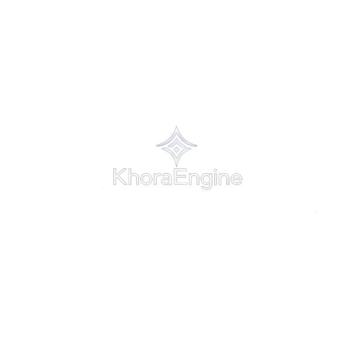

      
<p align="center">
  
</p>


<h1 align="center">KhoraEngine</h1>
<p align="center">
    <a href="https://github.com/eraflo/KhoraEngine/actions/workflows/rust.yml"></a>
</p>
<p align="center">
    KhoraEngine is an experimental game engine being developed in Rust. Its ultimate and ambitious goal is to implement a novel <strong>Symbiotic Adaptive Architecture (SAA)</strong>.
</p>

</br>

<p align="center">
This architecture aims to create a deeply context-aware engine where subsystems act as cooperating agents (<strong>Intelligent Subsystem Agents - ISAs</strong>) under the guidance of a central coordinator (<strong>Dynamic Context Core - DCC</strong>). The engine will dynamically adapt its behavior, resource allocation—through a sophisticated process of <strong>Goal-Oriented Resource Negotiation (GORNA)</strong>—and even potentially its core data structures, for instance through <strong>Adaptive Game Data Flows (AGDF)</strong> techniques. This adaptation will be driven by real-time performance metrics, resource availability, application goals, and hardware capabilities, enabling the engine to strive for optimal performance and user experience across diverse scenarios.
</p>

## Vision: Symbiotic Adaptive Architecture (SAA)

The SAA philosophy emphasizes:

*   **Context-Oriented Design:** Collecting and utilizing state, performance, and resource data from all engine aspects is paramount. The DCC will aggregate this into a comprehensive model of the engine's operational context.
*   **Extreme Modularity / Semantic Interfaces:** Designing subsystems as potential adaptive agents (ISAs) with clear, potentially semantic interfaces (evolving towards **Semantic Contracts**). ISAs report their capabilities, current state, and resource needs.
*   **Built-in Measurability:** Performance profiling, metrics (CPU, GPU, memory, VRAM, network, I/O), and resource tracking are fundamental, not afterthoughts, providing the essential data for the DCC's decision-making.
*   **Strategic Flexibility:** Enabling ISAs to possess multiple execution strategies (e.g., performance vs. quality, different algorithms for physics or AI pathfinding). The DCC can then request strategy switches based on the overall context and goals.
*   **Goal-Oriented Resource Negotiation (GORNA):** A core mechanism where ISAs actively request resource budgets (CPU time, memory, VRAM, bandwidth) and the DCC dynamically allocates these based on global objectives, ISA priorities, and available resources, fostering true symbiotic cooperation.
*   **Adaptive Game Data Flows (AGDF) (Long-Term R&D):** Exploring the dynamic adaptation of data layouts (e.g., AoS to SoA for certain components) based on observed access patterns and performance feedback, further optimizing for the specific runtime context.
*   **Intelligent Coordination:** The DCC will employ a sophisticated **heuristics engine (potentially evolving with ML-driven models)** to analyze the comprehensive context and make informed decisions about strategy selection and resource allocation for ISAs.

The long-term vision includes robust support for **Extended Reality (XR)** applications and an integrated **editor**, all built upon and benefiting from the adaptive SAA core, allowing the engine and its tools to perform optimally across a wide range of hardware and application demands.

## Project Status

**Phase 1, Milestone 1: Core Foundation & Context Hooks - ✅ COMPLETE**

The foundational layer of the engine is established. Key achievements include:

*   Setup of the Cargo workspace (`khora_engine_core`, `sandbox`) and basic CI/CD.
*   Implementation of core math types (`Vec2/3/4`, `Mat3/4`, `Quaternion`, etc.).
*   Definition of core architecture patterns (thread-safe `EventBus`, initial traits).
*   Integration of logging (`env_logger`) and event handling.
*   Implementation of basic CPU performance timing (`Stopwatch`).
*   Integration of heap memory allocation tracking (`SaaTrackingAllocator`).
*   Integration of windowing (`winit` via `ApplicationHandler`) and basic input event translation.
*   Establishment of the main application loop structure.

*(Git Tag: `v0.1.0` marks this stage)*

---

**Current Focus: Phase 1, Milestone 2 - Rendering Primitives & ISA Scaffolding**

Development is underway on Milestone 2, focusing on establishing basic rendering capabilities.

**Completed M2 Tasks:**

*   ✅ **`[Feature] Choose & Integrate Graphics API Wrapper (wgpu/ash/etc.)`**:
    *   `wgpu` (v0.20) integrated. `WgpuGraphicsContext` manages core `wgpu` objects.
    *   SAA Prep: `TIMESTAMP_QUERY` feature requested.
*   ✅ **`[Feature] Design Rendering Interface as potential ISA (Clear inputs, outputs, potential strategies)`**:
    *   Abstract `RenderSystem` trait defined.
    *   `WgpuRenderSystem` implements this trait, using an `Arc<Mutex<WgpuGraphicsContext>>` and an `Arc<WgpuDevice>`.
*   ✅ **`[Feature] Implement Graphics Device Abstraction`**:
    *   Abstract `GraphicsDevice` trait defined for resource management.
    *   `WgpuDevice` implements this trait.
*   ✅ **`[Feature] Implement Swapchain Management`**:
    *   Robust management of `wgpu::Surface` within `WgpuRenderSystem` and `WgpuGraphicsContext`.
*   ✅ **`[Feature] Implement Basic Shader System`**:
    *   Defined backend-agnostic API for shader modules (`ShaderModuleDescriptor`, `ShaderModuleId`, etc.) in `renderer::api`.
    *   `GraphicsDevice` trait includes `create_shader_module` and `destroy_shader_module`.
    *   `WgpuDevice` implements these methods.
*   ✅ **`[Feature] Implement Basic Render Pipeline System`**:
    *   Defined backend-agnostic API for render pipelines (`RenderPipelineDescriptor`, `RenderPipelineId`, `VertexAttributeDescriptor`, `ColorTargetStateDescriptor`, etc.) in `renderer::api::pipeline_types`.
    *   `GraphicsDevice` trait includes `create_render_pipeline` and `destroy_render_pipeline`.
    *   `WgpuDevice` implements these methods, translating abstract descriptors to `wgpu` pipeline objects.
*   ✅ **`[Feature] Develop Custom Bitflags Macro for Internal Engine Use`**:
    *   Implemented a custom, declarative macro (`khora_bitflags!`) providing type-safe bitflag functionality.
    *   SAA Prep: This foundational utility reduces external dependencies, ensures consistent bitwise operations, and provides efficient, human-readable debug output for flags used throughout the engine, especially for resource usage and contextual data.*
*   ✅ **`[Feature] Implement Basic Buffer/Texture Management (Track VRAM usage)`**
    *   Comprehensive API for creating, destroying, and writing to Buffers (BufferId, BufferDescriptor), Textures (TextureId, TextureDescriptor), TextureViews (TextureViewId, TextureViewDescriptor), and Samplers (SamplerId, SamplerDescriptor) through the GraphicsDevice trait.
*   ✅ **`[Feature] Implement GPU Performance Monitoring Hooks (Timestamps)`**
    *   Backend-agnostic GPU timing hooks (`GpuPerfHook` enum + trait method) with a non-blocking WGPU timestamp profiler feeding per-frame stats. See comprehensive documentation `docs/rendering/gpu_performance_monitoring.md`.

**Next Steps / Milestone 2 Tasks:**

*   ➡️ **`[Feature] Implement Core Metrics System Backend v1 (In-Memory)`**
    *   Description: Implement an initial in-memory backend for the Core Metrics System API. Focus on thread-safe storage (e.g., using `RwLock<HashMap<MetricId, MetricValue>>` or more specialized concurrent structures) and efficient retrieval of counters and gauges. Histograms/summaries can be deferred or simplified initially.
    *   Labels: `core`, `infra`, `performance`, `saa-prep`
*   ➡️ **`[Task] Integrate VRAM Tracking into Core Metrics System`**
    *   Description: Refactor WgpuDevice's VRAM tracking to report its usage (allocated bytes) to the new Core Metrics System instead of managing it internally. The GraphicsDevice (or a ResourceMonitor trait) might then query the Metrics System or WgpuDevice could still expose it directly while also reporting centrally.
    *   Labels: `rendering`, `performance`, `refactoring`, `saa-prep`
*   ➡️ **`[Task] Integrate System RAM Tracking into Core Metrics System`**
    *   Description: Connect the SaaTrackingAllocator (or its successor) to report global heap allocations to the Core Metrics System.
    *   Labels: `core`, `performance`, `refactoring`, `saa-prep`
*   ➡️ **`[Feature] Implement Robust Graphics Backend Selection (Vulkan/DX12/GL Fallback)`**
    *   Description: Enhance `WgpuGraphicsContext::new` to intelligently select and fall back between graphics backends.
    *   Labels: `rendering`, `core`, `platform`, `robustness`, `saa-prep`
*   ➡️ **`[Task] Render a Single Triangle/Quad with Performance Timings`**
    *   Description: Display a simple geometric shape using the established shader system, pipeline system, and buffer management, showing CPU/GPU timings.
    *   Labels: `rendering`, `performance`

**Planned Enhancements (Upcoming Issues)**

*   ➡️ **`[Enhancement] Advanced GPU Performance & Resize Heuristics`**
    *   Description: Expose raw + smoothed timings, make EMA alpha configurable, add additional timestamp scopes (shadow, postprocess), refine resize heuristics (relative delta, temporal backoff), optional aggregation/suppression of repeated "Suboptimal present" warnings, and prepare adaptive quality decisions driven by GPU frame time. See `docs/rendering/gpu_performance_monitoring.md`.
    *   Labels: `rendering`, `performance`, `saa-prep`

**Note:** This is a highly ambitious, long-term research and development project. The SAA goal requires significant R&D.

## Getting Started

The project currently sets up core components, creates a window, handles basic OS events and input, and logs performance/memory statistics to the console.

```bash
# Clone the repository
git clone https://github.com/eraflo/KhoraEngine.git
cd KhoraEngine

# Check code
cargo check --workspace

# Run unit tests
cargo test --workspace

# Build the project
cargo build --workspace

# Run the sandbox (outputs logs to console)
# RUST_LOG=khora_engine_core=trace cargo run --bin sandbox
cargo run --bin sandbox

# (Optional but recommended) Check formatting and linting before committing
cargo fmt --all -- --check
cargo clippy --workspace --all-targets --all-features -- -D warnings
```

## Documentation

Comprehensive documentation is available in the [`docs/`](docs/) directory:

- **[Documentation Index](docs/README.md)** - Complete documentation overview and navigation
- **[Developer Guide](docs/developer_guide.md)** - Getting started with development
- **[Architecture Design](docs/architecture_design.md)** - Engine architecture and SAA concepts
- **[Math Module](docs/math_module.md)** - Mathematical types and operations
- **[Rendering System](docs/rendering/rendering_system.md)** - Graphics programming guide
- **[Memory Management](docs/memory_management.md)** - Memory tracking and optimization
- **[Event System](docs/event_system.md)** - Event-driven communication
- **[Performance Monitoring](docs/performance_monitoring.md)** - Performance analysis and metrics
- **[Integration Guide](docs/integration_guide.md)** - Adding new subsystems and features

## Community & Contributing

KhoraEngine is an open-source project and we welcome community involvement! We strive to be a welcoming and inclusive community.

*   Please read and adhere to our [**Code of Conduct**](CODE_OF_CONDUCT.md).
*   If you're interested in contributing, please see our [**Contributing Guidelines**](CONTRIBUTING.md).
*   For bug reports or feature suggestions, please use the [**Issues** tab](https://github.com/eraflo/KhoraEngine/issues) and try to use the provided templates.
*   For general questions, ideas, or discussions about KhoraEngine and its SAA/AGDF concepts, please join us on our [**GitHub Discussions page**](https://github.com/eraflo/KhoraEngine/discussions)!


## License

KhoraEngine is licensed under the [Apache License 2.0](LICENSE).