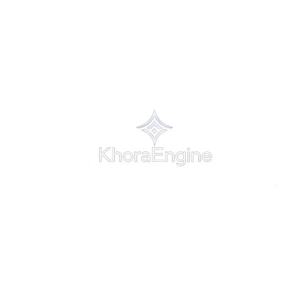

<p align="center">
  
</p>

<h1 align="center">Khora Engine</h1>
<p align="center">
    <a href="https://github.com/eraflo/KhoraEngine/actions/workflows/rust.yml"></a>
</p>
<p align="center">
    Khora is an experimental game engine in Rust, built on a novel <strong>Symbiotic Adaptive Architecture (SAA)</strong>.
</p>

## Our Vision: A Symbiotic, Self-Optimizing Architecture

Khora is not a traditional game engine. It is a living, context-aware system that continuously adapts to deliver the best possible experience. Its subsystems are not just gears in a machine, but **intelligent agents** that collaborate and negotiate for resources in real time to meet high-level performance goals.

This approach aims to solve the fundamental problems of modern engines: costly manual optimization, rigid pipelines, and the inability to adapt to growing hardware diversity.

## Project Status

Khora is under active development. The foundational architecture (CLAD) and our custom ECS (CRPECS) are in place. The current focus is on building out core engine capabilities and implementing the SAA's adaptive logic.

## Full Documentation

**The complete Khora Engine documentation is available online as a book.** This includes our high-level vision, architectural deep dives, and the full API reference.

### **[Read the Khora Engine Book](https://eraflo.github.io/KhoraEngine/)** 
*(Note: Link will be active once deployment is set up)*

You can also browse the source files for the documentation directly in the [`/docs`](./docs) directory of this repository.

## Getting Started

```bash
# Clone the repository
git clone https://github.com/eraflo/KhoraEngine.git
cd KhoraEngine

# Run tests for the entire workspace (requires cargo-nextest)
cargo nextest run --workspace

# Check for formatting and linting issues
cargo xtask all

# Run the sandbox application for testing and demos
cargo run -p sandbox
```

## Community & Contributing

Khora is an ambitious open-source project and we welcome all contributions.

*   Please read our [**Code of Conduct**](./CODE_OF_CONDUCT.md) and [**Contributing Guidelines**](./CONTRIBUTING.md).
*   For general discussions, ideas, and questions, join us on [**GitHub Discussions**](https://github.com/eraflo/KhoraEngine/discussions).
*   For bug reports or feature requests, please open an [**Issue**](https://github.com/eraflo/KhoraEngine/issues).

## License

Khora Engine is licensed under the [Apache License 2.0](./LICENSE).
