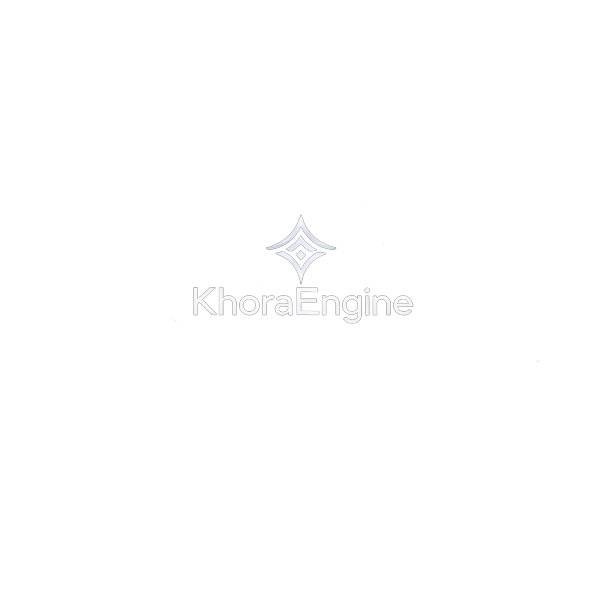

<p align="center">
  
</p>

<h1 align="center">Khora Engine</h1>

<p align="center">
  <em>An engine that thinks.</em>
</p>

<p align="center">
  <a href="https://github.com/eraflo/KhoraEngine/actions/workflows/rust.yml">
    
  </a>
</p>

---

Khora is an experimental real-time game engine written in Rust, built on a **Symbiotic Adaptive Architecture (SAA)**. Every major subsystem is an intelligent agent that negotiates for resources in real time. A central observer — the Dynamic Context Core — watches the engine's behavior, runs nine heuristics each tick, and trades budgets through a protocol called **GORNA**. The agents adapt; the work continues.

Most engines decide at compile time. Khora decides at runtime, every tick.

## Why

Modern engines are rigid. They assign fixed budgets at compile time and adapt poorly to hardware diversity. Khora replaces that with a council of intelligent, collaborating agents — automated self-optimization, strategic flexibility, goal-oriented decisions. The result is an engine that runs the same code on a workstation, a laptop on battery, and a Steam Deck — and adapts each tick to keep the frame rate.

## Status

Active development. The foundational CLAD architecture, the CRPECS ECS, GORNA v0.3, and five intelligent agents (Render, Shadow, Physics, UI, Audio) are operational. ~470 workspace tests pass on every commit. An editor with play mode is shipping. The roadmap commits to a multi-year horizon — culminating, in Phase 6, in a native physics solver replacing the third-party backend.

## Quick start

```bash
git clone https://github.com/eraflo/KhoraEngine.git
cd KhoraEngine
cargo build
cargo test --workspace
cargo run -p sandbox        # Run the demo
cargo run -p khora-editor   # Open the editor
```

## Documentation

The full documentation lives in [`docs/`](./docs/) as an mdBook.

| Read this | If you want to |
|---|---|
| [Introduction](./docs/src/00_introduction.md) | Understand what Khora is and why |
| [Principles](./docs/src/01_principles.md) | Read the SAA philosophy in depth |
| [Architecture](./docs/src/02_architecture.md) | See where SAA becomes CLAD |
| [SDK quickstart](./docs/src/16_sdk_quickstart.md) | Build a working game in 50 lines |
| [Editor design system](./docs/src/design/editor.md) | The visual language of the editor |
| [Roadmap](./docs/src/roadmap.md) | What is committed, what is planned |

Build the book locally:

```bash
mdbook serve docs/ --open
```

## Architecture at a glance

```
khora-sdk        Public API — Engine, GameWorld, Application
khora-agents     Five agents — Render, Shadow, Physics, UI, Audio
khora-lanes      Hot-path pipelines — render strategies, physics steps, audio mixing, asset decoders
khora-control    DCC orchestration, GORNA protocol, Scheduler
khora-data       CRPECS ECS, components, scene definitions
khora-io         VFS, asset loading, scene serialization
khora-core       Trait definitions, math, GORNA types, ServiceRegistry
khora-infra      Default backends — wgpu 28.0, Rapier3D, CPAL, Taffy, winit (swappable)
khora-telemetry  TelemetryService, MetricsRegistry, monitors
khora-macros     `#[derive(Component)]` proc macro
khora-editor     Editor application
```

Every backend in `khora-infra` implements a trait from `khora-core`. wgpu, Rapier3D, CPAL, Taffy are *current defaults*, not architectural commitments — alternative backends drop in as new sibling folders without touching the rest of the engine.

## For AI coding agents

Khora ships with provider-agnostic agent instructions:

- [`CLAUDE.md`](./CLAUDE.md) — Claude Code entry
- [`AGENTS.md`](./AGENTS.md) — Codex / Aider / Cursor / Continue entry
- [`.github/copilot-instructions.md`](./.github/copilot-instructions.md) — GitHub Copilot entry
- [`.agent/`](./.agent/) — Single source of truth: rules, conventions, architecture brief, eight specialist personas

## Community and contributing

- Read the [Code of Conduct](./CODE_OF_CONDUCT.md) and [Contributing Guidelines](./CONTRIBUTING.md).
- Join discussions on [GitHub Discussions](https://github.com/eraflo/KhoraEngine/discussions).
- File bugs or feature requests as [Issues](https://github.com/eraflo/KhoraEngine/issues).

## License

Khora Engine is licensed under the [Apache License 2.0](./LICENSE).
