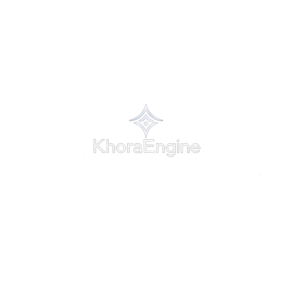

<p align="center">
  
</p>

<h1 align="center">Khora Engine</h1>

<p align="center">
  <em>An engine that thinks.</em>
</p>

<p align="center">
  <a href="https://github.com/eraflo/KhoraEngine/actions/workflows/rust.yml">
    
  </a>
</p>

---

Khora is an experimental real-time game engine written in Rust, built on a
**Symbiotic Adaptive Architecture (SAA)**. Every major subsystem is an
intelligent agent that negotiates for resources in real time. A central
observer — the Dynamic Context Core — watches the engine's behavior, runs a set
of heuristics each tick, and trades budgets through a protocol called **GORNA**.
The agents adapt; the work continues.

Most engines decide at compile time. Khora decides at runtime, every tick.

## Why

Modern engines are rigid. They assign fixed budgets at compile time and adapt
poorly to hardware diversity. Khora replaces that with a council of intelligent,
collaborating agents — automated self-optimization, strategic flexibility,
goal-oriented decisions. The result is an engine that runs the same code on a
workstation, a laptop on battery, and a handheld — and adapts each tick to keep
the frame rate.

## Status

Active development. The foundational **CLAD** architecture, the **CRPECS** ECS,
the GORNA negotiation loop, six intelligent agents (Render, Shadow, Overlay,
Physics, UI, Audio), a fixed-timestep simulation with render interpolation, and
an editor with play mode are operational. A large workspace test suite runs on
every commit across Linux, Windows, and macOS. The roadmap commits to a
multi-year horizon — culminating, in a later phase, in a native physics solver
replacing the third-party backend.

## Quick start

```bash
git clone https://github.com/eraflo/KhoraEngine.git
cd KhoraEngine
cargo build
cargo test --workspace
cargo run -p sandbox        # run the demo — a scene you can fly around
cargo run -p khora-editor   # open the editor
```

Requires Rust **1.91+** and a GPU supporting Vulkan, Metal, or DX12.

## Documentation

The documentation is an mdBook that routes you by what you came to do — build a
game, understand the engine, or contribute. **Start at the
[Home page](./docs/src/home.md)** and pick your path.

| Go straight to | If you want to |
|---|---|
| [Home — choose your path](./docs/src/home.md) | Get oriented and pick a track |
| [Your first game](./docs/src/tutorials/your-first-game.md) | Build a running scene, step by step |
| [The big idea (SAA)](./docs/src/concepts/saa.md) | Understand why the engine negotiates with itself |
| [API reference (rustdoc)](https://eraflo.github.io/KhoraEngine/api/) | Look up the exact public API |
| [Roadmap](./docs/src/project/roadmap.md) | See what is committed and what is planned |

Read it locally with live reload:

```bash
mdbook serve docs/ --open
```

The published book and API reference live at
<https://eraflo.github.io/KhoraEngine/>.

## Architecture at a glance

Khora is a Cargo workspace. Dependencies flow downward only
(`khora-core` → `khora-data`/`khora-control` → `khora-lanes` → `khora-agents` →
`khora-infra` → `khora-sdk`):

```
khora-core       Trait definitions, math, GORNA types, the Runtime container
khora-macros     #[derive(Component)] proc macro
khora-data       CRPECS ECS, components, Flows, scene definitions
khora-control    DCC orchestration, GORNA protocol, the Scheduler
khora-lanes      Hot-path pipelines — render strategies, physics steps, audio mixing
khora-agents     Six agents — Render, Shadow, Overlay, Physics, UI, Audio
khora-infra      Default backends — wgpu, Rapier3D, CPAL, Taffy, winit (swappable)
khora-io         VFS, asset loading, scene serialization
khora-telemetry  TelemetryService, MetricsRegistry, monitors
khora-plugins    Plugin loading and registration
khora-sdk        Public API — the only surface a game depends on
khora-editor     Editor application
khora-runtime    Generic player binary, stamped with packed assets
```

Plus the tooling crates `sandbox` (the demo game), `xtask` (build automation),
and `hub` (the project launcher). Every backend in `khora-infra` implements a
trait from `khora-core`: wgpu, Rapier3D, CPAL, and Taffy are *current defaults*,
not architectural commitments — alternative backends drop in as new sibling
folders without touching the rest of the engine.

## For AI coding agents

Khora ships with provider-agnostic agent instructions:

- [`CLAUDE.md`](./CLAUDE.md) — Claude Code entry
- [`AGENTS.md`](./AGENTS.md) — Codex / Aider / Cursor / Continue entry
- [`.github/copilot-instructions.md`](./.github/copilot-instructions.md) — GitHub Copilot entry
- [`.agent/`](./.agent/) — single source of truth: rules, conventions, architecture brief, specialist personas

## Community and contributing

- New contributors: start at the docs' [Contributing](./docs/src/contributing/setup.md) section.
- Read the [Code of Conduct](./CODE_OF_CONDUCT.md) and [Contributing Guidelines](./CONTRIBUTING.md).
- Join discussions on [GitHub Discussions](https://github.com/eraflo/KhoraEngine/discussions).
- File bugs or feature requests as [Issues](https://github.com/eraflo/KhoraEngine/issues).

## License

Khora Engine is licensed under the [Apache License 2.0](./LICENSE).
