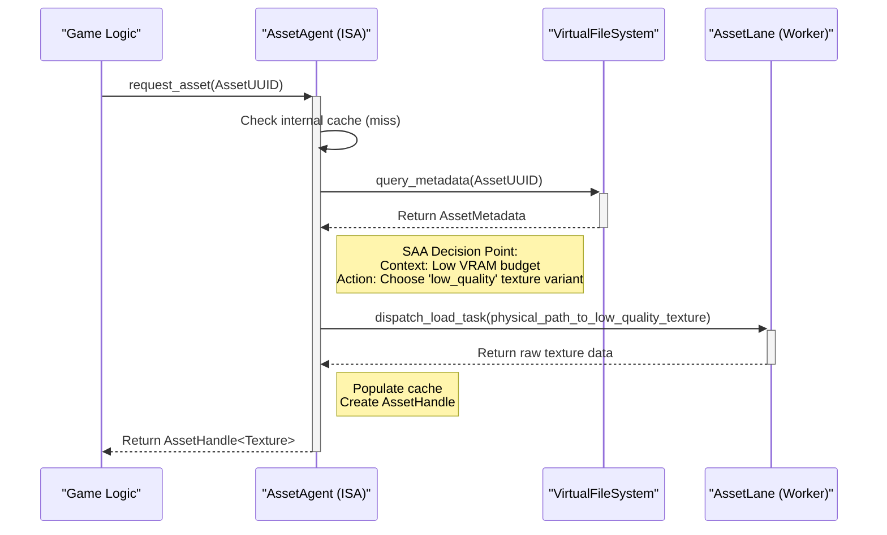

# 07 - Asset Architecture: The Virtual File System (VFS)

### The Problem: Assets as a Strategic Resource

In a traditional engine, an asset system is a simple loader: you ask for a file path, it gives you back data. This is insufficient for the Symbiotic Adaptive Architecture (SAA). To make intelligent decisions, the `AssetAgent` ISA needs to understand assets not just as files on a disk, but as strategic resources with costs, dependencies, and alternatives.

The Khora solution is the **Virtual File System (VFS)**. It's not a filesystem in the OS sense; it's an intelligent database that abstracts the physical storage of assets and enriches them with metadata, turning them into a queryable resource for the entire engine.

### Core Concepts

1.  **Logical vs. Physical Identification**:
    *   The engine logic **never** references a physical file path like `"./assets/textures/rock.png"`.
    *   Instead, it uses a stable, unique **`AssetUUID`**. This UUID represents the "idea" of the rock texture, regardless of where the file is or what its name is.
    *   The VFS is the sole component responsible for resolving an `AssetUUID` into a physical location. This completely decouples the content from the code.

2.  **Asset Metadata**:
    *   For every asset, the VFS stores a rich `AssetMetadata` entry. This is where the intelligence lies. It contains:
        *   **Physical Path**: The actual location of the source file on disk.
        *   **Asset Type**: The kind of loader to use (e.g., `TextureLoader`, `MeshLoader`).
        *   **Dependencies**: A list of other `AssetUUID`s this asset depends on (e.g., a material depends on several textures).
        *   **Variants**: Information about alternative versions of this asset (e.g., paths to High, Medium, and Low quality textures; different LODs for a mesh).
        *   **Tags**: Semantic information that can be used for queries (e.g., `"character"`, `"prop"`, `"ui_icon"`).

3.  **The Index**:
    *   The VFS's core is an "Index"—a highly optimized database that maps `AssetUUID`s to their `AssetMetadata`. This entire index is loaded into memory to allow for near-instantaneous queries.

### The Hybrid Indexing Strategy

A critical challenge is creating and maintaining this index without slowing down development or production builds. Khora uses a hybrid approach:

*   **For Development (`khora-editor`): The Real-Time Asset Database**
    *   An integrated service constantly watches the project's asset folder.
    *   When a file is added or changed, it is immediately processed: metadata is extracted, and the on-disk index is incrementally updated.
    *   **Goal**: Provide a seamless, "live" development experience. An artist can drop a texture into a folder, and it becomes instantly available in the editor without a manual import step or restart.

*   **For Production (Release Builds): Packfiles**
    *   A build script (`xtask`) is run to prepare the game for shipping.
    *   This tool scans all assets once, builds a final, highly optimized `index.bin` file, and packs all asset data into large, contiguous archive files (`data.pack`).
    *   **Goal**: Achieve maximum loading performance. The game starts, loads the single `index.bin` into memory, and can then load any asset with minimal disk I/O by reading directly from a known offset in a packfile.

### The Lifecycle of an Asset Request

This diagram illustrates how the components work together to load an asset:

### Conclusion: Why the VFS is Essential for SAA

The VFS architecture is a cornerstone of Khora's adaptive philosophy. It elevates the `AssetAgent` from a simple file loader to a true Intelligent Subsystem Agent. By providing rich, queryable metadata, the VFS gives the agent the **context** it needs to make meaningful, strategic decisions that align with the engine's global performance goals. It is the foundation upon which features like quality-of-service tiers, intelligent streaming, and adaptive resource management are built.