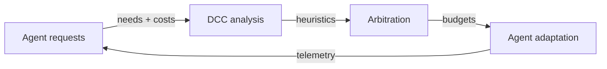
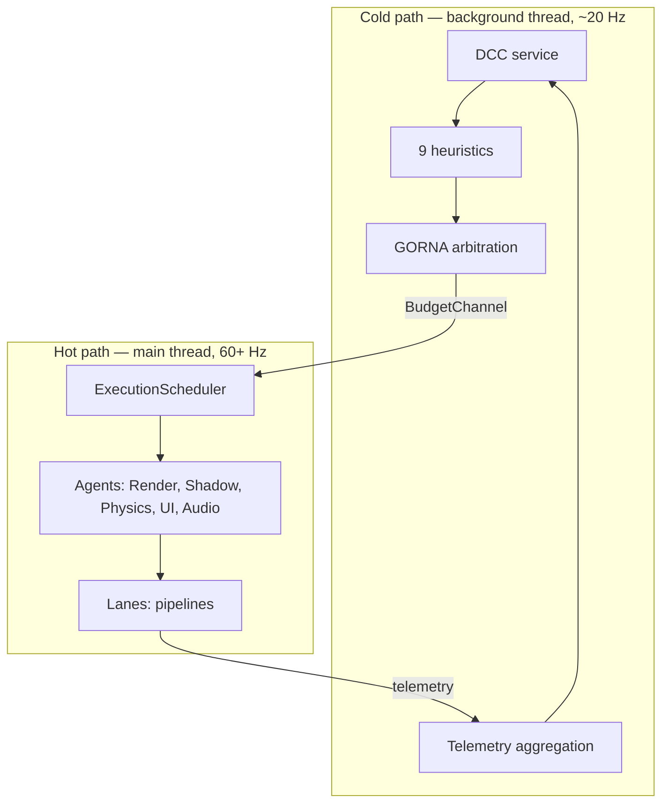

# Principles

The why behind Khora — the philosophy that the architecture serves.

- Document — Khora Principles v1.0
- Status — Authoritative
- Date — May 2026

---

## Contents

1. The Symbiotic Adaptive Architecture
2. The seven pillars
3. Cold path and hot path
4. Five engineering principles
5. Decisions
6. Open questions

---

## 01 — The Symbiotic Adaptive Architecture

The Symbiotic Adaptive Architecture, or **SAA**, is the conceptual framework Khora is built on. The name is exact: subsystems live in *symbiosis* — neither commanding nor commanded — and the engine *adapts* to its environment as a continuous behavior, not as a configuration step.

The contrast is sharp. A traditional engine is a tree. A central runtime calls into renderers, physics, audio in a fixed order, with budgets baked in at compile time. SAA is a council. A central observer (the **DCC**) watches; specialists (the **agents**) negotiate; an arbitrator hands out budgets each tick. Decisions are revisited every frame.

This is not a research toy. The engine ships ~470 tests, a working renderer, a working physics step, an editor with a play mode, and a sandbox you can run today. SAA is the framework — a deliberate, opinionated answer to the rigidity problem stated in the [Introduction](./00_introduction.md).

## 02 — The seven pillars

SAA rests on seven pillars. Each one has a corresponding home in the codebase. The mapping is in the [Architecture](./02_architecture.md) chapter; here, the *idea*.

### 1. Dynamic Context Core — the central nervous system

The DCC is the engine's center of awareness. It does not command subsystems directly; it maintains a constantly updated **situational model** of the entire application state.

| What it monitors | Examples |
|---|---|
| Hardware load | CPU cores, GPU utilization, VRAM, memory bandwidth |
| Game state | Scene complexity, entity counts, light count, physics interactions |
| Performance goals | Target framerate, maximum input latency, power budget |

The DCC runs on a **dedicated background thread at ~20 Hz**, completely independent of the main frame loop. It aggregates telemetry, runs heuristics, and sends resource budgets to the Scheduler through a unidirectional channel.

### 2. Intelligent Subsystem Agents — the specialists

Every major subsystem is an **agent**. An agent is not a passive library — it is a semi-autonomous component with deep understanding of its own domain.

| Capability | Description |
|---|---|
| Self-assessment | Constantly measures its own performance and resource consumption |
| Multi-strategy | Possesses multiple algorithms with different performance characteristics |
| Cost estimation | Predicts the resource cost (CPU, memory, VRAM) of each strategy |

Five agents exist today — one per `LaneKind`: Render, Shadow, Physics, UI, Audio. The architecture is open: users can add their own. See [Agents](./06_agents.md).

### 3. GORNA — Goal-Oriented Resource Negotiation and Allocation

GORNA is the formal communication protocol used by the DCC and the agents to allocate resources. This negotiation replaces static, pre-defined budgets.

| Step | Action |
|---|---|
| **1. Request** | Agents submit desired resource needs with strategy costs |
| **2. Arbitration** | DCC analyzes all requests against the global model and goals |
| **3. Allocation** | DCC grants a final budget to each agent (may be less than requested) |
| **4. Adaptation** | Agent selects a less resource-intensive strategy to stay within budget |

GORNA v0.3 is fully operational. The DCC runs nine heuristics each tick (Phase, Thermal, Battery, Frame Time, Stutter, Trend, CPU Pressure, GPU Pressure, Death Spiral). The full protocol lives in [GORNA](./08_gorna.md).

### 4. Adaptive Game Data Flows — the living data

AGDF is the principle that **not only algorithms but also the structure of data should be dynamic**. Realized through CRPECS, Khora's archetype-based ECS:

| Scenario | AGDF action |
|---|---|
| Entity far from player | Remove physics components, reduce update frequency |
| Entity enters player vicinity | Add physics components, increase update frequency |
| Scene complexity exceeds budget | Merge similar entities, simplify component data |

Archetype storage makes structural change cheap. Adding or removing a component shifts an entity to a different page; queries see the change immediately. See [ECS — CRPECS](./05_ecs.md).

### 5. Semantic interfaces and contracts — the common language

For intelligent negotiation to be possible, all agents must speak a common, unambiguous language. Khora's contracts are formal Rust traits.

| Contract type | Example |
|---|---|
| Capabilities | "I can render scenes using Forward+ or Simple Unlit" |
| Requirements | "I require access to all entity positions and meshes" |
| Guarantees | "With 4 ms CPU budget, I guarantee stable physics for 1000 rigid bodies" |

These contracts live in `khora-core` and are the seam through which the entire engine is reorganizable.

### 6. Observability and traceability — the glass box

An intelligent system risks becoming an indecipherable black box. Observability is a first-class principle.

- Every DCC decision is logged with complete context — telemetry, requests, final budget.
- Developers can ask not just "what happened?" but "**why** did the engine make that choice?"
- The `TelemetryService` provides real-time metrics for every subsystem. See [Telemetry](./15_telemetry.md).

### 7. Developer guidance and control — partnership, not autocracy

The engine's autonomy serves the developer. It does not replace them.

| Mechanism | Purpose |
|---|---|
| Constraints | Define rules or volumes to influence decisions ("In this zone, physics > graphics") |
| Adaptation modes (planned) | `Learning` (fully dynamic), `Stable` (predictable), `Manual` (locked strategies) |

## 03 — Cold path and hot path

The clearest way to understand SAA is to see the two paths it runs on.

| Aspect | Cold path (DCC) | Hot path (Scheduler + agents) |
|---|---|---|
| Thread | Background (`std::thread`) | Main |
| Frequency | ~20 Hz | 60+ Hz (every frame) |
| Responsibility | Observe, analyze, negotiate | Execute agents, dispatch lanes, produce output |
| Communication | Unidirectional `BudgetChannel` | Agents read budgets at frame start |

**Key insight.** Agents are not controllers — they are **adapters**. They receive budgets from GORNA and select the appropriate lane strategy. The DCC decides *what* resources are available; agents decide *how* to use them.

## 04 — Five engineering principles

These descend from SAA but apply at every level of the codebase.

### 1. The work is the hero

Chrome retreats. The user's scene, code, simulation, render is always the loudest thing in the system. The engine's machinery — schedulers, allocators, heuristics — should be auditable but never in the way.

### 2. The engine has a mind — show it

Khora's defining trait is its self-optimizing core. The editor must surface that intelligence — telemetry as ambient signal, not a separate dashboard. The user should *feel* the engine thinking. The full editor design lives in [Editor design system](./design/editor.md).

### 3. Density without density anxiety

Engine codebases fail by hiding everything in nested abstractions or by drowning the contributor in indirection. Khora aims for **dense, scannable** structure: one primary type per file, traits in `khora-core`, backends in `khora-infra/<backend>/`. You can find anything in two clicks.

### 4. Decisions belong in code, but they belong in writing too

Every major architectural choice has a *yes* and a *no*. The `Decisions` section at the end of major chapters records both. The full ledger is in [Decisions](./decisions.md).

### 5. Calm voice, loud signal

Logs say what they mean. Errors give context. Metrics carry units. Color, when used, means *state* — green for healthy telemetry, amber for warning, gold for active selection in the editor. When something is loud, it matters.

## 05 — Decisions

### We said yes to
- **A self-optimizing core.** GORNA, DCC, and per-tick negotiation are non-negotiable. Without them, Khora is just another engine.
- **Cold path / hot path separation.** The frame loop is never blocked by analysis. Budgets flow one way through a channel.
- **Agent per `LaneKind`.** Render, Shadow, Physics, UI, Audio. One subsystem, one negotiation surface. Splitting Render and Shadow lets the shadow atlas run in `OBSERVE` and `RenderAgent` declare a hard dependency.
- **Trait-defined contracts.** Every seam in the engine is a Rust trait. No string-keyed APIs, no `Box<dyn Any>` downcasting in production paths.

### We said no to
- **Static budgets baked at compile time.** A `MAX_LIGHTS` constant has no place in an engine that adapts.
- **Synchronous DCC calls from agents.** Agents must never wait on the DCC. The relationship is fire-and-forget through a channel.
- **Adding more agents than `LaneKind` variants.** If a subsystem has no strategies to negotiate, it is a service, not an agent.

## 06 — Open questions

What this chapter does not answer, and where the next iteration should go.

1. **Adaptation modes.** `Learning`, `Stable`, `Manual` are designed but not yet implemented. The contract for switching between them at runtime is open.
2. **Constraints API.** "In this zone, physics > graphics" is a stated capability with no concrete API yet. `PriorityVolume` is in the roadmap.
3. **Cross-agent coordination.** Today agents declare hard dependencies on each other (RenderAgent → ShadowAgent). When the dependency graph grows, do we need a richer scheduling model than per-frame topological sort?

---

*Next: the architecture that makes the principles real. See [Architecture](./02_architecture.md).*
