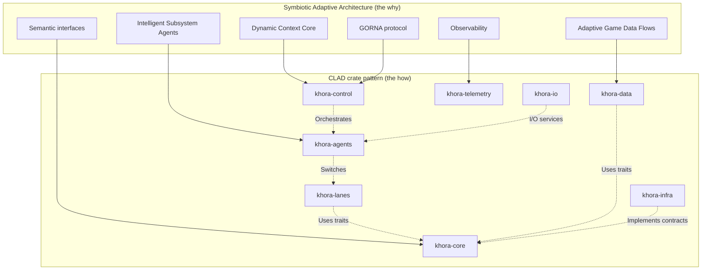
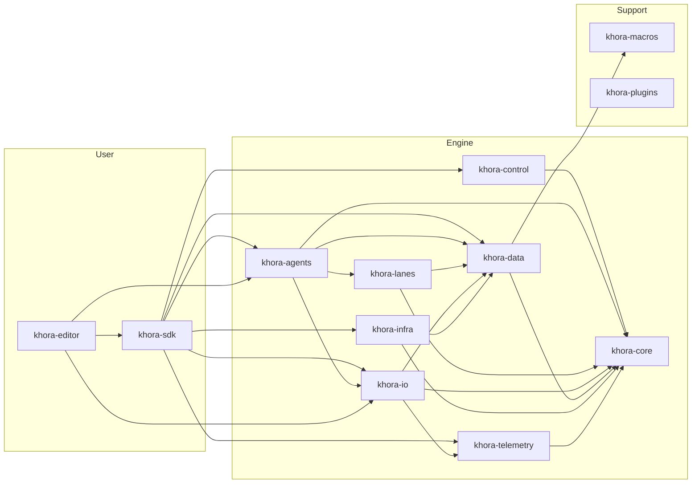

# Architecture

The how — where the SAA pillars live in the codebase. Pair with [Principles](./01_principles.md).

- Document — Khora Architecture v1.0
- Status — Authoritative
- Date — May 2026

---

## Contents

1. SAA, meet CLAD
2. The mapping
3. Crate dependency graph
4. Dependency rules
5. The eleven crates
6. Trait map
7. Standard components
8. Decisions
9. Open questions

---

## 01 — SAA, meet CLAD

Khora is built on two architectural concepts. They are not separate — they are two sides of the same coin.

| | The why | The how |
|---|---|---|
| Name | **SAA** — Symbiotic Adaptive Architecture | **CLAD** — Control / Lanes / Agents / Data |
| Form | Philosophical blueprint | Concrete crate structure |
| Concern | Self-optimizing, adaptive engine | Strict dependency layering, data flow patterns |

Every abstract concept in SAA has a direct, physical home within CLAD. The split between agents and lanes follows the split between *strategy* and *execution*. The split between data and core follows the split between *state* and *contract*.

## 02 — The mapping

| SAA concept (the why) | CLAD crate (the how) | Role |
|---|---|---|
| **Dynamic Context Core** & **GORNA** | `khora-control` | Strategic brain — observes telemetry, allocates budgets, runs the Scheduler |
| **Intelligent Subsystem Agents** | `khora-agents` | Tactical managers — each responsible for a `LaneKind` (rendering, shadow, physics, audio, UI) |
| **Multiple agent strategies** | `khora-lanes` | Fast, deterministic workers — algorithms an agent can choose from |
| **Adaptive Game Data Flows** | `khora-data` | Foundation — CRPECS enables flexible data layouts, dynamic component change |
| **Semantic interfaces and contracts** | `khora-core` | Universal language — traits, core types, math, GORNA types |
| **I/O services** | `khora-io` | Asset loading, VFS, serialization — on-demand services, not agents |
| **Observability and telemetry** | `khora-telemetry` | Nervous system — gathers performance data for the DCC |
| **Hardware and OS interaction** | `khora-infra` | Bridge to the outside world — wgpu, winit, Rapier3D, CPAL, Taffy |

## 03 — Crate dependency graph

## 04 — Dependency rules

> **Never** create circular dependencies. Dependencies flow downward only.

| Rule | Description |
|---|---|
| No upward deps | `khora-core` cannot depend on any other crate |
| No lateral deps | `khora-agents` cannot depend on `khora-control` |
| I/O is shared | `khora-io` is used by both agents and the SDK |
| Traits in core | Abstract traits live in `khora-core`, implementations in specific crates |
| Backends in infra | Per-backend code lives in `khora-infra/src/<area>/<backend>/` (e.g., `graphics/wgpu/`, `physics/rapier/`) |

Violating these is a hard build error. The dependency graph is the architecture; if you change one, you change the other.

> **`khora-infra` is *one* implementation, not *the* implementation.** Every backend in `khora-infra` implements a trait that lives in `khora-core`. Swapping to a different graphics backend, physics solver, audio device, or UI layout engine means writing a new implementation of the trait — typically as a new sibling folder under `khora-infra/src/<area>/<new_backend>/`. The rest of the engine never sees the change. This is the load-bearing reason backend code is segregated.

## 05 — The eleven crates

| Crate | Layer | Responsibility |
|---|---|---|
| `khora-core` | Foundation | Trait definitions, math types, GORNA types, ServiceRegistry, EngineContext, error hierarchy, memory tracking |
| `khora-data` | Data | CRPECS ECS (archetype SoA), components, scene definitions, `EcsMaintenance`, allocators |
| `khora-io` | Data | VFS, asset loading (FileLoader / PackLoader), serialization strategies, AssetService, SerializationService |
| `khora-lanes` | Lanes | Hot-path pipelines: render strategies, physics steps, audio mixing, asset decoders, scene transforms, ECS compaction, UI |
| `khora-agents` | Agents | Intelligent subsystem managers: RenderAgent, ShadowAgent, PhysicsAgent, UiAgent, AudioAgent, plus PhysicsQueryService |
| `khora-control` | Control | DCC orchestration, GORNA protocol, ExecutionScheduler, BudgetChannel, EnginePlugin, HeuristicEngine |
| `khora-infra` | Infrastructure | wgpu backend, winit window, Rapier3D physics, CPAL audio, Taffy layout, GPU/Memory/VRAM monitors |
| `khora-telemetry` | Telemetry | TelemetryService, MetricsRegistry, MonitorRegistry, resource monitors |
| `khora-sdk` | Public API | EngineCore, GameWorld, EngineApp / AgentProvider / PhaseProvider traits, Vessel + spawn helpers, run_winit, WindowConfig |
| `khora-editor` | Editor | Editor application — panels, gizmos, scene I/O, play mode |
| `khora-macros` | Support | `#[derive(Component)]` proc macro |

The eleventh slot once held `khora-plugins`, used for plugin loading and registration. It remains in the workspace but its API is stabilizing alongside the editor's plugin needs.

The full crate-by-crate map — folders, key files, what to read first — is in [Crate map](./04_crates.md).

## 06 — Trait map

The contracts that hold the engine together.

| Trait | Defined in | Implemented by |
|---|---|---|
| `Lane` | khora-core | All lane types in khora-lanes |
| `Agent` | khora-core | All agent types in khora-agents |
| `RenderSystem` | khora-core | `WgpuRenderSystem` in khora-infra |
| `PhysicsProvider` | khora-core | Rapier3D backend in khora-infra |
| `AudioDevice` | khora-core | CPAL backend in khora-infra |
| `LayoutSystem` | khora-core | `TaffyLayoutSystem` in khora-infra |
| `Asset` | khora-core | All loadable asset types |
| `Component` | khora-data | All ECS components (via derive macro) |
| `AssetDecoder<A>` | khora-lanes | Per-format decoder lanes |

Reading these traits is reading the engine's API. They are kept short, stable, and free of backend-specific types.

## 07 — Standard components

The components shipped in `khora-data`. Custom components are added the same way — `#[derive(Component)]` plus an `inventory::submit!` registration.

| Component | Domain | Purpose |
|---|---|---|
| `Transform` | All | Local position / rotation / scale |
| `GlobalTransform` | All | World-space computed transform |
| `Camera` | Render | Projection + view configuration |
| `Light` | Render | Light type, color, intensity, shadow config |
| `MaterialComponent` | Render | Material reference (handle) |
| `RigidBody` | Physics | Body type, mass, velocity, CCD |
| `Collider` | Physics | Shape descriptor for collision |
| `AudioSource` | Audio | Audio clip, volume, spatial flags |
| `AudioListener` | Audio | Listener position for 3D audio |
| `Parent` / `Children` | Scene | Entity hierarchy |
| `HandleComponent` | Asset | Generic asset handle wrapper |
| `UiTransform` | UI | Position, size, anchoring |
| `UiColor` | UI | Background color |
| `UiText` | UI | Text content, font, color |
| `UiImage` | UI | Texture handle, scale mode |
| `UiBorder` | UI | Border width, color |

## 08 — Decisions

### We said yes to
- **Splitting `khora-io` from `khora-data`.** Asset loading and serialization are I/O concerns; ECS storage is not. Separating them avoids cyclic constraints.
- **Backends are swappable.** Every `khora-infra` backend implements a `khora-core` trait. wgpu, Rapier3D, CPAL, Taffy are *current defaults*, not architectural commitments. Adding a new graphics, physics, audio, or layout backend means a new sibling folder under `khora-infra/src/<area>/`.
- **Trait coherence in `khora-core`.** Every public surface seam is a trait. No backend types leak into agents or the SDK.
- **One agent per `LaneKind`.** This forces the right number of agents — no more, no less.

### We said no to
- **Mega-crates.** Every crate has a single, scannable responsibility. We would rather pay the workspace overhead than the cognitive overhead of a 10 000-line crate.
- **Sibling dependencies between agents and control.** Agents talk *down* to lanes and *across* to a unidirectional channel — never *up* to control.
- **Dynamic plugin discovery via reflection.** Plugins register through `inventory::submit!` and explicit Rust APIs. No `Box<dyn Any>` lookup at runtime in the hot path.

## 09 — Open questions

1. **`khora-plugins` API.** The plugin model is real but its public API is still settling alongside editor needs.
2. **Editor as a contributor crate.** `khora-editor` depends directly on `khora-agents` and `khora-io` for performance. Is that a violation of "SDK is the public API," or a justified pragmatic shortcut?
3. **Workspace size.** Eleven crates is comfortable today. At twenty it might not be. The split rule is "per scannable responsibility," but we don't yet have a deterministic threshold.

---

*Next: the per-frame mechanics that bring this architecture to life. See [Lifecycle](./03_lifecycle.md).*
