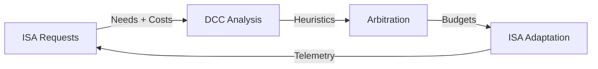

# SAA — Symbiotic Adaptive Architecture

The Symbiotic Adaptive Architecture (SAA) is the philosophical and conceptual framework of Khora. It is built on **seven key pillars** that work in symbiosis to create a truly adaptive engine — one that behaves not as a machine, but as a living organism.

## The Seven Pillars

### 1. Dynamic Context Core (DCC) — The Central Nervous System

The DCC is the engine's center of awareness. It does not command subsystems directly; instead, it maintains a constantly updated **situational model** of the entire application state.

| What it monitors | Examples |
|-----------------|----------|
| **Hardware Load** | CPU cores, GPU, VRAM, memory bandwidth utilization |
| **Game State** | Scene complexity, entity counts, light sources, physics interactions |
| **Performance Goals** | Target framerate, maximum input latency, power consumption budget |

The DCC runs on a **dedicated background thread** at ~20 Hz, completely independent of the main frame loop. It aggregates telemetry, runs heuristics, and sends resource budgets to the Scheduler through a unidirectional channel.

### 2. Intelligent Subsystem Agents (ISAs) — The Specialists

Every major engine subsystem is designed as an Intelligent Subsystem Agent. An ISA is not a passive library — it is a **semi-autonomous component** with deep understanding of its own domain.

| Capability | Description |
|-----------|-------------|
| **Self-Assessment** | Constantly measures its own performance and resource consumption |
| **Multi-Strategy** | Possesses multiple algorithms with different performance characteristics |
| **Cost Estimation** | Predicts the resource cost (CPU time, memory, VRAM) of each strategy |

<div class="callout callout-info">

**Extensibility**: Users can create custom agents by implementing the `Agent` trait. Each agent declares its `ExecutionTiming` (allowed modes, phases, priority, dependencies) and integrates automatically with the Scheduler.

</div>

### 3. GORNA — Goal-Oriented Resource Negotiation & Allocation

GORNA is the formal communication protocol used by the DCC and the ISAs to dynamically allocate resources. This negotiation replaces static, pre-defined budgets.



| Step | Action |
|------|--------|
| **1. Request** | ISAs submit desired resource needs with strategy costs |
| **2. Arbitration** | DCC analyzes all requests against global model and goals |
| **3. Allocation** | DCC grants a final budget to each ISA (may be less than requested) |
| **4. Adaptation** | ISA selects a less resource-intensive strategy to stay within budget |

<div class="callout callout-tip">

**GORNA v0.3** is fully operational. The DCC runs 9 heuristics each tick (Phase, Thermal, Battery, Frame Time, Stutter, Trend, CPU/GPU Pressure, Death Spiral). The `RenderAgent` and `PhysicsAgent` are fully GORNA-compliant with cost-based negotiation.

</div>

### 4. Adaptive Game Data Flows (AGDF) — The Living Data

AGDF is the principle that **not only algorithms but also the very structure of data should be dynamic**. This is realized through our custom ECS, the **CRPECS**.

Instead of being static, an entity's data layout can be fundamentally altered by the SAA in response to the game's context:

| Scenario | AGDF Action |
|----------|------------|
| Entity far from player | Remove physics components, reduce update frequency |
| Entity enters player vicinity | Add physics components, increase update frequency |
| Scene complexity exceeds budget | Merge similar entities, simplify component data |

The CRPECS's archetype-based design makes these structural changes extremely low-cost, enabling a deeper level of self-optimization at the memory level.

### 5. Semantic Interfaces & Contracts — The Common Language

For intelligent negotiation to be possible, all ISAs must speak a common, unambiguous language. These are defined by formal contracts (Rust traits):

| Contract Type | Example |
|--------------|---------|
| **Capabilities** | "I can render scenes using Forward+ or Simple Unlit" |
| **Requirements** | "I require access to all entity positions and meshes" |
| **Guarantees** | "With 4ms CPU budget, I guarantee stable physics for 1000 rigid bodies" |

### 6. Observability & Traceability — The Glass Box

An intelligent system risks becoming an indecipherable "black box." Observability is a first-class principle:

- Every DCC decision is logged with complete context — telemetry, requests, final budget
- Developers can ask not just "what happened?" but "**why** did the engine make that choice?"
- The `TelemetryService` provides real-time metrics for all subsystems

### 7. Developer Guidance & Control — A Partnership, Not an Autocracy

The engine's autonomy serves the developer, it does not replace them.

| Mechanism | Purpose |
|-----------|---------|
| **Constraints** | Define rules or volumes to influence decisions ("In this zone, physics > graphics") |
| **Adaptation Modes** *(planned)* | `Learning` (fully dynamic), `Stable` (predictable), `Manual` (locked strategies) |

## Cold Path vs Hot Path

```mermaid
graph TD
    subgraph Cold Path — Background Thread ~20Hz
        DCC[DCC Service]
        Telemetry[Telemetry Aggregation]
        Heuristics[9 Heuristics]
        GORNA[GORNA Arbitration]
    end
    subgraph Hot Path — Main Thread 60+Hz
        Scheduler[ExecutionScheduler]
        Agents[Agents: Render, Physics, UI, Audio, ...]
        Lanes[Lanes: Pipelines]
    end
    Telemetry --> DCC
    DCC --> Heuristics
    Heuristics --> GORNA
    GORNA -->|BudgetChannel| Scheduler
    Scheduler --> Agents
    Agents --> Lanes
    Lanes -->|Telemetry| Telemetry
```

| Aspect | Cold Path (DCC) | Hot Path (Scheduler + Agents) |
|--------|-----------------|-------------------------------|
| **Thread** | Background thread (`std::thread`) | Main thread |
| **Frequency** | ~20 Hz | 60+ Hz (every frame) |
| **Responsibility** | Observe, analyze, negotiate budgets | Execute agents, dispatch lanes, produce output |
| **Communication** | Unidirectional `BudgetChannel` | Agents read budgets from channel at frame start |

<div class="callout callout-warning">

**Key insight**: Agents are **not** controllers — they are adapters. They receive budgets from GORNA and select the appropriate lane strategy. The DCC decides *what* resources are available; agents decide *how* to use them.

</div>
