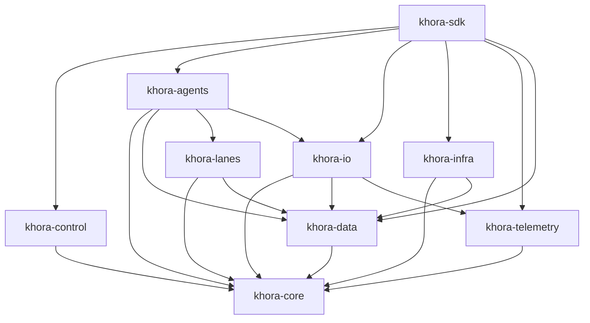

# CLAD — Organization

Khora is built on two core architectural concepts: the **Symbiotic Adaptive Architecture (SAA)** and the **CLAD Pattern**. They are not separate — they are two sides of the same coin.

- **SAA is the "Why"** — the philosophical blueprint: a self-optimizing, adaptive engine
- **CLAD is the "How"** — the concrete Rust implementation: strict crate structure, data flow patterns

Every abstract concept in the SAA has a direct, physical home within the CLAD structure.

```mermaid
graph TD
    subgraph SAA["Symbiotic Adaptive Architecture (The WHY)"]
        DCC[Dynamic Context Core]
        ISA[Intelligent Subsystem Agents]
        GORNA[GORNA Protocol]
        AGDF[Adaptive Game Data Flows]
        Contracts[Semantic Interfaces]
        Obs[Observability]
    end
    subgraph CLAD["CLAD Crate Pattern (The HOW)"]
        Control[khora-control]
        Agents[khora-agents]
        Lanes[khora-lanes]
        Data[khora-data]
        Core[khora-core]
        IO[khora-io]
        Tele[khora-telemetry]
        Infra[khora-infra]
    end
    DCC --> Control
    GORNA --> Control
    ISA --> Agents
    AGDF --> Data
    Contracts --> Core
    Obs --> Tele
    Control -.->|Orchestrates| Agents
    Agents -.->|Switches| Lanes
    Lanes -.->|Uses Traits| Core
    Data -.->|Uses Traits| Core
    IO -.->|I/O Services| Agents
    Infra -.->|Implements Contracts| Core
```



## The SAA-CLAD Mapping

| SAA Concept (The "Why") | CLAD Crate (The "How") | Role |
|------------------------|----------------------|------|
| **Dynamic Context Core (DCC)** & **GORNA** | `khora-control` | Strategic brain — observes telemetry, allocates budgets, runs Scheduler |
| **Intelligent Subsystem Agents (ISAs)** | `khora-agents` | Tactical managers — each responsible for a domain (rendering, physics, audio, UI) |
| **Multiple ISA Strategies** | `khora-lanes` | Fast, deterministic workers — algorithms an Agent can choose from |
| **Adaptive Game Data Flows (AGDF)** | `khora-data` | Foundation — CRPECS enables flexible data layouts, dynamic component addition/removal |
| **Semantic Interfaces & Contracts** | `khora-core` | Universal language — traits, core types, math, GORNA types |
| **I/O Services** | `khora-io` | Asset loading, VFS, serialization — on-demand services, not agents |
| **Observability & Telemetry** | `khora-telemetry` | Nervous system — gathers performance data for the DCC |
| **Hardware & OS Interaction** | `khora-infra` | Bridge to the outside world — wgpu, winit, Rapier3D, CPAL, Taffy |

## Dependency Rules

<div class="callout callout-danger">

**Never** create circular dependencies. Dependencies flow downward only.

</div>



| Rule | Description |
|------|-------------|
| **No upward deps** | `khora-core` cannot depend on any other crate |
| **No lateral deps** | `khora-agents` cannot depend on `khora-control` |
| **I/O is shared** | `khora-io` is used by both agents and the SDK |
| **Traits in core** | Abstract traits live in `khora-core`, implementations in specific crates |

## The 12 Crates

| Crate | Layer | Responsibility |
|-------|-------|----------------|
| `khora-core` | Foundation | Trait definitions, math types, GORNA types, service registry, memory tracking |
| `khora-data` | Data | ECS (CRPECS), archetype SoA, components, scene definitions, EcsMaintenance |
| `khora-io` | Data | VFS, asset loading (FileLoader/PackLoader), serialization strategies |
| `khora-lanes` | Lanes | Hot-path pipelines: render strategies, physics steps, audio mixing, scene transforms |
| `khora-agents` | Agents | Intelligent subsystem managers: Render, Physics, UI, Audio (extensible — users can add more) |
| `khora-control` | Control | DCC orchestration, GORNA protocol, ExecutionScheduler, BudgetChannel, EnginePlugin |
| `khora-infra` | Infrastructure | wgpu backend, winit window, Rapier3D physics, CPAL audio, Taffy layout |
| `khora-telemetry` | Telemetry | TelemetryService, MetricsRegistry, resource monitors |
| `khora-sdk` | Public API | Engine, GameWorld, Application trait, AppContext |
| `khora-editor` | Editor | Editor application with panels, gizmos, scene I/O |
| `khora-macros` | Support | `#[derive(Component)]` proc macro |
| `khora-plugins` | Support | Plugin loading and registration |

## Extensibility — User-Created Agents & Lanes

The system is designed for extension. Users can create:

### Custom Agents

```rust
pub struct MyAIAgent { /* ... */ }

impl Agent for MyAIAgent {
    fn id(&self) -> AgentId { AgentId::Custom("ai".to_string()) }
    fn execution_timing(&self) -> ExecutionTiming {
        ExecutionTiming {
            allowed_modes: vec![EngineMode::Playing],
            allowed_phases: vec![ExecutionPhase::TRANSFORM],
            priority: 0.7,
            importance: AgentImportance::Important,
            ..Default::default()
        }
    }
    fn execute(&mut self, ctx: &mut EngineContext<'_>) { /* ... */ }
    // ... other trait methods
}
```

### Custom Lanes

```rust
pub struct MyCustomLane { /* ... */ }

impl Lane for MyCustomLane {
    fn strategy_name(&self) -> &'static str { "MyCustom" }
    fn execute(&mut self, ctx: &mut LaneContext<'_>) -> Result<(), LaneError> {
        // Pipeline work here
        Ok(())
    }
    // prepare() and cleanup() have default no-op implementations
}
```

<div class="callout callout-tip">

This separation of concerns resolves the classic conflict between complexity and performance. Khora is highly intelligent and dynamic in its **Control Plane** (`control`, `agents`) while being uncompromisingly fast and predictable in its **Data Plane** (`lanes`, `data`).

</div>
