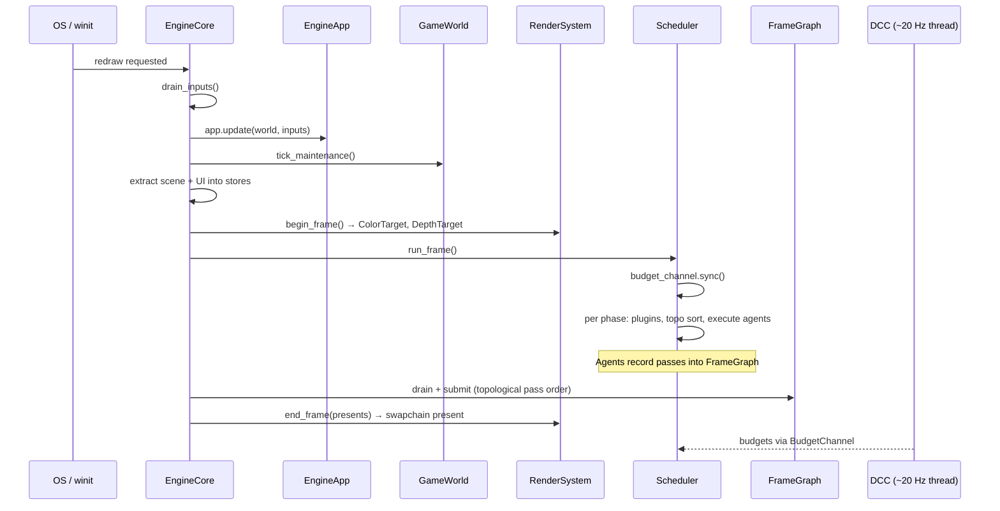
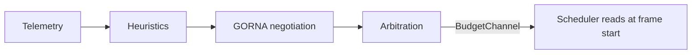

# Lifecycle

How Khora wakes up, runs, and shuts down.

- Document — Khora Lifecycle v1.0
- Status — Authoritative
- Date — May 2026

---

## Contents

1. The big picture
2. Startup
3. The frame loop
4. Cold path — DCC thread
5. Execution phases
6. Engine modes
7. Decisions
8. Open questions

---

## 01 — The big picture

Khora has two clocks. The **hot path** runs every frame on the main thread, at 60 Hz or higher, and it must never block. The **cold path** runs ~20 Hz on a background thread, watches what just happened, and decides what should happen next. The two communicate through one channel: budgets flow from the cold path to the hot path; telemetry flows back through the registry.



## 02 — Startup

```
run_winit::<WinitWindowProvider, MyApp>(bootstrap)  ← Entry point
  └─ MyApp::window_config()         ← Read window settings
  └─ window opened
  └─ bootstrap(window, services, _) ← Your closure registers the renderer
  └─ MyApp::new()                   ← Construct the app, no context yet
  └─ engine init                    ← Default services + DCC + agents registered
  └─ MyApp::setup(world, services)  ← Cache services, spawn entities
  └─ dcc.initialize_agents(ctx)     ← Agents cache services once
```

| Step | What happens |
|---|---|
| `run_winit::<W, A>(bootstrap)` | The SDK boots: opens a window via the chosen `WindowProvider`, runs your bootstrap closure (typically registers `WgpuRenderSystem`), then enters the frame loop. |
| `MyApp::window_config()` | Returns a `WindowConfig` — title, size, optional icon. |
| Bootstrap closure | Receives the window, the `ServiceRegistry`, and the native event loop. Register your renderer and any custom services here. |
| `MyApp::new()` | Your app constructor — no arguments, no context. Used to set up internal state. |
| `MyApp::setup(world, services)` | Called once after engine init. Spawn initial entities and cache service handles. |
| `dcc.initialize_agents(ctx)` | The DCC walks every registered agent and calls `on_initialize`. Agents cache their services here, exactly once. |

After this, the engine enters the frame loop. Nothing in `setup` is ever re-run.

## 03 — The frame loop

`EngineCore::tick_with_services` runs five stages in order. Each is a public method on `EngineCore` so drivers (the editor's overlay/shell) can interleave hooks between them.

```
tick_with_services(frame_services):
  1. drain_inputs()              ← Pop queued InputEvents, tick telemetry
  2. run_app_update(&inputs)     ← App logic + maintenance + extraction
  3. presents = begin_render_frame(&frame_services)
                                 ← RenderSystem::begin_frame, swapchain acquire
  4. run_scheduler(&frame_services)
                                 ← Phase-by-phase agent execution
  5. end_render_frame(presents)  ← submit_frame_graph + RenderSystem::end_frame
```

### Stage 1 — `drain_inputs`
Pops queued `InputEvent`s into a vector for the app to consume. Ticks telemetry counters. Marks the simulation as started on the first input frame.

### Stage 2 — `run_app_update`
Runs in this order:
1. `app.update(world, &inputs)` — user game logic.
2. `world.tick_maintenance()` — drain ECS cleanup / vacuum queues, compact pages.
3. **GPU mesh sync** — handles freshly added meshes are uploaded through `GpuCache`.
4. **Scene extraction** — `khora_data::render::extract_scene` populates `RenderWorldStore`; `khora_data::ui::extract_ui_scene` populates `UiSceneStore`.

### Stage 3 — `begin_render_frame`
Calls `RenderSystem::begin_frame()`, which acquires the swapchain texture, registers a view, and inserts `ColorTarget`, `DepthTarget`, and `ClearColor` into the per-frame `FrameContext`. Returns the `presents` token used at end-of-frame.

### Stage 4 — `run_scheduler`
The `ExecutionScheduler` runs every active phase in order (`INIT`, `OBSERVE`, `TRANSFORM`, `MUTATE`, `OUTPUT`, `FINALIZE`, plus any custom phases inserted after `OUTPUT`). For each phase it:

1. Syncs budgets from the DCC via `BudgetChannel::sync()`.
2. Runs registered `EnginePlugin` hooks for this phase.
3. Topologically sorts the agents declared for this phase + current `EngineMode`, using their hard dependencies as edges; tiebreaks by `AgentImportance` then `priority`.
4. Executes agents sequentially, skipping `Optional` agents under budget pressure (frame elapsed > 16 ms).
5. Marks completion in an `AgentCompletionMap` so dependent agents can tell their preconditions ran.

### Stage 5 — `end_render_frame`
1. **Drain `FrameGraph`** — agents that recorded passes during `OUTPUT` now have their command buffers topologically ordered by resource reads/writes and submitted to the device.
2. `RenderSystem::end_frame(presents)` — present the swapchain texture.

The five stages are the single most important sequence in Khora. Everything performance-critical happens here, in this order.

## 04 — Cold path — DCC thread

The DCC runs independently at ~20 Hz on a background thread:

1. **Collect** telemetry from agents and hardware monitors.
2. **Analyze** with the heuristic engine (thermal, battery, load).
3. **Negotiate** via GORNA — request strategies from agents.
4. **Arbitrate** — select an optimal strategy per agent based on the budget.
5. **Apply** — send budgets through the BudgetChannel to the Scheduler.

The cold path **never blocks** the hot path. Budgets are sent through a unidirectional channel with **last-wins** semantics — if multiple budgets arrive between frames, only the latest is used.



Heuristics, request shapes, and arbitration are detailed in [GORNA](./08_gorna.md).

## 05 — Execution phases

The Scheduler organizes per-frame work into **phases**. Each agent declares which phases it can run in.

| Phase | Purpose | Example agents |
|---|---|---|
| `Init` | Frame setup, reset | — |
| `Observe` | Read-only extraction | RenderAgent, ShadowAgent, UiAgent |
| `Transform` | Simulation, computation | PhysicsAgent, AudioAgent |
| `Mutate` | Write results, sync | — |
| `Output` | External output (present) | RenderAgent, UiAgent |
| `Finalize` | Cleanup, telemetry | — |

Phases are not subsystem-specific. They describe *what kind of work* runs, not *who* runs it. A custom phase can be inserted with `ExecutionPhase::custom(id)`.

## 06 — Engine modes

`EngineMode` is an open enum:

```rust
pub enum EngineMode {
    Playing,
    Custom(String),
}
```

The base engine ships only `Playing`. Other modes are injected by plugins — the editor registers `EngineMode::Custom("editor")` for example. Agents declare `allowed_modes` in their `ExecutionTiming`; the Scheduler filters automatically.

| Mode | Typical active agents | Purpose |
|---|---|---|
| `Custom("editor")` | Render, Shadow, UI | Scene editing, UI panels, gizmos (editor application) |
| `Playing` | Render, Shadow, Physics, Audio | Full game simulation |

The mode boundary is also where **play mode snapshots** happen — the world is serialized when you press *Play* and restored when you press *Stop*. See [Serialization](./14_serialization.md).

Note: the editor's own `PlayMode` enum (`Editing`/`Playing`/`Paused`) is a *UI-state* concept, separate from `EngineMode`. The editor mediates between the two — see [Editor](./18_editor.md).

## 07 — Decisions

### We said yes to
- **Two threads, one channel.** The DCC owns its thread; the Scheduler owns the main thread; they touch only through `BudgetChannel`. Anything more would let the cold path stall the frame loop.
- **Last-wins budget delivery.** The Scheduler doesn't replay a queue; it reads the latest snapshot. Reasoning: if two budgets arrived in the same frame interval, the older one is already irrelevant.
- **Phase-based ordering.** Agents declare phases, not absolute frame slots. The Scheduler resolves the dependency graph each frame.
- **`tick_maintenance` outside the agent system.** ECS GC has no strategies — it does the same thing every frame. Making it an agent would dilute what "agent" means.

### We said no to
- **Synchronous DCC calls from agents.** An agent that waits on the DCC is a frame stall waiting to happen.
- **Fixed agent execution order at compile time.** The DCC may reorder importance; the Scheduler resolves dependencies dynamically.
- **A separate "physics tick" loop.** PhysicsAgent owns its accumulator and runs in `Transform` like everything else. One frame loop is enough.

## 08 — Open questions

1. **Multi-threaded execution within a phase.** Today, agents in the same phase run sequentially after dependency resolution. A future Scheduler may parallelize independent agents across worker threads.
2. **Variable cold-path frequency.** ~20 Hz is a default. On low-power targets (mobile, handheld) we may want 5–10 Hz. The trigger model for changing this at runtime is open.
3. **Frame pacing.** Khora does not yet implement explicit frame pacing for VRR / fixed-rate displays. The hooks exist; the policy doesn't.

---

*Next: the eleven crates, in detail. See [Crate map](./04_crates.md).*
