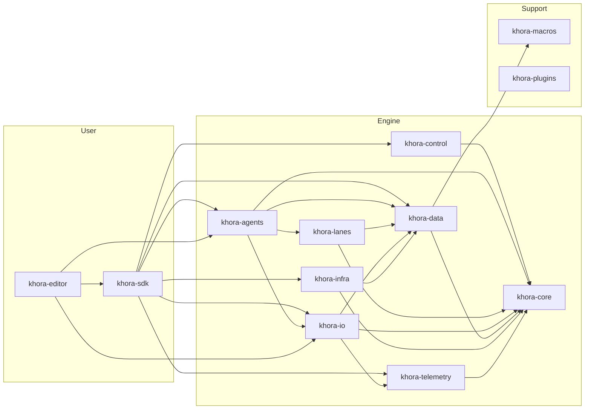

# Crate map

Where things live, in order of dependency depth.

- Document — Khora Crate Map v1.0
- Status — Authoritative
- Date — May 2026

---

## Contents

1. The graph at a glance
2. Foundation crates
3. Data crates
4. Lane and agent crates
5. Control and infrastructure
6. Public API
7. Editor
8. Where things live
9. Open questions

---

## 01 — The graph at a glance

Dependencies flow downward only.

## 02 — Foundation crates

### `khora-core`
The trait floor. Everything builds on it; it depends on nothing else in the workspace.

| Module | Contents |
|---|---|
| `lane/` | `Lane` trait, `LaneContext`, slots and refs |
| `agent/` | `Agent` trait, `AgentId`, `ExecutionTiming` |
| `math/` | `Vec2/3/4`, `Mat3/4`, `Quat`, `Aabb`, `LinearRgba` |
| `physics/` | `PhysicsProvider` trait, body and collider types |
| `audio/` | `AudioDevice` trait |
| `asset/`, `vfs/` | `Asset` trait, `VirtualFileSystem` |
| `ui/` | `LayoutSystem` trait |
| `scene/` | Scene file format, serialization types |
| `control/gorna/` | GORNA types — `NegotiationRequest/Response`, `ResourceBudget` |
| `service_registry.rs`, `context.rs` | `ServiceRegistry`, `EngineContext` |
| `renderer/error.rs` | Error hierarchy |

### `khora-macros`
Procedural macros. Today: `#[derive(Component)]`, which generates the `SerializableX` mirror struct, `From` conversions, and inventory registration glue.

## 03 — Data crates

### `khora-data`
The ECS and component storage layer.

| Module | Contents |
|---|---|
| `ecs/` | `World`, `Archetype`, `Query`, `Page`, `SemanticDomain`, `EcsMaintenance` |
| `ecs/components/` | Standard components and the `register_components!` macro |
| `ui/` | UI components (`UiTransform`, `UiColor`, `UiText`, `UiImage`, `UiBorder`) |
| `assets/` | `Assets<T>` registry, `AssetHandle<T>` |
| `allocators/` | `SaaTrackingAllocator` — heap allocation tracking |

### `khora-io`
Asset and serialization services. Sits between data storage and the agents that need them.

| Module | Contents |
|---|---|
| `vfs/` | `VirtualFileSystem` (UUID → metadata, O(1)) |
| `asset/` | `AssetService`, `AssetIo` trait, `FileLoader`, `PackLoader`, `DecoderRegistry` |
| `serialization/` | `SerializationService`, three strategies (Definition, Recipe, Archetype) |

## 04 — Lane and agent crates

### `khora-lanes`
The hot-path workers. Every algorithm lives here.

| Folder | Lanes |
|---|---|
| `render_lane/` | `SimpleUnlitLane`, `LitForwardLane`, `ForwardPlusLane`, `ShadowPassLane`, `UiRenderLane`, `ExtractLane` |
| `render_lane/shaders/` | WGSL files: `lit_forward.wgsl`, `shadow_depth.wgsl`, `simple_unlit.wgsl`, `standard_pbr.wgsl`, `forward_plus.wgsl`, `ui.wgsl` |
| `physics_lane/` | `StandardPhysicsLane`, `PhysicsDebugLane` |
| `audio_lane/` | `SpatialMixingLane` |
| `asset_lane/loading/` | Per-format decoders: glTF, OBJ, WAV, Symphonia (Ogg/MP3/FLAC), texture, font, pack |
| `scene_lane/` | `TransformPropagationLane`, scene serialization lanes |
| `ui_lane/` | `StandardUiLane` (Taffy layout) |
| `ecs_lane/` | `CompactionLane` |

### `khora-agents`
Five agents — one per `LaneKind`.

| Agent | Folder | `LaneKind` |
|---|---|---|
| `RenderAgent` | `render_agent/` | `Render` |
| `ShadowAgent` | `shadow_agent/` | `Shadow` |
| `UiAgent` | `ui_agent/` | `Ui` |
| `PhysicsAgent` | `physics_agent/` | `Physics` |
| `AudioAgent` | `audio_agent/` | `Audio` |

Plus `PhysicsQueryService` — an on-demand wrapper over `PhysicsProvider` for raycasts and debug geometry.

## 05 — Control and infrastructure

### `khora-control`
The cold-path brain.

| Module | Contents |
|---|---|
| `service.rs` | `DccService` — agent lifecycle, tick loop |
| `gorna/` | `GornaArbitrator` — budget fitting algorithm |
| `analysis.rs` | `HeuristicEngine` — nine heuristics, death-spiral detection |
| `scheduler.rs` | `ExecutionScheduler` — hot-path orchestration |
| `budget_channel.rs` | `BudgetChannel` — cold→hot pipe |
| `plugin.rs` | `EnginePlugin` — extensible per-phase hooks |

### `khora-infra`
Backends. One subfolder per backend, each implementing a `khora-core` trait. The wgpu, Rapier, CPAL, Taffy choices below are *current defaults* — alternative backends drop in as new sibling folders without touching the rest of the engine.

| Folder | Backend | Implements |
|---|---|---|
| `graphics/wgpu/` | wgpu 28.0 | `RenderSystem` (`WgpuRenderSystem`, `WgpuDevice`) |
| `physics/rapier/` | Rapier3D | `PhysicsProvider` |
| `audio/cpal/` | CPAL | `AudioDevice` |
| `ui/taffy/` | Taffy | `LayoutSystem` |
| `platform/window/` | winit | Window creation, event loop |
| `platform/input.rs` | winit | `InputEvent` translation |
| `telemetry/` | Native APIs | `GpuMonitor`, `MemoryMonitor`, `VramMonitor` |

### `khora-telemetry`
Observability infrastructure.

| Module | Contents |
|---|---|
| `service.rs` | `TelemetryService` |
| `metrics/` | `MetricsRegistry`, `MonitorRegistry` |

## 06 — Public API

### `khora-sdk`
The user-facing surface. Everything else is implementation detail.

| Module | Contents |
|---|---|
| `lib.rs` | Re-exports + prelude. Defines `WindowConfig`, `WindowIcon`, `PRIMARY_VIEWPORT` |
| `engine.rs` | `EngineCore` — the engine type |
| `game_world.rs` | `GameWorld` — safe ECS facade |
| `traits.rs` | `EngineApp`, `AgentProvider`, `PhaseProvider`, `WindowProvider` |
| `vessel.rs` | `Vessel` builder + `spawn_plane` / `spawn_cube_at` / `spawn_sphere` helpers |
| `winit_adapters.rs` | `run_winit` entry point + `WinitWindowProvider` (default winit-based window) |
| `prelude/` | Curated re-exports — `prelude::*`, `prelude::ecs::*`, `prelude::math::*`, `prelude::materials::*` |

The walkthrough is in [SDK quickstart](./16_sdk_quickstart.md). The full API surface is in [SDK reference](./17_sdk_reference.md).

## 07 — Editor

### `khora-editor`
The editor application. Built on the SDK, but reaches deeper for performance.

| Folder | Contents |
|---|---|
| `panels/` | Scene tree, properties, asset browser, viewport, console, GORNA stream |
| `gizmos/` | Move / rotate / scale, selection outline |
| `ops/` | High-level scene operations (spawn, despawn, parent, add component) |
| `scene_io/` | Scene save / load via `SerializationService` |

Visual language and panel anatomy in [Editor design system](./design/editor.md).

## 08 — Where things live

A flat lookup table for "I want to find X."

| Concern | Crate / module |
|---|---|
| Lane trait | `khora-core::lane` |
| Agent trait | `khora-core::agent` |
| Math types | `khora-core::math` |
| GORNA types | `khora-core::control::gorna` |
| ECS World and components | `khora-data::ecs` |
| Tracking allocator | `khora-data::allocators` |
| VFS and asset loading | `khora-io` |
| Serialization strategies | `khora-io::serialization` |
| Render pipelines | `khora-lanes::render_lane` |
| WGSL shaders | `khora-lanes::render_lane::shaders` |
| Physics lanes | `khora-lanes::physics_lane` |
| Audio lanes | `khora-lanes::audio_lane` |
| Scene transforms | `khora-lanes::scene_lane` |
| Agent implementations | `khora-agents` |
| Scheduler and GORNA | `khora-control` |
| wgpu backend | `khora-infra::graphics::wgpu` |
| Rapier backend | `khora-infra::physics::rapier` |
| CPAL backend | `khora-infra::audio::cpal` |
| Taffy backend | `khora-infra::ui::taffy` |
| Resource monitors | `khora-infra::telemetry` |
| User-facing API | `khora-sdk` |
| Editor UI | `khora-editor` |
| Sandbox app | `examples/sandbox` |

## 09 — Open questions

1. **Should `khora-editor` depend on `khora-sdk` only?** Today it reaches into `khora-agents` and `khora-io` for performance. Justified, but a violation of the "SDK is the public API" principle.
2. **Plugin crate scope.** `khora-plugins` exists but its API is in flux. Editor extensibility, scripting, and runtime plugin loading all share this crate's eventual surface.

---

*Next: the data layer that everything sits on. See [ECS — CRPECS](./05_ecs.md).*
