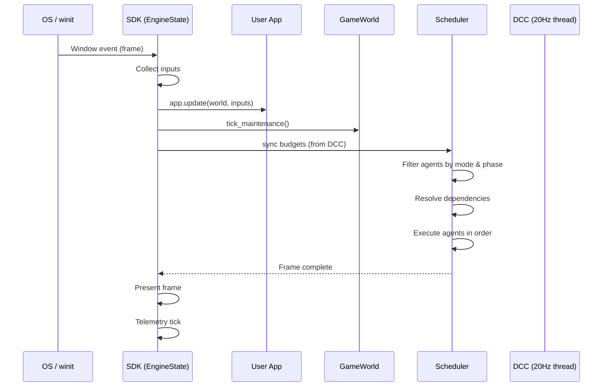

# Engine Lifecycle

Khora's execution model separates **cold-path analysis** from **hot-path execution**, with a clean frame loop orchestrated by the Scheduler.

## The Complete Frame Loop

## Phase-by-Phase Breakdown

| Phase | What happens | Who runs it |
|-------|-------------|-------------|
| **1. Input** | Collect winit events → InputEvent | SDK |
| **2. User Logic** | `app.update(world, inputs)` | User's Application |
| **3. Maintenance** | ECS garbage collection, compaction | GameWorld |
| **4. Budget Sync** | Drain DCC budget channel | Scheduler |
| **5. Agent Execution** | Filter → sort → execute agents | Scheduler |
| **6. Present** | Swapchain present, overlay render | SDK |
| **7. Telemetry** | Metrics collection, logging | TelemetryService |

## ExecutionPhase — Frame Pipeline Stages

The Scheduler organizes agent execution into **phases**. Each agent declares which phases it can run in.

| Phase | Purpose | Example Agents |
|-------|---------|----------------|
| `Init` | Frame setup, reset | — |
| `Observe` | Read-only extraction | RenderAgent, UiAgent |
| `Transform` | Simulation, computation | PhysicsAgent, AudioAgent |
| `Mutate` | Write results, sync | — |
| `Output` | External output | RenderAgent, UiAgent |
| `Finalize` | Cleanup, telemetry | — |

**Custom phases** — Users can create custom phases with `ExecutionPhase::custom(id)` and insert them into the execution order via the Scheduler API.

## EngineMode — Editor vs Playing

| Mode | Active Agents | Purpose |
|------|--------------|---------|
| **Editor** | Render, UI | Scene editing, UI panels, gizmos |
| **Playing** | Render, Physics, Audio | Full game simulation |

Agents declare `allowed_modes` in their `ExecutionTiming`. The Scheduler filters automatically.

## Cold Path — DCC Thread

The DCC runs independently at ~20 Hz on a background thread:

1. **Collect** telemetry from agents and hardware monitors
2. **Analyze** with heuristic engine (thermal, battery, load)
3. **Negotiate** via GORNA — request strategies from agents
4. **Arbitrate** — select optimal strategy per agent based on budget
5. **Apply** — send budgets through BudgetChannel to Scheduler

The cold path never blocks the hot path. Budgets are sent through a unidirectional channel with "last wins" semantics — if multiple budgets arrive between frames, only the latest is used.

