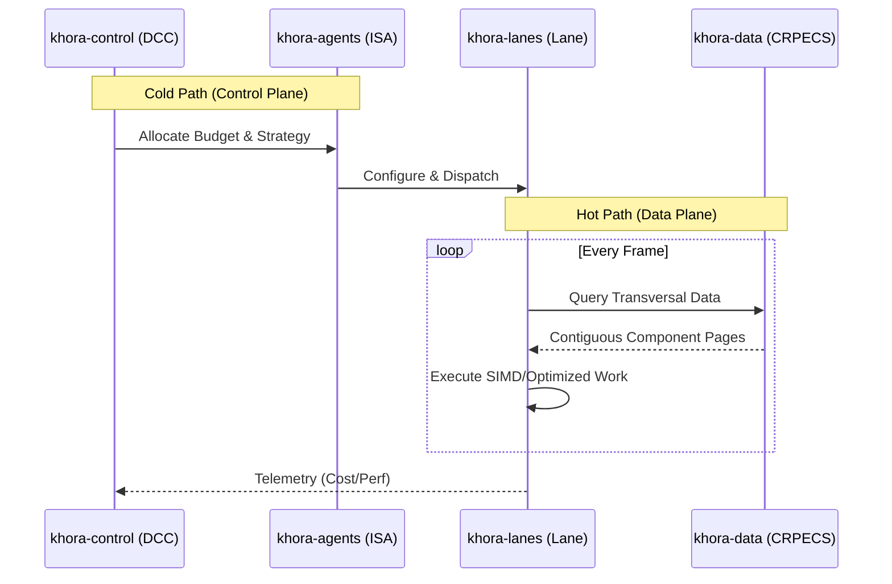

# 4. Technical Architecture: The CLAD Pattern

The **CLAD (Control-Lane-Agent-Data)** pattern is the concrete Rust implementation of the SAA philosophy. It is an architectural style designed for extreme performance and maintainability by enforcing a strict separation of concerns.

### Core Principle: The Hot/Cold Path Split

The entire engine is architected around isolating the **Control Plane (Cold Path)** from the **Data Plane (Hot Path)**.



*   **Cold Path (Control Plane)**:
    *   **Purpose**: Complex, stateful decision-making.
    *   **Components**: `khora-control`, `khora-agents`.
    *   **Frequency**: Ticks at a lower, non-critical rate (e.g., 10-60 Hz).
    *   **Characteristics**: Permitted to use complex logic, perform memory allocations, write logs, and analyze data. Its execution time does **not** directly impact the rendering time of a single frame.

*   **Hot Path (Data Plane)**:
    *   **Purpose**: Raw, deterministic work execution.
    *   **Components**: `khora-lanes`, `khora-data`.
    *   **Frequency**: Must execute within a strict frame budget (e.g., < 16.67ms for 60fps).
    *   **Characteristics**: Optimized for raw speed. Aims for zero heap allocations, cache-friendly data access (SoA), SIMD operations, and minimal branching.

### The CLAD Crates: Roles and Responsibilities

#### `khora-core` - The Foundation
The bedrock of the engine. It contains only abstract `traits`, universal data types (like math primitives), and interface contracts. It has zero dependencies on other `khora-*` crates and defines the universal \"language\" of the engine.

#### `khora-data` - The Data Layer ([D]ata)
The heart of Khora's data management strategy. This crate's primary responsibility is the implementation of our custom, high-performance **CRPECS**. It provides the concrete foundation for the **AGDF** concept, containing the specialized memory allocators, page structures, and the query engine that drives the entire Data Plane.

#### `khora-lanes` - The Hot Path ([L]ane)
This crate contains the performance-critical, \"dumb\" execution pipelines. A `Lane` is a specific implementation of an ISA's **strategy** (e.g., a rendering pass, a physics solver). They are optimized for linear data processing and contain no complex branching logic.

#### `khora-agents` - The Tactical Brains ([A]gent)
This crate is the home of the **ISAs**. Each agent is an intelligent wrapper around one or more `Lanes`. It is responsible for reporting its status to the Control Plane, estimating the cost of its strategies, and, upon receiving a budget, configuring and dispatching the appropriate `Lane`.

#### `khora-control` - The Strategic Brain ([C]ontrol)
The highest level of decision-making. This crate contains the **DCC** and the **GORNA** protocol implementation. It consumes telemetry, evaluates the overall situation against high-level goals, and orchestrates the `Agents` by allocating their resource budgets.

#### `khora-telemetry` - The Nervous System
A dedicated service for collecting, aggregating, and exposing engine-wide metrics. It gathers raw data from `khora-infra` (e.g., VRAM usage) and the `Lanes` (e.g., execution time) and provides it in a structured format to `khora-control` and debugging tools.

#### `khora-infra` - The Bridge to the World
This crate contains all concrete implementations that interact with external systems: GPU backends (WGPU), windowing (Winit), filesystem I/O, networking libraries, etc. It primarily implements the generic `traits` defined in `khora-core`.

#### `khora-sdk` - The Public Facade
A simple, stable API designed for game developers. It hides the complexity of the internal CLAD architecture and provides ergonomic, easy-to-use entry points for building an application with Khora. It owns the ECS `World` and `Assets` internally and exposes them through the `GameWorld` facade — users never interact with raw engine types.

#### `khora-macros` - Development Ergonomics
A procedural macro crate that provides derive macros to reduce boilerplate and improve developer experience. This crate implements compile-time code generation to automatically implement common traits throughout the engine. Currently provides the `#[derive(Component)]` macro for automatically implementing the `khora_data::ecs::Component` trait while enforcing its required bounds (`Clone`, `Send`, `Sync`, `'static`). As the engine evolves, this crate will house additional derive macros and attribute macros to streamline development across all CLAD layers.

#### `khora-plugins` - Extensions and Packages
A specialized crate that packages independent strategies, lanes, or pre-configured systems into modular plugins. This allows the engine to be extended with new capabilities (e.g., specific rendering techniques, AI behaviors) without bloating the core architecture.

#### `khora-editor` - The Engine Tooling
An interactive graphical application built on top of the `khora-sdk` utilizing `egui`. It serves as the primary visual tool for interacting with the engine, providing a real-time viewport, scene hierarchy panel, and context visualization for the DCC's decisions.

---

## The Lane Abstraction Layer

At the center of the CLAD pattern sits the **Lane** abstraction: a unified trait, a typed context mechanism, and a generic registry. Together they allow agents to manage heterogeneous processing strategies without domain-specific coupling.

### The `Lane` Trait (`khora-core::lane`)

Every processing strategy in the engine — rendering, shadow mapping, physics, audio mixing, asset loading, serialization, ECS maintenance — implements `Lane`:

```rust
pub trait Lane: Send + Sync {
    fn strategy_name(&self) -> &'static str;
    fn lane_kind(&self) -> LaneKind;
    fn estimate_cost(&self, ctx: &LaneContext) -> f32;
    fn on_initialize(&self, ctx: &mut LaneContext) -> Result<(), LaneError>;
    fn execute(&self, ctx: &mut LaneContext) -> Result<(), LaneError>;
    fn on_shutdown(&self, ctx: &mut LaneContext);
    fn as_any(&self) -> &dyn Any;
    fn as_any_mut(&mut self) -> &mut dyn Any;
}
```

The lifecycle is linear: `on_initialize → [execute]* → on_shutdown`. Agents call these methods — lanes never call each other directly.

**`LaneKind`** classifies each lane so agents can route execution correctly:

| Variant | Domain |
| :--- | :--- |
| `Render` | Main scene rendering |
| `Shadow` | Shadow map generation |
| `Physics` | Physics simulation |
| `Audio` | Audio mixing / spatialization |
| `Asset` | Asset loading / processing |
| `Scene` | Serialization / deserialization |
| `Ecs` | ECS maintenance (compaction, GC) |

### `LaneContext` — The Type-Map

`LaneContext` is a `HashMap<TypeId, Box<dyn Any>>` that serves as the **only** data channel between agents and lanes. The agent populates it before dispatching; each lane reads what it needs and writes results for downstream consumers.

```rust
let mut ctx = LaneContext::new();
ctx.insert(device.clone());                // Arc<dyn GraphicsDevice>
ctx.insert(ColorTarget(view_id));          // Typed key
ctx.insert(Slot::new(&mut render_world));  // Mutable borrow wrapper
```

This design eliminates domain-specific trait signatures (no `fn render(&self, world: &RenderWorld, encoder: &mut dyn CommandEncoder, …)`) and keeps each lane loosely coupled to its agent.

### `Slot<T>` and `Ref<T>` — Borrow Wrappers

For data the agent **borrows** rather than owns, two wrappers erase the borrow lifetime so the value can be stored in the type-map:

| Wrapper | Access | Use case |
| :--- | :--- | :--- |
| `Slot<T>` | `get() → &mut T` | Mutable borrows (encoder, render world) |
| `Ref<T>` | `get() → &T` | Shared borrows |

Safety is guaranteed by the **stack-scoped context pattern**: the `LaneContext` is created in the agent's frame method, passed to one lane at a time, and dropped before the function returns. The `Slot`/`Ref` never outlive the original reference.

### `LaneRegistry` — Generic Lane Storage

Agents store their lanes in a `LaneRegistry` instead of using domain-specific vectors:

```rust
pub struct LaneRegistry {
    lanes: Vec<Box<dyn Lane>>,
}
```

Key operations:

| Method | Purpose |
| :--- | :--- |
| `register(lane)` | Adds a lane to the registry. |
| `get(name)` | Finds a lane by `strategy_name()`. |
| `find_by_kind(kind)` | Returns all lanes matching a `LaneKind`. |
| `all()` | Returns a slice of all registered lanes. |

This allows developers to add custom lanes without modifying agent code — simply register the lane and the agent will discover it through the registry.

### Context Keys (`khora-core::lane::context_keys`)

Standard typed keys used across the engine:

| Key Struct | Inner Type | Domain |
| :--- | :--- | :--- |
| `ColorTarget` | `TextureViewId` | Rendering |
| `DepthTarget` | `TextureViewId` | Rendering |
| `ClearColor` | `LinearRgba` | Rendering |
| `ShadowAtlasView` | `TextureViewId` | Shadows |
| `ShadowComparisonSampler` | `SamplerId` | Shadows |
| `PhysicsDeltaTime` | `f32` | Physics |
| `AudioStreamInfo` | `StreamInfo` | Audio |
| `AudioOutputSlot` | `Slot<[f32]>` | Audio |

Agents and lanes agree on these types at compile time — no string-based lookup, no runtime key negotiation.