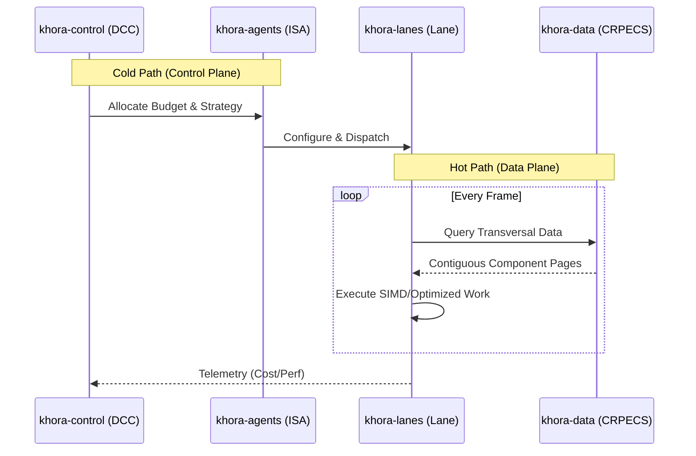

# 4. Technical Architecture: The CLAD Pattern

The **CLAD (Control-Lane-Agent-Data)** pattern is the concrete Rust implementation of the SAA philosophy. It is an architectural style designed for extreme performance and maintainability by enforcing a strict separation of concerns.

### Core Principle: The Hot/Cold Path Split

The entire engine is architected around isolating the **Control Plane (Cold Path)** from the **Data Plane (Hot Path)**.

*   **Cold Path (Control Plane)**:
    *   **Purpose**: Complex, stateful decision-making.
    *   **Components**: `khora-control`, `khora-agents`.
    *   **Frequency**: Ticks at a lower, non-critical rate (e.g., 10-60 Hz).
    *   **Characteristics**: Permitted to use complex logic, perform memory allocations, write logs, and analyze data. Its execution time does **not** directly impact the rendering time of a single frame.

*   **Hot Path (Data Plane)**:
    *   **Purpose**: Raw, deterministic work execution.
    *   **Components**: `khora-lanes`, `khora-data`.
    *   **Frequency**: Must execute within a strict frame budget (e.g., < 16.67ms for 60fps).
    *   **Characteristics**: Optimized for raw speed. Aims for zero heap allocations, cache-friendly data access (SoA), SIMD operations, and minimal branching.

### The CLAD Crates: Roles and Responsibilities

#### `khora-core` - The Foundation
The bedrock of the engine. It contains only abstract `traits`, universal data types (like math primitives), and interface contracts. It has zero dependencies on other `khora-*` crates and defines the universal \"language\" of the engine.

#### `khora-data` - The Data Layer ([D]ata)
The heart of Khora's data management strategy. This crate's primary responsibility is the implementation of our custom, high-performance **CRPECS**. It provides the concrete foundation for the **AGDF** concept, containing the specialized memory allocators, page structures, and the query engine that drives the entire Data Plane.

#### `khora-lanes` - The Hot Path ([L]ane)
This crate contains the performance-critical, \"dumb\" execution pipelines. A `Lane` is a specific implementation of an ISA's **strategy** (e.g., a rendering pass, a physics solver). They are optimized for linear data processing and contain no complex branching logic.

#### `khora-agents` - The Tactical Brains ([A]gent)
This crate is the home of the **ISAs**. Each agent is an intelligent wrapper around one or more `Lanes`. It is responsible for reporting its status to the Control Plane, estimating the cost of its strategies, and, upon receiving a budget, configuring and dispatching the appropriate `Lane`.

#### `khora-control` - The Strategic Brain ([C]ontrol)
The highest level of decision-making. This crate contains the **DCC** and the **GORNA** protocol implementation. It consumes telemetry, evaluates the overall situation against high-level goals, and orchestrates the `Agents` by allocating their resource budgets.

#### `khora-telemetry` - The Nervous System
A dedicated service for collecting, aggregating, and exposing engine-wide metrics. It gathers raw data from `khora-infra` (e.g., VRAM usage) and the `Lanes` (e.g., execution time) and provides it in a structured format to `khora-control` and debugging tools.

#### `khora-infra` - The Bridge to the World
This crate contains all concrete implementations that interact with external systems: GPU backends (WGPU), windowing (Winit), filesystem I/O, networking libraries, etc. It primarily implements the generic `traits` defined in `khora-core`.

#### `khora-sdk` - The Public Facade
A simple, stable API designed for game developers. It hides the complexity of the internal CLAD architecture and provides ergonomic, easy-to-use entry points for building an application with Khora.

#### `khora-macros` - Development Ergonomics
A procedural macro crate that provides derive macros to reduce boilerplate and improve developer experience. This crate implements compile-time code generation to automatically implement common traits throughout the engine. Currently provides the `#[derive(Component)]` macro for automatically implementing the `khora_data::ecs::Component` trait while enforcing its required bounds (`Clone`, `Send`, `Sync`, `'static`). As the engine evolves, this crate will house additional derive macros and attribute macros to streamline development across all CLAD layers.