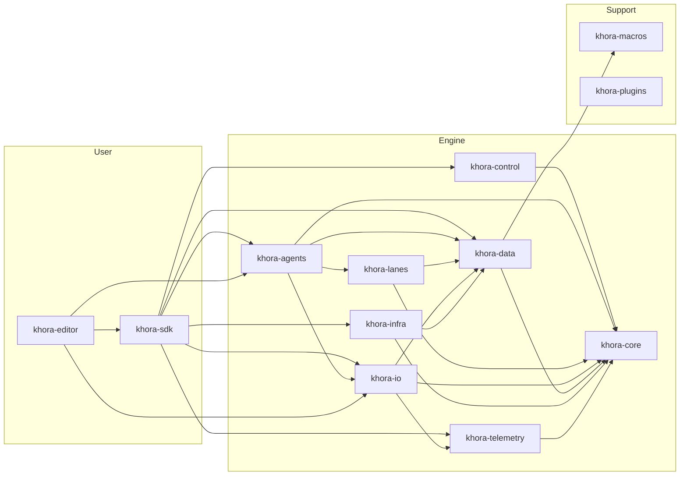

# Crate Map

Khora Engine is organized into **12 crates** in a Cargo workspace. Each crate has a single, clear responsibility.

## Dependency Graph

## Crate Details

| Crate | Lines | Key Types | Depends On |
|-------|-------|-----------|------------|
| **khora-core** | Foundation | `Lane`, `Agent`, `EngineContext`, `ServiceRegistry`, math types, GORNA types | — |
| **khora-data** | ECS | `World`, `Component`, `EcsMaintenance`, scene types | core, macros |
| **khora-io** | I/O | `VirtualFileSystem`, `AssetService`, `SerializationService`, `AssetIo` | core, data, telemetry |
| **khora-lanes** | Pipelines | Render lanes, PhysicsLane, AudioLane, SceneLane | core, data |
| **khora-agents** | Intelligence | RenderAgent, PhysicsAgent, UiAgent, AudioAgent | core, data, lanes, io |
| **khora-control** | Orchestration | `ExecutionScheduler`, `GornaArbitrator`, `BudgetChannel`, `EnginePlugin` | core |
| **khora-infra** | Backends | WgpuRenderSystem, RapierPhysics, TaffyLayout, CPALAudio | core, data |
| **khora-telemetry** | Observability | `TelemetryService`, `MetricsRegistry`, monitors | core |
| **khora-sdk** | Public API | `Engine`, `GameWorld`, `Application`, `AppContext` | core, data, agents, control, infra, lanes, telemetry, io |
| **khora-editor** | Editor | EditorApp, panels, ops, scene I/O | sdk, core, agents, io |
| **khora-macros** | Proc macros | `#[derive(Component)]` | syn, quote |
| **khora-plugins** | Plugin loading | Plugin trait, registry | core |

## Where Things Live

| Concern | Crate |
|---------|-------|
| Trait definitions | `khora-core` |
| Math types (Vec3, Mat4, Quat) | `khora-core::math` |
| ECS World & components | `khora-data::ecs` |
| VFS & asset loading | `khora-io` |
| Serialization strategies | `khora-io::serialization` |
| Render pipelines | `khora-lanes::render_lane` |
| Agent implementations | `khora-agents` |
| Scheduler & GORNA | `khora-control` |
| wgpu backend | `khora-infra::renderer::wgpu` |
| User-facing API | `khora-sdk` |
| Editor UI | `khora-editor` |
