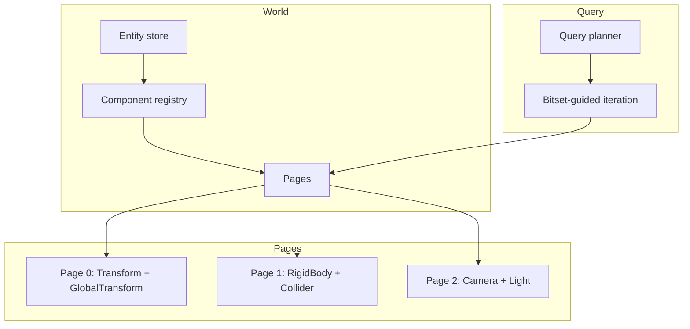

# ECS — CRPECS

The data layer Khora is built on. CRPECS is a custom archetype-based ECS with SoA storage, parallel queries, and semantic domains.

- Document — Khora ECS v1.0
- Status — Authoritative
- Date — May 2026

---

## Contents

1. Why CRPECS
2. Architecture overview
3. Entities
4. Components
5. Archetype pages
6. Semantic domains
7. Queries
8. ECS maintenance
9. Memory layout
10. For game developers
11. For engine contributors
12. Decisions
13. Open questions

---

## 01 — Why CRPECS

CRPECS — *Chunked Relational Page ECS* — exists because SAA's promise of **Adaptive Game Data Flows** requires a storage model where structural change is cheap. The three letters of the name are load-bearing: storage is **chunked** into bounded **pages**, the relationship between an entity and its data is **relational** (entities are identifiers, not pointers), and the page is the unit at which everything — iteration, compaction, serialization — happens.

The consequence: adding or removing a component to an entity is not an O(N) operation; whole pages are queryable in cache-friendly bursts; queries are guided by bitsets so sparse iteration stays fast. Off-the-shelf ECS libraries optimize for one of these. CRPECS is built to do all three, because the SAA needs all three.

## 02 — Architecture overview



The world owns three things: an **entity store** (sparse, generation-checked), a **component registry** (typed, inventory-driven), and a set of **archetype pages** (contiguous SoA arrays, one per component combination).

## 03 — Entities

Entities are lightweight identifiers with index and generation for safety:

```rust
pub struct EntityId {
    pub index: u32,
    pub generation: u32,
}
```

The generation prevents stale-handle bugs. When an entity is despawned and the slot is reused, the generation increments — old `EntityId` handles silently fail their lookups instead of pointing at the wrong entity.

## 04 — Components

Components are plain data types annotated with `#[derive(Component)]`:

```rust
#[derive(Component)]
pub struct Transform {
    pub translation: Vec3,
    pub rotation: Quaternion,
    pub scale: Vec3,
}
```

The derive does four things at compile time:

1. `impl Component for Transform`
2. Generates `SerializableTransform` with `Encode` / `Decode` (via bincode / serde).
3. Generates `From<Transform> for SerializableTransform` and the reverse.
4. Registers the component for scene serialization through `inventory::submit!`.

Two attributes refine the behavior:

| Attribute | Use |
|---|---|
| `#[component(skip)]` | Field excluded from serialization. Use for GPU handles, runtime state. |
| `#[component(no_serializable)]` | The whole component skips the auto-generated mirror. Use for unit structs and trait objects you handle manually. |

## 05 — Archetype pages

Components are stored in **archetype pages** — contiguous SoA arrays grouped by component combination:

| Page | Components | Entities |
|---|---|---|
| 0 | Transform, GlobalTransform | 1, 2, 3 |
| 1 | Transform, GlobalTransform, RigidBody, Collider | 4, 5 |
| 2 | Transform, GlobalTransform, Camera | 6 |

Adding a `RigidBody` to entity 1 moves it from page 0 to page 1. The cost is one component-by-component memcpy — bounded, predictable, cache-friendly. Bitsets on each page guide iteration so empty slots are skipped without branching.

## 06 — Semantic domains

Components are tagged with a **semantic domain** for optimized queries. Domains are encoded in a `DomainBitset` carried by every component registration:

| Domain | Components |
|---|---|
| `Spatial` | Transform, GlobalTransform, RigidBody, Collider |
| `Render` | Camera, Light, HandleComponent\<Mesh\>, MaterialComponent |
| `UI` | UiTransform, UiColor, UiText |
| `Audio` | AudioSource, AudioListener |

Domains let query planners pre-filter pages: a render extraction query with a `Render` domain hint never touches UI pages. This is part of how Khora keeps per-frame extraction fast even as the entity count grows.

Components are registered with the `Registry` at startup (one entry per type, via `inventory::submit!`). The registry is the source of truth for domain assignment, serialization metadata, and component identity.

## 07 — Queries

Queries are type-safe and use a planner for optimal execution:

```rust
let query = world.query::<(&Transform, &mut GlobalTransform)>();
for (transform, mut global) in query {
    global.0 = transform.compute_global();
}
```

The planner picks pages whose archetype contains every requested component, and iterates them in SoA order. References are borrow-checked at compile time — a `&mut Component` in one query closes the door on any other query touching that component for the duration.

## 08 — ECS maintenance

ECS maintenance is **not an agent** — it is a direct data-layer operation owned by `GameWorld`:

```rust
impl GameWorld {
    pub fn tick_maintenance(&mut self) {
        self.maintenance.tick(&mut self.world);
    }
}
```

`EcsMaintenance` lives at `crates/khora-data/src/ecs/maintenance.rs`. Each frame, between user logic and agent execution, the engine calls `tick_maintenance()` to drain pending cleanup and compaction work.

| Operation | Trigger | Effect |
|---|---|---|
| `queue_cleanup()` | Component removal | Marks orphaned data for cleanup |
| `queue_vacuum()` | Entity despawn | Marks page holes for compaction |
| `tick()` | Every frame, before agents | Drains queues, compacts pages |

**Why not an agent?** Maintenance has no strategies to negotiate. It does the same thing every frame. Agents are for subsystems with multiple execution strategies. Maintenance is a fixed data operation. See the *Agent vs Service* rule in [Architecture](./02_architecture.md).

## 09 — Memory layout

```
Page 0 (Transform + GlobalTransform)
┌─────────────┬─────────────┬─────────────┐
│ SoA arrays  │   Bitset    │  Metadata   │
│ tx ty tz rx │ 1 1 1 0 0 0 │ count: 3    │
│ ry rz sc... │             │ capacity: 8 │
└─────────────┴─────────────┴─────────────┘
```

Each page holds component arrays in struct-of-arrays form, a bitset describing which slots are live, and metadata for capacity and count. Iteration walks set bits and indexes into the SoA arrays — no per-entity allocation, no per-entity branching.

Compaction runs in `tick_maintenance()`. When too many holes accumulate, the page is rewritten with live entries packed to the front. Bitsets are rebuilt in the same pass.

---

## For game developers

You typically interact with the ECS through `GameWorld`, the SDK facade. It hides the raw `World` type and exposes a focused API.

```rust
// Spawn (raw tuple bundle)
let entity = world.spawn((Transform::identity(), GlobalTransform::identity()));

// Spawn through Vessel (the recommended path — see SDK quickstart)
let player = khora_sdk::Vessel::at(world, Vec3::new(0.0, 2.0, 10.0))
    .with_component(my_camera)
    .build();

// Read a transform
if let Some(t) = world.get_transform(entity) {
    log::info!("at {:?}", t.translation);
}

// Mutate a transform and sync to the renderer
if let Some(t) = world.get_transform_mut(entity) {
    t.translation += Vec3::Y;
}
world.sync_global_transform(entity);

// Generic component access
if let Some(c) = world.get_component::<MyComponent>(entity) {
    /* read */
}
if let Some(c) = world.get_component_mut::<MyComponent>(entity) {
    /* write */
}

// Add or remove components after spawn
world.add_component(entity, my_light);
world.remove_component::<MyComponent>(entity);

// Query
for (t, g) in world.query::<(&Transform, &GlobalTransform)>() {
    /* iterate */
}
for (t,) in world.query_mut::<(&mut Transform,)>() {
    /* mutate */
}

// Despawn
world.despawn(entity);
```

For your own components: derive `Component`, register it once via `inventory::submit!` in your crate, and use it everywhere. The serialization mirror is generated for you. See [SDK quickstart](./16_sdk_quickstart.md) for a worked example.

## For engine contributors

The contract surface lives in `khora-core::ecs` (the trait pieces) and `khora-data::ecs` (the implementation):

| File | Purpose |
|---|---|
| `crates/khora-data/src/ecs/world.rs` | `World` — entity store, page registry, query entry point |
| `crates/khora-data/src/ecs/archetype.rs` | `Archetype` — component combination identity |
| `crates/khora-data/src/ecs/page.rs` | `Page` — SoA storage, bitset, compaction |
| `crates/khora-data/src/ecs/query.rs` | `Query` — type-safe iteration, planner |
| `crates/khora-data/src/ecs/components/registrations.rs` | Standard component registrations |
| `crates/khora-data/src/ecs/maintenance.rs` | `EcsMaintenance` — GC, compaction queues |
| `crates/khora-macros/src/lib.rs` | `#[derive(Component)]` proc macro |

When extending CRPECS, the rule of thumb is: **changes to storage layout require a benchmarking pass.** The ECS is on the hot path; a 5% regression in iteration cost shows up everywhere.

## Decisions

### We said yes to
- **Archetype-based storage.** Per-archetype SoA pages give us cache-friendly iteration *and* cheap structural change. Hybrid models (component sparse sets) trade one for the other.
- **Bitset-guided iteration.** Sparse pages are fast. We don't pay for empty slots.
- **Generations on `EntityId`.** Stale handles return `None` instead of pointing at a different entity.
- **`#[derive(Component)]` generating the serializable mirror.** Two structs to maintain by hand was a recurring source of drift.

### We said no to
- **A non-archetype ECS.** Sparse-set ECS is simpler but pays a query-time cost we can't afford.
- **Globally synchronous component change.** Each `add_component` / `remove_component` is local. The structural cost is an `O(component_count_on_entity)` memcpy, not a world-wide event.
- **Reflection-driven serialization.** We considered runtime reflection. The proc macro is faster, statically checked, and has no allocation.

## Open questions

1. **Parallel query execution.** Today queries run on the calling thread. The borrow-checker's compile-time exclusivity makes parallelization safe; the policy and API are not yet decided.
2. **Live AGDF triggers.** The architecture supports adding/removing components based on context, but the *policy* — who decides, when, with what hysteresis — is open. See [Open questions](./open_questions.md).
3. **Page-size tuning.** Today pages start at 8 entries and grow geometrically. Whether 64 or 256 would be better at scale is unmeasured.

---

*Next: who decides which lane runs each frame. See [Agents](./06_agents.md).*
