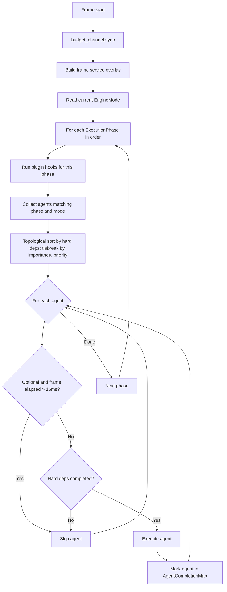

# Agents

Intelligent subsystem managers. One per `LaneKind`. Each negotiates with GORNA and dispatches lanes.

- Document — Khora Agents v1.0
- Status — Authoritative
- Date — May 2026

---

## Contents

1. What an agent is
2. The Agent trait
3. The five agents
4. ExecutionTiming
5. Agent dependencies
6. The Scheduler
7. BudgetChannel
8. EnginePlugin
9. For game developers
10. For engine contributors
11. Decisions
12. Open questions

---

## 01 — What an agent is

An agent is a tactical manager. It owns exactly one `LaneKind`, knows the lanes (strategies) available for that kind, exposes those strategies to GORNA, applies the budget GORNA returns, and dispatches the chosen lane each frame.

What an agent is *not*:

- An agent is **not** a controller. It does not decide global priorities. The DCC does that.
- An agent is **not** a worker. It does not contain pipeline code. Lanes do that.
- An agent is **not** a service. If a subsystem has no strategies to negotiate, it is a service (`AssetService`, `SerializationService`, `EcsMaintenance`), not an agent.

The five agents shipped today exhaust the five `LaneKind` variants. New `LaneKind` would mean a new agent. The architecture is designed for it.

## 02 — The Agent trait

```rust
pub trait Agent: Send + Sync {
    fn id(&self) -> AgentId;
    fn negotiate(&mut self, request: NegotiationRequest) -> NegotiationResponse;
    fn apply_budget(&mut self, budget: ResourceBudget);
    fn report_status(&self) -> AgentStatus;
    fn on_initialize(&mut self, context: &mut EngineContext<'_>) {}  // Once after registration
    fn execute(&mut self, context: &mut EngineContext<'_>);          // Every frame
    fn execution_timing(&self) -> ExecutionTiming;
    fn as_any(&self) -> &dyn Any;
    fn as_any_mut(&mut self) -> &mut dyn Any;
}
```

Agents implement **only** `Agent` plus `Default` — no extra methods. Construction goes through `Default::default()`. Private free functions in the same module file are acceptable for internal helpers; methods on the agent struct are not. This rule keeps agents legible and prevents the slow drift toward god-object subsystems.

## 03 — The five agents

`EngineMode` is open: the base engine ships `Playing`; the editor application injects `Custom("editor")`. Agents declare which modes they accept.

| Agent | `LaneKind` | Allowed modes | Allowed phases | Importance | Fixed timestep |
|---|---|---|---|---|---|
| `RenderAgent` | `Render` | `Playing`, `Custom("editor")` | Observe, Output | Critical | No |
| `ShadowAgent` | `Shadow` | `Playing`, `Custom("editor")` | Observe | Critical | No |
| `PhysicsAgent` | `Physics` | `Playing` | Transform | Critical | Yes (1/60 s) |
| `UiAgent` | `Ui` | `Custom("editor")` | Observe, Output | Important | No |
| `AudioAgent` | `Audio` | `Playing` | Transform | Important | No |

`ShadowAgent` is the canonical example of agent split: it runs in `OBSERVE`, encodes the shadow atlas off-swapchain, and publishes `ShadowAtlasView` + `ShadowComparisonSampler` into the per-frame `FrameContext`. `RenderAgent` declares `AgentDependency::Hard(AgentId::ShadowRenderer)` in `execution_timing()`; the Scheduler enforces the ordering. `RenderAgent` then reads the atlas values from `FrameContext` and re-injects them into its own `LaneContext` for the main pass.

## 04 — ExecutionTiming

Each agent declares when and how it wants to execute:

```rust
fn execution_timing(&self) -> ExecutionTiming {
    ExecutionTiming {
        allowed_modes: vec![EngineMode::Playing, EngineMode::Custom("editor".into())],
        allowed_phases: vec![ExecutionPhase::OBSERVE, ExecutionPhase::OUTPUT],
        default_phase: ExecutionPhase::OUTPUT,
        priority: 1.0,
        importance: AgentImportance::Critical,
        fixed_timestep: None,
        dependencies: vec![],
    }
}
```

| Field | Purpose |
|---|---|
| `allowed_modes` | Engine modes where this agent can run (Editor, Playing) |
| `allowed_phases` | Frame phases where this agent can run |
| `default_phase` | Phase to use if GORNA does not specify one |
| `priority` | Order within the same phase (higher = earlier) |
| `importance` | Critical / Important / Optional — determines skip behavior under budget pressure |
| `fixed_timestep` | If set, agent only runs when accumulator exceeds this duration |
| `dependencies` | Other agents this one depends on |

## 05 — Agent dependencies

Agents declare ordering relationships explicitly:

```rust
dependencies: vec![
    AgentDependency {
        target: AgentId::Physics,
        kind: DependencyKind::Hard,
        condition: Some(DependencyCondition::IfTargetActive),
    },
]
```

| Kind | Behavior |
|---|---|
| **Hard** | Target must run first. If target is skipped, this agent is also skipped. |
| **Soft** | Prefers target first, but can run without it. |
| **Parallel** | No ordering constraint — can run alongside target. |

The Scheduler resolves the dependency graph each frame after filtering by mode and phase. Cycles are detected at registration; mismatched dependencies (declaring a dep on an agent that is not registered) are warnings.

## 06 — The Scheduler



The Scheduler lives in `khora-control::scheduler`. Real algorithm:

1. **Budget sync.** `budget_channel.sync()` drains every per-agent crossbeam channel, keeping the latest budget for each agent.
2. **Per-frame service overlay.** A `ServiceRegistry::with_parent` wraps the global registry — frame-scoped services (the `FrameContext` itself, the `SharedFrameGraph`) live in the overlay.
3. **AgentCompletionMap.** Built fresh each frame. Every agent execution writes into it; agents with hard dependencies read it before running.
4. **Per-phase work.** For each phase in order:
   - Plugin hooks fire first (one closure per phase, signature `Fn(&mut World)`).
   - The `AgentRegistry` returns every agent declared for this phase and the active `EngineMode`.
   - The set is topologically sorted by hard dependencies; cycles are detected and reported.
   - Within an order-equivalent group, sort by `AgentImportance` (Critical / Important / Optional) then `priority`.
5. **Execute.** Each agent's `execute(&mut EngineContext)` is called sequentially, after a budget-pressure check (`Optional` agents are skipped if `frame_start.elapsed() > 16 ms`) and a hard-dependency check (skip if any prerequisite was skipped).

The Scheduler is private to the SDK — game developers never touch it. Its contract: respect the agents' declared timings, respect the dependency graph, never block on the cold path.

## 07 — BudgetChannel

The DCC sends budgets to the Scheduler through one **`crossbeam_channel` per agent**, plus a shared current-state cache.

```rust
// Conceptual shape
struct BudgetChannel {
    senders:   HashMap<AgentId, crossbeam_channel::Sender<ResourceBudget>>,
    receivers: HashMap<AgentId, crossbeam_channel::Receiver<ResourceBudget>>,
    current:   RwLock<HashMap<AgentId, ResourceBudget>>,
}
```

| Property | Detail |
|---|---|
| Transport | One `crossbeam_channel` per agent |
| Semantics | **Last wins** — `sync()` drains every channel, keeps only the latest budget per agent |
| Cold-side write | `send(agent_id, budget)` — non-blocking via `try_send` |
| Hot-side read at sync | `sync()` drains all channels, updates the `current` map under `RwLock` |
| Hot-side read in-frame | `get(agent_id) -> ResourceBudget` from the `current` map |

Per-agent channels keep the bookkeeping local — adding an agent does not change the channel surface for the others, and the cold path can update one agent's budget without touching the rest.

## 08 — EnginePlugin

Plugins inject callbacks into the frame pipeline at specific phases. The closure receives just the ECS `World` — anything else (services, frame context) is reached through the world's resources.

```rust
let mut plugin = EnginePlugin::new("my-plugin");
plugin.on_phase(ExecutionPhase::OUTPUT, |world: &mut World| {
    // Inspect or mutate the world before agents run for this phase.
});
scheduler.register_plugin(plugin);
```

The Scheduler runs every plugin hook for the current phase **before** the agents for that phase. Plugins are the canonical way to add work that does not need GORNA negotiation but should land in a specific phase — for example, the editor's per-phase bookkeeping. See [Editor](./18_editor.md).

---

## For game developers

Most game developers will never see an agent. The SDK shields you. You write components, you write `update`, the engine handles the rest.

The one exception: when you need a custom subsystem with multiple performance strategies, you can implement `Agent` and register it. Read [Extending Khora](./19_extending.md) for a worked example.

## For engine contributors

The agents shipped today live in `crates/khora-agents/src/<name>_agent/`. Each follows the same skeleton:

```rust
#[derive(Default)]
pub struct MyAgent {
    cached_service: Option<Arc<MyService>>,
    current_strategy: Option<Box<dyn Lane>>,
}

impl Agent for MyAgent {
    fn id(&self) -> AgentId { AgentId::My }

    fn execution_timing(&self) -> ExecutionTiming { /* see above */ }

    fn negotiate(&mut self, request: NegotiationRequest) -> NegotiationResponse {
        // Return strategies + cost estimates
    }

    fn apply_budget(&mut self, budget: ResourceBudget) {
        // Switch self.current_strategy based on budget.strategy_id
    }

    fn on_initialize(&mut self, ctx: &mut EngineContext<'_>) {
        self.cached_service = ctx.services.get::<Arc<MyService>>();
    }

    fn execute(&mut self, ctx: &mut EngineContext<'_>) {
        if let Some(lane) = self.current_strategy.as_mut() {
            let mut lane_ctx = LaneContext::from(ctx);
            lane.execute(&mut lane_ctx);
        }
    }

    fn report_status(&self) -> AgentStatus { /* metrics */ }

    fn as_any(&self) -> &dyn Any { self }
    fn as_any_mut(&mut self) -> &mut dyn Any { self }
}
```

No `start`, `stop`, builder methods, or accessors. If you find yourself adding one, you are leaking lane work into the agent.

## Decisions

### We said yes to
- **Agents implement only `Agent` + `Default`.** No methods, no builders. The shape is uniform across all agents in the workspace.
- **One agent per `LaneKind`.** Splitting Render and Shadow into two agents is the canonical example: each has its own negotiation surface, its own dependency declaration, its own per-frame role.
- **Hard / Soft / Parallel dependency model.** Three kinds covered every concrete need in two years of development. Adding a fourth would require strong evidence.
- **Last-wins on `BudgetChannel`.** Replaying old budgets would accumulate latency and contradict the premise of *adaptive*.

### We said no to
- **Agent-managed concurrency.** Agents do not spawn threads. The DCC handles cold-path concurrency; the Scheduler handles per-frame ordering.
- **Agents reading from each other directly.** All cross-agent data flow is through `FrameContext` slots. The ShadowAgent → RenderAgent path goes through the context, not through a shared field.
- **Optional methods that take input.** `on_initialize` and `execute` are the only inputs. Everything else is configuration via `execution_timing()`.

## Open questions

1. **Plugin agents.** Today, agents are added at compile time via `register_components!`-style registration. Hot-loaded plugin agents need a stable ABI we have not yet committed to.
2. **Multi-`LaneKind` agents.** Forbidden by current rule, but if a future subsystem genuinely needs to coordinate two lane kinds (e.g., compute + render in the same pipeline), the rule may need a carve-out.
3. **Async agent work.** Some lanes (asset streaming) want async I/O. The contract for an agent that yields control mid-frame is open.

---

*Next: the workers agents dispatch. See [Lanes](./07_lanes.md).*
