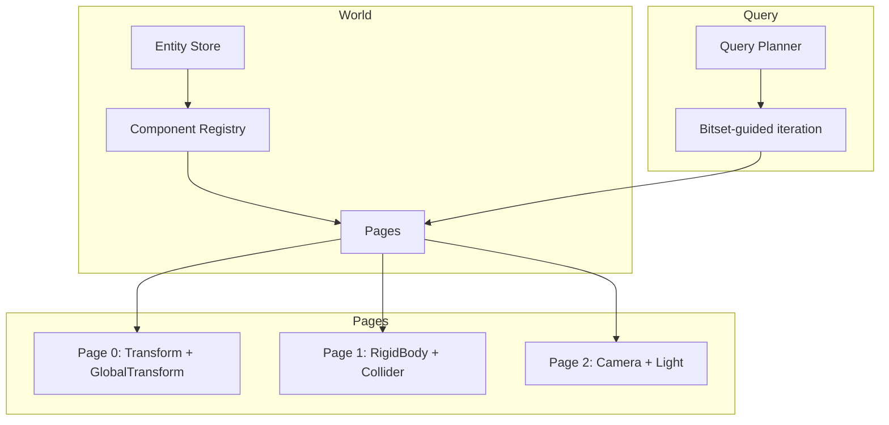

# ECS — CRPECS

Khora uses **CRPECS** — a custom archetype-based Entity Component System with Structure of Arrays (SoA) storage, parallel queries, and semantic domains.

## Architecture Overview



## Key Concepts

### Entities

Entities are lightweight identifiers (`EntityId`) with an index and generation for safety:

```rust
pub struct EntityId {
    pub index: u32,
    pub generation: u32,
}
```

### Components

Components are plain data types that implement the `Component` trait:

```rust
#[derive(Component)]
pub struct Transform {
    pub translation: Vec3,
    pub rotation: Quaternion,
    pub scale: Vec3,
}
```

<div class="callout callout-info">

The `#[derive(Component)]` macro generates:
- `impl Component for T`
- `SerializableT` with `Encode`/`Decode` for serialization
- `From<T>` / `From<SerializableT>` conversions
- Automatic registration in the inventory for scene serialization

</div>

### Archetype Pages

Components are stored in **archetype pages** — contiguous SoA arrays grouped by component combination:

| Page | Components | Entities |
|------|-----------|----------|
| 0 | Transform, GlobalTransform | 1, 2, 3 |
| 1 | Transform, GlobalTransform, RigidBody, Collider | 4, 5 |
| 2 | Transform, GlobalTransform, Camera | 6 |

### Semantic Domains

Components are tagged with a **semantic domain** for optimized queries:

| Domain | Components |
|--------|-----------|
| `Spatial` | Transform, GlobalTransform, RigidBody, Collider |
| `Render` | Camera, Light, HandleComponent\<Mesh\> |
| `UI` | UiTransform, UiColor, UiText |
| `Audio` | AudioSource, AudioListener |

### Queries

Queries are type-safe and use a planner for optimal execution:

```rust
let query = world.query::<(&Transform, &mut GlobalTransform)>();
for (transform, mut global) in query {
    global.0 = transform.compute_global();
}
```

## EcsMaintenance

ECS maintenance is **not an Agent** — it's a direct data layer operation:

```rust
impl GameWorld {
    pub fn tick_maintenance(&mut self) {
        self.maintenance.tick(&mut self.world);
    }
}
```

| Operation | Trigger | Effect |
|-----------|---------|--------|
| `queue_cleanup()` | Component removal | Marks orphaned data for cleanup |
| `queue_vacuum()` | Entity despawn | Marks page holes for compaction |
| `tick()` | Every frame (before agents) | Drains queues, compacts pages |

<div class="callout callout-tip">

**Why not an Agent?** Maintenance has no strategies to negotiate — it does the same thing every frame. Agents are for subsystems with multiple execution strategies. Maintenance is a fixed data operation.

</div>

## Memory Layout

```
Page 0 (Transform + GlobalTransform)
┌─────────────┬─────────────┬─────────────┐
│ SoA arrays  │   Bitset    │  Metadata   │
│ tx ty tz rx │ 1 1 1 0 0 0 │ count: 3    │
│ ry rz sc... │             │ capacity: 8 │
└─────────────┴─────────────┴─────────────┘
```

The bitset guides iteration — only set bits are processed, enabling efficient sparse queries.
