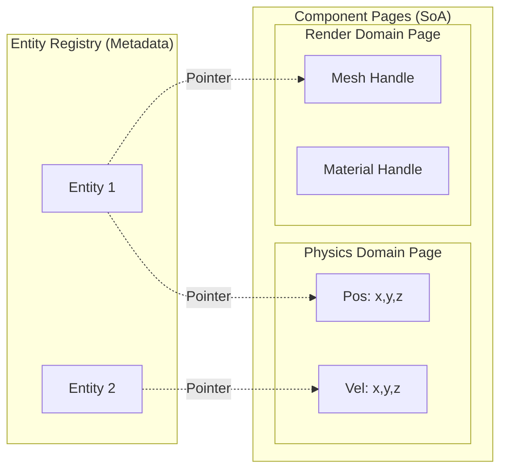
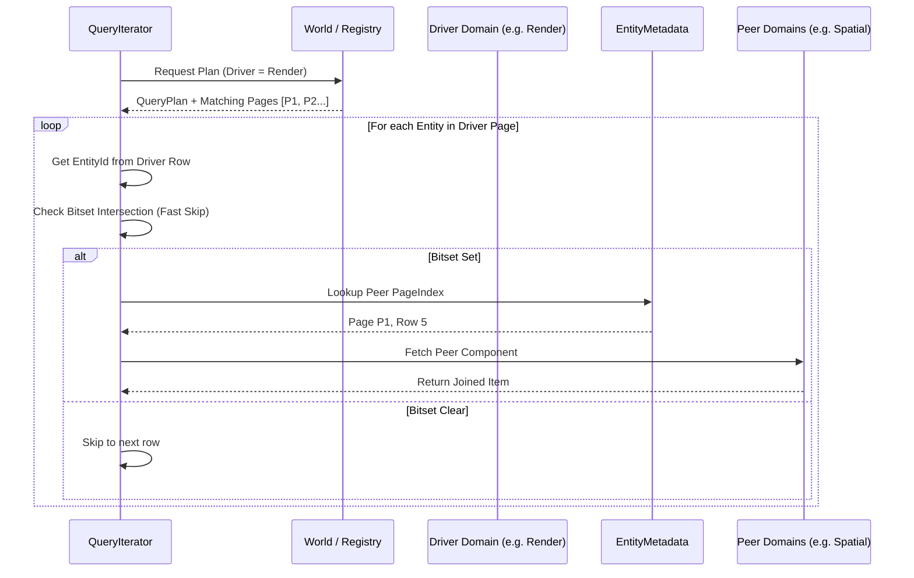
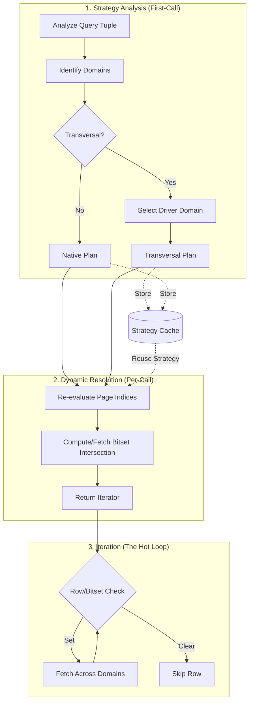
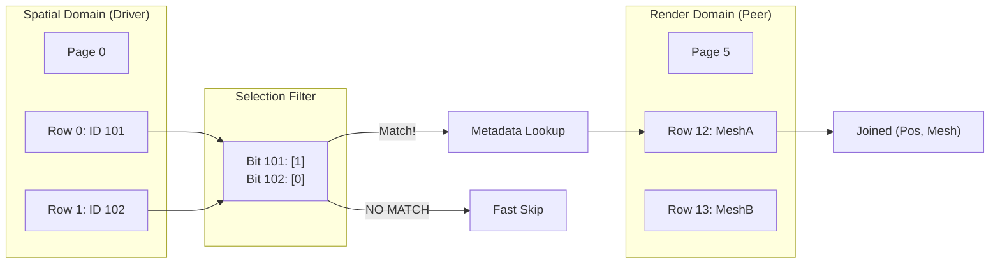

# 6. ECS Architecture: The CRPECS

This document details the architecture of Khora's custom **Chunked Relational Page ECS (CRPECS)**. It was designed from the ground up to be the high-performance backbone of the SAA and to enable its most advanced concept: **Adaptive Game Data Flows (AGDF)**.

## Philosophy: Performance Through Intelligent Compromise

Modern ECS architectures typically force a difficult choice:
*   **Archetypal (e.g., `bevy_ecs`)**: Delivers extremely fast iteration speeds due to perfect data locality, but incurs a very high performance cost when an entity's component structure changes (an "archetype move").
*   **Sparse Set (e.g., `specs`)**: Offers very fast structural changes, but iteration can be slower for entities with many components due to increased pointer indirection and poorer data locality.

Khora's SAA vision requires the best of both worlds: fast, predictable iteration for the **Data Plane** (the `Lanes`), and cheap, frequent structural changes driven by the **Control Plane** (the `Agents` and `Control` crates). The CRPECS resolves this conflict by creating a new set of trade-offs perfectly aligned with our goals.

Its core principle is to **completely dissociate an entity's logical identity from the physical storage location of its component data**.



## Core Principles

### 1. Component Pages: Semantic Data Grouping

Instead of storing components based on the entity's complete structure (its archetype), we group them by **semantic domain** into fixed-size memory blocks called **Pages** (e.g., 16KB).
*   A **`PhysicsPage`** would store the contiguous `Vec`s for `Position`, `Velocity`, and `Collider`.
*   A **`RenderPage`** would store the contiguous `Vec`s for `HandleComponent<Mesh>`, `MaterialComponent`, etc.

Within each Page, component data is stored as a **Structure of Arrays (SoA)**, guaranteeing optimal cache performance for any system iterating *within that domain*.

### 2. Entity Metadata: The Relational Hub

An entity's identity is maintained in a central table, completely separate from its component data. Each entry in this table is a small struct containing pointers that map the entity's ID to the physical location of its data across all relevant Pages.

```rust
// A logical pointer to a piece of component data.
struct PageIndex {
    page_id: u32,   // Which page holds the data?
    row_index: u32, // Which row within that page's SoA?
}

// The central "table of contents" for a single entity.
struct EntityMetadata {
    // A map from a component's semantic domain to its physical location.
    locations: HashMap<SemanticDomain, PageIndex>,
}
```

### 3. Data Dissociation: The Key to Flexibility

The data for a single entity is physically scattered across multiple Pages, but it is logically unified by its `EntityMetadata`. This is the architectural key that unlocks our required flexibility.

## How Key Operations Work

#### Iteration (e.g., `Query<(&mut Position, &Velocity)>`)
*   **Performance: Near-Optimal.**
*   The query understands that `Position` and `Velocity` both belong to the `Physics` semantic domain. It therefore only needs to iterate through all active `PhysicsPage`s, accessing their contiguous `Vec`s. This achieves performance nearly identical to a pure Archetypal ECS for domain-specific queries.

#### Structural Changes: Fast Logic, Asynchronous Cleanup
*   **`add_component<C>()`**: This is a fast operation that handles the addition of a new component to an entity. It migrates the entity's existing components for the relevant `SemanticDomain` to a new `ComponentPage` that matches the new component layout. Crucially, it does **not** clean up the "hole" left in the old page. Instead, it orphans the data at the old location and queues it for garbage collection.
*   **`remove_component_domain<C>()`**: This is an **extremely high-performance `O(1)` operation**. It removes all components in a given `SemanticDomain` from an entity by simply deleting an entry from the `locations` `HashMap` in its `EntityMetadata`. Like `add_component`, this operation orphans the actual component data and queues it for cleanup by the garbage collector.

#### The Garbage Collection Process
*   The actual component data from `add` and `remove` operations is now "orphaned" and will be cleaned up later by a low-priority, asynchronous garbage collection process, ensuring that performance-critical code is not blocked by expensive cleanup operations.

## The Intelligent Compromise: Transversal Queries

Khora now provides a full implementation for **transversal queries**—queries that access data from different semantic domains simultaneously (e.g., `Query<(&Position, &RenderTag)>`).

### Mechanism: The Domain Join
Such a query cannot iterate linearly over a single set of Pages. It performs a "join" across domains using a **Driver Domain** strategy.



### Bitset-Guided Optimization
To minimize the cost of metadata lookups, Khora uses a **Signature-Based Bitset Join**. Before starting iteration, the `World` computes the bitwise intersection of the `DomainBitset`s for all domains involved in the query. 

*   **Fast-Skip**: The iterator uses this pre-computed bitset to instantly skip any entity that does not exist in all required domains.
*   **Result**: This avoids expensive pointer lookups (Metadata HashMap access) for entities that are guaranteed to fail the join, making transversal queries highly efficient even in sparse scenarios.

### Dynamic Strategy & Cache
The query system uses a **Stateful Strategy Plan**. Even though it resides in the **Data Plane**, it distinguishes between the heavy architectural analysis and the lightweight per-call execution.



*   **Strategy Memoization**: The execution strategy (which domain drives, which are peers) is memoized to avoid repeating the architectural analysis.
*   **Per-Call Correctness**: While the strategy is cached, the **matching page indices** and **bitset intersections** are re-evaluated dynamically on every call. This ensures the engine remains stable and correct even if the world's archetype layout changes frequently.

### Memory Layout: The Transversal View
A transversal join essentially creates a virtual, temporary "bridge" between physically disjoint SoA pages.



### Architectural Benefit
This is a deliberate design choice. While transversal joins are highly optimized, they remain slightly slower than native, domain-specific iteration. This creates a natural **"architectural gravity"** that encourages developers to group related data into the same semantic domain, leading to cleaner and more performant systems.

## Integration with CLAD and SAA

The CRPECS is the cornerstone of the **`khora-data`** crate and the ultimate implementation of the **[D]ata** in CLAD.
*   It provides the perfect foundation for **AGDF**, as the SAA's Control Plane can cheaply and frequently alter data layouts by modifying `EntityMetadata` using the `add_component` and `remove_component_domain` methods.
*   The **garbage collection** and page compaction process has been implemented as a prime example of the CLAD and SAA philosophy. A `GarbageCollectorAgent` (**[A]**), acting as an **ISA**, makes strategic decisions about when and how much to clean. It dispatches this work to a dedicated `CompactionLane` (**[L]**), which performs the heavy lifting of modifying the component page **[D]ata**. This makes the ECS itself a living, self-optimizing part of the SAA.
