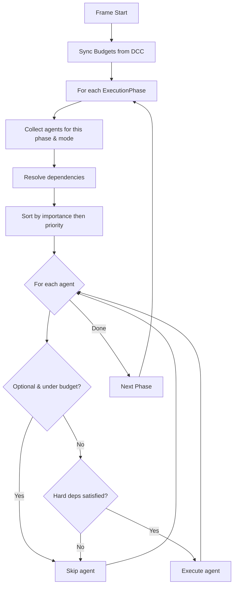

# Agents & Scheduler

Agents are the **intelligent subsystem managers** of Khora Engine. The Scheduler orchestrates their execution every frame based on declared timing, dependencies, and the current engine mode.

## The Four Agents

| Agent | Allowed Modes | Allowed Phases | Importance | Fixed Timestep |
|-------|--------------|----------------|------------|----------------|
| **RenderAgent** | Editor, Playing | Observe, Output | Critical | No |
| **PhysicsAgent** | Playing | Transform | Critical | Yes (1/60s) |
| **UiAgent** | Editor | Observe, Output | Important | No |
| **AudioAgent** | Playing | Transform | Important | No |

> [!WARNING]
> **Only 4 agents.** Subsystems without GORNA strategy negotiation (assets, serialization, ECS maintenance) use direct services, not agents.

## ExecutionTiming

Each agent declares when and how it wants to execute:

```rust
fn execution_timing(&self) -> ExecutionTiming {
    ExecutionTiming {
        allowed_modes: vec![EngineMode::Editor, EngineMode::Playing],
        allowed_phases: vec![ExecutionPhase::OBSERVE, ExecutionPhase::OUTPUT],
        default_phase: ExecutionPhase::OUTPUT,
        priority: 1.0,
        importance: AgentImportance::Critical,
        fixed_timestep: None,
        dependencies: vec![],
    }
}
```

| Field | Purpose |
|-------|---------|
| `allowed_modes` | Engine modes where this agent can run (Editor, Playing) |
| `allowed_phases` | Frame phases where this agent can run |
| `default_phase` | Phase to use if GORNA doesn't specify one |
| `priority` | Order within the same phase (higher = earlier) |
| `importance` | Critical / Important / Optional — determines skip behavior |
| `fixed_timestep` | If set, agent only runs when accumulator exceeds this duration |
| `dependencies` | Other agents this one depends on |

## Agent Dependencies

Agents can declare dependencies on each other:

```rust
dependencies: vec![
    AgentDependency {
        target: AgentId::Physics,
        kind: DependencyKind::Hard,
        condition: Some(DependencyCondition::IfTargetActive),
    },
]
```

| Kind | Behavior |
|------|----------|
| **Hard** | Target MUST run first. If target is skipped, this agent is also skipped. |
| **Soft** | Prefers target to run first, but can run without it. |
| **Parallel** | No ordering constraint — can run alongside target. |

## The Scheduler Algorithm



## BudgetChannel — Cold → Hot Communication

The DCC sends budgets to the Scheduler through a unidirectional channel:

| Property | Detail |
|----------|--------|
| **Transport** | crossbeam_channel (unbounded) |
| **Semantics** | Last wins — if multiple budgets arrive, only the latest is kept |
| **Thread safety** | Cloneable via Arc — DCC holds a clone, Scheduler holds a clone |
| **Sync point** | Scheduler calls `sync()` at the start of each frame |

## EnginePlugin — Extensibility

Plugins inject callbacks into the frame pipeline at specific phases:

```rust
let mut plugin = EnginePlugin::new("my-plugin");
plugin.on_phase(ExecutionPhase::OUTPUT, |world, ctx| {
    // Custom rendering, HUD, etc.
});
scheduler.register_plugin(plugin);
```

> [!TIP]
> The editor itself is a set of plugins — scene tree, properties panel, viewport, gizmos — all registered via `EnginePlugin` hooks.
