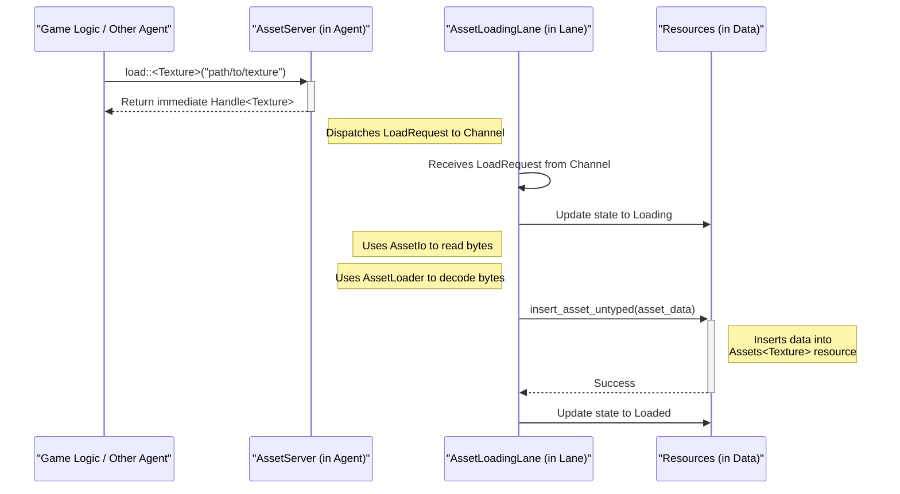

# 7. Asset Architecture: The Strategic Asset System

In a traditional engine, an asset system is a simple loader: you ask for a file path, it gives you back data. This is insufficient for the Symbiotic Adaptive Architecture (SAA). To make intelligent decisions, the `AssetAgent` ISA needs to understand assets not just as files, but as **strategic resources** with costs, dependencies, and alternatives.

The Khora solution is an intelligent layer that treats the project's assets as a queryable database. This system is the foundation upon which features like quality-of-service tiers, intelligent streaming, and adaptive resource management are built.

### Core Concepts

#### 1. Decoupling with Handles
The engine logic **never** references a physical file path or holds asset data directly in components. Instead, it uses a stable, unique, and strongly-typed **`Handle<T>`**.
*   A `Handle<Texture>` is a lightweight, copyable identifier that represents the "idea" of a specific texture.
*   This indirection is critical: it allows the `AssetAgent` to load, unload, or even hot-reload asset data in the background without ever affecting the game logic that holds the handle.

#### 2. The Asset Source Abstraction (`AssetIo`)
The engine is decoupled from the physical source of asset bytes. A simple `trait`, `AssetIo`, defines the contract for reading bytes from a path. This allows for multiple "asset source strategies":
*   **`FileSystemAssetIo`**: The standard implementation for development, reading directly from loose files on disk.
*   **`PackfileAssetIo`**: A high-performance implementation for release builds that reads from large, contiguous archive files.
*   Future implementations could include reading from a network source or a compressed archive.

#### 3. Metadata and a Hybrid Indexing Strategy
A key challenge is discovering assets and their metadata without costly scanning at startup. Khora uses a hybrid approach:

*   **For Development (in the Editor): The Real-Time Asset Database**
    *   An integrated service constantly watches the project's `assets/` folder.
    *   When a file is added or changed, its metadata (type, dependencies, available quality variants) is extracted and stored in an incremental on-disk database.
    *   **Goal**: Provide a seamless, "live" development experience. An artist can drop a texture into a folder, and it becomes instantly available without a manual import step.

*   **For Production (Release Builds): Packfiles**
    *   A build script (`xtask`) is run to prepare the game for shipping.
    *   This tool scans all assets once, builds a final, highly optimized `index.bin` file containing all metadata, and packs all asset data into large archive files (`data.pack`).
    *   **Goal**: Achieve maximum loading performance. The game starts, loads the single `index.bin` into memory, and can then load any asset with minimal disk I/O by reading from a known offset in a packfile.

### The Lifecycle of an Asset Request

This diagram illustrates how the CLAD components work together to load an asset:

### Conclusion: Why This Architecture is Essential for SAA

This architecture elevates the `AssetAgent` from a simple file loader to a true Intelligent Subsystem Agent. By providing it with an abstract source of assets (`AssetIo`) and the future ability to query rich metadata, we give the agent the **context** it needs to make meaningful, strategic decisions—such as choosing a lower-quality texture variant to stay within a VRAM budget—that align with the engine's global performance goals.