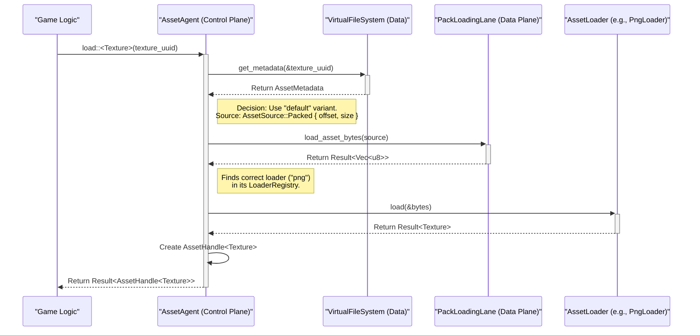

# 07 - Asset Architecture: The Virtual File System (VFS)

### The Problem: Assets as a Strategic Resource

In a traditional engine, an asset system is a simple loader: you ask for a file path, it gives you back data. This is insufficient for the Symbiotic Adaptive Architecture (SAA). To make intelligent decisions, the `AssetAgent` ISA needs to understand assets not as files on disk, but as **strategic resources** with costs, dependencies, and alternatives.

Khora's solution is the **Virtual File System (VFS)**. It is not a filesystem in the OS sense; it's an intelligent database that abstracts the physical storage of assets and enriches them with metadata, turning them into a queryable resource for the entire engine.

### Core Concepts

#### 1. Logical Identification: `AssetUUID` and `AssetHandle`
The engine logic **never** references a physical file path. Instead, it uses two central types:
*   **`AssetUUID`**: A unique and **stable** identifier that represents the "idea" of an asset, regardless of its location or filename. In our production pipeline, it is generated deterministically from the asset's source path.
*   **`AssetHandle<T>`**: A lightweight, cloneable smart pointer (`Arc<T>`). This is the type that engine systems manipulate. This indirection is critical: it allows the `AssetAgent` to manage the asset's lifecycle in the background without ever affecting the game logic that holds the handle.

#### 2. The Abstract Data Source: The `AssetSource` Enum
To support both development and production workflows, we need an abstraction over where asset data comes from. The `AssetSource` enum fulfills this role in a type-safe manner:
*   **`AssetSource::Path(PathBuf)`**: Used by the editor (future). Indicates that the asset is a loose file on disk.
*   **`AssetSource::Packed { offset, size }`**: Used by the runtime. Indicates the exact location of the asset's data within a `data.pack` file.

#### 3. Rich Metadata and a Hybrid Indexing Strategy
The core intelligence of the VFS lies in the `AssetMetadata`. To create and use this metadata, Khora employs a hybrid strategy:

*   **For Production (What we just built): Packfiles**
    *   A build tool (`xtask`) runs the `assets pack` command.
    *   This tool scans source directories (defined in `Assets.toml`), generates a stable `AssetUUID` for each asset, and produces two files:
        1.  **`index.bin`**: A binary file containing a list of all `AssetMetadata`.
        2.  **`data.pack`**: A binary file containing the raw, contiguous data of all assets for optimal I/O.
    *   **Goal**: Maximum loading performance in release builds.

*   **For Development (Future Issue #175): The Real-Time Asset Database**
    *   A service integrated into the editor will watch the asset directories.
    *   Changes will trigger an incremental update to an on-disk database, which will contain the same `AssetMetadata` but with `AssetSource::Path` variants.
    *   **Goal**: A seamless and iterative development experience.

### The Lifecycle of an Asset Request (Runtime Mode)

This diagram illustrates how the CLAD components we built interact to load an asset from packfiles:

### Conclusion: Why This Architecture is Essential for SAA

This VFS architecture is a critical foundation for the SAA philosophy. It elevates the `AssetAgent` from a simple file loader to a true Intelligent Subsystem Agent. By providing it with rich metadata via the VFS, we give the agent the **context** it needs to make meaningful, strategic decisions—such as choosing a lower-quality asset variant to stay within a VRAM budget—that align with the engine's global performance goals.