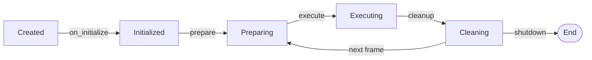

# Lanes

The execution units. Every algorithm in Khora is a lane.

- Document — Khora Lanes v1.0
- Status — Authoritative
- Date — May 2026

---

## Contents

1. What a lane is
2. The Lane trait
3. Lane lifecycle
4. The three contexts
5. LaneContext in detail
6. Lane types by subsystem
7. Cost estimation
8. For game developers
9. For engine contributors
10. Decisions
11. Open questions

---

## 01 — What a lane is

A lane is a hot-path worker. It does one thing — render a forward pass, simulate one physics step, mix one audio frame, decode one glTF — and it does it deterministically.

Lanes do **not** decide *whether* to run. They do not negotiate. They run when an agent dispatches them. Each lane represents a *strategy* the owning agent can choose from.

The naming is symmetric. `RenderAgent` chooses between `SimpleUnlitLane`, `LitForwardLane`, and `ForwardPlusLane`. `PhysicsAgent` runs `StandardPhysicsLane` (with `PhysicsDebugLane` as an opt-in overlay). `AudioAgent` runs `SpatialMixingLane`. The agent owns selection. The lane owns execution.

## 02 — The Lane trait

```rust
pub trait Lane {
    /// Phase 1: read-only extraction, setup
    fn prepare(&mut self, ctx: &mut LaneContext<'_>) -> Result<(), LaneError> { Ok(()) }

    /// Phase 2: the actual work
    fn execute(&mut self, ctx: &mut LaneContext<'_>) -> Result<(), LaneError>;

    /// Phase 3: teardown, reset
    fn cleanup(&mut self, ctx: &mut LaneContext<'_>) -> Result<(), LaneError> { Ok(()) }

    /// Human-readable strategy name
    fn strategy_name(&self) -> &'static str;

    /// Cost estimate for GORNA (0.0 = cheap, 1.0 = expensive)
    fn estimate_cost(&self, ctx: &LaneContext<'_>) -> f32;

    /// One-time initialization
    fn on_initialize(&mut self, ctx: &mut LaneContext<'_>) -> Result<(), LaneError> { Ok(()) }
}
```

`prepare`, `execute`, `cleanup` are the per-frame triple. `on_initialize` is one-shot. `estimate_cost` lets the lane participate in GORNA negotiation through its agent. `strategy_name` is the identifier shown in telemetry, the editor's GORNA stream, and the decisions log.

## 03 — Lane lifecycle



| Phase | When | Purpose | Example |
|---|---|---|---|
| `on_initialize` | Once, at boot | Cache services, create GPU resources | Create render pipeline |
| `prepare` | Every frame, before execute | Read-only extraction from ECS | Extract meshes, cameras |
| `execute` | Every frame, after prepare | The actual work | Encode GPU commands |
| `cleanup` | Every frame, after execute | Reset state for next frame | Clear render world |

The split between `prepare` and `execute` lets us separate read-only ECS access (which can be parallelized over many lanes) from mutating output (which is single-threaded). It also gives the lane a clear seam to flush per-frame state in `cleanup` without leaking between frames.

## 04 — The three contexts

Khora has three context types — distinct shapes, distinct scopes. Confusing them is the most common reading mistake.

| Context | Crate / module | Scope | Carries |
|---|---|---|---|
| `EngineContext` | `khora-core::context` | Per agent invocation | `world: Option<&'a mut dyn Any>`, `services: Arc<ServiceRegistry>` |
| `LaneContext` | `khora-core::lane` | Per lane invocation | Type-map of `Slot<T>` / `Ref<T>` plus arbitrary inserted values |
| `FrameContext` | `khora-core::renderer::api::core::frame_context` | One frame | Type-erased blackboard, `StageHandle<T>` sync, tokio task tracking |

### `EngineContext` — agent input
The Scheduler builds one and passes it to every agent's `execute(&mut EngineContext)`. It carries a type-erased pointer to the ECS world and a clone of the per-frame service registry. Agents read services through this; lanes get one too when an agent constructs a `LaneContext` for them.

### `LaneContext` — lane data exchange
Lanes communicate through this. The agent populates it with the data its lanes need, calls `lane.execute(&mut ctx)`, and the lane retrieves typed values out of it. See section 05.

### `FrameContext` — cross-agent blackboard
Created once per frame. Lives in the per-frame service overlay. Agents reach it through `services.get::<FrameContext>()`. Three jobs:

- **Type-keyed blackboard.** `insert::<T>(value)` and `get::<T>() -> Option<Arc<T>>`. The renderer inserts `ColorTarget` / `DepthTarget` here at `begin_frame`; agents read them.
- **Stage synchronization.** `insert_stage::<MyStage>()` returns a `StageHandle<T>` backed by `tokio::sync::watch`. Producers `mark_done()`; consumers `await stage.wait()`. Cross-agent ordering is normally handled by the Scheduler's `AgentCompletionMap` — `StageHandle` is the ad-hoc primitive for plugins or sub-tasks that need their own sync without going through agent registration.
- **Hot-path async tasks.** `spawn(future)` runs an async task on the shared tokio runtime, tracked by an atomic counter. The runner calls `wait_for_all().await` after `engine.tick()` to flush pending work.

The split is load-bearing. `EngineContext` is a *call argument*, `LaneContext` is a *parameter bag*, `FrameContext` is a *shared blackboard*. They never replace each other.

## 05 — LaneContext in detail

Lanes communicate through a type-erased context:

```rust
let mut ctx = LaneContext::new();
ctx.insert(Slot::new(&mut render_world));
ctx.insert(device.clone());
ctx.insert(ColorTarget(view));
```

| Type | Purpose |
|---|---|
| `Slot<T>` | Mutable access to owned data |
| `Ref<T>` | Immutable reference |
| `ColorTarget` | Render target for encoding |
| `DepthTarget` | Depth/stencil target |

The context is the only way data crosses the lane boundary. Lanes do not hold long-lived references to each other; they read from and write to the context, frame after frame. This keeps lanes orthogonal — a lane can be removed, replaced, or substituted without touching the others.

## 06 — Lane types by subsystem

| Subsystem | Lanes | Strategy variants |
|---|---|---|
| **Render** | LitForward, ForwardPlus, SimpleUnlit, ShadowPass | Quality versus performance |
| **Physics** | StandardPhysicsLane, PhysicsDebugLane | Fixed timestep + optional debug overlay |
| **Audio** | SpatialMixingLane | 3D positional mixing |
| **Scene** | TransformPropagationLane | Hierarchy updates |
| **Asset** | TextureLoader, MeshLoader, FontLoader, AudioDecoder | Format-specific decoding |
| **UI** | StandardUiLane, UiRenderLane | Layout + render |
| **ECS** | CompactionLane | Page defragmentation |

**One lane type per agent.** The `RenderAgent` manages render lanes, the `PhysicsAgent` manages physics lanes. An agent selects between lane strategies based on its GORNA budget.

## 07 — Cost estimation

`estimate_cost` is how a lane participates in GORNA. The convention:

- `0.0` — cheap, runs in a known small budget
- `1.0` — expensive, the most resource-intensive strategy this agent has

The agent collects `estimate_cost` for each of its lanes, packages them as `StrategyOption`s, and returns them in `negotiate()`. GORNA arbitrates across all agents. The chosen strategy comes back as a `ResourceBudget`, and the agent switches `current_strategy` accordingly.

The estimate is *not* a hard contract. It is a hint. The DCC's heuristics smooth measurements over many frames; one stretched frame does not trigger a strategy switch.

---

## For game developers

You almost never write a lane. Lanes are engine internals. The exception: if you write a custom agent ([Extending Khora](./19_extending.md)), you will write at least one lane to give it something to do.

For most game work, the lane abstraction shows up indirectly — when you read render strategy names in the editor's GORNA stream, when you see `LitForward` swap to `Forward+` because GORNA detected too many lights, when you log `strategy_name()` from telemetry.

## For engine contributors

Lanes live in `crates/khora-lanes/src/<subsystem>_lane/`. Each lane file contains:

```rust
#[derive(Default)]
pub struct MyLane {
    // Owned state — pipeline, ring buffer, accumulator, etc.
}

impl Lane for MyLane {
    fn on_initialize(&mut self, ctx: &mut LaneContext<'_>) -> Result<(), LaneError> {
        let device = ctx.get::<Arc<dyn GraphicsDevice>>().ok_or(LaneError::MissingService)?;
        // Create pipelines, buffers, bind groups
        Ok(())
    }

    fn prepare(&mut self, ctx: &mut LaneContext<'_>) -> Result<(), LaneError> {
        let world = ctx.get::<World>().ok_or(LaneError::MissingData)?;
        self.extract_renderables(world);
        ctx.insert(self.render_world.clone());
        Ok(())
    }

    fn execute(&mut self, ctx: &mut LaneContext<'_>) -> Result<(), LaneError> {
        let render_world = ctx.get::<RenderWorld>().ok_or(LaneError::MissingData)?;
        self.encode_gpu_commands(render_world);
        Ok(())
    }

    fn cleanup(&mut self, ctx: &mut LaneContext<'_>) -> Result<(), LaneError> {
        self.render_world.clear();
        ctx.remove::<RenderWorld>();
        Ok(())
    }

    fn strategy_name(&self) -> &'static str { "MyStrategy" }

    fn estimate_cost(&self, _ctx: &LaneContext<'_>) -> f32 { 0.5 }
}
```

Three rules:

1. **No long-lived references.** Anything that survives between frames belongs in `self`. Anything frame-scoped belongs in `LaneContext`.
2. **`cleanup` actually cleans.** A lane that leaves stale data in `LaneContext` is a frame-leak waiting to happen.
3. **Errors are `LaneError`.** They bubble to the agent, which logs and can fall back to a less expensive strategy.

For shaders specifically: WGSL files live under `crates/khora-lanes/src/render_lane/shaders/`. Never inline shader source as a Rust string; the file is the source of truth, hot-reloadable in development.

## Decisions

### We said yes to
- **Three-phase lifecycle (prepare / execute / cleanup).** The split is load-bearing: it is the seam between read-only extraction and mutating output, and the place where per-frame state is reset.
- **Type-erased `LaneContext`.** Lanes communicate through inserted slots, not direct references. The cost is some boilerplate; the win is total decoupling.
- **`estimate_cost` returning `f32`.** A simple, comparable scalar. Richer cost models (multi-resource vectors) were considered and rejected as premature.

### We said no to
- **Lanes referencing each other.** A `LitForwardLane` does not depend on a `ShadowPassLane` instance — it depends on `ShadowAtlasView` and `ShadowComparisonSampler` slots in the context. The shadow lane can be replaced without touching the forward lane.
- **Lane-owned threads.** A lane runs on the calling thread. Parallelism happens at the Scheduler level.
- **Inlined shader source.** `lit_forward.wgsl` is a file. It is editable, reviewable, and (in a future iteration) hot-reloadable.

## Open questions

1. **Lane-level parallelism.** Today lanes run sequentially within an agent's `execute`. For some agents (asset decoders) parallel lane execution is obvious; the contract is undefined.
2. **Shader hot-reload.** Files-on-disk make this trivial in principle. The wgpu pipeline cache invalidation policy is not yet decided.
3. **Asynchronous lanes.** Asset streaming wants `async fn execute`. The current sync-only contract is a known constraint.

---

*Next: the protocol that decides which lane runs. See [GORNA](./08_gorna.md).*
