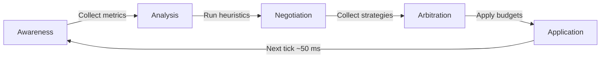
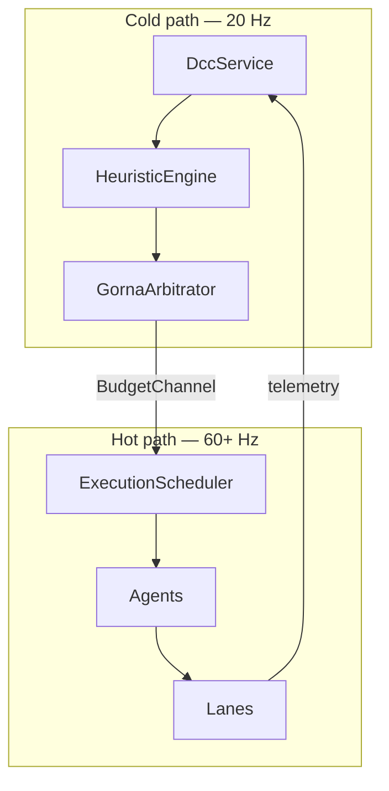

# GORNA

Goal-Oriented Resource Negotiation and Allocation. The protocol that lets agents and the DCC trade budgets in real time.

- Document — Khora GORNA v0.3
- Status — Operational
- Date — May 2026

---

## Contents

1. Why GORNA
2. The five phases
3. Data structures
4. The nine heuristics
5. Compliance today
6. Cold path and hot path, again
7. For game developers
8. For engine contributors
9. Decisions
10. Open questions

---

## 01 — Why GORNA

A traditional engine assigns budgets at compile time: physics gets 4 ms, rendering gets 12 ms, audio gets the rest. Those numbers are wrong on every machine that is not the developer's.

GORNA replaces that with a per-tick negotiation. Agents declare what they *can* do at various cost points; the DCC observes the system, applies heuristics (thermal, battery, frame-time stutter, GPU pressure), and hands out a budget that reflects *this* hardware, *this* scene, *this* frame.

The result: an engine that runs the same code on a workstation, a laptop on battery, and a Steam Deck — and adapts strategy each tick to keep the frame rate.

## 02 — The five phases



| Phase | Duration | Action |
|---|---|---|
| **Awareness** | Instant | Collect telemetry from agents and hardware monitors |
| **Analysis** | ~1 ms | Run the heuristic engine — thermal, battery, load |
| **Negotiation** | ~2 ms | Request strategy options from each agent |
| **Arbitration** | ~1 ms | Select an optimal strategy per agent within budget |
| **Application** | Instant | Call `apply_budget()` on each agent, send to BudgetChannel |

The whole loop runs at ~20 Hz on the cold path. The hot path never waits for it.

## 03 — Data structures

### NegotiationRequest

```rust
pub struct NegotiationRequest {
    pub target_latency: Duration,       // e.g., 16.6 ms for 60 FPS
    pub priority_weight: f32,           // 0.0 to 1.0
    pub constraints: ResourceConstraints,
    pub current_phase: EnginePhase,     // Boot, Menu, Simulation, Background
    pub agent_timing: ExecutionTiming,  // Agent's declared timing
}
```

### NegotiationResponse

```rust
pub struct NegotiationResponse {
    pub strategies: Vec<StrategyOption>,
    pub timing_adjustment: Option<TimingAdjustment>,
}

pub struct StrategyOption {
    pub id: StrategyId,         // LowPower, Balanced, HighPerformance
    pub estimated_time: Duration,
    pub estimated_vram: u64,
}
```

### ResourceBudget

```rust
pub struct ResourceBudget {
    pub strategy_id: StrategyId,
    pub time_limit: Duration,
    pub memory_limit: Option<u64>,
    pub vram_limit: Option<u64>,
    pub extra_params: HashMap<String, f64>,
}
```

The shape is intentionally narrow. Adding a new resource dimension is a small, considered change — not a free-form bag.

## 04 — The nine heuristics

The DCC's heuristic engine runs nine heuristics each tick:

| Heuristic | Input | Output |
|---|---|---|
| **Phase** | Current `EnginePhase` (Boot, Menu, Simulation, Background) | Multiplier favoring relevant subsystems |
| **Thermal** | GPU/CPU temperature | Reduce budget multiplier when hot |
| **Battery** | Battery level + AC state | Reduce budget on low battery, prefer LowPower strategies |
| **Frame Time** | Recent frame durations | Tighten budgets if frames are over target |
| **Stutter** | Frame time variance | Penalize strategies that produce inconsistent timings |
| **Trend** | Frame time slope | Anticipate degradation before it triggers a stutter |
| **CPU Pressure** | CPU utilization | Rebalance time budgets toward CPU-light strategies |
| **GPU Pressure** | GPU utilization | Rebalance toward GPU-light strategies |
| **Death Spiral** | Consecutive over-budget frames | Force LowPower strategy until recovery |

Heuristics are independent. Each emits a multiplier or a recommendation; the arbitrator combines them. New heuristics can be added without touching existing ones — the engine's adaptive intelligence grows by accretion.

> **GORNA cannot force phases.** It can only suggest importance changes (`TimingAdjustment`). Agents always control which phases they run in via `allowed_phases`.

## 05 — Compliance today

| Agent | Negotiates | Applies budget | Reports status |
|---|---|---|---|
| `RenderAgent` | 3 strategies (Unlit / LitForward / Forward+) | Switches lane strategy | Frame time, draw calls, lights |
| `ShadowAgent` | 1 strategy (atlas) | (no-op, single strategy) | Atlas usage, cascade count |
| `PhysicsAgent` | 3 strategies (Standard / Simplified / Disabled) | Adjusts fixed timestep | Step time, body count, collider count |
| `UiAgent` | 1 strategy (layout + render) | (no-op, single strategy) | Node count, text count |
| `AudioAgent` | 3 strategies (Full / Reduced / Minimal) | Adjusts max sources | Source count, frame |

GORNA v0.3 is the current version. Agents that today expose a single strategy are placeholders for future split — for instance, `UiAgent` will gain density-based strategies as the editor's UI complexity grows.

## 06 — Cold path and hot path, again



The two paths only touch through the `BudgetChannel` — one `crossbeam_channel` per agent, shared current-state cache, last-wins semantics. The hot path **never blocks** on the cold path. If a budget is late, the previous one stays in effect.

---

## For game developers

GORNA is internal. As a game developer, you observe its decisions through the editor's *GORNA Stream* panel: a live feed of "RenderAgent: switching from LitForward to Forward+ — reason: GPU pressure." If you want a lane never to switch, today the answer is to override the agent's negotiation surface (advanced — see [Extending Khora](./19_extending.md)). A first-class user-facing constraint API is on the [Roadmap](./roadmap.md) under DCC v2.

## For engine contributors

The protocol code lives in two crates:

| File | Purpose |
|---|---|
| `crates/khora-core/src/control/gorna/` | Type definitions: `NegotiationRequest`, `NegotiationResponse`, `ResourceBudget`, `StrategyOption` |
| `crates/khora-control/src/gorna/` | `GornaArbitrator` — budget fitting, multi-agent solve |
| `crates/khora-control/src/analysis.rs` | `HeuristicEngine` — nine heuristics, death-spiral detection |
| `crates/khora-control/src/service.rs` | `DccService` — owns the cold thread, runs the loop |

Adding a heuristic: implement the `Heuristic` trait, register it in `HeuristicEngine::new`, write a test that feeds synthetic telemetry. Heuristics are pure functions of telemetry → multiplier; do not let them store state without a strong reason.

Adding a new agent strategy: add a new lane, give it a `strategy_name()`, expose it from the agent's `negotiate()`. The arbitrator picks it up automatically as soon as `estimate_cost` returns a meaningful number.

## Decisions

### We said yes to
- **A simple, narrow request shape.** `target_latency`, `priority`, `constraints`, `phase`, `timing`. Anything more would invite each subsystem to invent its own dialect.
- **Heuristics as independent functions.** Composable, individually testable, additive.
- **Per-tick re-negotiation.** Not per-frame, not per-event. ~50 ms is fast enough to react to thermal events, slow enough to avoid thrashing.
- **Death spiral as a first-class concept.** When the engine cannot keep frame budget for several frames in a row, GORNA forces the cheapest strategy. Recovery is monitored and the agent returns to negotiated strategy when the spiral breaks.

### We said no to
- **Synchronous negotiation in the hot path.** The frame loop never waits for GORNA.
- **Multi-resource vector budgets.** Considered. Rejected as premature — the four current resources (time, memory, VRAM, extras) cover every case to date.
- **GORNA forcing phases.** Phases are agent-declared. GORNA suggests *importance*, not *when*. Otherwise agents lose autonomy over their execution model.

## Open questions

1. **User constraints.** "In this volume, physics > graphics" is a stated capability without a concrete API. `PriorityVolume` is in the roadmap.
2. **Adaptation modes.** `Learning` (fully dynamic), `Stable` (predictable), `Manual` (locked). The contract for switching at runtime is open.
3. **ML-augmented heuristics.** A future heuristic could be a small ML model trained on telemetry. The deployment story (model storage, update cadence) is undecided.

---

*Next: how GORNA decisions become pixels. See [Rendering](./09_rendering.md).*
