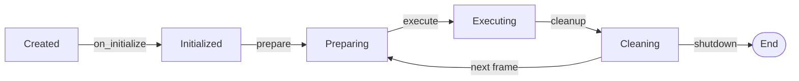

# Lanes — Hot-Path Pipelines

Lanes are the **execution units** of Khora Engine. Each lane implements a specific pipeline stage with a three-phase lifecycle: prepare, execute, cleanup.

## The Lane Trait

```rust
pub trait Lane {
    /// Phase 1: Read-only extraction, setup
    fn prepare(&mut self, ctx: &mut LaneContext<'_>) -> Result<(), LaneError> { Ok(()) }

    /// Phase 2: The actual work
    fn execute(&mut self, ctx: &mut LaneContext<'_>) -> Result<(), LaneError>;

    /// Phase 3: Teardown, reset
    fn cleanup(&mut self, ctx: &mut LaneContext<'_>) -> Result<(), LaneError> { Ok(()) }

    /// Human-readable strategy name
    fn strategy_name(&self) -> &'static str;

    /// Cost estimate for GORNA (0.0 = cheap, 1.0 = expensive)
    fn estimate_cost(&self, ctx: &LaneContext<'_>) -> f32;

    /// One-time initialization
    fn on_initialize(&mut self, ctx: &mut LaneContext<'_>) -> Result<(), LaneError> { Ok(()) }
}
```

## Lane Lifecycle



| Phase | When | Purpose | Example |
|-------|------|---------|---------|
| `on_initialize` | Once, at boot | Cache services, create GPU resources | Create render pipeline |
| `prepare` | Every frame, before execute | Read-only extraction from ECS | Extract meshes, cameras |
| `execute` | Every frame, after prepare | The actual work | Encode GPU commands |
| `cleanup` | Every frame, after execute | Reset state for next frame | Clear render world |

## LaneContext

Lanes communicate through a type-erased context:

```rust
let mut ctx = LaneContext::new();
ctx.insert(Slot::new(&mut render_world));
ctx.insert(device.clone());
ctx.insert(ColorTarget(view));
```

| Type | Purpose |
|------|---------|
| `Slot<T>` | Mutable access to owned data |
| `Ref<T>` | Immutable reference |
| `ColorTarget` | Render target for encoding |
| `DepthTarget` | Depth/stencil target |

## Lane Types by Subsystem

| Subsystem | Lanes | Strategy Variants |
|-----------|-------|-------------------|
| **Render** | LitForward, ForwardPlus, SimpleUnlit, ShadowPass | Quality vs performance |
| **Physics** | StandardPhysicsLane | Fixed timestep |
| **Audio** | SpatialMixingLane | 3D positional mixing |
| **Scene** | TransformPropagationLane | Hierarchy updates |
| **Asset** | TextureLoader, MeshLoader, FontLoader, AudioDecoder | Format-specific decoding |

> [!NOTE]
> **One lane type per agent.** The RenderAgent manages render lanes, the PhysicsAgent manages physics lanes. An agent selects between lane strategies based on its GORNA budget.

## Example: Render Lane

```rust
impl Lane for LitForwardLane {
    fn prepare(&mut self, ctx: &mut LaneContext<'_>) -> Result<(), LaneError> {
        let world = ctx.get::<World>().ok_or(LaneError::MissingData)?;
        self.extract_renderables(world);
        ctx.insert(self.render_world.clone());
        Ok(())
    }

    fn execute(&mut self, ctx: &mut LaneContext<'_>) -> Result<(), LaneError> {
        let render_world = ctx.get::<RenderWorld>().ok_or(LaneError::MissingData)?;
        self.encode_gpu_commands(render_world);
        Ok(())
    }

    fn cleanup(&mut self, ctx: &mut LaneContext<'_>) -> Result<(), LaneError> {
        self.render_world.clear();
        ctx.remove::<RenderWorld>();
        Ok(())
    }
}
```
