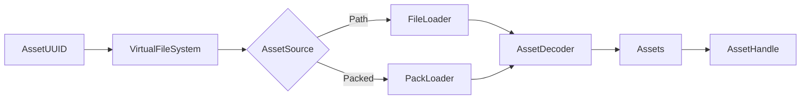

# I/O — Assets & Serialization

The `khora-io` crate handles all I/O operations: asset loading via VFS, and scene serialization. These are **services**, not agents — they run on-demand, not every frame.

## Asset Pipeline



| Step | Component | Purpose |
|------|-----------|---------|
| 1 | `AssetUUID` | Unique identifier for the asset |
| 2 | `VirtualFileSystem` | UUID → metadata lookup (O(1)) |
| 3 | `AssetSource` | Path (dev) or Packed offset/size (release) |
| 4 | `AssetIo` | FileLoader or PackLoader — reads raw bytes |
| 5 | `AssetDecoder<A>` | Decodes bytes into typed asset |
| 6 | `Assets<T>` | Typed storage registry |
| 7 | `AssetHandle<T>` | Typed handle for the loaded asset |

## AssetDecoder Trait

```rust
pub trait AssetDecoder<A: Asset> {
    fn load(&self, bytes: &[u8]) -> Result<A, Box<dyn Error + Send + Sync>>;
}
```

| Decoder | Asset Type | Format |
|---------|-----------|--------|
| `TextureLoaderLane` | `CpuTexture` | PNG, JPG, BMP |
| `GltfLoaderLane` | `Mesh` | glTF 2.0 |
| `ObjLoaderLane` | `Mesh` | OBJ |
| `FontLoaderLane` | `Font` | TTF, OTF |
| `WavLoaderLane` | `SoundData` | WAV |
| `SymphoniaLoaderLane` | `SoundData` | MP3, Ogg, FLAC |

## Serialization

### Strategies

| Strategy | Format | Use Case |
|----------|--------|----------|
| **Definition** | RON (human-readable) | Debug, long-term storage |
| **Recipe** | Binary commands | Compact, editor interchange |
| **Archetype** | Binary layout | Fastest load, play mode snapshot |

### SerializationService

```rust
let service = SerializationService::new();

// Save
let scene_file = service.save_world(&world, SerializationGoal::FastestLoad)?;
std::fs::write("scene.kscene", scene_file.to_bytes())?;

// Load
let file = SceneFile::from_bytes(&bytes)?;
service.load_world(&file, &mut world)?;
```

> [!TIP]
> **Play mode** uses the Archetype strategy for fast snapshot/restore. The editor uses Recipe for human-readable scene files (`.kscene`).

### File Format

```
.kscene file
┌─────────────────────────────────────┐
│ Header (64 bytes)                   │
│  Magic: "KHORASCN" (8 bytes)       │
│  Version: 1 (4 bytes)               │
│  Strategy ID (32 bytes)             │
│  Payload length (8 bytes)           │
│  Reserved (12 bytes)                │
├─────────────────────────────────────┤
│ Payload (bincode or RON encoded)    │
└─────────────────────────────────────┘
```
