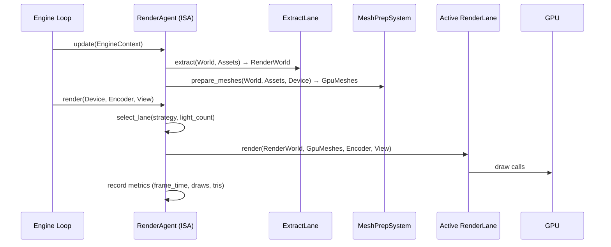

# 10. Rendering Strategies & The RenderAgent ISA

This document describes the **Rendering ISA** architecture: how the `RenderAgent` manages polymorphic rendering strategies, participates in the GORNA negotiation protocol, reports performance telemetry, and adapts at runtime.

## 1. The Vision: Polymorphic Rendering

In a conventional game engine, the rendering pipeline (Forward, Deferred, etc.) is a project-wide choice. Khora's **Symbiotic Adaptive Architecture (SAA)** treats rendering as a **polymorphic service**.

The goal is not just to support multiple rendering techniques, but to enable the engine to **seamlessly switch** between them at runtime based on environmental context and performance goals.

## 2. Available Render Lanes

Instead of a static selection, Khora maintains several **RenderLanes**, each implementing the `RenderLane` trait from `khora-lanes`. All lanes coexist in memory — switching strategies does **not** destroy or recreate GPU resources.

| Lane | Strategy | GORNA Mapping | Status |
| :--- | :--- | :--- | :--- |
| `SimpleUnlitLane` | Vertex colors only, no lighting | `StrategyId::LowPower` | **Implemented** |
| `LitForwardLane` | Per-fragment Blinn-Phong with directional/point/spot lights | `StrategyId::Balanced` | **Implemented** |
| `ForwardPlusLane` | Tiled forward rendering with compute-based light culling | `StrategyId::HighPerformance` | **Implemented** |
| `DeferredLane` | G-Buffer + deferred lighting pass | — | *Concept* |
| Mobile/Low-Power Lane | Energy-efficient path for thermal management | — | *Concept* |
| Virtual Geometry Lane | Nanite-like fine-grained visibility & streaming | — | *Concept* |

### The `RenderLane` Trait Contract

Every lane must implement:

| Method | Purpose |
| :--- | :--- |
| `strategy_name()` | Returns a stable string identifier (e.g., `"ForwardPlus"`). |
| `estimate_cost(&RenderWorld, &GpuMeshes) -> f32` | Reports a relative cost factor for the current scene state. |
| `render(&RenderWorld, ...)` | Records GPU commands for the frame. |
| `on_initialize(&dyn GraphicsDevice)` | Creates GPU resources (pipelines, buffers, bind groups). |
| `on_shutdown(&dyn GraphicsDevice)` | Destroys **all** owned GPU resources (pipelines, buffers). |
| `get_pipeline_for_material(...)` | Returns the pipeline handle for a given material configuration. |

> [!IMPORTANT]
> `on_shutdown()` must clean up every GPU resource the lane owns. The `ForwardPlusLane`, for example, destroys its render pipeline, light buffer, light index buffer, light grid buffer, and culling uniforms buffer.

## 3. The RenderAgent as an ISA

The `RenderAgent` (`khora-agents::render_agent`) is an **Intelligent Subsystem Agent** implementing the `Agent` trait. It sits on the **Control Plane** (Cold Path) and drives the rendering **Lanes** on the Data Plane (Hot Path).

### 3.1 Internal State

```rust
pub struct RenderAgent {
    render_world: RenderWorld,        // Extracted scene data (meshes, lights, camera)
    gpu_meshes: Arc<RwLock<Assets<GpuMesh>>>,
    mesh_preparation_system: MeshPreparationSystem,
    extract_lane: ExtractRenderablesLane,
    lanes: Vec<Box<dyn RenderLane>>,  // All lanes coexist (never destroyed on switch)
    strategy: RenderingStrategy,      // Current active strategy enum
    current_strategy: StrategyId,     // GORNA strategy ID
    device: Option<Arc<dyn GraphicsDevice>>,
    render_system: Option<Arc<Mutex<Box<dyn RenderSystem>>>>, // Cached for tactical work
    telemetry_sender: Option<Sender<TelemetryEvent>>,         // Wired via .with_telemetry_sender()
    // --- Performance Metrics ---
    last_frame_time: Duration,
    time_budget: Duration,            // Assigned by GORNA
    draw_call_count: u32,
    triangle_count: u32,
    frame_count: u64,
}
```

### 3.2 Strategy Selection Modes

The `RenderingStrategy` enum governs which lane is active:

| Mode | Behavior |
| :--- | :--- |
| `Unlit` | Always selects `SimpleUnlitLane`. |
| `LitForward` | Always selects `LitForwardLane`. |
| `ForwardPlus` | Always selects `ForwardPlusLane`. |
| `Auto` *(default)* | Selects based on scene light count vs. `FORWARD_PLUS_LIGHT_THRESHOLD` (20). |

In `Auto` mode, the agent switches between `LitForward` and `ForwardPlus` at runtime without any GORNA intervention, using the light count heuristic. GORNA can override this by issuing a specific strategy via `apply_budget()`.

## 4. GORNA Protocol Integration

### 4.1 Phase C: Negotiation — `negotiate()`

When the DCC triggers a GORNA negotiation round, it calls `negotiate(NegotiationRequest)` on the `RenderAgent`.

**Algorithm:**

1. For each registered lane, call `lane.estimate_cost(&render_world, &gpu_meshes)` to get a real cost factor.
2. Convert the cost to an estimated GPU time: `estimated_time = cost × COST_TO_MS_SCALE / 1000` (clamped to ≥ 0.1ms).
3. Compute VRAM estimates:
   - **Base**: `mesh_count × 100KB` (vertex + index buffers).
   - **LitForward overhead**: `+512B/mesh + 4KB` (uniform buffers).
   - **ForwardPlus overhead**: `+512B/mesh + 4KB + 8MB` (compute culling buffers).
4. Filter out any strategy that exceeds `request.constraints.max_vram_bytes`.
5. Always guarantee at least one `LowPower` fallback (1ms, base VRAM).

**Response example** (3 meshes, no VRAM constraint):

| Strategy | Estimated Time | Estimated VRAM |
| :--- | :--- | :--- |
| `LowPower` | ~0.10ms | 300 KB |
| `Balanced` | ~0.50ms | 305 KB |
| `HighPerformance` | ~2.50ms | 8.5 MB |

### 4.2 Phase E: Application — `apply_budget()`

The DCC selects a strategy and issues a `ResourceBudget`. The agent:

1. Maps `StrategyId` → `RenderingStrategy` enum (`LowPower → Unlit`, `Balanced → LitForward`, `HighPerformance → ForwardPlus`).
2. Stores `budget.time_limit` into `self.time_budget` for health reporting.
3. **Does not** destroy or recreate any lanes — only the active strategy enum changes.

> [!NOTE]
> Custom strategy IDs fall back to `Balanced` with a warning log.

### 4.3 Health Reporting — `report_status()`

The agent reports its health to the DCC every tick:

```rust
AgentStatus {
    agent_id: AgentId::Renderer,
    health_score,       // min(1.0, time_budget / last_frame_time)
    current_strategy,
    is_stalled,         // true if frame_count == 0 && device is initialized
    message,            // "frame_time=X.XXms draws=N tris=N lights=N"
}
```

*   `health_score = 1.0` when at or under budget, `< 1.0` when over budget.
*   `is_stalled = true` signals the DCC that the rendering subsystem has a device but has never produced a frame (potential initialization failure).

### 4.4 Telemetry Integration

The `RenderAgent` tracks per-frame metrics that flow into the DCC via `TelemetryEvent::GpuReport`:

| Metric | Source |
| :--- | :--- |
| `gpu_frame_time` | `Instant` timing around `lane.render()` |
| `draw_calls` | Count of `RenderObject` instances submitted |
| `triangles_rendered` | Sum of `vertex_count / 3` across all rendered meshes |
| `lights` | `directional + point + spot` light counts in `RenderWorld` |

The DCC's `MetricStore` ingests these into ring buffers for trend analysis and heuristic evaluation.

## 5. Frame Lifecycle

A single frame flows through these stages:



### 5.1 Tactical Update (`Agent::update`)

Called by the engine loop (via `DccService::update_agents`):

1. Cache the `GraphicsDevice` on first call; initialize all lanes via `on_initialize()`.
2. Downcast the type-erased `EngineContext` to access `World` and `Assets<Mesh>`.
3. Run `MeshPreparationSystem` to upload new CPU meshes to GPU.
4. Run `ExtractRenderablesLane` to populate the `RenderWorld` from ECS data.

### 5.2 Rendering (`render()`)

1. Start a high-precision timer (`Instant::now()`).
2. Call `select_lane()` to pick the active lane based on the current strategy.
3. Extract camera view from ECS (`extract_camera_view()`).
4. Build `RenderObject` list from `RenderWorld` meshes.
5. Submit to the active lane: `lane.render(render_world, objects, gpu_meshes, encoder, view)`.
6. Record `last_frame_time`, `draw_call_count`, `triangle_count`; increment `frame_count`.

## 6. Integration with CLAD

The rendering subsystem is the canonical embodiment of the **CLAD Pattern**:

| Role | Component | Responsibility |
| :--- | :--- | :--- |
| **[C]ontrol** | `RenderAgent` | Lifecycle management, GORNA negotiation, strategy selection. |
| **[L]ane** | `RenderLane` impls | Deterministic GPU command recording on the Hot Path. |
| **[A]gent** | `RenderAgent` | ISA negotiating GPU time and VRAM budget with the DCC. |
| **[D]ata** | `RenderWorld` | Decoupled scene data (meshes, lights, camera) consumed by any lane. |

## 7. Implementation Status

### Completed
- [x] Three coexisting render lanes (`SimpleUnlit`, `LitForward`, `ForwardPlus`).
- [x] Full GORNA protocol: `negotiate()`, `apply_budget()`, `report_status()`.
- [x] Cost-based negotiation using `lane.estimate_cost()`.
- [x] VRAM-aware strategy filtering.
- [x] Per-frame performance metrics tracking.
- [x] Health score computation (budget vs. actual frame time).
- [x] Stall detection for the DCC watchdog.
- [x] `GpuReport` telemetry event integration with `MetricStore`.
- [x] Proper GPU resource cleanup in `ForwardPlusLane::on_shutdown()`.
- [x] Telemetry sender wiring (`Sender<TelemetryEvent>` for `GpuReport` emission to DCC).
- [x] 17 GORNA integration tests (negotiate, apply_budget, report_status, telemetry, full cycle).
- [x] Tiled Forward+ Compute culling and fragment shaders implemented.
- [x] Directional Light matrix rotation properly extracted to `GpuLight`.

### Known Limitations & Future Work
- [ ] **NO SHADOW MAPPING YET:** Directional lights do not cast shadows. A cube lit by a directional light will look flat and unshaded on its top face due to the nature of Blinn-Phong shading without shadow occlusion.
- [ ] Auto-mode uses a simple light-count threshold; could leverage DCC heuristics instead.
- [ ] `extract_lane` material query uses `.nth(entity_id)` which may not match actual material IDs.
- [ ] `LitForwardLane` allocates uniform buffers per-frame (should use a persistent ring buffer).
- [ ] Vertex layout assumptions differ between lanes (not currently validated).
- [ ] `MaterialUniforms` struct is hardcoded; should derive from material properties dynamically.

## 8. Future Research Areas

*   **NPR (Non-Photorealistic Rendering) Lanes**: Cell-shading or oil-painting as selectable strategies.
*   **Hardware-Specific Lanes**: Paths for Ray Tracing (DXR/Vulkan RT) or Mesh Shaders.
*   **Autonomous Streaming Lanes**: Lane-managed "just-in-time" geometry/texture streaming (Nanite/Virtual Textures).
*   **DeferredLane**: G-Buffer rendering for massive light counts, decoupling lighting from geometry cost.
*   **Predictive Strategy Switching**: Using `MetricStore` trend analysis to pre-emptively switch strategies before budget violations occur.
