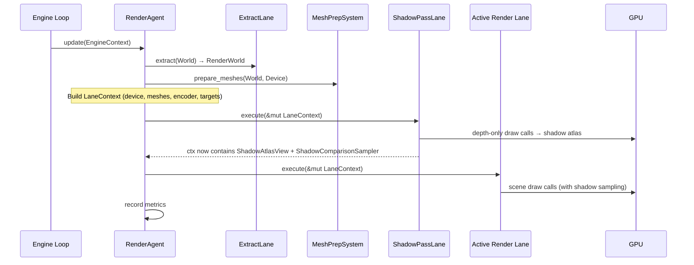

# 10. Rendering Architecture

This document describes the **Rendering ISA** architecture: how the `RenderAgent` manages polymorphic rendering strategies through the unified `Lane` trait, participates in GORNA negotiation, performs shadow mapping, and adapts at runtime.

## 1. Polymorphic Rendering in SAA

In a conventional engine the rendering pipeline (Forward, Deferred, etc.) is a project-wide configuration. Khora's **Symbiotic Adaptive Architecture (SAA)** treats rendering as a **polymorphic service**: multiple rendering paths coexist in memory and the engine switches between them transparently, driven by the **GORNA** protocol.

This approach delivers:

- **Zero-downtime switching** — GPU resources for all lanes stay alive; only the active strategy pointer changes.
- **Budget-aware rendering** — the DCC can force the agent onto a cheaper lane when the frame time budget is tight.
- **Shadow integration** — shadow lanes run before any render lane, injecting depth-atlas data into the shared `LaneContext`.

## 2. The Unified Lane Trait

All lanes in KhoraEngine — rendering, shadow, physics, audio, etc. — implement the same `Lane` trait defined in `khora-core::lane`. There is **no domain-specific trait** such as `RenderLane` or `ShadowLane`; the unified interface is sufficient:

```rust
pub trait Lane: Send + Sync {
    fn strategy_name(&self) -> &'static str;
    fn lane_kind(&self) -> LaneKind;
    fn estimate_cost(&self, ctx: &LaneContext) -> f32;
    fn on_initialize(&self, ctx: &mut LaneContext) -> Result<(), LaneError>;
    fn execute(&self, ctx: &mut LaneContext) -> Result<(), LaneError>;
    fn on_shutdown(&self, ctx: &mut LaneContext);
    fn as_any(&self) -> &dyn Any;
    fn as_any_mut(&mut self) -> &mut dyn Any;
}
```

| Method | Purpose |
| :--- | :--- |
| `strategy_name()` | Stable string identifier (e.g. `"LitForward"`, `"ShadowPass"`). |
| `lane_kind()` | Returns a `LaneKind` variant (`Render`, `Shadow`, `Physics`, …). |
| `estimate_cost(&LaneContext)` | Relative cost factor used during GORNA negotiation. |
| `on_initialize(&mut LaneContext)` | One-time GPU init — creates pipelines, buffers, bind groups. |
| `execute(&mut LaneContext)` | Hot-path entry point — called every frame/tick. |
| `on_shutdown(&mut LaneContext)` | Destroys all owned GPU resources. |

> [!IMPORTANT]
> `on_shutdown()` must release every GPU resource the lane owns. `ForwardPlusLane`, for example, destroys its render pipeline, light buffer, light-index buffer, light-grid buffer, and culling-uniforms buffer. `ShadowPassLane` destroys its pipeline, bind-group layouts, atlas texture, and atlas view.

### LaneKind Classification

```rust
pub enum LaneKind {
    Render,   // Main scene rendering (forward, deferred, …)
    Shadow,   // Shadow map generation
    Physics,  // Physics simulation
    Audio,    // Audio mixing and spatialization
    Asset,    // Asset loading and processing
    Scene,    // Serialization / deserialization
    Ecs,      // ECS maintenance (compaction, GC)
}
```

The agent uses `LaneKind` to **route execution**: shadow lanes run before render lanes, physics lanes run in the physics tick, etc.

## 3. Available Lanes

### 3.1 Render Lanes (`LaneKind::Render`)

| Lane | Strategy Name | GORNA Mapping | Description |
| :--- | :--- | :--- | :--- |
| `SimpleUnlitLane` | `"SimpleUnlit"` | `LowPower` | Vertex colors, no lighting. |
| `LitForwardLane` | `"LitForward"` | `Balanced` | Per-fragment Blinn-Phong with directional / point / spot lights + PCF shadow sampling. |
| `ForwardPlusLane` | `"ForwardPlus"` | `HighPerformance` | Tiled forward+ with compute-based light culling. |

### 3.2 Shadow Lanes (`LaneKind::Shadow`)

| Lane | Strategy Name | Description |
| :--- | :--- | :--- |
| `ShadowPassLane` | `"ShadowPass"` | Renders a 2048×2048 4-layer depth atlas. Patches `ExtractedLight` fields and injects `ShadowAtlasView` + `ShadowComparisonSampler` into the `LaneContext` for downstream render lanes. |

### 3.3 Future Concepts

| Lane | Strategy | Status |
| :--- | :--- | :--- |
| `DeferredLane` | G-Buffer + deferred lighting pass | *Concept* |
| Mobile / Low-Power | Energy-efficient path for thermal management | *Concept* |
| Virtual Geometry | Nanite-like fine-grained visibility & streaming | *Concept* |

## 4. LaneContext: The Data Bridge

Agents and lanes communicate through `LaneContext`, a `HashMap<TypeId, Box<dyn Any>>` type-map. The agent **populates** the context before dispatching lanes; each lane **reads** what it needs and **writes** results for downstream lanes.

### 4.1 Standard Context Keys

These typed keys live in `khora-core::lane::context_keys`:

| Key | Type | Producer | Consumer |
| :--- | :--- | :--- | :--- |
| `ColorTarget` | `TextureViewId` | `RenderAgent` | All render lanes |
| `DepthTarget` | `TextureViewId` | `RenderAgent` | All render lanes |
| `ClearColor` | `LinearRgba` | `RenderAgent` | All render lanes |
| `ShadowAtlasView` | `TextureViewId` | `ShadowPassLane` | `LitForwardLane`, `ForwardPlusLane` |
| `ShadowComparisonSampler` | `SamplerId` | `ShadowPassLane` | `LitForwardLane`, `ForwardPlusLane` |
| `Arc<dyn GraphicsDevice>` | — | `RenderAgent` | All lanes (init & execute) |
| `Arc<RwLock<Assets<GpuMesh>>>` | — | `RenderAgent` | Render & shadow lanes |
| `Slot<dyn CommandEncoder>` | mutable borrow | `RenderAgent` | All lanes |
| `Slot<RenderWorld>` | mutable borrow | `RenderAgent` | All lanes |

### 4.2 Slot / Ref Wrappers

For data that the agent **borrows** (not owns), `Slot<T>` (mutable) and `Ref<T>` (shared) erase the borrow lifetime so the value can be stored in the type-map:

```rust
// Agent side
let mut ctx = LaneContext::new();
ctx.insert(Slot::new(encoder));     // mutable borrow
ctx.insert(Slot::new(render_world));

// Lane side
let encoder = ctx.get::<Slot<dyn CommandEncoder>>()
    .ok_or(LaneError::missing("Slot<dyn CommandEncoder>"))?
    .get();  // → &mut dyn CommandEncoder
```

Safety is guaranteed by the **stack-scoped context pattern**: the `LaneContext` is created by the agent, passed to one lane at a time, and dropped before the next frame.

## 5. The RenderAgent ISA

The `RenderAgent` (`khora-agents::render_agent`) is an **Intelligent Subsystem Agent** implementing the `Agent` trait. It sits on the **Control Plane** (Cold Path) and drives both shadow and render Lanes on the Data Plane (Hot Path).

### 5.1 Internal State

```rust
pub struct RenderAgent {
    render_world: RenderWorld,
    gpu_meshes: Arc<RwLock<Assets<GpuMesh>>>,
    mesh_preparation_system: MeshPreparationSystem,
    extract_lane: ExtractRenderablesLane,
    lanes: LaneRegistry,             // All lanes (render + shadow) in one registry
    strategy: RenderingStrategy,      // Current active strategy enum
    current_strategy: StrategyId,     // GORNA strategy ID
    device: Option<Arc<dyn GraphicsDevice>>,
    render_system: Option<Arc<Mutex<Box<dyn RenderSystem>>>>,
    telemetry_sender: Option<Sender<TelemetryEvent>>,
    // --- Performance Metrics ---
    last_frame_time: Duration,
    time_budget: Duration,            // Assigned by GORNA
    draw_call_count: u32,
    triangle_count: u32,
    frame_count: u64,
}
```

On construction, `RenderAgent::new()` registers four default lanes:

```rust
let mut lanes = LaneRegistry::new();
lanes.register(Box::new(SimpleUnlitLane::new()));
lanes.register(Box::new(LitForwardLane::new()));
lanes.register(Box::new(ForwardPlusLane::new()));
lanes.register(Box::new(ShadowPassLane::new()));
```

### 5.2 Strategy Selection

The `RenderingStrategy` enum governs which render lane is active:

| Mode | Behavior |
| :--- | :--- |
| `Unlit` | Always selects `SimpleUnlitLane`. |
| `LitForward` | Always selects `LitForwardLane`. |
| `ForwardPlus` | Always selects `ForwardPlusLane`. |
| `Auto` *(default)* | Picks `LitForward` or `ForwardPlus` based on the scene light count vs. the `FORWARD_PLUS_LIGHT_THRESHOLD` (20). Falls back to `SimpleUnlit` only when the scene has zero lights. |

In `Auto` mode the agent evaluates the scene every frame, choosing the most appropriate lane without GORNA intervention. GORNA can override this by issuing a specific strategy via `apply_budget()`.

## 6. GORNA Protocol Integration

### 6.1 Phase C: Negotiation — `negotiate()`

When the DCC triggers a GORNA round, it calls `negotiate(NegotiationRequest)` on the agent.

**Algorithm:**

1. Build a minimal `LaneContext` with `Slot<RenderWorld>` and `Arc<RwLock<Assets<GpuMesh>>>`.
2. For each `LaneKind::Render` lane, call `lane.estimate_cost(&ctx)` to get a real cost factor.
3. Convert cost to estimated GPU time: `estimated_time = cost × COST_TO_MS_SCALE / 1000` (clamped to ≥ 0.1 ms).
4. Compute VRAM estimates:
   - **Base**: `mesh_count × 100 KB` (vertex + index buffers).
   - **LitForward overhead**: `+512 B/mesh + 4 KB` (uniform buffers).
   - **ForwardPlus overhead**: `+512 B/mesh + 4 KB + 8 MB` (compute culling buffers).
5. Filter out strategies exceeding `request.constraints.max_vram_bytes`.
6. Always guarantee at least one `LowPower` fallback (1 ms, base VRAM).

**Example response** (3 meshes, no VRAM constraint):

| Strategy | Estimated Time | Estimated VRAM |
| :--- | :--- | :--- |
| `LowPower` | ~0.10 ms | 300 KB |
| `Balanced` | ~0.50 ms | 305 KB |
| `HighPerformance` | ~2.50 ms | 8.5 MB |

### 6.2 Phase E: Application — `apply_budget()`

The DCC selects a strategy and issues a `ResourceBudget`. The agent:

1. Maps `StrategyId` → `RenderingStrategy`:
   - `LowPower → Auto` — lets the agent pick `SimpleUnlit` when the scene has no lights, but automatically escalate to `LitForward` when lights are present so shadows and lighting work correctly.
   - `Balanced → LitForward`
   - `HighPerformance → ForwardPlus`
2. Stores `budget.time_limit` for health reporting.
3. **Does not** destroy or recreate any lane — only the active strategy enum changes.

> [!NOTE]
> Custom strategy IDs fall back to `Balanced` with a warning log.

### 6.3 Health Reporting — `report_status()`

The agent reports health to the DCC every tick:

```rust
AgentStatus {
    agent_id: AgentId::Renderer,
    health_score,       // min(1.0, time_budget / last_frame_time)
    current_strategy,
    is_stalled,         // true if frame_count == 0 && device is initialized
    message,            // "frame_time=X.XXms draws=N tris=N lights=N"
}
```

- `health_score = 1.0` when at or under budget, `< 1.0` when over budget.
- `is_stalled = true` signals a potential initialization failure (device present but no frames rendered).

### 6.4 Telemetry

The agent emits `TelemetryEvent::GpuReport` each frame:

| Metric | Source |
| :--- | :--- |
| `gpu_frame_time` | `Instant` timing around the render closure |
| `draw_calls` | Count of `RenderWorld.meshes` |
| `triangles_rendered` | Sum of `vertex_count / 3` across rendered meshes |
| `lights` | `directional + point + spot` light counts |

The DCC's `MetricStore` ingests these into ring buffers for trend analysis and heuristic evaluation.

## 7. Frame Lifecycle



### 7.1 Tactical Update (`Agent::update`)

Called by the engine loop via `DccService::update_agents`:

1. **Cache device**: On first call, obtain `Arc<dyn GraphicsDevice>` from the `ServiceRegistry`, then initialize **all** lanes via `lane.on_initialize(&mut ctx)`.
2. **Extract scene**: Downcast `EngineContext` to `World`, run `MeshPreparationSystem` (CPU → GPU mesh upload), run `ExtractRenderablesLane` (ECS → `RenderWorld`).
3. **Extract camera**: Push the camera view to the cached `RenderSystem`.

### 7.2 Rendering (`render_with_encoder` closure)

Inside the render system's encoder scope:

1. **Build `LaneContext`**: Insert `Arc<dyn GraphicsDevice>`, `Arc<RwLock<Assets<GpuMesh>>>`, `Slot<dyn CommandEncoder>`, `Slot<RenderWorld>`, `ColorTarget`, `DepthTarget`, `ClearColor`.
2. **Shadow pass**: Execute all `LaneKind::Shadow` lanes. The `ShadowPassLane`:
   - Renders depth-only draw calls into the 2048×2048 4-layer atlas.
   - Patches each `ExtractedLight` with `shadow_view_proj` and `shadow_atlas_index`.
   - Inserts `ShadowAtlasView` and `ShadowComparisonSampler` into the context.
3. **Render pass**: Execute the selected `LaneKind::Render` lane (via `lanes.get(selected_name)`). The lit lanes read shadow data from the context and build a 3-entry bind group (uniform buffer + shadow atlas + comparison sampler).
4. **Metrics**: Record `last_frame_time`, `draw_call_count`, `triangle_count`; increment `frame_count`.

## 8. Shadow Mapping Pipeline

### 8.1 Architecture

Shadow mapping is a first-class, integrated subsystem — not an optional post-process. The `ShadowPassLane` runs **before** any render lane in every frame where lights are present.

**Shadow Atlas**: A `Depth32Float` 2D-array texture (2048 × 2048 × 4 layers). Each shadow-casting light is assigned one layer.

### 8.2 ShadowPassLane::execute() — Three Phases

| Phase | Action |
| :--- | :--- |
| **1. Render Shadows** | For each shadow-casting light, compute a light-space view-projection matrix, set up a depth-only render pass targeting one atlas layer, and draw all shadow-casting meshes. Uses ring buffers for uniforms. |
| **2. Patch Lights** | Write `shadow_view_proj` and `shadow_atlas_index` into each `ExtractedLight` through the `Slot<RenderWorld>`. |
| **3. Store Resources** | Insert `ShadowAtlasView(view_id)` and `ShadowComparisonSampler(sampler_id)` into the `LaneContext` so render lanes can sample the atlas. |

### 8.3 Shadow Sampling (WGSL)

The `lit_forward.wgsl` shader performs **3×3 PCF** (Percentage-Closer Filtering):

```wgsl
fn sample_shadow_pcf(light_space_pos: vec4<f32>, atlas_index: i32) -> f32 {
    let proj = light_space_pos.xyz / light_space_pos.w;
    let uv   = proj.xy * vec2(0.5, -0.5) + 0.5;
    let texel = 1.0 / 2048.0;
    var shadow = 0.0;
    for (var y = -1; y <= 1; y++) {
        for (var x = -1; x <= 1; x++) {
            shadow += textureSampleCompareLevel(
                shadow_atlas, shadow_sampler,
                uv + vec2(f32(x), f32(y)) * texel,
                atlas_index, proj.z
            );
        }
    }
    return shadow / 9.0;
}
```

### 8.4 Resource Lifecycle

| Event | Action |
| :--- | :--- |
| `on_initialize` | Creates atlas texture (2048×2048×4), depth view, comparison sampler, depth-only pipeline, per-frame ring buffers (camera + model uniforms), bind-group layouts. |
| `execute` | Uses ring buffers for per-light uniforms. No per-frame allocations. |
| `on_shutdown` | Destroys pipeline, layouts, atlas texture, atlas view, comparison sampler. |

## 9. Integration with CLAD

The rendering subsystem is the canonical embodiment of the **CLAD Pattern**:

| Role | Component | Responsibility |
| :--- | :--- | :--- |
| **[C]ontrol** | `RenderAgent` | Lifecycle management, GORNA negotiation, strategy selection. |
| **[L]ane** | `Lane` impls (`SimpleUnlit`, `LitForward`, `ForwardPlus`, `ShadowPass`) | Deterministic GPU command recording on the Hot Path via `execute(&mut LaneContext)`. |
| **[A]gent** | `RenderAgent` | ISA negotiating GPU time and VRAM budget with the DCC. |
| **[D]ata** | `RenderWorld` + `LaneContext` | Decoupled scene data and typed context consumed by any lane. |

## 10. Implementation Status

### Completed

- [x] Four coexisting lanes: `SimpleUnlitLane`, `LitForwardLane`, `ForwardPlusLane`, `ShadowPassLane`.
- [x] Unified `Lane` trait — no domain-specific render/shadow traits.
- [x] `LaneRegistry` for generic lane storage and lookup by name/kind.
- [x] `LaneContext` type-map for zero-coupling data passing between agent and lanes.
- [x] `Slot<T>` / `Ref<T>` wrappers for safe borrow-through-context patterns.
- [x] Full GORNA protocol: `negotiate()`, `apply_budget()`, `report_status()`.
- [x] Cost-based negotiation via `lane.estimate_cost(&LaneContext)`.
- [x] VRAM-aware strategy filtering.
- [x] Shadow atlas (2048×2048, 4 layers, Depth32Float) with 3×3 PCF sampling.
- [x] Shadow data flow: atlas → `LaneContext` → bind group in render lanes.
- [x] Per-frame performance metrics tracking.
- [x] Health score computation (budget vs. actual frame time).
- [x] Stall detection for the DCC watchdog.
- [x] `GpuReport` telemetry event integration with `MetricStore`.
- [x] Tiled Forward+ compute culling and fragment shaders.
- [x] 17 GORNA integration tests (negotiate, apply_budget, report_status, telemetry, full cycle).

### Known Limitations & Future Work

- [ ] Auto-mode uses a simple light-count threshold; could leverage DCC heuristics instead.
- [ ] Shadow atlas is hardcoded to 4 layers — should scale based on shadow-casting light count.
- [ ] `extract_lane` material query uses `.nth(entity_id)` which may not match actual material IDs.
- [ ] `LitForwardLane` allocates uniform buffers per-frame (should use a persistent ring buffer).
- [ ] Vertex layout assumptions differ between lanes (not currently validated).
- [ ] `MaterialUniforms` struct is hardcoded; should derive from material properties dynamically.

## 11. Future Research Areas

- **NPR (Non-Photorealistic Rendering) Lanes**: Cell-shading or oil-painting as selectable strategies.
- **Hardware-Specific Lanes**: Paths for Ray Tracing (DXR/Vulkan RT) or Mesh Shaders.
- **Autonomous Streaming Lanes**: Lane-managed "just-in-time" geometry/texture streaming (Nanite/Virtual Textures).
- **DeferredLane**: G-Buffer rendering for massive light counts, decoupling lighting from geometry cost.
- **Predictive Strategy Switching**: Using `MetricStore` trend analysis to pre-emptively switch strategies before budget violations occur.
- **Cascaded Shadow Maps**: Multiple shadow cascades for better depth precision over large view distances.
