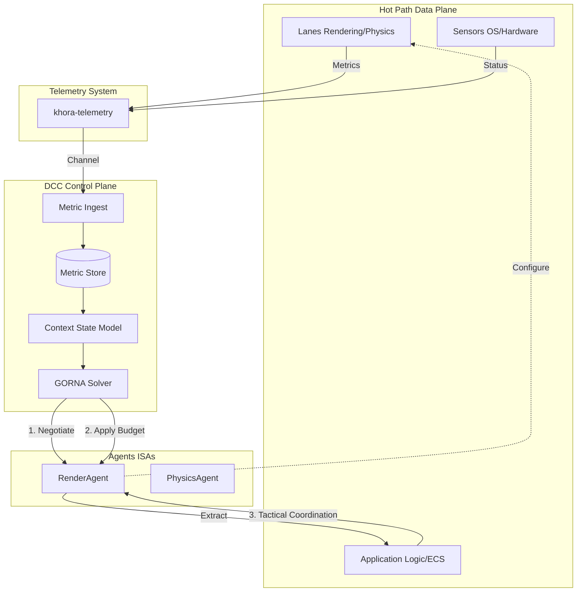
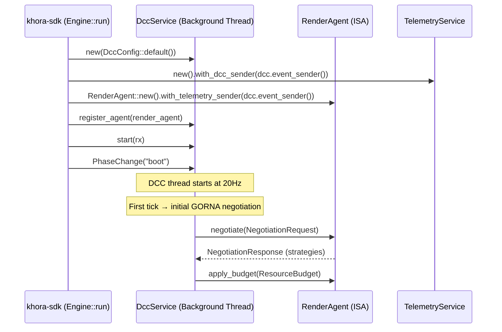

# 11. Dynamic Context Core (DCC) Architecture

The **Dynamic Context Core (DCC)** is the strategic "brain" of the Symbiotic Adaptive Architecture (SAA). It is responsible for maintaining a holistic model of the application's state, analyzing performance metrics, and orchestrating the **Intelligent Subsystem Agents (ISAs)** via the **GORNA** protocol.

> [!NOTE]
> The DCC operates on the **Control Plane (Cold Path)**. It runs asynchronously from the main render loop, typically at a lower frequency (e.g., 10-60 Hz), allowing it to perform complex analysis without stalling frame generation.

## 1. Core Responsibilities

The DCC has three primary directives:

1.  **Observe**: Aggregate telemetry from all subsystems and hardware sensors to build a `Context` model.
2.  **Evaluate**: Compare the current state against high-level goals (e.g., "Target 60 FPS", "Conserve Battery").
3.  **Orchestrate**: Negotiate with Agents to adjust their resource budgets and strategies.

## 2. State Representation (The Context Model)

The DCC maintains a living model of the world, split into three categories:

### 2.1 Hardware State
Describes the physical constraints of the device.

*   **`ThermalStatus`**: `Cool` | `Warm` | `Throttling` | `Critical`.
    *   *Source*: OS sensors / Driver events.
    *   *Impact*: If throttling, the DCC must aggressively reduce GPU/CPU budgets to prevent OS-level frequency clamping.
*   **`BatteryLevel`**: `Mains` | `High` | `Low` | `Critical`.
    *   *Source*: OS power events.
    *   *Impact*: In `Low` battery, the DCC might cap the frame rate to 30 FPS or disable expensive post-processing.
*   **`LoadAverage`**: Rolling average of CPU/GPU utilization.

### 2.2 Execution Phase (Engine Context)
Describes *what* the engine is currently doing, which dictates priority.

*   **`Boot`**: The engine is initializing.
    *   *Goal*: Maximize loading speed. Uncap CPU usage for compression/IO.
*   **`Menu`**: The user is in a menu.
    *   *Goal*: Responsiveness but efficiency. Cap FPS (e.g., 60), reduce GPU clocks if possible.
*   **`Simulation`**: Active gameplay.
    *   *Goal*: Stable frame times. strict adherence to budgets.
*   **`Background`**: The window is minimized or lost focus.
    *   *Goal*: Absolute minimum footprint. Cap FPS to 1-5, pause simulation lanes.

### 2.3 Performance Metrics
Aggregated data from `khora-telemetry`.

*   **Timing**:
    *   `CpuFrameTime`: Total time spent in the CPU logic loop.
    *   `GpuFrameTime`: Total time spent by the GPU to render the frame.
    *   `FrameVariance`: Standard deviation of the last 60 frames (stutter detection).
*   **Memory**:
    *   `SystemRAM`: Resident Set Size (RSS).
    *   `VRAM`: Video memory usage.
    *   `PageFaults`: Hard/Soft page faults (detecting thrashing).
*   **Rendering**:
    *   `DrawCalls`: Number of draw calls per frame.
    *   `TriangleCount`: Total geometry complexity.
    *   `ShaderSwitches`: Pipeline state changes (sort efficiency).
*   **Logic (ECS)**:
    *   `EntityCount`: Total active entities in the world.
    *   `SystemTime`: Time spent in specific hot systems (e.g., Physics).
*   **Streaming**:
    *   `IoReadBytesPerSec`: Disk bandwidth usage.
    *   `PendingAsyncLoads`: Number of assets waiting to load (detecting bottlenecks).

## 3. Metric Aggregation Strategy

To make informed decisions, the DCC needs accurate data. However, collecting data must not impact the **Hot Path**.

### 3.1 Lock-Free Ingestion
Telemetry events are sent from the Hot Path (Lanes) to the DCC via **crossbeam channels** (Multi-Producer, Single-Consumer). This ensures that a rendering thread never locks or waits when reporting a metric.

### 3.2 The `MetricStore`
The DCC stores metrics in a strictly contiguous, cache-friendly structure.

*   **Data Structure**: `Vec<RingBuffer<f32, N>>` indexed by `MetricId`.
*   **Ring Buffers**: Fixed-size arrays (e.g., storing the last 60 samples). This avoids allocation during runtime.
*   **Analysis**: The DCC analyzes these buffers to compute:
    *   **Trends**: Is memory usage rising rapidly? (Slope analysis).
    *   **Stability**: Is frame time variance high? (Standard deviation).

## 4. The Decision Loop (The Brain)

The DCC runs its own loop, decoupled from the frame rate.

### Step 1: Ingest
Drain the telemetry channel. New events are pushed into their respective `RingBuffer` in the `MetricStore`.

### Step 2: Analysis & Heuristics
Update the `Context` model.
*   *Example*: If `avg_frame_time` > 16ms for the last 60 frames, set a `PerformanceWarning` flag.
*   *Example*: If `thermal_event` received, update `HardwareState.thermal` to `Throttling`.

### Step 3: GORNA Evaluation
Compare the current `Context` against the defined goals. The **GORNA (Goal-Oriented Resource Negotiation & Allocation)** protocol solves the resource distribution.

The `HeuristicEngine` runs 9 checks each tick:

| Heuristic | Trigger | Effect |
| :--- | :--- | :--- |
| **Phase** | `Phase == Background` | `GlobalBudget.max_fps = 5`. Reduce all Agent update rates. |
| **Thermal** | `Thermal ≥ Throttling` | Reduce `global_budget_multiplier` (0.6× at Critical). |
| **Battery** | `Battery == Low/Critical` | Reduce budgets, cap FPS. |
| **Frame Time Avg** | `avg_frame_time > target` | Trigger GORNA re-negotiation. |
| **Stutter** | High frame time variance | Trigger GORNA re-negotiation. |
| **Trend** | Rising frame time slope | Early warning; preemptive negotiation. |
| **CPU Pressure** | `cpu_load > 0.9` | Signal ISAs to reduce CPU work. |
| **GPU Pressure** | `gpu_load > 0.9` | Signal ISAs to reduce GPU work. |
| **Death Spiral** | Multiple agents stalled | Emergency `LowPower` on all agents. |

### Step 3.5: Initial GORNA Round
On the **first tick after agents are registered**, the DCC forces an initial GORNA negotiation round, regardless of whether any heuristic triggers. This ensures every agent receives a baseline `ResourceBudget` before telemetry-driven arbitration begins.

Without this initial round, agents would remain in their default state indefinitely on healthy systems where no heuristic threshold is ever crossed.

### Step 4: Act (Arbitration & Application)
The DCC runs the `GornaArbitrator` to resolve resource conflicts and issues budgets to the agents.
*   **Negotiate**: The DCC asks agents for strategy options based on the current `target_latency`.
*   **Apply Budget**: The DCC selects the optimal strategy and issues a `ResourceBudget` to each agent.

### Step 5: Tactical Coordination (`Agent::update`)
Beyond strategic budgeting, agents perform high-frequency tactical work. This is triggered by the main engine loop (e.g., in `RedrawRequested`) via the `DccService::update_agents` method.
*   **Mechanism**: The engine provides an `EngineContext` containing type-erased (`Any`) pointers to the ECS `World` and `Assets`.
*   **Action**: Agents (like the `RenderAgent`) downcast these pointers to extract data, prepare GPU meshes, and coordinate multi-threaded data flows between the Data Plane and the Data Lane.
*   **Telemetry Emission**: After tactical work, agents with a wired `Sender<TelemetryEvent>` emit performance reports (e.g., `GpuReport` with draw calls, triangle count) back to the DCC channel.

## 5. SDK Integration & Phase Lifecycle

The `DccService` is fully integrated into `khora-sdk`. End users interact with it implicitly through the `Application` trait — no manual DCC configuration is required.

### 5.1 Automatic Wiring (in `Engine::run`)

### 5.2 Execution Phase Lifecycle

The SDK automatically emits `PhaseChange` events to the DCC at key lifecycle transitions:

| Transition | Phase | Trigger |
| :--- | :--- | :--- |
| Engine init | `Boot` | Emitted immediately after `DccService::start()`. |
| First `RedrawRequested` | `Simulation` | Emitted on the first frame's `RedrawRequested` event. |
| Window minimized | `Background` | *(Future: emitted on window focus loss)* |
| Window restored | `Simulation` | *(Future: emitted on window focus gain)* |

### 5.3 Per-Frame Tactical Update

On every `RedrawRequested`, the SDK calls `dcc.update_agents(&mut context)` using its internally owned `GameWorld`:

1. The `GameWorld` (owned by the SDK's `EngineState`) provides its `World` and `Assets<Mesh>` through a `pub(crate)` method.
2. These are type-erased into `EngineContext` and passed to each agent's `update()`.
3. The `RenderAgent` downcasts the context, runs `MeshPreparationSystem` and `ExtractRenderablesLane`, then emits a `GpuReport` telemetry event.
4. The user's `Application::update(&mut self, world: &mut GameWorld)` is called **after** agent updates, giving the game logic a typed, controlled view of the ECS without ever touching `World` directly.

### 5.4 Communication Channels

*   **Inbound** (Hot Path → DCC): `Receiver<TelemetryEvent>` from `khora-telemetry` monitors **and** from agents' telemetry senders.
*   **Outbound** (DCC → Agents): Direct `Arc<Mutex<dyn Agent>>` method calls (`negotiate`, `apply_budget`) on the background thread.
