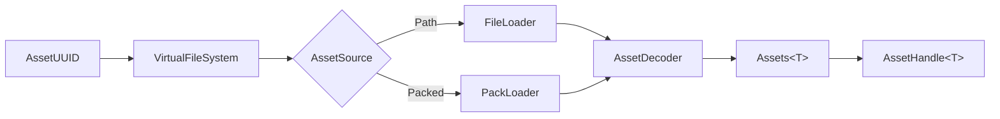

# Assets and VFS

How Khora finds, loads, and stores assets — meshes, textures, fonts, audio. Built on a virtual file system and per-format decoders.

- Document — Khora Assets v1.0
- Status — Authoritative
- Date — May 2026

---

## Contents

1. The pipeline
2. The Virtual File System
3. AssetSource — file or pack
4. Decoders
5. AssetService and handles
6. .pack archives
7. For game developers
8. For engine contributors
9. Decisions
10. Open questions

---

## 01 — The pipeline



| Step | Component | Purpose |
|---|---|---|
| 1 | `AssetUUID` | Unique identifier for an asset |
| 2 | `VirtualFileSystem` | UUID → metadata lookup (O(1)) |
| 3 | `AssetSource` | Path (dev) or packed offset/size (release) |
| 4 | `AssetIo` | `FileLoader` or `PackLoader` — reads raw bytes |
| 5 | `AssetDecoder<A>` | Decodes bytes into a typed asset |
| 6 | `Assets<T>` | Typed storage registry |
| 7 | `AssetHandle<T>` | Typed handle game code carries around |

The whole pipeline is on-demand — assets are services, not agents. There is no "asset agent" because there are no strategies to negotiate.

## 02 — The Virtual File System

`VirtualFileSystem` is a UUID → metadata table. UUIDs are stable across builds; paths are not. This is the seam that lets us ship loose files in development and packed archives in release without changing game code.

```rust
let vfs = ctx.services.get::<Arc<VirtualFileSystem>>().unwrap();
let metadata = vfs.lookup(asset_uuid)?;
match metadata.source {
    AssetSource::Path(p) => /* dev mode */,
    AssetSource::Packed { offset, size } => /* release mode */,
}
```

VFS lookups are O(1) — a `HashMap<Uuid, AssetMetadata>`. The metadata carries the source descriptor and any pre-decode hints (mip levels, vertex count, sample rate).

## 03 — AssetSource — file or pack

| Variant | Use | Reader |
|---|---|---|
| `AssetSource::Path(PathBuf)` | Development — loose files on disk | `FileLoader` |
| `AssetSource::Packed { offset, size }` | Release — single `.pack` file | `PackLoader` |

Both implement the `AssetIo` trait. The decoder layer above does not know which is in use.

## 04 — Decoders

Decoders are lanes (the asset-loader lanes). Each decodes one format into one typed asset.

```rust
pub trait AssetDecoder<A: Asset> {
    fn load(&self, bytes: &[u8]) -> Result<A, Box<dyn Error + Send + Sync>>;
}
```

| Decoder | Asset type | Format |
|---|---|---|
| `TextureLoaderLane` | `CpuTexture` | PNG, JPG, BMP |
| `GltfLoaderLane` | `Mesh` | glTF 2.0 |
| `ObjLoaderLane` | `Mesh` | OBJ |
| `FontLoaderLane` | `Font` | TTF, OTF |
| `WavLoaderLane` | `SoundData` | WAV |
| `SymphoniaLoaderLane` | `SoundData` | MP3, Ogg, FLAC |

Adding a format means adding a decoder and registering it. The `DecoderRegistry` maps file extensions to decoders.

## 05 — AssetService and handles

`AssetService` is the public face of the asset pipeline:

```rust
let service = ctx.services.get::<Arc<AssetService>>().unwrap();
let handle: AssetHandle<Mesh> = service.load("models/character.gltf").await?;
```

`AssetHandle<T>` is a typed handle that game code stores in components. It is reference-counted and cloneable; the underlying asset is freed when no handle remains.

| Operation | What happens |
|---|---|
| `load("path")` | VFS lookup → AssetIo read → AssetDecoder decode → store in `Assets<T>` → return handle |
| `get(handle)` | Look up by handle in `Assets<T>` |
| Drop last handle | Asset is removed from `Assets<T>` on next maintenance tick |

Loading is async because file I/O is. The decoder runs on the calling thread today; a future revision moves it to a thread pool for large assets.

## 06 — .pack archives

In release builds, all assets are bundled into a single `.pack` file:

```
.pack file
┌─────────────────────────────────────┐
│ Header                              │
│  Magic: "KHORAPACK"                 │
│  Version                            │
│  Entry count                        │
│  Index offset                       │
├─────────────────────────────────────┤
│ Asset blob 0                        │
│ Asset blob 1                        │
│ ...                                 │
├─────────────────────────────────────┤
│ Index (UUID → offset, size)         │
└─────────────────────────────────────┘
```

`PackLoader` reads from `.pack` using `mmap` for zero-copy access. The VFS is built from the index at startup.

The pack builder is a separate tool (under construction). Today, development uses `FileLoader` against loose files.

---

## For game developers

```rust
// In setup or update
let asset_service = ctx.services.get::<Arc<AssetService>>().unwrap();

// Load (await — async)
let mesh: AssetHandle<Mesh> = asset_service.load("models/cube.gltf").await?;
let texture: AssetHandle<CpuTexture> = asset_service.load("textures/wood.png").await?;

// Spawn an entity using the handles
world.spawn((
    Transform::default(),
    GlobalTransform::identity(),
    HandleComponent::new(mesh),
    MaterialComponent::pbr(texture),
));
```

Handles are cheap to clone — they are reference-counted. Multiple entities can share one mesh or texture without duplicating GPU memory.

When an entity is despawned, its handles drop. When the last handle to an asset drops, the asset is queued for unload on the next maintenance tick.

For your own asset types: implement the `Asset` trait (it is a marker — `Send + Sync + 'static`), write an `AssetDecoder<MyAsset>`, register it. The pipeline takes over.

## For engine contributors

The split:

| File | Purpose |
|---|---|
| `crates/khora-core/src/asset/` | `Asset` trait, `AssetHandle<T>` |
| `crates/khora-core/src/vfs/` | `VirtualFileSystem`, `AssetMetadata`, `AssetSource` |
| `crates/khora-io/src/asset/` | `AssetService`, `AssetIo` trait, `FileLoader`, `PackLoader`, `DecoderRegistry` |
| `crates/khora-lanes/src/asset_lane/loading/` | Per-format decoder lanes |
| `crates/khora-data/src/assets/` | `Assets<T>` typed storage |

Adding a format: write a struct implementing `AssetDecoder<MyAsset>`, register it in `DecoderRegistry::new()` keyed on extension. Done.

Adding a backend (e.g., loading from a network CDN): implement `AssetIo`, swap it through service registration. The VFS, decoders, and handles do not change.

## Decisions

### We said yes to
- **UUID-based identity.** Paths change; UUIDs are forever. Renaming a file or moving it does not break references.
- **Loose files in dev, pack in release.** Same code path through `AssetIo`; only the loader implementation differs.
- **Asset loaders as lanes.** Format decoding is a pipeline stage, exactly like rendering. Lane lifecycle (`prepare` / `execute` / `cleanup`) maps cleanly.
- **Reference-counted handles.** Game code does not manage asset lifetime. Drop the handle, the asset goes away.

### We said no to
- **Asset path strings as identity.** Strings are ergonomic; UUIDs are correct. The VFS provides the path → UUID resolution at edit time.
- **An "asset agent."** Loading has no strategies to negotiate. It is a service.
- **Asset hot-reload as a v1 feature.** Designed (the VFS layer can detect changes), not yet implemented.

## Open questions

1. **Streaming.** Today assets load entirely into memory. Streaming meshes (Nanite-style) and textures (sparse residency) are roadmap items.
2. **Async decoder execution.** The decoder runs on the calling thread. Large assets should use a thread pool — the contract is undecided.
3. **Pack builder.** A working `.pack` builder tool is needed to move releases off `FileLoader`. Designed; in development.

---

*Next: UI. See [UI](./13_ui.md).*
