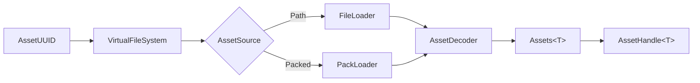

# Assets and VFS

How Khora finds, loads, and stores assets — meshes, textures, fonts, audio. Built on a virtual file system and per-format decoders.

- Document — Khora Assets v1.0
- Status — Authoritative
- Date — May 2026

---

## Contents

1. The pipeline
2. The Virtual File System
3. AssetSource — file or pack
4. Decoders
5. AssetService and handles
6. .pack archives
7. For game developers
8. For engine contributors
9. Decisions
10. Open questions

---

## 01 — The pipeline



| Step | Component | Purpose |
|---|---|---|
| 1 | `AssetUUID` | Unique identifier for an asset |
| 2 | `VirtualFileSystem` | UUID → metadata lookup (O(1)) |
| 3 | `AssetSource` | Path (dev) or packed offset/size (release) |
| 4 | `AssetIo` | `FileLoader` or `PackLoader` — reads raw bytes |
| 5 | `AssetDecoder<A>` | Decodes bytes into a typed asset |
| 6 | `Assets<T>` | Typed storage registry |
| 7 | `AssetHandle<T>` | Typed handle game code carries around |

The whole pipeline is on-demand — assets are services, not agents. There is no "asset agent" because there are no strategies to negotiate.

## 02 — The Virtual File System

`VirtualFileSystem` is a UUID → metadata table. UUIDs are stable across builds; paths are not. This is the seam that lets us ship loose files in development and packed archives in release without changing game code.

```rust
let vfs = ctx.services.get::<Arc<VirtualFileSystem>>().unwrap();
let metadata = vfs.lookup(asset_uuid)?;
match metadata.source {
    AssetSource::Path(p) => /* dev mode */,
    AssetSource::Packed { offset, size } => /* release mode */,
}
```

VFS lookups are O(1) — a `HashMap<Uuid, AssetMetadata>`. The metadata carries the source descriptor and any pre-decode hints (mip levels, vertex count, sample rate).

## 03 — AssetSource — file or pack

| Variant | Use | Reader |
|---|---|---|
| `AssetSource::Path(PathBuf)` | Development — loose files on disk | `FileLoader` |
| `AssetSource::Packed { offset, size }` | Release — single `.pack` file | `PackLoader` |

Both implement the `AssetIo` trait. The decoder layer above does not know which is in use.

## 04 — Decoders

Decoders are lanes (the asset-loader lanes). Each decodes one format into one typed asset.

```rust
pub trait AssetDecoder<A: Asset> {
    fn load(&self, bytes: &[u8]) -> Result<A, Box<dyn Error + Send + Sync>>;
}
```

| Decoder | Asset type | Format |
|---|---|---|
| `TextureLoaderLane` | `CpuTexture` | PNG, JPG, BMP |
| `GltfLoaderLane` | `Mesh` | glTF 2.0 |
| `ObjLoaderLane` | `Mesh` | OBJ |
| `FontLoaderLane` | `Font` | TTF, OTF |
| `WavLoaderLane` | `SoundData` | WAV |
| `SymphoniaLoaderLane` | `SoundData` | MP3, Ogg, FLAC |

Adding a format means adding a decoder and registering it. The `DecoderRegistry` maps file extensions to decoders.

## 05 — AssetService and handles

`AssetService` is the public face of the asset pipeline:

```rust
let service = ctx.services.get::<Arc<AssetService>>().unwrap();
let handle: AssetHandle<Mesh> = service.load("models/character.gltf").await?;
```

`AssetHandle<T>` is a typed handle that game code stores in components. It is reference-counted and cloneable; the underlying asset is freed when no handle remains.

| Operation | What happens |
|---|---|
| `load("path")` | VFS lookup → AssetIo read → AssetDecoder decode → store in `Assets<T>` → return handle |
| `get(handle)` | Look up by handle in `Assets<T>` |
| Drop last handle | Asset is removed from `Assets<T>` on next maintenance tick |

Loading is async because file I/O is. The decoder runs on the calling thread today; a future revision moves it to a thread pool for large assets.

## 06 — Pack archives

In release builds, all of a project's assets are bundled into a **two-file** layout written by [`khora_io::asset::PackBuilder`]:

```
<project>/dist/<target>/
├── data.pack   # concatenation of every asset's bytes, in the order produced
│               # by IndexBuilder (sorted lexicographically on the forward-
│               # slash relative path → byte-deterministic across runs)
└── index.bin   # bincode-encoded Vec<AssetMetadata>; each metadata's
                # "default" variant is rewritten from AssetSource::Path(rel)
                # to AssetSource::Packed { offset, size } pointing into
                # data.pack
```

### `data.pack` byte layout

```
data.pack
┌──────────────────────────────────────────────────┐  offset = 0
│ Header (16 bytes)                                │
│   ─ Magic:           "KHORAPK\0"   (8 bytes)     │
│   ─ format_version:  u32 LE        (4 bytes) = 1 │
│   ─ asset_count:     u32 LE        (4 bytes)     │
├──────────────────────────────────────────────────┤  offset = 16
│ asset 0 bytes  (size = m0.size)                  │
├──────────────────────────────────────────────────┤
│ asset 1 bytes  (size = m1.size)                  │
├──────────────────────────────────────────────────┤
│ ...                                              │
├──────────────────────────────────────────────────┤
│ asset N-1 bytes                                  │
└──────────────────────────────────────────────────┘
```

The 16-byte header lets `PackLoader::new` fail fast on three failure modes: a wrong file accidentally renamed to `data.pack` (bad magic), a pack produced by a future engine the current runtime can't read (`format_version` mismatch), or a pack whose `index.bin` has drifted out of sync (`asset_count` cross-check). Asset offsets recorded in `index.bin` are **relative to the asset region** (they start at 0 for the first asset); the loader transparently adds `PACK_HEADER_SIZE` when seeking.

No checksums, no per-asset framing, no padding — every byte after the header is asset payload. Determinism comes from `IndexBuilder` sorting paths before `PackBuilder` streams them, so two consecutive packs of the same `assets/` directory are byte-identical.

### `index.bin` byte layout

```
index.bin
┌──────────────────────────────────────────────────┐
│ bincode(Vec<AssetMetadata>)                      │
│                                                  │
│ Each AssetMetadata carries:                      │
│   - uuid: AssetUUID                              │
│   - source_path: PathBuf                         │
│   - asset_type_name: String  ("texture", "mesh") │
│   - dependencies: Vec<AssetUUID>                 │
│   - variants: HashMap<String, AssetSource>       │
│       └─ "default" → Packed { offset, size }     │
│   - tags: Vec<String>                            │
└──────────────────────────────────────────────────┘
```

Encoded with `bincode::config::standard()` so future additions to `AssetMetadata` (a new field, a new variant) keep older `index.bin` files readable.

### Loader contract

`PackLoader::new(File)` opens `data.pack` and serves byte ranges with `seek` + `read_exact`. `VirtualFileSystem::new(index_bytes)` decodes `index.bin` into the in-memory `HashMap<AssetUUID, AssetMetadata>` used for O(1) UUID lookups. Both files are needed together; releasing them as separate artifacts (instead of the originally-considered single-file format with trailing index) keeps the IO trivially zero-copy and lets a tool inspect either file independently.

UUIDs are **identical** between dev mode (`FileLoader` + in-memory `IndexBuilder` scan) and release mode (`PackLoader` + on-disk `index.bin`) because both derive UUIDs via `AssetUUID::new_v5(forward_slash_rel_path)`. Game code carrying an `AssetHandle<T>` works in either mode without changes.

The editor's **Build Game** menu runs `PackBuilder` against `<project>/assets/` and stages the output next to a copy of `khora-runtime` — see [`18_editor.md`](./18_editor.md#build-game) and the [`projects/structure.md`](./projects/structure.md#lifecycle) Lifecycle section.

---

## For game developers

```rust
// In setup or update
let asset_service = ctx.services.get::<Arc<AssetService>>().unwrap();

// Load (await — async)
let mesh: AssetHandle<Mesh> = asset_service.load("models/cube.gltf").await?;
let texture: AssetHandle<CpuTexture> = asset_service.load("textures/wood.png").await?;

// Spawn an entity using the handles
world.spawn((
    Transform::default(),
    GlobalTransform::identity(),
    HandleComponent::new(mesh),
    MaterialComponent::pbr(texture),
));
```

Handles are cheap to clone — they are reference-counted. Multiple entities can share one mesh or texture without duplicating GPU memory.

When an entity is despawned, its handles drop. When the last handle to an asset drops, the asset is queued for unload on the next maintenance tick.

For your own asset types: implement the `Asset` trait (it is a marker — `Send + Sync + 'static`), write an `AssetDecoder<MyAsset>`, register it. The pipeline takes over.

## For engine contributors

The split:

| File | Purpose |
|---|---|
| `crates/khora-core/src/asset/` | `Asset` trait, `AssetHandle<T>` |
| `crates/khora-core/src/vfs/` | `VirtualFileSystem`, `AssetMetadata`, `AssetSource` |
| `crates/khora-io/src/asset/` | `AssetService`, `AssetIo` trait, `FileLoader`, `PackLoader`, `DecoderRegistry` |
| `crates/khora-lanes/src/asset_lane/loading/` | Per-format decoder lanes |
| `crates/khora-data/src/assets/` | `Assets<T>` typed storage |

Adding a format: write a struct implementing `AssetDecoder<MyAsset>`, register it in `DecoderRegistry::new()` keyed on extension. Done.

Adding a backend (e.g., loading from a network CDN): implement `AssetIo`, swap it through service registration. The VFS, decoders, and handles do not change.

## Decisions

### We said yes to
- **UUID-based identity.** Paths change; UUIDs are forever. Renaming a file or moving it does not break references.
- **Loose files in dev, pack in release.** Same code path through `AssetIo`; only the loader implementation differs.
- **Asset loaders as lanes.** Format decoding is a pipeline stage, exactly like rendering. Lane lifecycle (`prepare` / `execute` / `cleanup`) maps cleanly.
- **Reference-counted handles.** Game code does not manage asset lifetime. Drop the handle, the asset goes away.

### We said no to
- **Asset path strings as identity.** Strings are ergonomic; UUIDs are correct. The VFS provides the path → UUID resolution at edit time.
- **An "asset agent."** Loading has no strategies to negotiate. It is a service.

### Hot reload (now implemented)

The editor wires a `notify`-based watcher (`khora_io::asset::AssetWatcher`) on the project's `assets/` directory at boot. Each editor frame, `EditorApp::before_agents` drains the watcher: `Modified` events call `AssetService::invalidate(uuid)` (drops cached handles; next `load` re-reads bytes + re-runs the decoder), `Created` / `Removed` events trigger a full `IndexBuilder` rescan + `AssetService::reindex`. Outstanding `AssetHandle<T>` clones keep the *old* asset alive until they themselves drop — by design, so a renderer mid-frame doesn't see a half-loaded replacement.

The runtime (`khora-runtime`) does not enable hot reload — release builds are sealed against `data.pack` and asset bytes are immutable for the process lifetime.

### Scripts as a future asset type

The doctrine recognises three tiers of "code" in a Khora project:

- **Tier 1**: engine built-ins (compiled into `khora-sdk`).
- **Tier 2**: native Rust (`src/` + `Cargo.toml`, opt-in — see [`projects/structure.md`](./projects/structure.md#three-tiers-of-code)).
- **Tier 3**: scripts (`assets/scripts/*.kscript`) — gameplay logic as data, hot-reloadable via the watcher above.

The pipeline is **already in place** for tier 3 even though the language isn't pinned yet:

- `IndexBuilder::asset_type_for_extension` maps `.kscript` to the canonical type name `"script"`.
- `AssetWatcher` filters and emits events for them like any other asset.
- `PackBuilder` includes them in `data.pack` with their UUIDs derived the same way.
- The hub seeds `assets/scripts/main.kscript` at project creation as a placeholder.

What's missing is purely domain-specific (a chosen scripting language, an `AssetDecoder<Script>` registered under `"script"`, and a script-execution agent) — none of which require changes to the asset pipeline.

Build Game handles scripts transparently in **both** strategies: they're assets, they get packed, both `khora-runtime` and a custom-Rust user binary load them through the same `AssetService`. A user can therefore add scripts without touching tier 2, ship cross-platform via runtime stamp, and still hot-reload them while iterating in the editor.

## Open questions

1. **Streaming.** Today assets load entirely into memory. Streaming meshes (Nanite-style) and textures (sparse residency) are roadmap items.
2. **Async decoder execution.** The decoder runs on the calling thread. Large assets should use a thread pool — the contract is undecided.
3. **Cross-target build templates.** The hub's Engine Manager today caches the host's runtime only. To export from one OS to another via Strategy A, the user has to switch machines. A future expansion fetches `khora-runtime-{windows,linux,macos}-…` from the same release into separate cache slots so the editor's Build dialog can offer all three from any host.
4. **Cross-compile for Strategy B.** Native-Rust projects currently build host-only. Integrating `cross` (Docker-based) would let users target Linux from Windows etc., at the cost of a Docker dependency. Not in the v1 scope.
5. **Scripting language choice.** The slot is wired (see "Scripts as a future asset type"), but the language itself isn't picked. Candidates: Rhai (Rust-native, embed-friendly), mun (designed for hot-reload), Wren, or a Khora-specific DSL.
6. **GLTF resource resolution.** External `.bin` / texture URIs in `.gltf` files are resolved relative to the project's `assets/` root (a divergence from the gltf spec, which says relative to the gltf file). A per-load directory context in the `AssetDecoder` trait would let us honour the spec; deferred until a real project hits the limitation.

---

*Next: UI. See [UI](./13_ui.md).*
