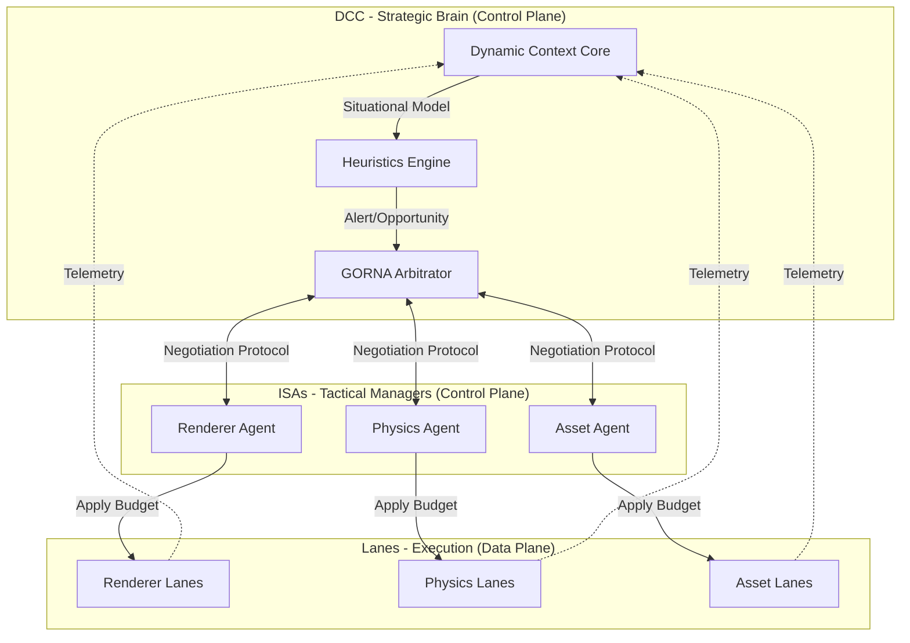
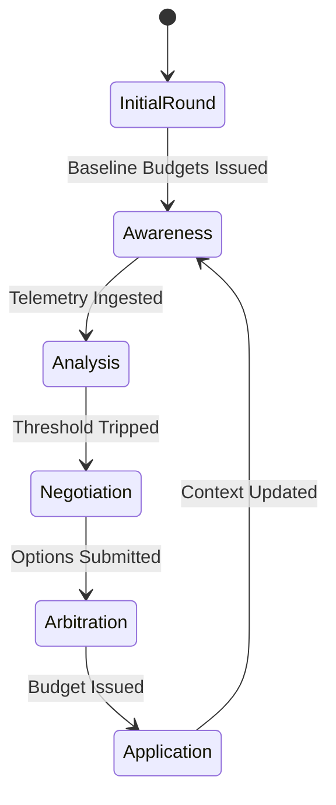
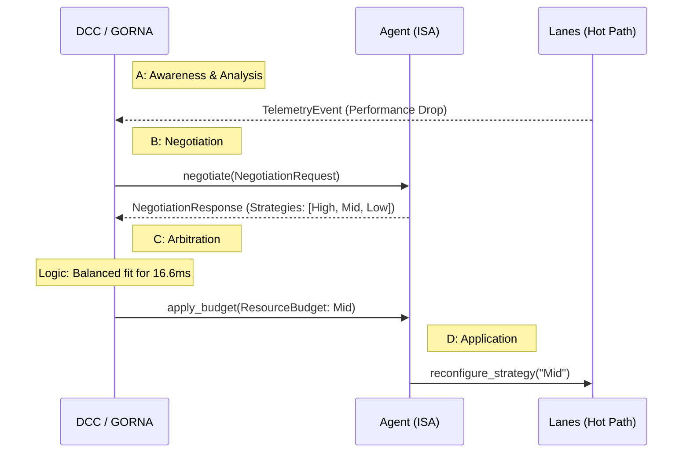

# 12 - GORNA Protocol Specification

The **Goal-Oriented Resource Negotiation & Allocation (GORNA)** protocol is the core mechanism by which KhoraEngine achieves engine-wide adaptivity. It moves away from hard-coded resource usage towards a marketplace-like negotiation between the engine core and its subsystems.

## 1. The Core Philosophy
GORNA operates on three fundamental principles:
1. **Utility-Based**: Subsystems don't just "request memory"; they offer "quality levels" (Strategies) and their associated costs.
2. **Global Optimization**: Only the DCC has the global view (Thermal, Battery, Phase) to decide which subsystem gets priority.
3. **Soft-Real-Time Contracts**: A "Budget" is a contract. If an Agent accepts a 16ms budget, it must guarantee execution within that time.

### Architectural Overview


## 2. Protocol Phases
The GORNA loop is a continuous cycle of sensing and adapting.



### Phase 0: Initial Round (Boot)
On the **first DCC tick after agents are registered**, the DCC forces a full GORNA negotiation round regardless of heuristic state. This ensures every agent receives a baseline `ResourceBudget` before telemetry-driven arbitration takes over.

Without this initial round, agents would remain throttled at their defaults indefinitely on healthy systems where no performance threshold is ever crossed.

### Phase A: Awareness (Telemetry)
Hot Paths (`Lanes`) emit `TelemetryEvents` (frametime, VRAM usage, draw calls). These are ingested by the `DccService`. Additionally, agents with a wired `Sender<TelemetryEvent>` (e.g., the `RenderAgent`) push `GpuReport` events directly into the DCC channel after their tactical `update()` work.

### Phase B: Analysis (DCC Heuristics)
The DCC analyzes trends. 
- *Ex: "GPU usage is at 98% and the device is warning of thermal pressure."*
- *Result: The DCC triggers a "Negotiation Event".*

### Phase C: Negotiation (The Handshake)
The DCC sends a `NegotiationRequest` to all registered `Agents`.



| Field | Description |
| :--- | :--- |
| `target_latency` | The absolute time slice allowed for this frame. |
| `priority_weight` | The current importance of this agent (determined by `ExecutionPhase`). |
| `constraints` | Hard limits (e.g., "Must stay under 2GB VRAM"). |

The `Agent` responds with a `NegotiationResponse` containing a list of `StrategyOptions`:
- **Strategy A (Ultra)**: 14ms, 4GB VRAM.
- **Strategy B (Balanced)**: 8ms, 2GB VRAM.
- **Strategy C (Low)**: 4ms, 1GB VRAM.

### Phase D: Arbitration (GORNA Logic)
The DCC runs the `Arbitrator`.
1. **Sum Costs**: If all "Ultra" strategies exceed the 16.6ms frame budget, the DCC must downgrade some agents.
2. **Prioritize**: Based on Phase (e.g., in `Simulation`, Physics gets its requested budget, Renderer is downgraded to "Balanced").
3. **Issue Budgets**: The DCC calls `apply_budget(ResourceBudget)` on each Agent.

### Phase E: Application (Strategy Switch)
The `Agent` reconfigures its `Lanes`. This might involve:
- Switching a shader variant.
- Changing LOD thresholds.
- Reducing the frequency of a simulation step.

## 3. Data Structures (Rust Pseudocode)

```rust
pub struct ResourceBudget {
    pub agent_id: AgentId,
    pub strategy_id: StrategyId,
    pub time_limit: Duration,
    pub memory_limit: Option<u64>,
}

pub struct AgentStatus {
    pub agent_id: AgentId,
    pub current_strategy: StrategyId,
    pub health_score: f32, // 0.0 - 1.0 (How well it adheres to budget)
    pub is_stalled: bool,
    pub message: String,
}
```

## 4. Advanced Heuristics & Conflict Resolution

### The "Death Spiral" Prevention
If multiple ISAs fail to meet their budgets, GORNA Enforces an "Emergency Stop" strategy across all agents to prevent engine-wide hangs.

### Thermal Pullback
As a device heats up, the DCC gradually reduces the `GlobalBudgetMultiplier`. 
- `Cooling`: 1.0x
- `Warm`: 0.9x
- `Throttling`: 0.6x (Strategic degradation of all non-critical ISAs).

## 5. Implementation Roadmap
- [x] **v0.1**: Static priority arbitration (Cold Path only).
- [x] **v0.2**: Dynamic weight calculation based on `ExecutionPhase`, situational hierarchy, and Hardware awareness (Thermal/CPU).
- [x] **v0.3**: Cost-based negotiation with `lane.estimate_cost()`, VRAM-aware filtering, health score reporting, and `GpuReport` telemetry integration.
- [ ] **v1.0**: Predictive arbitration using `MetricStore` trends and multi-agent resource bargaining.
