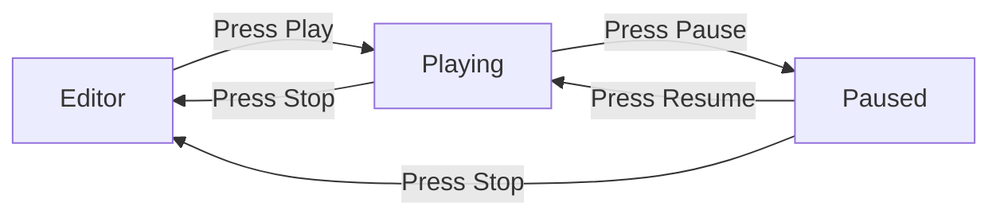

# Play Mode

Play mode transitions the engine from scene editing to full game simulation, with automatic world snapshot and restore.

## Architecture



## Editor Mode

| Aspect | Behavior |
|--------|----------|
| **Active agents** | RenderAgent, UiAgent |
| **Camera** | Editor camera (free orbit) |
| **Input** | Editor input (gizmos, selection) |
| **ECS** | Mutable — user edits directly |
| **Rendering** | Viewport texture + gizmos + overlay |

## Playing Mode

| Aspect | Behavior |
|--------|----------|
| **Active agents** | RenderAgent, PhysicsAgent, AudioAgent |
| **Camera** | Scene cameras (active ones) |
| **Input** | Game input (player controls) |
| **ECS** | Snapshot-based — original world is preserved |
| **Rendering** | Full scene, no editor chrome |

## Snapshot & Restore

When entering play mode, the world is serialized using the **Archetype strategy** (fastest):

```rust
// On Play:
let service = SerializationService::new();
let scene_file = service.save_world(&world, SerializationGoal::FastestLoad)?;
world_snapshot = Some(scene_file.to_bytes());

// On Stop:
let scene_file = SceneFile::from_bytes(&snapshot)?;
service.load_world(&scene_file, &mut world)?;
```

<div class="callout callout-warning">

**Physics state is NOT preserved.** When restoring, the physics engine rebuilds from component data. Velocities and contacts are reset to defaults.

</div>

## Mode Synchronization

The editor's `PlayMode` (Editing/Playing/Paused) is automatically synced with the engine's `EngineMode` (Editor/Playing):

```
Editor toolbar: ▶ Play
  → EditorState.play_mode = Playing
  → SDK detects change → set_mode(EngineMode::Playing)
  → Scheduler filters agents → Physics ✅, Audio ✅, UI ❌
```

## Agent Filtering by Mode

| Agent | Editor | Playing |
|-------|--------|---------|
| RenderAgent | ✅ | ✅ |
| UiAgent | ✅ | ❌ |
| PhysicsAgent | ❌ | ✅ |
| AudioAgent | ❌ | ✅ |

Agents declare `allowed_modes` in their `ExecutionTiming`. The Scheduler automatically filters — no manual enable/disable needed.
