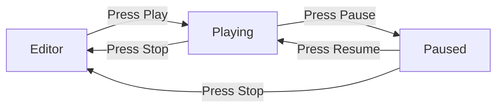

# Editor

The editor application — panels, gizmos, play mode, scene I/O.

- Document — Khora Editor v1.0
- Status — Authoritative
- Date — May 2026

---

## Contents

1. What the editor is
2. Workspace anatomy
3. Modes
4. Play mode
5. Scene I/O
6. Gizmos and selection
7. Build Game
8. The Control Plane
9. For game developers
10. For engine contributors
11. Decisions
12. Open questions

---

## 01 — What the editor is

`khora-editor` is a separate binary built on the SDK. It opens a project (a folder containing `.kscene` files and assets), authors scenes through ECS-aware panels, and previews them with **play mode** — a one-button switch between editing and full simulation.

The editor is not a separate engine. It uses the same agents, lanes, and ECS as a shipping game. What changes is *which agents run* (Editor mode runs Render, Shadow, UI; Playing mode adds Physics and Audio) and *what the panels do on top of the world*.

The visual language — colors, typography, panels, voice — is documented in [Editor design system](./design/editor.md). This chapter covers the **architecture**, not the look.

## 02 — Workspace anatomy

```
+--------------------------------------------------------------+
| Title bar — brand, project name, window controls            |
+----+----------------------------------------------+----------+
|    |                                              |          |
| Sp |               Viewport                       | Inspect  |
| in |                                              | -or      |
| e  |                                              |          |
|    |                                              |          |
+----+----------------------------------------------+----------+
| Bottom dock: Assets · Console · GORNA stream                |
+--------------------------------------------------------------+
| Status bar — engine state, FPS, build status                |
+--------------------------------------------------------------+
```

| Region | Purpose |
|---|---|
| **Title bar** | Brand, project name, window controls |
| **Spine** | Mode rail (Scene / Canvas / Graph / Animation / Shader / Control Plane) |
| **Hierarchy** | Tree of entities, left of the viewport |
| **Viewport** | The 3D scene with floating gizmos |
| **Inspector** | Components of the selected entity, right of the viewport |
| **Bottom dock** | Assets browser, console, GORNA stream |
| **Status bar** | Engine state, FPS, build status, GORNA pulse |

Full anatomy and pixel-level layout in [Editor design system](./design/editor.md).

## 03 — Modes

The Spine offers six modes:

| Mode | Purpose |
|---|---|
| **Scene** | 3D editing (default) |
| **Canvas** | 2D layout and UI |
| **Graph** | Node-based logic and shader |
| **Animation** | Timeline and curves |
| **Shader** | Code editor with live preview |
| **Control Plane** | Engine telemetry and GORNA stream |

Each mode has its own panel layout. We commit to opinionated defaults — Unity and Unreal let you arrange panels freely, and most users keep the defaults forever. We pick the layouts users won't want to change.

## 04 — Play mode



When you press **Play**:

1. The current world is serialized using `SerializationGoal::FastestLoad` (Archetype strategy).
2. The snapshot is stored in memory.
3. The editor's `PlayMode` (UI-state) becomes `Playing`.
4. `EngineMode` switches from `Custom("editor")` to `Playing` — `PhysicsAgent` and `AudioAgent` start running, `UiAgent` stops.
5. The play camera takes over from the editor camera.

When you press **Stop**:

1. The editor's `PlayMode` becomes `Editing`.
2. `EngineMode` switches back to `Custom("editor")`.
3. The snapshot is deserialized into the world.
4. The editor camera resumes.

The snapshot is fast — milliseconds for a 10 000-entity scene — because Archetype strategy serializes ECS pages directly. See [Serialization](./14_serialization.md).

| Aspect | Editor (`Custom("editor")`) | Playing (`Playing`) |
|---|---|---|
| Active agents | Render, Shadow, UI | Render, Shadow, Physics, Audio |
| Camera | Editor camera (free orbit) | Scene cameras (active ones) |
| Input | Editor input (gizmos, selection) | Game input (player controls) |
| ECS | Mutable — user edits directly | Snapshot-based — original world preserved |
| Rendering | Viewport texture + gizmos + overlay | Full scene, no editor chrome |

> **Two enums, two scopes.** `PlayMode` (`Editing` / `Playing` / `Paused`) is the editor's UI state — it drives buttons, panel visibility, and what the user sees. `EngineMode` (`Playing` / `Custom("editor")` / other) is the engine's filter for agent execution. The editor application bridges them: user clicks Play → editor sets `PlayMode::Playing` → editor requests `EngineMode::Playing` from the engine.

> **Physics state is not preserved across play mode.** Velocities, contacts, and sleep state are reset on restore. The ECS components are restored exactly; the physics world rebuilds from those components.

## 05 — Scene I/O

The editor uses `SerializationService` for all scene operations. As of v0.4 it goes through `ProjectVfs` (the editor's wrapper around `khora_io::AssetService` + `AssetWatcher`), so saves and loads inside the project use the same UUID identity that a release pack would:

| Action | What happens |
|---|---|
| **Open project** | `ProjectVfs::open` recursively scans `<project>/assets/`, builds the in-memory UUID index, registers all decoders, arms a filesystem watcher. The asset browser reads off the resulting VFS. |
| **New scene** | Editor creates an empty world, ready for editing |
| **Save scene** | Encoded with `SerializationGoal::EditorInterchange` (Recipe — compact, structured) and written via `AssetWriter` so the new file enters the VFS index immediately |
| **Save scene as** | Same, with a new path. Out-of-project paths fall back to raw `std::fs` and log a warning. |
| **Load scene** | Double-click a `.kscene` in the asset browser, or File → Open. Project-internal paths route through `AssetService::load_raw` (UUID-keyed). |
| **Play / Stop** | World snapshot + restore via `SerializationService` with `FastestLoad` (Archetype — no human-readable round-trip needed for in-memory revert). |

Scene files are compact-binary in development today. RON dumps for diffing are available through `SerializationGoal::HumanReadableDebug` — not yet wired to a menu, but the strategy is registered in the service.

## 06 — Gizmos and selection

The viewport has floating gizmos for the selected entity:

- **Move** — three-axis arrows + center sphere for screen-space drag.
- **Rotate** — three rings, one per axis.
- **Scale** — three handles + uniform-scale center.

Selection is tracked in `EditorState.selected_entity`. Clicking an entity in the hierarchy or the viewport sets it; `Esc` clears it. Selected entities get a 2 px gold inner-stroke outline (1 px dark outer stroke), visible against any background.

Numeric fields in the Inspector are draggable scrubbers — drag horizontally to change a value, modifier keys for precision. No spinner buttons.

## 07 — Build Game

`Build → Build Game…` packages the open project for a target OS. The editor picks one of two **strategies** automatically, based on the presence of `<project>/Cargo.toml`:

### Strategy A — Runtime stamp (default, data-only projects)

Used when the project has no `Cargo.toml` — the typical state for a fresh project from the hub.

1. **Pack** — `khora_io::asset::PackBuilder` walks `<project>/assets/` (sorted by forward-slash relative path), assigns `AssetUUID::new_v5(rel_path)` to each file, and writes the two-file release layout: `data.pack` (16-byte header + concatenated asset bytes) + `index.bin` (`Vec<AssetMetadata>` with each variant rewritten to `AssetSource::Packed { offset, size }`).
2. **Stamp runtime** — the editor copies the pre-built `khora-runtime` for the chosen target into the output directory and renames it after the project. The runtime binary lives next to the editor (release-archive layout) or in the hub's `~/.khora/engines/<version>/runtime/` cache.
3. **Write `runtime.json`** — read by the runtime at boot to learn which scene to auto-load.

Cross-platform is trivial: the pre-built runtime exists for every target shipped by `release.yml`, so building Linux from a Windows host is just a file copy.

### Strategy B — Cargo build (native-Rust projects)

Used when the user has clicked **"Add Native Code"** on the project's hub card, which scaffolds `Cargo.toml` + `src/main.rs` (calling `khora_sdk::run_default()` by default — same as the runtime, but linked into a binary that *can* register custom components / agents / lanes when the user edits `main.rs`).

1. Same `PackBuilder` step as Strategy A.
2. `cargo build --release --manifest-path <project>/Cargo.toml` compiles the user's binary. stdout / stderr stream into the editor's console panel.
3. The compiled binary is copied into the output directory under the project name.
4. Same `runtime.json` companion is written.

Host-only in v1 (Rust cross-compilation is fragile without per-target toolchains). The editor refuses non-host targets on this strategy with a clear error pointing the user to "run the editor on the target OS".

### Output layout (identical between strategies)

```
<project>/dist/<target>/
├── <project_name>{.exe}     # renamed khora-runtime OR compiled user binary
├── data.pack
├── index.bin
└── runtime.json
```

Run the binary directly — both `khora-runtime` and any project compiled via `khora_sdk::run_default()` auto-detect PackLoader (when `data.pack` + `index.bin` are siblings) or FileLoader (when a loose `assets/` directory is a sibling instead, used by engine contributors who want to skip packing during iteration).

### Why two strategies

The choice is **deterministic** (presence of `Cargo.toml` is the contract) and **opt-in** (the user explicitly upgrades a project to native Rust by clicking the hub button). Most projects stay on Strategy A and benefit from trivial cross-platform export. Strategy B is the escape hatch when raw performance, compile-time safety, or new engine primitives are needed. Future scripting (`assets/scripts/`, hot-reloadable, see `12_assets.md`) plugs into both strategies transparently — scripts are just assets that get packed.

## 08 — The Control Plane

The sixth Spine mode is the **Control Plane** — a workspace dedicated to the engine's mind.

| Region | Purpose |
|---|---|
| **Lane Timeline** (top) | Horizontal lanes per subsystem, execution windows as colored bands |
| **GORNA Stream** (bottom-left) | Live feed of negotiation: timestamp, subsystem, suggestion, accept/reject |
| **Meters Wall** (bottom-right) | Frame time, GPU %, memory, agent budget, assets pending |

The Control Plane is not a profiler popup. It is a first-class workspace. The whole pitch of Khora is the self-optimizing architecture; the editor surfaces that intelligence as a place you go to, not a window you launch.

Full design in [Editor design system](./design/editor.md), section 09.

---

## For game developers

You typically run the editor against your project folder:

```bash
cargo run -p khora-editor -- --project /path/to/my_project
```

Inside the editor, you author scenes. Each scene is one `.kscene` file. Spawn entities by dragging a vessel from the Assets panel into the viewport, or by right-clicking in the hierarchy → Add Entity. Edit components in the Inspector. Save with `Ctrl+S`.

To preview your scene in play mode, press the Play button. Your `EngineApp::update` runs every frame, exactly as in your shipping game.

## For engine contributors

The editor is implemented as a set of `EnginePlugin`s — each panel registers callbacks at the appropriate `ExecutionPhase`:

| Folder | Contents |
|---|---|
| `crates/khora-editor/src/panels/` | Scene tree, properties, asset browser, viewport, console, GORNA stream |
| `crates/khora-editor/src/gizmos/` | Move / rotate / scale, selection outline |
| `crates/khora-editor/src/ops/` | High-level scene operations (spawn, despawn, parent, add component) |
| `crates/khora-editor/src/scene_io/` | Scene save / load via `SerializationService` |
| `crates/khora-editor/src/state.rs` | `EditorState` — selection, mode, pending operations |

To add a panel: implement the panel render function, register it as an `EnginePlugin` in the editor's main plugin list. Panels read `EditorState` and the world; they mutate through `ops/` operations to keep the action layer clear.

To add a gizmo type: add a render path in `gizmos/` that draws the gizmo for the selected entity, plus an interaction handler in `ops/` that converts mouse drags into `Transform` mutations.

The editor depends directly on `khora-agents` and `khora-io` for performance — it bypasses the SDK in places. This is a known trade-off (see Decisions).

## Decisions

### We said yes to
- **Editor as a separate binary.** The editor is a different application from a shipping game — different lifecycle, different active agents, different input.
- **Mode-first layouts.** Opinionated defaults beat infinite customization for 95% of users.
- **Play mode through scene snapshot.** Press Play, run the game; press Stop, you are back where you were. No state pollution.
- **Editor reaches into `khora-agents` and `khora-io`.** Pragmatic shortcut for performance. The SDK is the public API for *games*; the editor is privileged.

### We said no to
- **Free-form panel docking.** Powerful but exhausting. We pick layouts users won't want to change.
- **Telemetry charts in the main UI.** Telemetry belongs in the Control Plane mode. Scene mode shows the scene.
- **Editor chrome during play mode.** Play mode is a near-shipping preview. Chrome reappears on stop.

## Open questions

1. **Multi-window.** How does Spine + Modes work when the user pops the viewport to a second monitor? Likely the popped window keeps its own Spine, with one mode lit.
2. **Plugin UI surface.** Third-party plugins need a place to live — probably the Inspector as additional component cards, but the contract is undefined.
3. **Collaboration.** Real-time multi-user editing (shared cursors, shared selections) is on no roadmap, but the architecture does not preclude it.

---

*Next: writing your own agent or lane. See [Extending Khora](./19_extending.md).*
