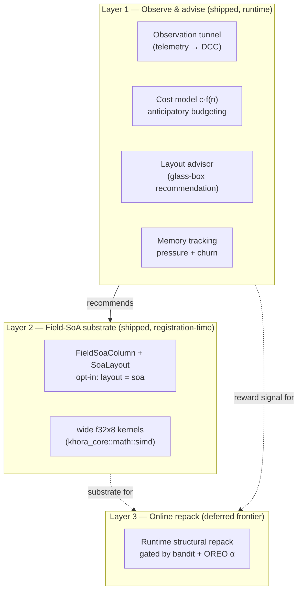
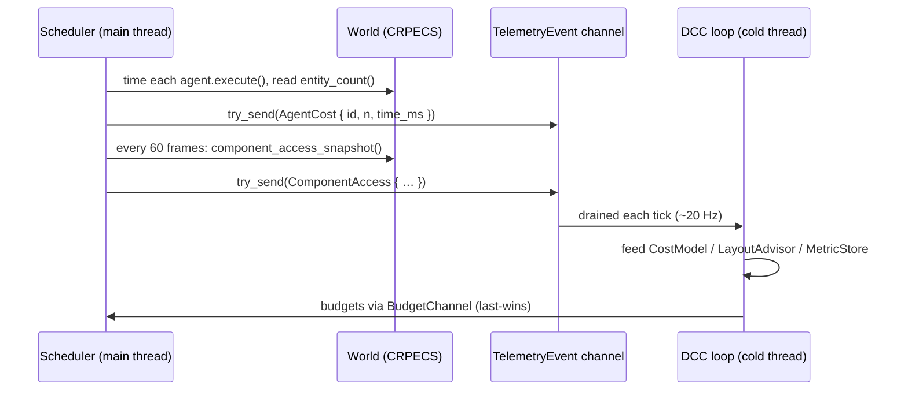
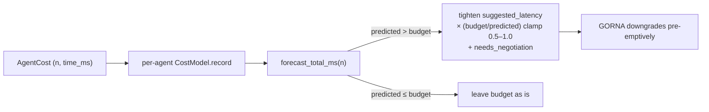
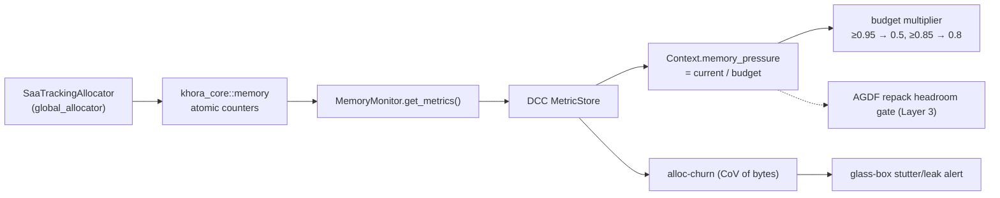
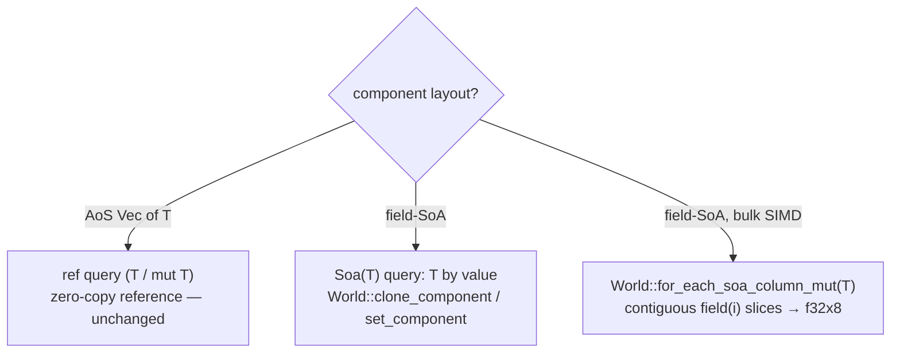

# Adaptive Game Data Flows (AGDF)

How Khora adapts the *representation* of its data — never its meaning — and the
optimizations that ride on top of it.

- Document — Khora AGDF v1.0
- Status — Active
- Date — May 2026

---

## Contents

1. What AGDF is (and is not)
2. The three-layer model
3. Layer 1 — the observation tunnel
4. Layer 1 — anticipatory budgeting (cost model)
5. Layer 1 — the layout advisor
6. Layer 1 — memory tracking with teeth
7. The performance lever — field-SoA + explicit SIMD
8. Layer 2 — persistent field-SoA storage
9. The decision core — bandits and gates
10. Layer 3 — online repack (the deferred frontier)
11. Developer guide
12. Verification
13. Prior art and references

---

## 01 — What AGDF is (and is not)

**AGDF = Adaptive Game Data Flows.** It is the online adaptation of the *data
layout* of the ECS — laying component storage out for the access pattern and the
hardware (field-split SoA, SIMD tiling, hot/cold splitting) instead of one fixed
representation.

The single organizing rule of the whole Symbiotic Adaptive Architecture applies:

> **Adapt the HOW, never the WHAT.** Automatic adaptation may change the
> *representation* — strategy, quality, memory layout — but never the game
> *semantics* (which components an entity has, how the simulation behaves).

| | **HOW** (representation) | **WHAT** (semantics) |
|---|---|---|
| Examples | Forward+ ↔ Unlit, 30 ↔ 120 Hz, **SoA ↔ field-SoA layout** | detaching a `RigidBody`, merging entities, dropping component data |
| Gameplay effect | **none** (identical observable result) | **changes** the simulation |
| Who decides | the engine, automatically | the developer, always |

So **GORNA** adapts the HOW for *strategies*; **AGDF** adapts the HOW for *data
layout* — the data-layer twin of GORNA, governed by the same MAPE-K loop. AGDF
is **not** distance-based gameplay gating (detaching physics far from the
camera); that changes the WHAT and is opt-in, developer-authored policy.

**The industry gap Khora targets.** Every mainstream archetype ECS (Unity DOTS,
Unreal Mass, Bevy, flecs) stores components *SoA-across-entities, AoS-within-the-
component* — one contiguous array of whole structs. The unexploited layer is the
*field* level, and **no shipping engine adapts layout online**. AGDF operates
exactly there.

---

## 02 — The three-layer model

Reading the prior art (academic + shipping engines + cross-domain systems)
resolved AGDF into three layers, shipped in this order:



- **Layer 1 — observe & advise** *(runtime, shipped).* The DCC watches the data
  layer through a read-only telemetry tunnel: per-agent cost samples feed a
  forecasting cost model, per-component access stats feed a layout advisor, and
  the tracking allocator feeds a memory-pressure signal. The DCC **observes and
  advises**; it never mutates the Data layer (CLAD: Data self-optimizes).
- **Layer 2 — field-SoA substrate** *(registration-time, shipped).* A component
  can opt into a field-split column (`#[component(layout = "soa")]`) consumed by
  explicit-SIMD kernels — the ~4× lever. The layout is chosen per component at
  registration (industry-standard); the rest of CRPECS is untouched.
- **Layer 3 — online repack** *(deferred).* Flipping a populated component's
  layout at runtime, driven by the learned decision core. Deferred for a sound
  reason (see §10); the decision primitives are built and ready.

---

## 03 — Layer 1: the observation tunnel

The DCC runs on a **cold thread** and never holds `&World`. Everything it learns
about the Data layer travels as `TelemetryEvent`s into its `MetricStore`;
budgets travel back through the last-wins `BudgetChannel`. AGDF extends that
existing tunnel with two events, published by the scheduler from the main thread
(non-blocking `try_send` — telemetry never stalls the frame):

| Event | Carries | Published |
|---|---|---|
| `TelemetryEvent::AgentCost` | `{ id, n, time_ms }` | per agent, every frame |
| `TelemetryEvent::ComponentAccess` | `{ type_name, size_bytes, query_count, rows_scanned }` | every 60 frames (cumulative, slow-moving) |



The workload size `n` is the live entity count (`World::entity_count`); the
access snapshot joins the registry's per-component `AccessCounters`
(`query_count`, `rows_scanned`) with `size_of` and the type name
(`World::component_access_snapshot`).

---

## 04 — Layer 1: anticipatory budgeting (cost model)

A reactive controller only acts *after* a frame overruns. AGDF makes the DCC
*predictive*: it fits each agent's measured `(n, time)` to a complexity class
and forecasts the breach.

`CostModel` (`khora-control/src/cost_model.rs`) fits a constant factor `c` to
each candidate class `f(n)` ∈ { `1`, `n`, `n·log n`, `n²` } by least squares and
keeps the best fit — the same shape a database query optimizer uses (cardinality
× per-row cost). The DCC keeps one model per agent, fed from `AgentCost`:



When the combined forecast at the current workload exceeds the frame budget, the
DCC tightens the target latency *before* the frame actually overruns, so GORNA
selects cheaper strategies in advance. The arbitrator is untouched — the logic
is contained in the cold loop ("model proposes, measurement disposes").

---

## 05 — Layer 1: the layout advisor

The advisor turns the live access counters into an actionable, **read-only**
layout recommendation per component — the glass-box half of AGDF that works
today (no repack required). It lives in the Data layer
(`khora_data::ecs::layout::LayoutAdvisor`); the DCC runs it from `ComponentAccess`
telemetry and surfaces the result via `DccService::layout_recommendations()`
(e.g. for the editor's Control-Plane panel).

```rust
pub enum LayoutRecommendation {
    KeepSoa,        // default column is fine
    SimdFieldSoa,   // lean component swept in large batches → field-SoA + SIMD
    HotColdSplit,   // fat component → split hot fields from cold
}
```

The thresholds encode the engine's own benchmark findings (see §07): the
field-SoA/SIMD lever pays on *large, compute-bound* batches; the hot/cold split
pays on *fat* components; Khora's lean built-ins want neither. **CLAD invariant:
Control observes and advises; Data owns its layout — the DCC never repacks.**

---

## 06 — Layer 1: memory tracking with teeth

`SaaTrackingAllocator` wraps the system allocator and counts every allocation
into the global atomics in `khora_core::memory`. The `MemoryMonitor` exposes
those counters as named metrics (`memory.current_bytes`, `…lifetime`,
`net_allocations`) through the normal telemetry push pipeline, where the DCC
turns them into **decisions**, not just a readout:



1. **Memory pressure → budget.** With a budget set (`DccConfig::memory_budget_bytes`),
   the DCC derives `Context::memory_pressure` and degrades the global budget
   multiplier as the ceiling approaches — a first-class resource signal beside
   thermal/CPU/GPU. Unset budget ⇒ pressure 0 ⇒ no effect (chiefly useful on
   memory-constrained targets).
2. **Allocation churn → glass-box.** High volatility of resident bytes
   (coefficient of variation per window) raises an alert flagging a likely
   per-frame allocation hotspot — a real frame-hitch cause.
3. **Repack-headroom gate.** Layer 3's repack would read `memory_pressure` to
   decline a repack (which transiently doubles a column) under tight memory.

---

## 07 — The performance lever: field-SoA + explicit SIMD

The reason layout matters at all. A normal CRPECS column is `Vec<T>` —
*Array-of-Structures within the component*:

```text
AoS column (Vec<Transform>):   [ t0 r0 s0 | t1 r1 s1 | t2 r2 s2 | … ]
                                 a whole struct per slot; a loop over one field
                                 strides over the others → wasted cache + SIMD

field-SoA column:   tx[ x0 x1 x2 … ]  ty[ … ]  tz[ … ]  qx[ … ] …
                    one contiguous f32 stream per field → tiles into f32x8
                    with no gather (the "resident" layout)
```

The engine ships `wide`-based (`f32x8`, stable Rust) batch kernels in
`khora_core::math::simd` (`compose_trs_to_mat4`, `normalize_quat_batch`, with
scalar twins). The benchmark `crates/khora-data/examples/layout_bench.rs`
measured, on this machine:

| Kernel | Layout | Result |
|---|---|---|
| `normalize_quat_batch` | in-place field-SoA | **4.25×** vs scalar — a win |
| compute-heavy normalize | AoSoA auto-vec / SoA + explicit `f32x8` | 2.9× / **4.1×** |
| `compose_trs_to_mat4` | SoA in → **AoS `Mat4` out** | **0.9×** — a *loss* |

> **The key lesson.** The SIMD win is a **whole-pipeline property**: it holds
> only while the data stays field-SoA *resident*. The same `f32x8` math wins
> big in place but **loses** the moment it must scatter back to an AoS result,
> because the per-lane transpose dominates the cheap arithmetic. This is why
> Layer 2 makes the field-SoA storage *persistent*, rather than transposing in
> and out each frame, and why auto-vectorization alone caps near ~2.9× (the
> floating-point reduction in `normalize`/`sqrt` is non-associative, so the
> compiler may not lane it — explicit SIMD recovers the rest).

---

## 08 — Layer 2: persistent field-SoA storage

This is the substrate that lets a compute kernel stay resident. It is **opt-in
per component**, integrated *into* CRPECS (not a parallel store), and bit-
identical to before for every component that doesn't opt in.

### The integration seam — five `Component` hooks

A component declares how its column is created, written, migrated, read, and
overwritten. All five default to the AoS `Vec<T>` path (unchanged); a field-SoA
component overrides them (generated by the macro):

```rust
pub trait Component: Clone + 'static + Send + Sync {
    fn make_column() -> Box<dyn AnyVec>;                 // default: Vec<Self>
    fn push_into_column(self, col: &mut dyn AnyVec);
    fn copy_row_between(src: &dyn AnyVec, row: usize, dst: &mut dyn AnyVec);
    fn clone_from_column(col: &dyn AnyVec, row: usize) -> Self;   // by value
    fn set_in_column(self, col: &mut dyn AnyVec, row: usize);     // by value
}
```

`registry` and `bundle` route *all* column creation/push/copy through these, so
CRPECS storage stays a `Box<dyn AnyVec>` either way — only the concrete column
type behind it changes.

### The column — `FieldSoaColumn<T>`

One contiguous `Vec<f32>` per component field, behind the same `AnyVec` as any
column (so pages, domains, despawn/migration, and serialization are untouched —
its `to_bytes`/`set_from_bytes` round-trip a self-consistent field-major
format). The macro generates the tiny per-type `SoaLayout` (`scatter_push` /
`scatter_set` / `gather`) the generic column needs.

### Access — by value or in bulk

A field-SoA component can't yield `&T` (its bytes are split across field arrays,
not a contiguous `T`), so the access path differs by layout:



AoS components keep `&T` exactly as before. A `&T` query on a field-SoA component
panics with a clear message (documented misuse) — use `Soa<T>` instead.

### Opting in

```rust
#[derive(Debug, Clone, Copy, Default, Component)]
#[component(domain = Physics, layout = "soa")]
#[repr(C)]
pub struct Particle {
    pub x: f32, pub y: f32, pub z: f32,
    pub vx: f32, pub vy: f32, pub vz: f32,
}
```

v1 supports structs whose fields are all `f32` (a non-`f32` field is a compile
error). That is exactly how data-oriented hot components are written; richer
field types (`Vec3`, `Quat`) decomposing into several `f32` lanes is a future
macro extension, not needed for the lever.

---

## 09 — The decision core: bandits and gates

AGDF's brain is a MAPE-K autonomic loop (Kephart & Chess, 2003): **M**onitor
(access counters, frame timings) → **A**nalyze (cost model) → **P**lan (the
bandit + gates) → **E**xecute (repack — Layer 3) over shared **K**nowledge. The
planning primitives live in `khora_data::ecs::layout`, all **deterministic** (no
RNG → reproducible decisions):

| Primitive | Role | Prior art |
|---|---|---|
| `Ucb1` | textbook upper-confidence-bound bandit | Auer et al. 2002 |
| `SlidingWindowUcb1` | non-stationary variant (a game session changes phase) | Garivier & Moulines 2011 |
| `DecayCounter` | evaporating (recency-weighted) access tally | stigmergy / discounted counts |
| `net_reward(benefit, migration_cost)` | folds the repack cost into the reward → anti-thrash | C-UCB / "DBA bandits" |
| `should_switch(incumbent, challenger, hysteresis)` | the dwell/α-gate | OREO α-counter; switched-system hysteresis |
| `LayoutAdvisor` | access stats → recommendation (§05) | Chilimbi; the Data Calculator |

A bandit only learns by *trying* each layout and measuring throughput — which
requires a runtime repack. Until Layer 3 lands, the bandit gets its real reward
signal offline in `layout_bench`; the primitives are ready for the online loop.

---

## 10 — Layer 3: online repack (the deferred frontier)

Flipping a *populated* component's layout at runtime is consciously deferred —
for a sound reason, not for lack of effort:

> The query contract is **fixed at compile time**: an AoS component is read as
> `&T`, a field-SoA component as `Soa<T>`. Flipping a populated component
> AoS↔SoA at runtime would break every `&T` that referenced it. And a bandit
> cannot *learn* a layout online without trying it (which needs the repack) —
> circular. The only sound runtime repack is *within* the SoA family (plain ↔
> AoSoA tiling), whose benefit is marginal for pure streaming.

So Layer 2's **registration-time** layout choice (the whole industry's approach)
is what ships, and Layer 3 stays the documented frontier. The design anchors are
recorded for when it is justified: **OREO**'s α-counter (online reorg as a
Metrical Task System, with a provable competitive bound and built-in
hysteresis), the **V8/HotSpot speculate → cheap-guard → deoptimize** pattern for
safety (a wrong layout guess costs speed, never correctness), and cross-domain
bets to test — a reuse-distance cost model (predict a layout's miss rate without
repacking), SimPoint-style phase detection (re-evaluate only on workload phase
change), and an AutoFDO/BOLT-style shipped layout profile (warm-start from a
playtest).

---

## 11 — Developer guide

**Read engine adaptation state (glass-box).**

```rust
// Per-component layout advice the DCC derived from access telemetry.
for (component, rec) in dcc.layout_recommendations() {
    println!("{component}: {rec:?} — {}", rec.reason());
}
```

**Opt a hot, compute-heavy component into field-SoA** — `#[component(layout =
"soa")]` (§08), all-`f32` fields. Query it by value with `Soa<T>`, or process it
in bulk for SIMD:

```rust
// Bulk SIMD-style update over the contiguous `x` field array.
world.for_each_soa_column_mut::<Particle>(|col| {
    for x in col.field_mut(0) { *x += dt; }
});
```

**Use the SIMD kernels directly** (`khora_core::math::simd`) for batched
transform/quaternion math; keep the data field-SoA *resident* across the loop —
do not transpose in and out (§07).

**Set a memory budget** to enable memory-pressure budgeting on a constrained
target: `DccConfig { memory_budget_bytes: Some(…), .. }`.

**Rule of thumb.** Most components should stay AoS (`&T` queries, zero-copy).
Reach for `layout = "soa"` only for a *large, compute-bound, all-`f32`* hot
component — exactly what the advisor flags as `SimdFieldSoa`.

---

## 12 — Verification

- `cargo test --workspace` — the AGDF units (cost model, SW-UCB, decay counter,
  advisor, `FieldSoaColumn` round-trip, the SoA `World` lifecycle integration
  test) run here; the default AoS path is asserted bit-identical.
- `cargo run -p khora-data --example layout_bench --release` — reproduces the
  resident-vs-scatter numbers in §07 (the shipped kernels, not throwaway code).
- `cargo test -p khora-core math::simd` — the `f32x8` kernels match their scalar
  twins to `EPSILON`, with the exact affine constants the conversion asserts.

---

## 13 — Prior art and references

AGDF's contribution is *unifying* models proven in other domains into a game
ECS, governed by the DCC — not inventing memory that optimizes itself.

- **Layout / SIMD:** LLAMA (layout as an exchangeable compile-time mapping),
  Cabana / Kokkos (AoSoA in HPC), Chilimbi (PLDI'99) + Pettis–Hansen (PLDI'90)
  (hot/cold splitting), `wide` / the State of SIMD in Rust 2025.
- **Online reorganization:** OREO (ICDE'24, Metrical Task Systems), database
  cracking (Idreos), Just-in-Time Data Structures (De Wael & Marr 2015).
- **Decision / control:** UCB1 (Auer 2002), SW-UCB (Garivier & Moulines 2011),
  switching-cost bandits (Dekel et al.), MAPE-K (Kephart & Chess 2003), the
  speculate-guard-deopt pattern (HotSpot / V8).

See also: [ECS — CRPECS](./05_ecs.md), [GORNA](./08_gorna.md),
[Telemetry](./15_telemetry.md), [Decisions](./decisions.md),
[Open questions](./open_questions.md).
