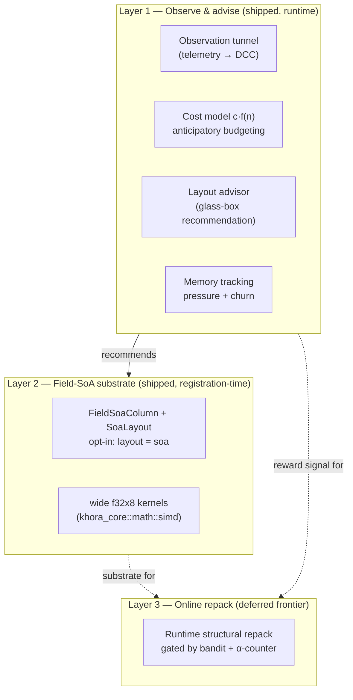

# AGDF: adaptive data layout

**AGDF** — *Adaptive Game Data Flows* — is how Khora adapts the *representation* of
its ECS data to the hardware and the access pattern, without ever changing what the
data *means*. This page opens with a short overview anyone can follow, then drops
into a deep dive for engine contributors. For the steps to opt a component into a
SoA layout, see [How-to: add a component](../how-to/add-a-component.md); for the
storage model it builds on, [Data and the ECS](./ecs.md).

---

## In one minute

**AGDF is runtime data-layout adaptation.** Component storage can be laid out for
the access pattern and the hardware — a field-split SoA stream for a compute-bound
batch, plain array-of-structures for everything else — instead of one fixed
representation chosen once and forever.

It is governed by a single guarantee that runs through the whole Symbiotic Adaptive
Architecture: **adapt the HOW, never the WHAT.** A layout change rewrites *how* a
component's bytes are stored; it never changes *what* components an entity has or how
the simulation behaves. Switching a column from AoS to field-SoA produces a bit-
identical observable result. Detaching a `RigidBody`, by contrast, changes the
simulation — so that is the WHAT, and AGDF never touches it. (Distance-based gameplay
gating, like dropping physics far from the camera, is *not* AGDF; it is opt-in,
developer-authored policy.)

AGDF resolves into three layers, shipped in order. **Layer 1** observes and advises:
the DCC watches the data layer through a read-only telemetry tunnel and produces a
per-component layout recommendation, but never mutates the data. **Layer 2** is the
field-SoA substrate: a component can opt into a field-split column at registration
time and feed explicit-SIMD kernels — the performance lever, and what actually ships
as adaptable storage today. **Layer 3** is online repack — flipping a populated
component's layout at runtime — which is a documented frontier, deliberately
deferred. That is the whole idea; the rest of this page is for contributors who need
the mechanism.

---

## Deep dive

### The industry gap, and the three-layer model

Every mainstream archetype ECS (Unity DOTS, Unreal Mass, Bevy, flecs) stores
components SoA-across-entities but AoS-within-the-component — one contiguous array of
whole structs. The unexploited level is the *field*, and no shipping engine adapts
layout online. AGDF operates exactly there, governed by the DCC and the same MAPE-K
loop that governs [GORNA](./gorna.md): GORNA adapts the HOW for *strategies*, AGDF
adapts the HOW for *data layout*.



### Layer 1 — observe and advise

The DCC runs on a cold thread and never holds `&World`. Everything it learns about
the data layer travels as telemetry into its metric store; budgets travel back
through the last-wins channel. AGDF extends that existing tunnel with two events the
scheduler publishes from the main thread by non-blocking `try_send` (telemetry never
stalls the frame): a per-frame agent-cost sample `{ id, n, time_ms }`, and a slow-
moving per-component access snapshot `{ type_name, size_bytes, query_count,
rows_scanned }` emitted every 60 frames. The workload size `n` is the live entity
count.

Three consumers ride that tunnel:

- **The cost model** fits each agent's measured `(n, time)` to a complexity class
  (`1`, `n`, `n·log n`, `n²`) by least squares and forecasts the breach. When the
  combined forecast at the current workload exceeds the frame budget, the DCC
  tightens the target latency *before* the frame overruns, so GORNA selects cheaper
  strategies in advance, and the same measured costs calibrate agent quotes inside
  arbitration. This is the predictive half of the budget loop — see
  [GORNA](./gorna.md).
- **The layout advisor** turns the live access counters into a read-only
  recommendation per component — `KeepSoa`, `SimdFieldSoa`, or `HotColdSplit`. Its
  thresholds encode the engine's own benchmark findings: the field-SoA/SIMD lever
  pays on large, compute-bound batches; the hot/cold split pays on fat components;
  the lean built-ins want neither. This is the glass-box half of AGDF that works
  today with no repack — it advises, and a contributor or the editor's control panel
  reads the advice. The CLAD invariant holds throughout: Control observes and
  advises, Data owns its layout, the DCC never repacks.
- **Memory tracking** wraps the system allocator and exposes resident bytes,
  lifetime allocations, and net allocations as telemetry. With a budget configured,
  the DCC derives a `memory_pressure` signal that sits alongside thermal/CPU/GPU;
  at/above 0.95 it imposes the same hard safety cap the GORNA controller uses, and
  high allocation churn raises a glass-box alert flagging a likely per-frame
  allocation hotspot.

### Flow view caching — per-domain change epochs

The first piece of data-*flow* adaptation that shipped at runtime is a literal
application of the organizing rule. Flows are read-only projectors: every Substrate
Pass they re-derive a View from the World and publish it to the bus. Most frames,
nothing the projection reads has changed, so re-running it is pure waste — and a
cached View is bit-identical to a freshly projected one, so skipping the work changes
only the HOW, never the WHAT.

Two pieces close the gap. The `World` keeps a [per-domain change epoch](./ecs.md), a
monotonic counter bumped O(1) at every mutation that can affect a domain's *semantic*
content; equal epochs guarantee "unchanged", a bump means only "possibly changed"
(conservative by design), and a representation-only AGDF layout change does **not**
bump it. A flow that can name all of its inputs returns a `cache_key` combining the
World's instance id and the relevant domain epochs (plus any runtime fingerprint,
like the editor viewport override, that has no ECS epoch); on a key match the runner
republishes the previous View as a cheap clone instead of re-projecting. Which flows
opt in is an honest audit of their inputs — `AudioFlow`, `RenderFlow`, and
`ShadowFlow` cache; `UiFlow` and `PhysicsFlow` do not, because their inputs (surface
size, hot-reloadable fonts, a simulation that mutates every frame) have no signal a
key could fold in.

### Layer 2 — the field-SoA substrate, and why it is the lever

A default CRPECS column is `Vec<T>` — array-of-structures *within* the component, so
a loop over one field strides over all the others and wastes both cache and SIMD
lanes. A field-SoA column instead stores one contiguous `f32` stream per field, which
tiles cleanly into `f32x8` with no gather:

```text
AoS column:        [ t0 r0 s0 | t1 r1 s1 | t2 r2 s2 | … ]   ← strides over fields
field-SoA column:  tx[ x0 x1 x2 … ]  ty[ … ]  tz[ … ] …     ← one stream per field
```

The engine ships `wide`-based `f32x8` batch kernels (stable Rust) in
`khora_core::math::simd`, with scalar twins. The shipped benchmark
(`crates/khora-data/examples/layout_bench.rs`) measured, on the reference machine, a
**4.25×** speedup for an in-place field-SoA quaternion normalise — *but a loss* the
moment the same math has to scatter its result back to an AoS `Mat4`. That is the key
lesson: **the SIMD win is a whole-pipeline property.** It holds only while the data
stays field-SoA *resident*; the per-lane transpose in and out dominates the cheap
arithmetic otherwise. This is precisely why Layer 2 makes the field-SoA storage
*persistent* rather than transposing per frame, and why auto-vectorisation alone caps
near ~2.9× (the floating-point reduction in `sqrt`/`normalize` is non-associative, so
the compiler may not lane it).

The substrate is opt-in per component (`#[component(layout = "soa")]`, v1 requiring
all-`f32` fields) and integrated *into* CRPECS, not a parallel store. A component
declares how its column is created, written, migrated, read, and overwritten through
a small set of `Component` hooks that all default to the AoS path; the macro
overrides them for an opt-in component and generates the per-type scatter/gather
glue. Storage stays a type-erased column either way, so pages, domains, despawn, and
serialization are untouched. The only visible difference is the access path: a field-
SoA component can't yield `&T` (its bytes are split across field arrays), so it is
read by value or processed in bulk for SIMD, and a `&T` query against one panics with
a clear message rather than silently misbehaving.

### The decision core, and why Layer 3 is deferred

AGDF's planning brain is a MAPE-K autonomic loop, and its primitives are built and
tested: a textbook UCB1 bandit, a sliding-window variant for the non-stationary
reward a game session produces (the best layout in a menu is not the best in a
firefight), a decaying access counter, and net-reward / dwell-gate helpers that fold
the repack cost into the decision so a learner can't thrash. All are deterministic
(no RNG), so decisions stay reproducible.

But these primitives are *not* wired to a physical runtime repack — that is the line
to keep straight. **Layer 3 — online repack — is consciously deferred,** for a sound
reason rather than lack of effort. The query contract is fixed at compile time: an
AoS component is read as `&T`, a field-SoA component by value. Flipping a *populated*
component's layout at runtime would break every `&T` that referenced it. And a bandit
cannot *learn* a layout online without trying it — which needs the very repack that
isn't there yet — so the learning loop is circular until the repack lands. The only
sound runtime repack is *within* the SoA family (plain ↔ AoSoA tiling), whose benefit
is marginal for pure streaming. So Layer 2's registration-time choice — the whole
industry's approach — is what ships, the bandit gets its reward signal offline in the
benchmark, and Layer 3 stays the documented frontier with its design anchors
recorded (OREO's α-counter for online reorganisation with a competitive bound, the
speculate-guard-deopt safety pattern from V8/HotSpot, and reuse-distance / phase-
detection cost models to warm-start from a playtest).

### Prior art

AGDF's contribution is *unifying* models proven elsewhere into a game ECS governed by
the DCC, not inventing self-optimising memory. Layout and SIMD draw on LLAMA (layout
as an exchangeable compile-time mapping), Cabana/Kokkos (AoSoA in HPC), and Chilimbi
/ Pettis–Hansen (hot/cold splitting). Online reorganisation draws on OREO (online
reorg as a Metrical Task System), database cracking, and Just-in-Time Data
Structures. The decision and control side draws on UCB1 and SW-UCB, switching-cost
bandits, MAPE-K, and the speculate-guard-deopt pattern.

## Next steps

- [Data and the ECS](./ecs.md) — the CRPECS storage model and change epochs AGDF
  builds on.
- [GORNA](./gorna.md) — the strategy-level sibling of AGDF and the cost-model loop
  they share.
- [How-to: add a component](../how-to/add-a-component.md) — opt a hot component into
  a SoA layout.
- [Glossary](../reference/glossary.md) — AGDF, field-SoA, layout advisor, MAPE-K,
  change epoch, online repack.
