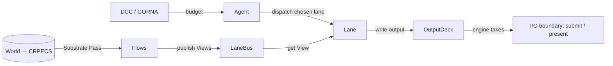

# Agents and Lanes

This page explains the single most-confused boundary in Khora: the line between a
**strategist** (an Agent) and an **executor** (a Lane). They are deliberately
different kinds of object with different rules, and keeping them straight is the
key to reading the per-frame descent. This is an explanation of *why* the split
exists and how data flows across it — for the steps to add either one, see
[How-to: add a lane](../how-to/add-a-lane.md) and
[How-to: add an agent](../how-to/add-an-agent.md); for the trait method tables,
the rustdoc on `khora_core::agent` and `khora_core::lane`.

---

## Two roles, one descent

The CLAD descent of a frame is `Control → Agent → Lane → Data`. The Control layer
(the DCC, via [GORNA](./gorna.md)) hands each agent a budget; the agent picks a
strategy and dispatches it; the strategy — a lane — does the work against data the
Data layer has projected. The two middle roles are not interchangeable:

- An **Agent** is a *tactical manager*. It owns exactly one **LaneKind**, knows the
  lanes (strategies) available for that kind, exposes those strategies to GORNA,
  applies the budget GORNA returns, and dispatches the chosen lane each frame. It
  decides *which* lane runs.
- A **Lane** is a *hot-path worker*. It does one thing — render a forward pass,
  step physics once, mix one audio frame, decode one glTF — deterministically, and
  it does it when an agent dispatches it. It decides *nothing*; it just executes.

The naming is symmetric on purpose. `RenderAgent` chooses between
`SimpleUnlitLane`, `LitForwardLane`, and `ForwardPlusLane`; `PhysicsAgent` runs the
standard physics lane; `AudioAgent` runs the spatial-mixing lane. **The agent owns
selection. The lane owns execution.** Each lane *is* a strategy the owning agent
can offer to GORNA.

## Why agents are kept so thin

An agent implements **only** the `Agent` trait plus `Default` — no other methods.
No `start`/`stop`, no builders, no accessors; construction goes through
`Default::default()`. This is a hard rule, and it is worth understanding the
reasoning rather than treating it as arbitrary:

- **One LaneKind per agent.** An agent has exactly one negotiation surface. The
  canonical example is the split between `RenderAgent` and `ShadowAgent`: shadows
  and the main pass have different costs, different dependencies, and different
  per-frame roles, so they are two agents, not one agent with two jobs.
- **No per-frame state.** An agent does not buffer outputs, own a Flow, or
  accumulate work between frames. If it needs to remember something across frames,
  that thing belongs in a lane (`self`), in the ECS, or in a tick-scoped context —
  not on the agent. State on an agent is the first symptom of lane logic leaking
  upward.
- **Strategist, never worker or controller.** An agent does not contain pipeline
  code (that is the lane's job) and does not decide global priorities (that is the
  DCC's job). It sits precisely in between.

The motive is legibility. Every agent in the workspace has the same shape, so the
boundary stays crisp and the slow drift toward god-object subsystems never starts.
If you find yourself adding a method to an agent struct, you are almost certainly
leaking lane work into the agent — the fix is to push it down into a lane.

A corollary worth stating: a subsystem that has *no strategies to negotiate* is not
an agent at all. ECS maintenance, asset loading, and serialization are **services**,
not agents, because there is nothing for GORNA to choose between. Reserve the agent
abstraction for subsystems that genuinely have competing performance strategies.

## How a lane gets its data: the bus and the deck

A lane never reaches into the ECS `World` directly. This is the other half of the
discipline, and it is what makes lanes orthogonal — substitutable without touching
their neighbours. Lanes read and write through two tick-scoped, typed channels,
reached via the `LaneContext` the agent hands them:

- **The `LaneBus` — the read side.** The domain **Flow** layer is the *only*
  legitimate producer of the Views a lane consumes. During the Substrate Pass each
  Flow projects a typed View (`RenderWorld`, `ShadowView`, …) from the World and
  *publishes* it into the bus. A lane only ever *gets* a View by type from the bus;
  it cannot publish, and it cannot query the World behind the bus's back. The bus
  is constructed by the scheduler at frame start and dropped at frame end — outside
  lane execution it does not exist.
- **The `OutputDeck` — the write side.** The symmetric counterpart: a lane writes
  its typed output (recorded GPU command buffers, draw lists) into a slot on the
  deck. The engine drains specific types at the I/O boundary — submit, present —
  by *taking* them out. A lane produces into the deck; it does not perform the
  final I/O itself.

So the full data flow is: **World → Flow → LaneBus → Lane → OutputDeck → engine
I/O**, with the agent sitting above the lane choosing *which* lane runs and the DCC
above the agent setting *how much* it may spend. Read-only Views in, typed outputs
out, nothing shared by long-lived reference. A lane can be removed, replaced, or
swapped for another strategy without disturbing any other lane, because everything
crosses the boundary as a typed value in the bus or the deck rather than as a
direct dependency between lanes.

That decoupling is the payoff of the whole arrangement. The `LitForwardLane` does
not depend on a `ShadowPassLane` *instance* — it depends on the shadow View being
present in the bus. The shadow lane can be rewritten, and as long as it still
publishes the same View type, the forward lane never notices.

## The three phases of a lane

A lane's per-frame work is split into `prepare` → `execute` → `cleanup` (with a
one-shot `on_initialize` at boot). The split is load-bearing, not ceremony:
`prepare` is read-only extraction (parallelizable across lanes in principle),
`execute` is the mutating output (single-threaded), and `cleanup` is the seam where
per-frame state is reset so nothing leaks into the next frame. A lane that leaves
stale data behind in `cleanup` is a frame-leak waiting to happen. Errors surface as
a `LaneError` that bubbles to the agent, which can log it and fall back to a cheaper
strategy — the same `LaneError` is how a degraded frame stays a degraded frame
rather than a crash.

## Why this separation exists

Pulling the two roles apart buys three things the engine depends on:

1. **GORNA has something to negotiate.** Because lanes *are* strategies and agents
   expose them, the cost estimates flow up to the DCC and budgets flow back down —
   adaptation has a surface to act on. A monolithic "render system" would have
   nothing to choose between.
2. **The hot path stays decoupled from the cold path.** Agents apply budgets that
   the DCC computed off-thread; lanes execute against Views the Flow layer already
   projected. Neither blocks on the other.
3. **Subsystems stay swappable.** Lanes communicate only through the bus and the
   deck, so a strategy can be added, removed, or replaced in isolation — which is
   exactly what an *adaptive* engine needs when it switches `LitForward` to
   `Forward+` mid-session because GORNA detected too many lights.

## Next steps

- [How-to: add a lane](../how-to/add-a-lane.md) — write a hot-path strategy.
- [How-to: add an agent](../how-to/add-an-agent.md) — add a strategist over a new
  LaneKind.
- [GORNA](./gorna.md) — how budgets reach agents and strategies are chosen.
- [Data and the ECS](./ecs.md) — the World the Flow layer projects Views from.
- [Glossary](../reference/glossary.md) — Agent, Lane, LaneKind, LaneBus,
  OutputDeck, Flow, View.
