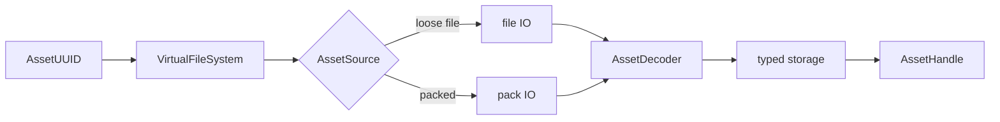

# Assets and the VFS

How Khora finds, loads, and stores assets — meshes, textures, fonts, sounds. This
page explains *why* assets are addressed by stable identity through a virtual file
system, and how the same code path serves loose files in development and a packed
archive in release. It is an explanation, not a recipe — for the steps to load an
asset and reference it from a component, see
[How-to: load assets](../how-to/load-assets.md).

---

## Identity, not paths

The seam that holds the whole pipeline together is this: an asset is addressed by a
**UUID**, not a path. Paths change — files get renamed and moved — but a reference
must not break when they do. So game code carries a typed handle backed by a UUID,
and the **virtual file system** resolves that UUID to wherever the bytes actually
live.

By **default** the UUID is derived from the asset's forward-slash relative path (a v5
UUID). But the path is only the *default* seed for identity, not identity itself: the
moment an asset is renamed or moved in the editor, its UUID is **frozen** in a
per-project identity registry (`<project>/.khora/asset-registry.ron`) so the reference
survives the move. Whether frozen or still on its path-derived default, the identifier
a texture gets in development is *byte-identical* to the one it gets when packed for
release, because both resolve through the same registry. A handle therefore works in
either mode without changes, and the index is deterministic across runs. See
[File formats — asset identity registry](../reference/formats.md#asset-identity-registry).

## The pipeline

The load path is a short, on-demand chain. There is no "asset agent" because there
are no per-frame strategies to negotiate — loading is a **service**, the same line
the engine draws everywhere between strategy-bearing agents and fixed-work services:

The virtual file system is a UUID → metadata table — an O(1) lookup. The metadata
names the **source** (a path in development, an offset-and-size into the pack in
release) and any pre-decode hints. The IO layer reads raw bytes from whichever
source applies; a per-format **decoder** turns those bytes into a typed asset; the
asset lands in typed storage and the service returns a reference-counted
**handle**. The load is synchronous — the service looks the UUID up, reads, decodes,
caches, and hands back a handle, returning a cached one if the asset is already
loaded. Multiple entities sharing one mesh or texture share one handle and one copy
in memory; when the last handle drops, the asset is queued for unload.

The decoder set is extensible by registration: adding a format is writing a decoder
and registering it under a type name, not rewiring the pipeline. The same is true of
the IO layer — loading from, say, a network source is a new IO implementation
swapped in behind the same VFS and decoders.

## Dev and packed are the same path

In development, assets are loose files on disk and the index is built by scanning
the project's asset directory. In release, every asset is concatenated into a single
**pack** file alongside a binary index, and the source descriptors are rewritten
from paths to packed offsets. The decoder layer above does not know which is in use —
it sees the same VFS and the same handle type. Because UUIDs are derived from the project-relative path (or frozen in the identity registry once an asset has been renamed),
the two modes are interchangeable; the editor's build step produces the packed pair
from the same asset directory, deterministically.

## Dependency tracking

Asset metadata also records each asset's **direct dependencies** — the UUIDs of the
other assets it references — so a loader can fetch prerequisites without first
decoding the asset. This is populated while the index is built, through a single
extension point keyed on the asset's type name.

Today **materials** are the populated case: a material records the UUIDs of the
textures it references (base-colour, metallic-roughness, normal, emissive). Those
UUIDs match exactly what the index assigns the texture files, because both derive
from the same relative path; the list is deduplicated and sorted so reusing one
texture across slots contributes it once and the index stays byte-deterministic. The
extension point is generic — scene, prefab, and mesh formats are stubs that return
an empty list, and adding real extraction for one is a single match arm. To keep the
index build fast, bytes are read only for types that actually have an extractor;
leaf assets like textures and audio are never opened.

## Next steps

- [How-to: load assets](../how-to/load-assets.md) — load an asset by UUID and
  reference it from a component.
- [How-to: add an asset decoder](../how-to/add-an-asset-decoder.md) — register a
  decoder for a new format.
- [Serialization](./serialization.md) — how scenes (which reference assets by UUID)
  are saved and loaded.
- [Glossary](../reference/glossary.md) — AssetUUID, VFS, decoder, service.
