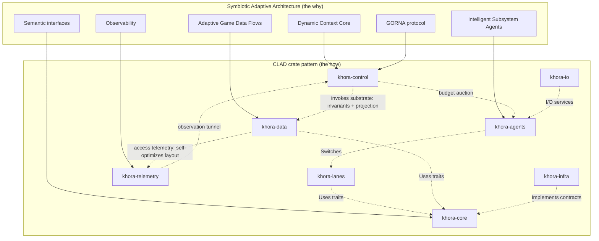
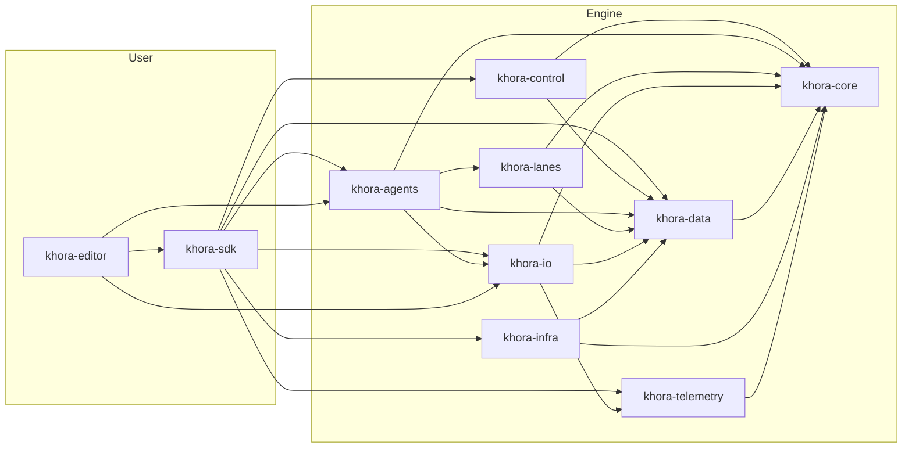

# Architecture (CLAD)

Where the SAA pillars live in the codebase, and why the layering flows the way
it does. Pair with [The big idea](./saa.md).

---

## SAA, meet CLAD

Khora is built on two architectural concepts that are really two sides of one
coin. [**SAA**](../reference/glossary.md) is the philosophical blueprint —
self-optimizing, adaptive, symbiotic. [**CLAD**](../reference/glossary.md) is
the concrete crate structure — Control / Lanes / Agents / Data — with strict
dependency layering and well-defined data-flow patterns.

| | The why | The how |
|---|---|---|
| Name | **SAA** — Symbiotic Adaptive Architecture | **CLAD** — Control / Lanes / Agents / Data |
| Form | Philosophical blueprint | Concrete crate structure |
| Concern | Self-optimizing, adaptive engine | Strict dependency layering, data-flow patterns |

Every abstract concept in SAA has a direct, physical home within CLAD. The split
between agents and lanes mirrors the split between *strategy* and *execution*.
The split between data and core mirrors the split between *state* and *contract*.



## The descent: Control → Agent → Lane → Data

The CLAD name spells out the path a frame's command takes through the engine:

```
Control ──► Agent ──► Lane ──► Data
       budget   selects   reads bus / writes deck
```

- **Control** ([**DCC**](../reference/glossary.md) + [**GORNA**](../reference/glossary.md))
  is the strategic brain. It observes telemetry, arbitrates the agent budget
  auction, runs the Scheduler, and invokes the Substrate (data invariants +
  projection Flows). It sets a budget; it does not dictate strategy.
- **Agents** are tactical managers. Each owns exactly one
  [**`LaneKind`**](../reference/glossary.md). Given its budget, an agent picks a
  Lane and invokes it. It does no per-frame state-keeping of its own — it is a
  strategist, not a worker.
- **Lanes** are the fast, deterministic workers — the actual algorithms an agent
  can choose between. A Lane reads typed Views from the bus and writes its
  results into the output deck.
- **Data** is the foundation — the archetype ECS storage plus the adaptive
  memory layout. It is *read-only projected* into the hot path each frame, never
  mutated structurally from within a Lane.

This descent is the competitive path: agents negotiate, the winner descends to
its Lane, the Lane touches Data. It is the single most important shape in the
engine.

## The mapping

Each SAA pillar lands in a specific crate:

| SAA concept (the why) | CLAD crate (the how) | Role |
|---|---|---|
| **Dynamic Context Core** & **GORNA** | `khora-control` | Strategic brain — observes telemetry (incl. Data access patterns), arbitrates the agent budget auction, runs the Scheduler, invokes the Substrate. It never drives Data's layout — Data self-optimizes |
| **Intelligent Subsystem Agents** | `khora-agents` | Tactical managers — one per `LaneKind` (render, shadow, physics, audio, UI) |
| **Multiple agent strategies** | `khora-lanes` | Fast, deterministic workers — the algorithms an agent chooses from |
| **Adaptive Game Data Flows** | `khora-data` | Foundation — archetype storage + adaptive memory layout, self-optimized *inside* the Data layer; representation only, never game semantics |
| **Semantic interfaces and contracts** | `khora-core` | Universal language — traits, core types, math, GORNA types |
| **I/O services** | `khora-io` | Asset loading, VFS, serialization — on-demand services, not agents |
| **Observability and telemetry** | `khora-telemetry` | Nervous system — gathers performance data for the DCC |
| **Hardware and OS interaction** | `khora-infra` | Bridge to the outside world — wgpu, winit, Rapier3D, CPAL, Taffy |

The full crate-by-crate map — folders, key files, what to read first — lives in
the [Crate map reference](../reference/crates.md).

## Dependencies flow downward only

The dependency graph *is* the architecture. If you change one, you change the
other. Dependencies flow strictly downward; a cycle is a hard build error.



A handful of rules make the graph legible:

| Rule | Why |
|---|---|
| No upward deps | `khora-core` depends on nothing — it stays portable and trait-only |
| No lateral deps | Agents never depend on Control; they talk *down* to lanes and *across* to a one-way channel |
| Traits in core | Abstract traits live in `khora-core`; implementations live in their own crates |
| Backends in infra | Per-backend code lives under `khora-infra/src/<area>/<backend>/` |

Two consequences are worth dwelling on, because they shape the whole engine.

**`khora-control` depends on `khora-data`, but never *commands* it.** The
Scheduler invokes the **Substrate** — the data-layer invariants and the
projection Flows — over the World because it owns the tick ordering. That is
orchestration of *when* Data takes its turn, not control over *how* Data lays
itself out. Layout is Data's own self-optimization. Agents still never depend on
Control.

**`khora-infra` is *one* implementation, not *the* implementation.** Every
backend in `khora-infra` implements a trait that lives in `khora-core`. Swapping
to a different graphics backend, physics solver, audio device, or UI layout
engine means writing a new implementation of the trait — typically a new sibling
folder under `khora-infra/src/<area>/<new_backend>/`. The rest of the engine
never sees the change. This is the load-bearing reason backend code is
segregated, and it is why the trait surface matters more than any single backend.

## Two relationships of Control — and neither commands Data

A frequent misreading is that the DCC "commands" subsystems, or that the data
layer "competes" for budget like an agent. Neither is true. Control relates to
the rest of the engine in exactly two ways:

1. **The descent — the budget auction.** `Control → Agent → Lane → Data`. Agents
   are the *only* parties that negotiate for the frame budget; the DCC arbitrates
   *among agents*. Once an agent's budget is fixed, it picks a Lane and work
   descends. This is the competitive path.
2. **The observation tunnel — Data → Control.** Telemetry flows *up*: hardware
   monitors, agent status, and data-layer access-pattern metrics feed the DCC's
   situational model. This is **read-only observation** — the opposite of a
   command.

The data layer adapts *itself*. Its memory layout is a self-optimization
internal to `khora-data`, decided locally from the access patterns it measures
and self-bounded by a cost/benefit test. The DCC does not drive it; it only
observes the result. Symmetrically, the DCC never dictates an agent's strategy
either — it sets a budget, the agent decides. This is precisely what keeps the
architecture *symbiotic* rather than autocratic.

## The trait surface

The contracts that hold the engine together are a small set of Rust traits.
Reading them *is* reading the engine's API — they are kept short, stable, and
free of backend-specific types:

| Trait | Defined in | Implemented by |
|---|---|---|
| `Lane` | `khora-core` | All lane types in `khora-lanes` |
| `Agent` | `khora-core` | All agent types in `khora-agents` |
| `RenderSystem` | `khora-core` | wgpu backend in `khora-infra` |
| `PhysicsProvider` | `khora-core` | Rapier3D backend in `khora-infra` |
| `AudioDevice` | `khora-core` | CPAL backend in `khora-infra` |
| `LayoutSystem` | `khora-core` | Taffy backend in `khora-infra` |
| `Component` | `khora-data` | All ECS components (via derive macro) |

The presence of every seam as a trait — and the absence of string-keyed APIs or
`Box<dyn Any>` downcasting in production paths — is what makes the engine
reorganizable at runtime. For the exhaustive trait and type listing, defer to
the rustdoc; the point here is the *shape*, not the catalog.

## Next steps

- **[The frame](./the-frame.md)** — the per-frame mechanics that bring this
  layering to life: the six-stage descent, the Substrate Pass, and the
  fixed-timestep simulation model. Read this next.
- **[Crate map reference](../reference/crates.md)** — the full crate-by-crate
  breakdown.
- **[Glossary](../reference/glossary.md)** — every proprietary term in one place.
