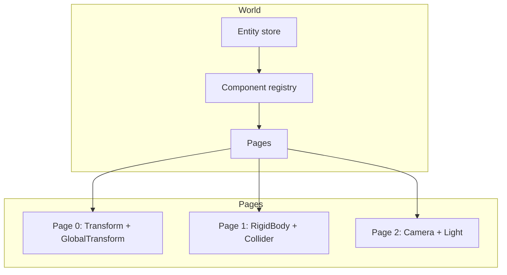

# Data and the ECS (CRPECS)

The data layer Khora is built on. This page explains *why* the engine carries its
own ECS, the shape of its storage model, and how that shape pays off for the rest
of the Symbiotic Adaptive Architecture. It is an explanation, not a recipe — for
the steps to define and register a component, see
[How-to: add a component](../how-to/add-a-component.md), and for the type-level
facts, the rustdoc on `khora_data::ecs`.

---

## Why a custom ECS

**CRPECS** — *Chunked Relational Page ECS* — exists because the SAA's promise of
**[Adaptive Game Data Flows](./agdf.md)** (adapting the in-memory *layout* of data
to the hardware it runs on) requires a storage model where structural change is
cheap. The three letters of the name are load-bearing: storage is **chunked** into
bounded pages, the relationship between an entity and its data is **relational**
(entities are identifiers, not pointers), and the page is the unit at which
everything — iteration, compaction, serialization — happens.

The consequence is that adding or removing a component is not an O(N) operation;
whole pages are queryable in cache-friendly bursts; and bitset-guided queries keep
sparse iteration fast. Off-the-shelf ECS libraries tend to optimise for one of
those properties at the expense of the others — a sparse-set ECS is simpler but
pays a query-time cost; a pure archetype store iterates fast but can make
structural change expensive. CRPECS is built to do all three at once, because the
SAA needs all three at once. That is the whole trade-off the design is organised
around.

## The storage model

The `World` owns three things: an **entity store** (sparse, generation-checked), a
**component registry** (typed, inventory-driven), and a set of **archetype pages**
(contiguous struct-of-arrays storage, one per component combination).



**Entities** are lightweight identifiers carrying an index and a generation. The
generation is what makes stale handles safe: when an entity is despawned and its
slot is reused, the generation increments, so an old handle silently fails its
lookups instead of pointing at whatever now lives in that slot.

**Components** are plain data tagged with `#[derive(Component)]`. The derive is
where a lot of the ergonomics live — it generates the serialization mirror and its
`From` conversions, and self-registers the type (via `inventory`) so `World::new`
discovers it with no hand-maintained list. The point worth understanding is *why*
the macro generates a mirror at all: maintaining two structs by hand (the live
type and its serialized form) was a recurring source of drift, and runtime
reflection would cost allocation on the hot path. The macro is the statically
checked middle path.

**Pages** are the heart of it. Components are grouped by archetype — the exact set
of component types an entity has — and each archetype's data lives in one or more
contiguous pages, stored struct-of-arrays. Adding a `RigidBody` to an entity moves
it from its current page to the page whose archetype includes `RigidBody`; the
cost is a bounded, component-by-component memcpy, not a world-wide event. A bitset
on each page records which slots are live, so iteration walks set bits and indexes
into the SoA arrays with no per-entity allocation and no per-entity branching.

## Semantic domains

Every component declares a **SemanticDomain** (`Spatial`, `Render`, `UI`,
`Audio`, …), encoded as a bitset on its registry entry. Domains exist so that a
query can pre-filter pages by *meaning*: a render-extraction query hinted with the
`Render` domain never touches UI pages. As the entity count grows, this is part of
what keeps per-frame extraction from scaling with the whole world.

Domains are also the unit of *change tracking*, and this is where the ECS connects
to the adaptive layer. The `World` keeps a monotonic counter — a **change epoch** —
per domain, bumped in O(1) by every mutation entry point that can affect that
domain's *semantic* content: spawn/despawn, component insert/remove, `get_mut`,
mutable query construction, deserialization, and compaction that reorders rows.

The contract is deliberately one-sided. Equal epochs across two reads *guarantee*
the domain's data — and its iteration order — is unchanged; a different value means
only "possibly changed". The bumps are conservative, so over-bumping is harmless
while a *missed* bump would mean a stale consumer, which is the failure mode the
design refuses to risk. Crucially, a representation-only change — an AGDF layout
choice that rewrites how a column is stored — does **not** bump the epoch, because
it changes the HOW, not the WHAT. Epochs are read via `World::domain_epoch(domain)`
and paired with `World::instance_id()` so counters from two different `World`
instances can never accidentally compare equal.

The first consumer of these epochs is **Flow** view caching: a Flow that can name
all of its inputs folds the relevant domain epochs into a cache key, and on an
unchanged frame republishes its previous View instead of re-projecting it. That
mechanism — and why a cached View is bit-identical to a freshly projected one — is
explained in [AGDF](./agdf.md).

## Queries and SoA versus AoSoA

Queries are type-safe and borrow-checked at compile time. A query asks for a tuple
of component references, and the planner picks every page whose archetype contains
all of them, iterating in SoA order:

```rust
for (transform, mut global) in world.query::<(&Transform, &mut GlobalTransform)>() {
    global.0 = transform.compute_global();
}
```

A `&mut Component` in one query closes the door, at compile time, on any other
query touching that component for the borrow's duration — the same exclusivity
rule that would later make parallel query execution sound, though the policy for
that is not yet decided.

Underneath, a default column is a `Vec<T>`: struct-of-arrays *across entities*, but
array-of-structures *within* a component — whole structs back to back. That is the
right default and matches what every mainstream archetype ECS does. But it leaves
the *field* level on the table: a loop touching one field of a fat component
strides over all the others, wasting cache lines and defeating SIMD. A
compute-heavy, all-`f32` component can therefore opt into a **field-split (SoA)**
column, where each field becomes its own contiguous stream — without changing its
semantics or disturbing the rest of CRPECS. This is the substrate the adaptive-
layout layer rides on; the trade-offs, the measured wins, and why the layout is
chosen *per component* are covered in [AGDF](./agdf.md).

## Maintenance is a service, not an agent

ECS maintenance — draining cleanup after component removal and compacting pages
with too many holes — runs every frame between user logic and agent execution. It
is deliberately *not* an agent. An [agent](./agents-and-lanes.md) exists to
negotiate between competing strategies; maintenance has no strategies to negotiate,
it does the same fixed work every frame. So it is a direct data-layer operation,
owned by the world rather than scheduled through GORNA. Knowing where that line
falls — strategy-bearing subsystems are agents, fixed operations are services — is
the single most useful distinction for reading the data layer.

## Next steps

- [How-to: add a component](../how-to/add-a-component.md) — define, tag with a
  domain, and register a component.
- [AGDF](./agdf.md) — how the field-SoA substrate and Flow view-caching ride on
  this storage model.
- [Agents and Lanes](./agents-and-lanes.md) — what consumes the Views the data
  layer projects.
- [Glossary](../reference/glossary.md) — CRPECS, SemanticDomain, change epoch,
  archetype page.
