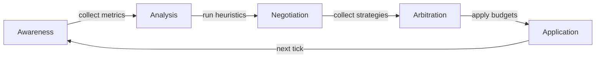
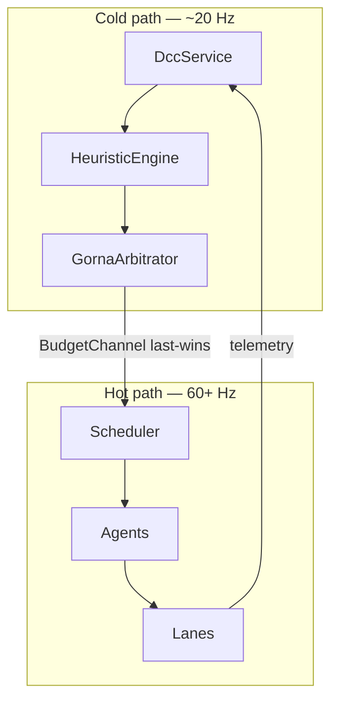

# GORNA: resource negotiation

**GORNA** — *Goal-Oriented Resource Negotiation and Allocation* — is the protocol
that lets the engine's agents and its central controller trade frame budgets in
real time. This page explains *why* the engine negotiates budgets at all, the shape
of the negotiation, and how the control loop closes. It is an explanation, not an
operator's manual — for pinning or bounding an agent in practice, see
[How-to: control GORNA adaptation](../how-to/control-gorna-adaptation.md), and for
watching a live decision, [How-to: debug a frame](../how-to/debug-a-frame.md).

---

## Why negotiate at all

A traditional engine assigns budgets at compile time: physics gets 4 ms, rendering
gets 12 ms, audio gets the rest. Those numbers are correct on exactly one machine —
the developer's — and wrong everywhere else. A laptop on battery, a workstation, and
a Steam Deck do not share a frame budget, and the same machine does not share one
between a quiet menu and a crowded firefight.

GORNA replaces the fixed split with a per-tick negotiation. Agents declare what they
*can* do at several cost points; the **DCC** (the Dynamic Control Core) observes the
running system, applies a set of heuristics, and hands back a budget that reflects
*this* hardware, *this* scene, *this* frame. The result is one binary that adapts
its strategy each tick to hold the frame rate, instead of a binary tuned for one
target.

A boundary worth stating up front: **only agents negotiate in GORNA.** There is one
negotiation surface per LaneKind, and that is it. The Data layer does *not* compete
here — it self-optimises its own memory layout ([AGDF](./agdf.md)), observed by the
DCC but never driven by it, and never bids for the frame budget. GORNA arbitrates
strategy; AGDF arbitrates layout; they are siblings, not the same auction.

## The negotiation, phase by phase

The loop runs on the cold path at roughly 20 Hz. The hot path never waits for it —
if a budget is late, the previous one simply stays in effect.

- **Awareness** gathers telemetry from agents and hardware monitors.
- **Analysis** runs the heuristic engine over that telemetry, shaping a single
  frame-time target.
- **Negotiation** asks each agent for its strategy options and their estimated
  costs.
- **Arbitration** selects an optimal strategy per agent that fits the global frame
  budget, respecting priorities and constraints.
- **Application** calls `apply_budget` on each agent and pushes the result through
  the `BudgetChannel` (one channel per agent, last-wins).

Agents declare what they offer as `StrategyOption`s and receive a `ResourceBudget`.
The request and budget shapes are intentionally narrow — time, memory, VRAM, and a
small extras map — so that adding a resource dimension is a considered change, not a
free-form bag each subsystem invents its own dialect for. The exhaustive field lists
live in the rustdoc on `khora_core::control::gorna`.

## The cost model and the PID frame-budget controller

Two pieces turn raw telemetry into a budget, and the division of labour between them
is the heart of the current design.

The **heuristics** shape a single *frame-time target* rather than scaling the budget
directly. Thermal, battery, and engine-phase heuristics *relax* the target (a hot
device aims for 30 FPS rather than 60); the cost-model forecast can *tighten* it
pre-emptively. They answer the question "what frame time should we be aiming for?".

The actual `global_budget_multiplier` — the scalar applied to every agent's frame
budget — is then driven by a **PID controller** that closes the loop on *measured*
frame time versus that target. When frames run long the loop lowers the multiplier
(agents pick cheaper strategies, frames speed up); when there is headroom it climbs
back toward 1.0. This replaced an older static thermal/battery lookup that stepped
the multiplier in coarse jumps and double-counted thermal and battery (once in the
target, once in the multiplier). The controller uses the refinements a noisy,
saturating, discrete-actuator plant needs — derivative-on-measurement with a low-
pass filter, back-calculation anti-windup, setpoint weighting, and output clamping
to `[floor, 1.0]`. On top of the loop sits a **hard safety ceiling** that caps the
multiplier immediately on critical thermal/battery or near-budget memory pressure:
the loop regulates the steady state, the ceiling handles emergencies.

The **PID recovery loop** is what makes this bidirectional, and it is a recently
completed piece rather than a future one. Pressure heuristics drive the *downgrades*
by tightening the target and flagging a renegotiation. *Recovery* is driven by the
multiplier itself: the DCC remembers the multiplier in effect when budgets were last
issued, and re-arbitrates whenever the PID has since moved it by more than a small
fixed delta (0.05) in either direction. Once measured frame time settles back under
the setpoint the multiplier climbs, budgets are re-issued, and agents upgrade
again — instead of staying pinned at a degraded strategy forever.

**Empirical cost calibration** closes the other gap. Agents quote *static* estimates
in `negotiate()`, but reality drifts from the quote per machine and per scene. The
DCC fits each agent's measured `(n, time)` samples to an empirical cost model (a
constant factor times a complexity class `f(n)`, the same shape a query optimiser
uses), and `GornaArbitrator::arbitrate` feeds those measured costs back into the
negotiation: every strategy option is rescaled so the one matching the agent's
*current* strategy equals the measurement. The rescale factor is clamped (to
`[0.25, 4.0]`) so a single hitch or cold cache cannot swing the fit by orders of
magnitude, and the relative ordering of options is preserved — only the absolute
scale moves. The budget fitting therefore reasons about *measured milliseconds*, not
static worst-case quotes. An agent with no measurement yet (cold start) keeps its
quotes as-is. Together with the cost model's forecast — which can tighten the target
*before* a frame overruns — this is the "model proposes, measurement disposes" loop:
the controller acts ahead of a breach, and the measurements keep its arithmetic
honest.

## The heuristics

The heuristic engine runs a battery of independent heuristics each tick, each one a
near-pure function of telemetry that emits a target adjustment or a recommendation;
the arbitrator combines them. Because they are independent, new heuristics grow the
engine's adaptive intelligence by accretion, without touching the existing ones.

| Heuristic | Reads | Effect |
|---|---|---|
| **Phase** | the current engine phase | relaxes or tightens the target for that phase |
| **Thermal** | GPU/CPU temperature | relaxes the target when hot; hard safety cap on critical |
| **Battery** | battery level + AC state | relaxes the target on low battery; hard cap on critical |
| **Frame time** | recent frame durations | tightens when frames run over target |
| **Stutter** | frame-time variance | penalises strategies with inconsistent timing |
| **Trend** | frame-time slope | anticipates degradation before it becomes a stutter |
| **CPU pressure** | CPU utilisation | rebalances toward CPU-light strategies |
| **GPU pressure** | GPU utilisation | rebalances toward GPU-light strategies |
| **Death spiral** | consecutive over-budget frames | forces the cheapest strategy until recovery |

The death spiral is a first-class concept: when the engine cannot hold its frame
budget for several frames running, GORNA forces the cheapest strategy and monitors
for recovery, returning agents to negotiated strategies once the spiral breaks. It
overrides developer control — safety wins.

One firm constraint runs through all of this: **GORNA can never force a phase.** It
can suggest an *importance* change, but agents always control which phases they run
in. Adaptation changes the HOW, never the WHAT.

## AdaptationMode — the developer-control surface

GORNA is a partnership, not an autocracy. How much latitude it has over a given
agent is set per agent through **AdaptationMode** (via `DccService::set_adaptation_mode`,
the DCC being a registered service). There are four modes:

- **Learning** *(default)* — full negotiation; the DCC freely picks the best-fitting
  strategy each tick.
- **Manual(strategy)** — the agent is pinned; GORNA observes and reports but never
  switches it.
- **Stable** — GORNA may *downgrade* under pressure but never makes an opportunistic
  *upgrade*, so the strategy does not flap frame to frame.
- **Bounded { min, max }** — the chosen strategy is clamped to a range.

All four are enforced today. A death-spiral safety stop can still force the cheapest
strategy in any mode — safety overrides developer control. (A few finer modes —
calibration, a game→engine hint channel, a spatial `PriorityVolume` constraint API —
remain on the roadmap; they are not part of `AdaptationMode`.)

Separately, the DCC can **record and replay** its decision trace. Arbitration is
deterministic (no RNG), so recording the strategy issued to each agent each tick and
replaying it reproduces a session's adaptation bit-for-bit — for QA, lockstep, and
bug reproduction. This is a *capability of the DCC service* (start/stop recording,
load a trace to replay), not an `AdaptationMode` variant, and it is implemented
today rather than planned.

## Cold path and hot path

The two paths touch only through the `BudgetChannel`, and the hot path never blocks
on the cold path. Within each phase the scheduler currently executes agents
*sequentially*, in priority order, so a GORNA budget is a per-agent exclusive time
slice of the frame, not a concurrent allocation — which is exactly why the budget
fitting sums the calibrated per-agent costs against the frame budget. Parallel agent
execution is roadmap work; when it lands, the fitting must switch from sum-of-costs
to a critical-path model.

## Next steps

- [How-to: control GORNA adaptation](../how-to/control-gorna-adaptation.md) — pin,
  bound, or free an agent.
- [How-to: debug a frame](../how-to/debug-a-frame.md) — watch a live GORNA decision.
- [Agents and Lanes](./agents-and-lanes.md) — what GORNA negotiates over.
- [AGDF](./agdf.md) — the layout adaptation the DCC observes but does not auction.
- [Glossary](../reference/glossary.md) — GORNA, DCC, AdaptationMode, cost model, PID
  budget multiplier, death spiral.
