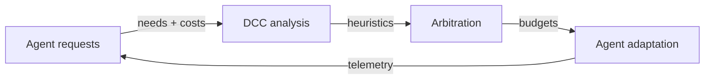
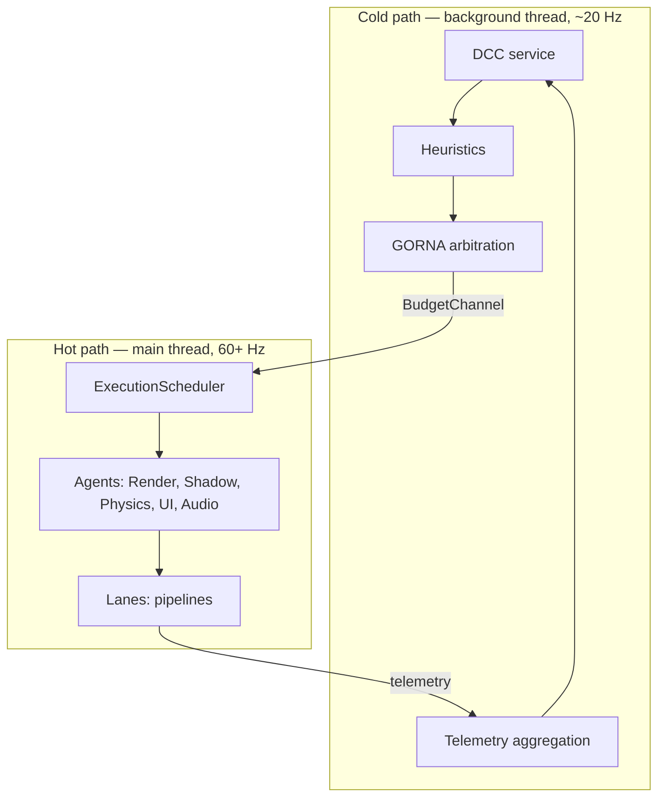

# The big idea

Why an engine would negotiate with itself.

---

## The problem with rigid engines

Most game engines decide at compile time. The render pipeline is fixed, the
physics tick rate is a constant, the resource budgets are baked in. This works
beautifully on exactly one target — the machine the defaults were tuned for —
and progressively worse everywhere else. The result is a familiar trio of
problems:

| Problem | Impact |
|---|---|
| Static resource allocation | Underutilization or bottlenecks |
| Manual per-platform tuning | Tedious, fragile, expensive |
| No contextual awareness | Cannot prioritize what matters to the player right now |

Hardware diversity makes this worse every year. A title that ships to high-end
PCs, mobile, and VR cannot have one static configuration that is right for all
three. The classic answer is per-platform tuning by hand: weeks of fiddling
with quality presets, and a combinatorial explosion of edge cases. The engine
never *understands* its situation — it only ever replays decisions a human made
in advance.

## The answer: an engine that thinks

Khora replaces the rigid orchestrator with a council of intelligent,
collaborating agents. The framework has a name: the **Symbiotic Adaptive
Architecture**, or [**SAA**](../reference/glossary.md). The name is exact —
subsystems live in *symbiosis* (neither commanding nor commanded), and the
engine *adapts* to its environment as a continuous behavior, not as a
configuration step.

The contrast with a traditional engine is sharp:

- A traditional engine is a **tree**. A central runtime calls into renderers,
  physics, and audio in a fixed order, with budgets decided at compile time.
- SAA is a **council**. A central observer watches; specialists negotiate; an
  arbitrator hands out budgets each tick. Decisions are revisited every frame.

Three properties fall out of this:

- **Automated self-optimization.** The engine detects bottlenecks and
  reallocates resources autonomously — no `MAX_LIGHTS` constant, no preset to
  pick.
- **Strategic flexibility.** Rendering switches techniques under load. Physics
  shrinks its tick rate when the GPU is starving. Audio sheds voices when memory
  tightens. None of it requires developer intervention.
- **Goal-oriented decisions.** Every adaptation serves a high-level goal —
  *maintain 90 fps in VR*, *conserve battery on mobile*, *prioritize physics in
  this volume*.

This is not a research toy. The engine ships a working renderer, a working
physics step, an editor with a play mode, a sandbox you can run today, and
hundreds of workspace tests. SAA is a deliberate, opinionated answer to the
rigidity problem — not an aspiration.

## The seven pillars

SAA rests on seven pillars. Here is the *idea* of each; where each one lives in
the codebase is the subject of [Architecture (CLAD)](./clad.md).

### 1. Dynamic Context Core — the central nervous system

The [**DCC**](../reference/glossary.md) is the engine's center of awareness. It
does not command subsystems directly; it maintains a constantly updated
*situational model* of the whole application — hardware load (CPU cores, GPU
utilization, VRAM, bandwidth), game state (scene complexity, entity counts,
light count), and performance goals (target framerate, latency ceiling, power
budget). It runs on a **dedicated background thread at ~20 Hz**, completely
independent of the frame loop.

### 2. Intelligent Subsystem Agents — the specialists

Every major subsystem is an [**agent**](../reference/glossary.md): not a passive
library but a semi-autonomous component with deep understanding of its own
domain. An agent measures its own cost, holds multiple strategies with different
performance characteristics, and can estimate the resource cost of each. Five
agents exist today — one per [**`LaneKind`**](../reference/glossary.md): Render,
Shadow, Physics, UI, Audio. The architecture is open; you can add your own.

### 3. GORNA — Goal-Oriented Resource Negotiation and Allocation

[**GORNA**](../reference/glossary.md) is the formal protocol the DCC and the
agents use to allocate resources, replacing static budgets:

Agents submit desired needs with strategy costs; the DCC arbitrates against the
global model and its goals; it grants each agent a budget (possibly less than
requested); the agent then selects a strategy that fits. The DCC shapes a single
frame-time target from a battery of heuristics each tick, and a closed-loop
**PID controller** regulates the global budget so the *measured* frame time
tracks that target.

### 4. Adaptive Game Data Flows — the living representation

[**AGDF**](../reference/glossary.md) is the principle that *not only algorithms
but also the in-memory representation of data should adapt* to the hardware it
runs on. The engine observes how each component is actually accessed and lays
its storage out for the machine it is on right now:

| Signal | AGDF action (representation only) |
|---|---|
| A component is scanned in tight, vectorizable loops | Re-tile its column to a SIMD-friendly `AoSoA` layout |
| A component mixes hot and cold fields | Split storage so iteration touches only the hot cache lines |
| A layout stops paying off on this hardware | Repack back, gated by a cost/benefit test |

This rearranges bytes, never the simulation outcome. It is the data-layer twin
of GORNA — the same *observe → decide → apply* loop, applied to memory instead
of strategy.

> **What AGDF is *not*.** Removing an entity's physics because it is far from the
> player *changes the game*, not just its representation. That is a gameplay
> decision and belongs to the developer. The engine may offer the mechanism, but
> it never applies it to an entity the developer has not opted into. See pillar 7.

### 5. Semantic interfaces and contracts — the common language

For intelligent negotiation to be possible, every agent must speak a common,
unambiguous language. Khora's contracts are formal Rust traits — capabilities
("I can render with Forward+ or Simple Unlit"), requirements ("I require all
entity positions and meshes"), guarantees ("with 4 ms CPU budget I guarantee
stable physics for 1000 rigid bodies"). These contracts are the seam through
which the entire engine is reorganizable.

### 6. Observability and traceability — the glass box

An intelligent system risks becoming an indecipherable black box. Observability
is therefore first-class. Every DCC decision is logged with complete context —
telemetry, requests, final budget — so a developer can ask not just "what
happened?" but "*why* did the engine choose that?". A telemetry service surfaces
real-time metrics for every subsystem.

### 7. Developer guidance and control — partnership, not autocracy

The engine's autonomy serves the developer; it does not replace them. The
developer can define constraints ("in this zone, physics > graphics") and pick
an adaptation mode (`Learning` / `Manual` / `Stable` / `Bounded`). The boundary
is firm:

> **Automatic adaptation may change the *how* (strategy, quality, memory layout)
> but never the *what* (game semantics — which components an entity has, how the
> simulation behaves).** Changing the *what* is always the developer's call; the
> engine supplies the mechanism, the developer authors the policy.

This single rule — *adapt the HOW, never the WHAT* — recurs throughout the
engine, and is the reason adaptation never becomes a correctness hazard.

## Cold path and hot path

The clearest way to understand SAA is to see the two clocks it runs on. The
**hot path** runs every frame on the main thread and must never block. The
**cold path** runs slowly on a background thread, watches what just happened, and
decides what should happen next. They communicate through exactly one channel:
budgets flow down, telemetry flows up.

| Aspect | Cold path (DCC) | Hot path (Scheduler + agents) |
|---|---|---|
| Thread | Background | Main |
| Frequency | ~20 Hz | 60+ Hz (every frame) |
| Responsibility | Observe, analyze, negotiate | Execute agents, dispatch lanes, produce output |
| Communication | Unidirectional budget channel | Agents read budgets at frame start |

**The key insight:** agents are not controllers, they are *adapters*. They
receive budgets from GORNA and select the appropriate lane strategy. The DCC
decides *what* resources are available; agents decide *how* to use them. The
data layer plays by the same spirit on its own — it self-optimizes its memory
layout internally, and the DCC only *observes* the result through a read-only
telemetry tunnel. Only agents compete in the budget auction; the data layer
never bids for frame time.

This cold/hot split is non-negotiable. The frame loop must never be blocked by
analysis, and an agent must never wait synchronously on the DCC — the
relationship is fire-and-forget through a channel, with last-wins semantics.

## SAA is the *why*; CLAD is the *how*

SAA describes the philosophy. Its concrete implementation has another name: the
[**CLAD**](../reference/glossary.md) layering — Control, Lanes, Agents, Data.
The first describes the *why*; the second describes the *how*. They are two
views of the same thing. Every abstract SAA concept has a direct, physical home
within CLAD, and the dependency layering of the crates *is* the architecture.

## Next steps

- **[Architecture (CLAD)](./clad.md)** — where each of the seven pillars lives,
  and why the layering flows the way it does. Read this next.
- **[The frame](./the-frame.md)** — the per-frame descent and the fixed-timestep
  model that turns SAA into motion.
- **[Glossary](../reference/glossary.md)** — every proprietary term in one place.
