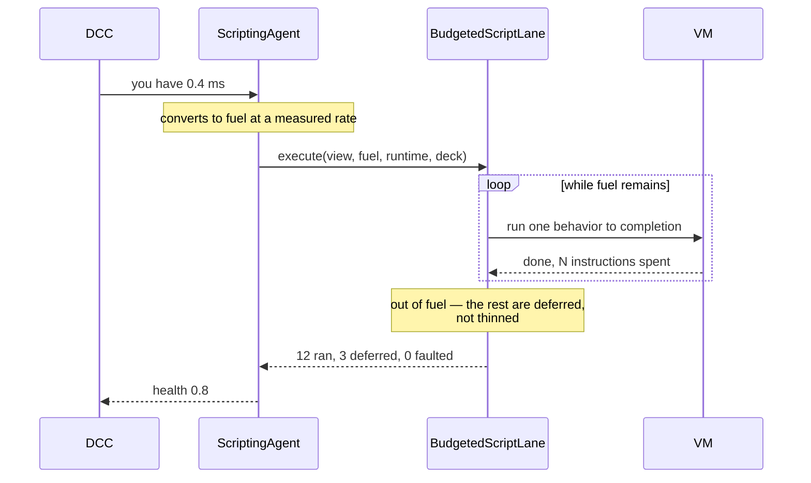

# Scripting (Ergon)

Ergon is Khora's gameplay language. It exists for one reason, and that reason is
the rest of this engine.

## Why not Lua, or C#, or WASM

Every subsystem in Khora can be told *"you have 0.4 ms this frame, work with
that"*. The renderer drops to a cheaper lane, shadows lose resolution, the audio
mixer sheds voices. [GORNA](./gorna.md) exists so those answers are negotiated
rather than guessed.

Gameplay was the one subsystem that could not answer. Hand a script a budget and
it will either finish or it will not, and if it does not, your options are to
let it overrun the frame or to kill it mid-decision. Neither is an answer.
Lua's debug hooks and Wasmtime's fuel can *interrupt* — but interruption is an
error path in both, and what a budget needs is for stopping to be **ordinary**.

So Ergon suspends on an instruction boundary and keeps the machine that
suspended. Next frame resumes rather than restarts.

## Degrading defers whole behaviors

A budget that will not cover every behavior forces a choice. The lane could give
each behavior a smaller slice — every guard thinks a little less, uniformly. Or
it could run some to completion and defer the rest.

**It defers.** A half-run behavior decides from a partial read of the world, and
a hundred of those is a hundred subtly wrong decisions that no one can debug. A
deferred behavior acts a frame late, which gameplay absorbs — a frame late *is*
what a frame is. The order it defers in is the scene's, so the same entities are
not starved every time.

This is why `report_status` reports the share of behaviors that got their turn
rather than a simple success flag: an agent claiming perfect health while half
its behaviors were deferred would tell the DCC nothing was wrong at exactly the
moment something was.

## A script never writes the world

Effects are queued as `WorldCommand`s and applied by a data system during
[Maintenance](./the-frame.md). Nothing a script does reaches the ECS while it
runs.

That constraint is not bureaucracy — it is what buys the parallelism. Because
the script lane touches no `World`, its agent declares `AgentAccess::Isolated`
and can share a wave with other world-free agents. The rule and the performance
are the same fact.

## An event is never delivered in the frame it was raised

One behavior tells another something; the other hears it next frame.

Handling an event where it was raised opens a cascade with no bound — behavior A
raises to B, B raises to C, C raises back to A — and a budget that cannot bound
the work is not a budget. The one-frame delay is the bound.

Two queues feed one delivery:

| Source | Route |
|---|---|
| Behavior → behavior | waits on the `ScriptRuntime`, never leaves scripting |
| Engine → behavior (a collision, an input) | a bounded `Channel<ScriptEvent>` the engine fills and the lane drains |

They stay apart on purpose. Script-to-script mail routed through a shared
resource would cost two frames of latency and a deck slot nothing else reads.

## Hot-reload keeps the state

An author edits a guard's `Update` while ten guards are patrolling. The ten
should still be where they were, with the health they had — restarting them
would make the feature useless for exactly the thing it is for.

Fields are carried across a recompile and matched **by name**. A slot means
nothing across a rebuild: inserting one field at the top shifts every slot after
it, and a positional carry-over would silently move one guard's health into
another's ammo. A field that was renamed keeps no value, and the engine says so
in a warning rather than letting the author find out from whatever the guard
does next.

## Who owns what

The split follows [CLAD](./clad.md) exactly, and it did not always:

| Piece | Where | Why |
|---|---|---|
| The language and VM | `khora-script` | Depends on `khora-core` and the macros only, so the compiler and VM are testable without booting an engine |
| The scripting world (programs, live instances, pending mail, last report, measured rate) | `Runtime::services`, as `Arc<Mutex<ScriptRuntime>>` | It is subsystem state, not strategy state — the same place the physics provider lives |
| The work (reloads, delivery, running behaviors, measuring) | `BudgetedScriptLane` | Lanes execute |
| Choosing a lane for a budget | `ScriptingAgent` | Agents are strategists and hold nothing else |

The agent used to own all of it. What that cost was not correctness but reach:
nothing else could see the live behaviors, because they were a private field of
a strategist.

## Adding a type to the language

Two places, not eight: a row in the `script_value_table!` X-macro
(`khora-core::script`), and a line of the `ergon_type!` declaration in
`khora-script::native::engine_types`. Exposing `Vec3` once cost an
`impl ScriptType`, a hand-written constructor, and an arm in each of four
converters across three crates — and the copies diverged, so
`Raise(e, "Hit", Vec3(…))` produced a value the delivery side did not know, the
lane treated that as a fault, and the target behavior was disabled for good.

It is deliberately a **declaration and not an attribute**. An attribute belongs
on the item it describes, and these types live in `khora-core`, which must not
carry scripting annotations. More decisively, a `ScriptType` needs a matching
`Value` variant, and those come from the table — so a game cannot expose a type
of its own this way whatever the syntax. What is being written down is not "this
struct is scriptable" but "this table row is reachable from a script".

If a change needs a new arm in four files, the table is being bypassed.

---

*Next: [Agents and Lanes](./agents-and-lanes.md) for the strategist/executor
split this page assumes, or [GORNA](./gorna.md) for how the 0.4 ms is decided.*
