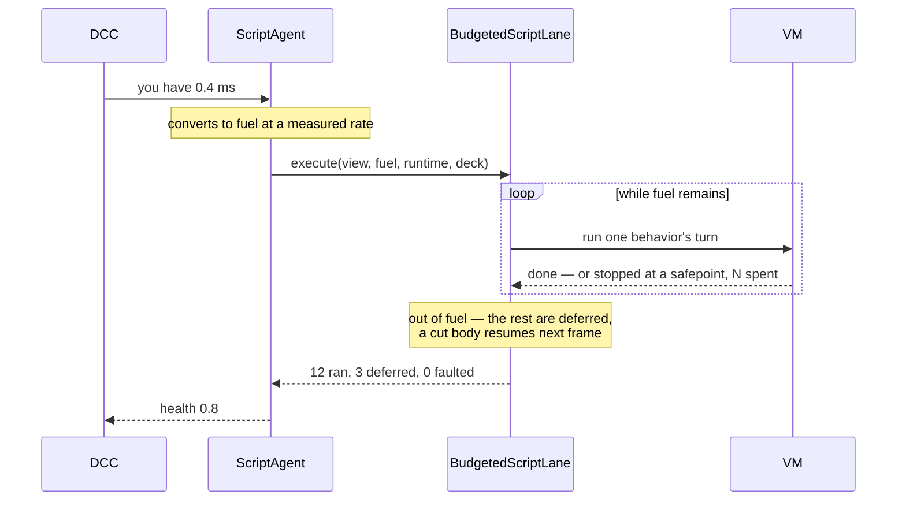

# Scripting (Ergon)

Ergon is Khora's gameplay language. It exists for one reason, and that reason is
the rest of this engine. This page explains how a script runs inside a frame,
how it stops and resumes, what a save keeps of it, and what happens to a script
that is part-way through something when its author edits it. For the language
itself — syntax, members, what compiles today — see the
[Ergon reference](../reference/ergon.md).

## Why not Lua, or C#, or WASM

Every subsystem in Khora can be told *"you have 0.4 ms this frame, work with
that"*. The renderer drops to a cheaper lane, shadows lose resolution, the audio
mixer sheds voices. [GORNA](./gorna.md) exists so those answers are negotiated
rather than guessed.

Gameplay was the one subsystem that could not answer. Hand a script a budget and
it will either finish or it will not, and if it does not, your options are to
let it overrun the frame or to kill it mid-decision. Neither is an answer.
Lua's debug hooks and Wasmtime's fuel can *interrupt* — but interruption is an
error path in both, and what a budget needs is for stopping to be **ordinary**.

So an Ergon script that runs out of budget stops at the next **safepoint** and
keeps the machine that stopped. Next frame resumes rather than restarts — and
because every safepoint has a name, the machine can even be resumed in code the
author edited since.


```mermaid
sequenceDiagram
    participant DCC
    participant Agent as ScriptAgent
    participant Lane as BudgetedScriptLane
    participant VM

    DCC->>Agent: you have 0.4 ms
    Note over Agent: converts to fuel at a measured rate
    Agent->>Lane: execute(view, fuel, runtime, deck)
    loop while fuel remains
        Lane->>VM: run one behavior's turn
        VM-->>Lane: done — or stopped at a safepoint, N spent
    end
    Note over Lane: out of fuel — the rest are deferred,<br/>a cut body resumes next frame
    Lane-->>Agent: 12 ran, 3 deferred, 0 faulted
    Agent-->>DCC: health 0.8
```

## A behavior at a glance

A script declares **behaviors**: state and logic attached to an entity.

```text
behavior Guard {
    int health = 100;

    void OnSpawn() { Log("on duty"); }

    on Damaged(int amount) {
        health -= amount;
        if (health <= 0) { Despawn(this); }
    }

    state Patrol {
        every 2s { Raise(this, "Look"); }
        on Spotted(Entity foe) { become Chase(foe); }
    }

    state Chase(Entity foe) {
        async void Attack() {
            await 0.5s;           // wind up
            Raise(foe, "Damaged", 10);
        }
    }
}
```

Fields hold what the guard *is*; lifecycle members (`OnSpawn`, `Update`, …)
are called by the engine; `on` handlers answer events; `every` and `after` are
schedules; `state` confines data and members to a phase of the behavior's life;
`async` members may `await` a duration. The [reference](../reference/ergon.md)
lists every construct and what compiles today.

## One turn

Each frame, each behavior gets a **turn**. A turn runs its steps in a fixed
order, each only when it applies:

<div class="kp-figure-frame">

{{#include ../images/scripting/turn.svg}}

</div>

The order is the guarantee. `OnLoad` runs before anything can observe a restored
instance. A body still under way — waiting on an `await`, or cut short by the
budget — resumes before anything new starts, so a behavior never runs two
answers to "what am I doing" at once; and while it is still waiting, nothing
else of that behavior runs this frame.

## Stopping is ordinary

Fuel is charged per instruction but **checked only at safepoints**: the start of
a statement, the head of a loop, a function's entry, just past a call's return.
A run that has spent its fuel goes on to the next one and stops there; what it
spent past the budget is reported as an overdraft, never hidden. Every loop's
back edge lands on a safepoint, so the stretch between two of them is
straight-line code: the compiler measures the worst one, and a run never
overdraws more than that.

<div class="kp-figure-frame">

{{#include ../images/scripting/sites.svg}}

</div>

Stopping only there is what keeps a stopped machine small and meaningful. At a
statement's start no half-evaluated expression is live — the machine is its
locals and a position. And every such position, and every place a frame stands
after an `await` or a call, is a **site** with a name the compiler derives from
the source: the kind of each enclosing statement and a short hash of what it
says. Those names are what let a machine survive an edit (below).

## Degrading defers whole behaviors

A budget that will not cover every behavior forces a choice. The lane could give
each behavior a smaller slice — every guard thinks a little less, uniformly. Or
it could give each its full turn, in order, until the budget runs out, and defer
the rest.

**It defers.** A behavior thinned every frame decides from a partial read of the
world, and a hundred of those is a hundred subtly wrong decisions that no one can
debug. A deferred behavior acts a frame late, which gameplay absorbs — a frame
late *is* what a frame is. The one behavior the budget runs out *inside* stops at
a safepoint and finishes its turn next frame, from where it stopped. The order is
the scene's, so the same entities are not starved every time.

This is why `report_status` reports the share of behaviors that got their turn
rather than a simple success flag: an agent claiming perfect health while half
its behaviors were deferred would tell the DCC nothing was wrong at exactly the
moment something was.

## Scripts run only while the game runs

The script agent is registered for one engine mode: `Playing`. In the editor,
**editing** is the editor's own mode, and no script runs while you arrange a
scene; Play switches to `Playing`, and **pause** keeps it — scripts still run, at
a delta of zero.

<div class="kp-figure-frame">

{{#include ../images/editor/play-modes.svg}}

</div>

Play does not resume anything: every scripted entity arrives fresh and runs
`OnSpawn`. Stop puts the scene back as it was. A shipped game starts in the mode
its `EngineApp::initial_mode` says — `Playing` unless it says otherwise.

## A script never writes the world

Effects are queued as `WorldCommand`s and applied by a data system during
[Maintenance](./the-frame.md). Nothing a script does reaches the ECS while it
runs.

That constraint is not bureaucracy — it is what buys the parallelism. Because
the script lane touches no `World`, its agent declares `AgentAccess::Isolated`
and can share a wave with other world-free agents. The rule and the performance
are the same fact.

## An event is never delivered in the frame it was raised

One behavior tells another something; the other hears it next frame.

Handling an event where it was raised opens a cascade with no bound — behavior A
raises to B, B raises to C, C raises back to A — and a budget that cannot bound
the work is not a budget. The one-frame delay is the bound.

Two queues feed one delivery:

| Source | Route |
|---|---|
| Behavior → behavior | waits on the `ScriptRuntime`, never leaves scripting |
| Engine → behavior (a collision, an input) | a bounded `Channel<ScriptEvent>` the engine fills and the lane drains |

They stay apart on purpose. Script-to-script mail routed through a shared
resource would cost two frames of latency and a deck slot nothing else reads.

## Saved mid-sentence

An entity's script is two components. `Script` is **authored**: which module and
behavior, and the values the author set — it is what a scene holds. `ScriptState`
is **runtime and resumable**: what the lane observed of the running behavior —
and it is what a [game save](./saves.md) holds:

| `ScriptState` keeps | So that, after a load… |
|---|---|
| the fields, by name | the guard has the health it had |
| the current state and its data | it is still chasing whom it was chasing |
| each timer's remaining time | `every 2s` fires when it would have |
| the body under way, frozen | an attack half-way through its wind-up finishes it |
| whether it has spawned | `OnSpawn` never runs twice |
| a fault, and the code it faulted under | a broken behavior stays off until its code changes |

A frozen body is written in names, not positions: its functions by name, its
literals by text, each frame by the site it stands at, with its locals by name.
That is what lets a save made today load into the script as it is next month.

After a restore, `OnLoad` runs first; the restored body waits behind it.

## Edits while running

Hot-reload replaces a module's program while the game runs. Two things must
survive it: what each instance *is*, and what each instance is *doing*.

### Fields, by name

An author edits a guard's `Update` while ten guards are patrolling. The ten
should still be where they were, with the health they had — restarting them
would make the feature useless for exactly the thing it is for.

Fields are carried across a recompile and matched **by name**. A slot means
nothing across a rebuild: inserting one field at the top shifts every slot after
it, and a positional carry-over would silently move one guard's health into
another's ammo. A field that was renamed keeps no value, and the engine says so
in a warning rather than letting the author find out from whatever the guard
does next.

### A body part-way through, in tiers

A guard is half-way through `Attack`, stopped at its `await`, when the author
edits the script. What the frozen machine holds is a position in the old code.
Resuming it blindly in the new code would run whatever now sits at that
position; abandoning it would lose the attack every time anyone touches the
file. Khora does neither. It takes the body back in the best of five tiers:

<div class="kp-figure-frame">

{{#include ../images/scripting/resume-tiers.svg}}

</div>

- **Exact** and **unchanged** rest on fingerprints. Each function's fingerprint
  is a stable hash of its code with everything it names — a callee, a literal, a
  field — hashed by name, so moving another function or adding a field leaves
  it alone. Renaming a local changes no code at all: it resumes exactly.
- **Rebuilt** rests on site names. A statement's name comes from what it says,
  and an `if` or a loop from its header only, so adding a line above the
  `await`, or editing the loop body around it, leaves the `await`'s site where
  it was. Each frame is laid out again at its site in the new code, every local
  moved to its new register by name, declaring block and type.
- **Restarted** reruns the member with the arguments it was first given — not
  what its parameters held when it stopped, since a body may reassign them. What
  ran before the cut may run again; the author edited the code it was running.
- **Abandoned** tells the behavior, which can repair what the lost body was in
  the middle of:

```text
void OnResumeFailed(string member) {
    if (member == "Chase.Attack") { become Patrol; }
}
```

The same tiers apply to a game save loaded into edited code, and every resume
below *exact* is listed in the lane's report — which body, which tier.

## Who owns what

The split follows [CLAD](./clad.md) exactly, and it did not always:

| Piece | Where | Why |
|---|---|---|
| The language and VM | `khora-script` | Depends on `khora-core` and the macros only, so the compiler and VM are testable without booting an engine |
| The scripting world (programs, live instances, pending mail, last report, measured rate) | `Runtime::services`, as `Arc<Mutex<ScriptRuntime>>` | It is subsystem state, not strategy state — the same place the physics provider lives |
| The work (reloads, delivery, running behaviors, measuring) | `BudgetedScriptLane` | Lanes execute |
| Choosing a lane for a budget | `ScriptAgent` | Agents are strategists and hold nothing else |

The agent used to own all of it. What that cost was not correctness but reach:
nothing else could see the live behaviors, because they were a private field of
a strategist.

## Adding a type to the language

Two places, not eight: a row in the `script_value_table!` X-macro
(`khora-core::script`), and a line of the `ergon_type!` declaration in
`khora-script::native::engine_types`. Exposing `Vec3` once cost an
`impl ScriptType`, a hand-written constructor, and an arm in each of four
converters across three crates — and the copies diverged, so
`Raise(e, "Hit", Vec3(…))` produced a value the delivery side did not know, the
lane treated that as a fault, and the target behavior was disabled for good.

It is deliberately a **declaration and not an attribute**. An attribute belongs
on the item it describes, and these types live in `khora-core`, which must not
carry scripting annotations. More decisively, a `ScriptType` needs a matching
`Value` variant, and those come from the table — so a game cannot expose a type
of its own this way whatever the syntax. What is being written down is not "this
struct is scriptable" but "this table row is reachable from a script".

If a change needs a new arm in four files, the table is being bypassed.

---

*Next: the [Ergon reference](../reference/ergon.md) for the language,
[Agents and Lanes](./agents-and-lanes.md) for the strategist/executor split this
page assumes, or [GORNA](./gorna.md) for how the 0.4 ms is decided.*
