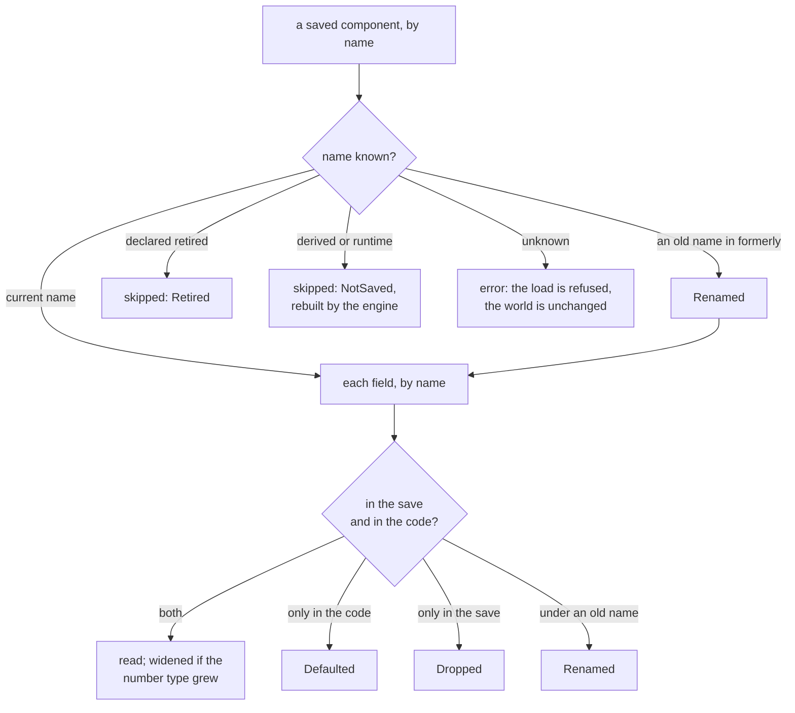
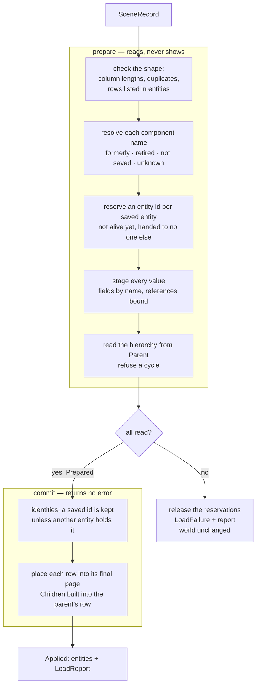

# Serialization

Saving and loading scenes as **records**: what a save holds, by name, in the shape
of the world's pages. This page explains *why* a save is shaped that way and how
the engine picks an encoding for it. It is an explanation, not a recipe — for the
steps to save and load a scene, see
[How-to: save and load scenes](../how-to/save-and-load-scenes.md); for the bytes,
see [File formats](../reference/formats.md).

---

## The whole path at a glance

A save and a load are the same path, walked in opposite directions. In the middle
sits the **scene record**: the world's authored content, by name, page by page —
independent of how it is then written to bytes.

{{#include ../images/persistence/round-trip.svg}}

- **Capture** reads the live pages and keeps only what a save holds: the
  components an author or a tool wrote, each entity under its persistent id.
- **Encode / decode** turn the record into bytes and back. Three encodings exist;
  all of them carry exactly the same record. A fourth form, the **snapshot**, skips
  the record for speed — see below.
- **Prepare / commit** bring a record into a world: everything is checked first,
  then the pages are built — or nothing changes at all.

## Why records

A save outlives the code that wrote it. Components gain fields, lose fields and
change names; a project's scenes are written by one version of the engine and read
by the next. A save that recorded component values positionally — field after field,
as the type laid them out the day it was written — breaks the moment a type
changes, and every change then needs a hand-written migration.

So a save holds **records**: each component under the name it registers, each field
under its name. Reading a record matches names, not positions, and adapts what
differs:

- a field the save predates takes its default;
- a field the code no longer has is dropped;
- a field, variant or component renamed in code is found under the old name its
  type lists as `formerly`;
- a number is widened when that loses nothing — never narrowed;
- a reference to an entity the save does not hold is cut.

None of that is an error, and none of it is silent: every adaptation is an entry in
the **load report** the caller receives, naming the entity, the component and the
field. What *is* an error is a component name nothing registers — a save holding
data the engine cannot place is refused, not trimmed. A component removed on
purpose is declared **retired**; a save holding it loads, skips it and says so.
So is a component the engine derives: a save holding one — written by a tool, or
before the component stopped being saved — skips it and rebuilds it.

## Pages, persistent ids, provenance

Khora's ECS stores entities in pages, one per component signature, columns of
values side by side. The page is the unit of iteration, of compaction — and of
serialization. A record keeps that shape: one page record per signature, the rows'
ids, one column of values per component. Capture walks the live pages; load builds
pages directly, row by row, so a loaded entity lands in its final page at once — no
entity is migrated from page to page while a scene loads. What changes is the
representation of a column, never its bytes: a save holds named values, not the
memory of a page, so a layout the data layer adapts at runtime is never written to
disk.

{{#include ../images/persistence/page-to-record.svg}}

Entities are referenced by **persistent id**, not by their runtime index. An
authored entity's id is random and scene-scoped; any other entity draws from the
*created* namespace — and only when something needs its identity: a save, a lookup.
Spawning and despawning entities nobody saves costs no identity work at all. A
reference inside a component — a `Parent`, a target —
is saved as the persistent id it names, and loading binds it back to the entity
that id now belongs to.

{{#include ../images/persistence/persistent-id.svg}}

| | Runtime `EntityId` | `PersistentId` |
|---|---|---|
| What it is | an index and a generation into the entity store | 64 bits; the top bit says which namespace |
| Authored entity | changes on every load | random 63 bits, chosen once, kept by every save |
| Created at runtime | changes on every load | the next free number in the *created* namespace, given the first time it is needed |
| In a save | never | every row and every entity reference |

A reference to an entity the save does not hold — deleted, or outside a saved
subtree — loads as a reference to **nowhere**: one entity id per world, reserved
once, never alive and never handed to a spawn, so such a reference can never come to
name a live entity. The report says where each one was.

Only what was **authored** is saved. A component's provenance says whether it was
authored, tool-authored, derived or runtime state; derived values such as
`Children` or a global transform, and runtime state, are rebuilt on load rather
than stored.

## Atomic loading

Loading is two steps. **Prepare** reads the whole record: it checks names, shapes
and references, reserves the entities, and stages every value — touching nothing
the world shows. **Commit** then places the staged rows. A file that fails at any
point of the first step leaves the world exactly as it was, and the caller gets the
reason with the report of what had been read so far. Replacing a scene uses the
same split: the new scene is staged before the old one is removed.

## Goals and encodings

A save has more than one consumer. The editor wants something small and fast; a
diff in version control wants text; an external tool wants a format it can read.
The developer states a **`SerializationGoal`** — the intent — and the engine maps it
to an **encoding**:

| Goal | Encoding |
|---|---|
| `HumanReadableDebug`, `LongTermStability` | Text — pretty-printed JSON |
| `EditorInterchange`, `SmallestFileSize` | Compact — Khora's binary, page-shaped and column-major |
| `PortableBinary` | MessagePack, fields by name |
| `FastestLoad` | Snapshot — positional, bound to the build's schema |

The three record encodings carry the same record, so stability does not depend on
which one wrote a file: the rules above hold for a compact save exactly as for a text
one. The compact encoding stores each component and field name once, in tables, and
refers to them by index — the names are there, they are just not repeated per row.

The **snapshot** is the exception, on purpose. It writes values by position — no
names, nothing to match — and pays for that speed with a contract: every component
is listed with the fingerprint of its schema, and a snapshot whose fingerprints are
not the running build's is refused whole. That is how engines ship cooked data
(Unity's type-tree hashes, Unreal's unversioned properties): a fast, nameless body
beside a stable, named source. The editor's Play/Stop state is a snapshot; a scene a
project keeps is a record.

## One service, one file format

Scene save and load is a **service**, not an agent — there are no per-frame
strategies to negotiate, so it sits on the same side of the line as asset loading.
`SerializationService` exposes `save_world` (take a goal, produce a scene file),
`load_world` (bring a scene in beside what is there) and `replace_world` (swap the
world's contents for the scene's). Each load returns its report.

Every scene file is a fixed header — a magic number, the format version, the
encoding id, the payload length — followed by the payload. The header is what makes
loading symmetric: the caller never says how a file was written.

## How components serialize

Component serialization is generated, not hand-written. Deriving `Component` on a
type generates a serializable mirror, the conversions to and from the live type,
and a self-registration so loading finds the type by name with no hand-maintained
list. Fields marked `#[component(skip)]` — GPU handles, runtime caches — are left out
of the mirror and rebuilt on load, typically by the asset system. A type renamed in
code keeps its saves readable with `#[component(formerly = "OldName")]`; a field,
with `#[component(formerly = "old_name")]`.

## Play-mode snapshots

Pressing Play snapshots the world; pressing Stop restores it. The snapshot is a
`save_world` into memory under `FastestLoad` — the same build writes and reads it,
so the positional form is safe — and the restore a `replace_world`: atomic, with
every identity kept, so references a script holds land on the restored entities.

One honest caveat: **physics state is not preserved** across a snapshot. On restore,
the physics engine rebuilds from component data, so velocities and contacts reset to
defaults.

## Next steps

- [How-to: save and load scenes](../how-to/save-and-load-scenes.md) — save with a
  goal and load a scene with the real service API.
- [File formats](../reference/formats.md) — the header, the record, the encodings.
- [Data and the ECS](./ecs.md) — pages, and the component model the mirror is
  generated from.
- [Assets](./assets.md) — how scene references to assets resolve by UUID.
