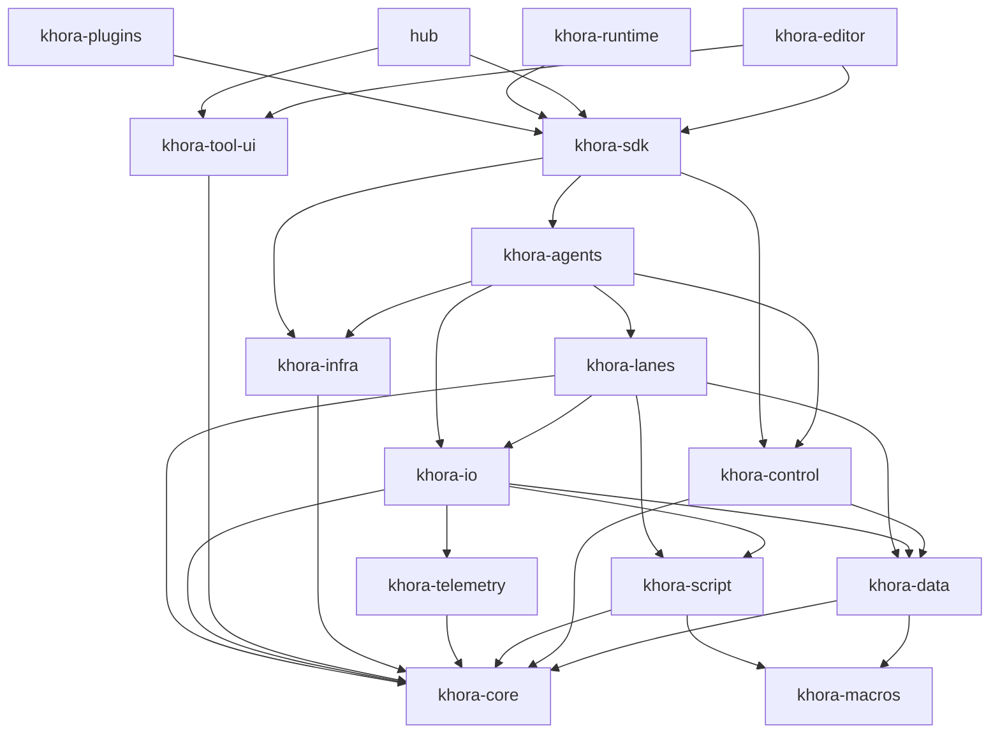

# Crate map

The authoritative map of the workspace: every crate, its one-line role, the
dependency direction, and a flat "where things live" lookup.

> *Why* this layering exists is the [CLAD](../concepts/clad.md) concept page. This
> page is the lookup table CLAD defers to.

## The crates

Khora is **17 workspace members**: 14 `khora-*` plus `sandbox`, `xtask`, and
`hub`. `khora-macros` is a fifteenth `khora-*` crate but a *path* crate — a
dependency of `khora-data` and `khora-script`, not a workspace member.

| Crate | One-line role |
|---|---|
| `khora-core` | The trait floor — traits, math, GORNA types, the `Runtime` containers, scene format. Depends on nothing else in the workspace. |
| `khora-macros` | The `#[derive(Component)]` and `#[ergon_fn]` proc macros (path crate). |
| `khora-data` | CRPECS ECS, component storage, SoA/AGDF layout, Flows, scene serialization strategies. |
| `khora-control` | The DCC, GORNA arbitration, cost model, scheduler, the Substrate Pass. |
| `khora-script` | **Ergon** — the gameplay language: lexer, parser, bytecode, VM, persistent field arena, hot-reload. Depends on `khora-core` and `khora-macros` only, so the compiler and VM are testable without booting an engine. |
| `khora-lanes` | Hot-path Lanes — render, physics, audio, UI, script. |
| `khora-agents` | Strategist Agents — one per `LaneKind` — plus `PhysicsQueryService`. |
| `khora-infra` | Concrete backends, one subfolder each: wgpu, Rapier3D, an in-house physics backend, CPAL, Taffy, winit, native telemetry. Owns the `.wgsl` files and their composition. |
| `khora-io` | Asset service, VFS, serialization service, pack/file loaders, hot-reload watchers. |
| `khora-telemetry` | Metrics, monitors, telemetry events. |
| `khora-plugins` | Plugin loading and registration. |
| `khora-sdk` | The single public API for game developers (façade). |
| `khora-tool-ui` | The first-party **tool** design system: brand palette and shared widgets. Deliberately outside the SDK, so a game built on Khora never compiles the engine vendor's brand. Used by `khora-editor` and `hub`. |
| `khora-editor` | The editor application built on the SDK (panels, gizmos, dock). |
| `khora-runtime` | The generic player binary, stamped with packed assets. |
| `sandbox` | Example game using the SDK (`examples/sandbox`). |
| `xtask` | Build automation (`cargo xtask …`). |
| `hub` | Project manager / engine launcher. |

## Dependency direction

Dependencies flow **downward only** — never introduce a cycle. Each tier may
depend on anything above it and nothing below:

| Tier | Crates | Depends on |
|---|---|---|
| floor | `khora-core`, `khora-macros` | nothing |
| on the floor | `khora-data`, `khora-control`, `khora-script`, `khora-telemetry`, `khora-infra`, `khora-tool-ui` | core (+ `macros` for data/script, + `data` for control) |
| middle | `khora-io`, `khora-lanes` | core, data, script, telemetry / core, data, io, script |
| strategists | `khora-agents` | everything above, **including `khora-infra`** |
| façade | `khora-sdk` | agents, control, core, data, infra, io, lanes, telemetry |
| apps | `khora-editor`, `hub`, `khora-runtime`, `khora-plugins` | sdk (+ `tool-ui` for editor and hub) |

Two are easy to get backwards, and older revisions of this page had them so:
**`khora-agents` depends on `khora-infra`**, not the reverse — a strategist
needs the concrete backends it dispatches against. And **`khora-infra` depends
on `khora-core` only**: it sits on the floor beside `khora-data`, not on top of
the stack.

Abstract traits live in `khora-core`; concrete backends live in per-backend
subfolders under `khora-infra` (`graphics/wgpu/`, `physics/rapier/`,
`physics/khora/`, `audio/cpal/`, `ui/taffy/`, …). Changing a `khora-core` trait
means updating every downstream implementation in the same change.

## Where things live

A flat lookup for "I want to find X."

| Concern | Crate / module |
|---|---|
| Lane trait | `khora-core::lane` |
| Agent trait | `khora-core::agent` |
| Math types | `khora-core::math` |
| GORNA types | `khora-core::control::gorna` |
| Runtime containers (`Services` / `Backends` / `Resources`) | `khora-core::runtime` |
| Scene file format + `SerializationGoal` | `khora-core::scene` |
| ECS World and components | `khora-data::ecs` |
| Component storage / pages / archetypes | `khora-data::ecs` |
| Flows (read-only projectors) | `khora-data::flow` |
| Scene serialization strategies | `khora-data::scene` |
| VFS and asset loading | `khora-io::asset`, `khora-io::vfs` |
| Serialization service | `khora-io::serialization` |
| Render pipelines | `khora-lanes::render_lane` |
| WGSL shaders and their composition | `khora-infra::graphics::shader` (28 of 30 files; the two raw-string exceptions live in `khora-lanes::render_lane::shaders`) |
| Physics lanes | `khora-lanes::physics_lane` |
| Audio lanes | `khora-lanes::audio_lane` |
| Script lane (fuel, deferral, hot-reload) | `khora-lanes::script_lane` |
| Asset decoders | `khora-io::asset::decoders` — services, not lanes: a decoder has no per-frame strategy to negotiate |
| Transform propagation, ECS maintenance | `khora-data::ecs::systems` — data systems, for the same reason |
| Agent implementations | `khora-agents` |
| Ergon language (lexer, parser, bytecode, VM) | `khora-script` |
| Script ↔ engine value bridge | `khora-script::bridge`, `khora-core::script` |
| Scheduler and GORNA arbitration | `khora-control` |
| wgpu backend | `khora-infra::graphics::wgpu` |
| Rapier backend | `khora-infra::physics::rapier` |
| In-house physics backend (incomplete) | `khora-infra::physics::khora` |
| CPAL backend | `khora-infra::audio::cpal` |
| Taffy backend | `khora-infra::ui::taffy` |
| Resource monitors | `khora-infra::telemetry` |
| User-facing API | `khora-sdk` |
| Editor UI | `khora-editor` |
| Sandbox app | `examples/sandbox` |

---

*The descent through these crates — Control → Agent → Lane → Data — is explained
in [CLAD](../concepts/clad.md). The public surface of `khora-sdk` is mapped in
[SDK surface](./sdk.md).*
