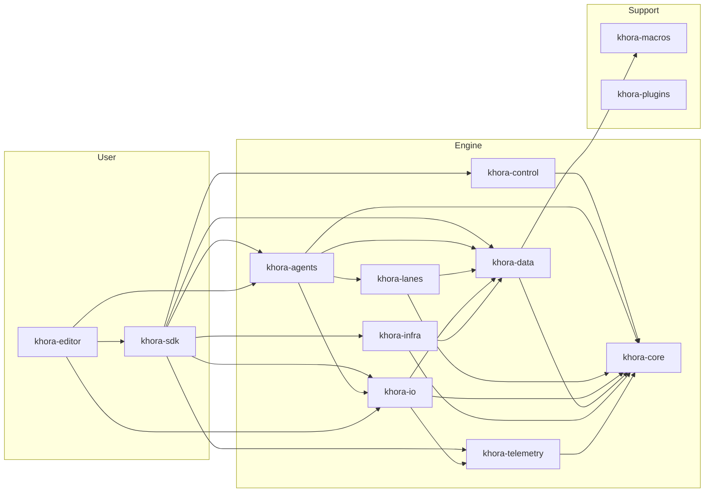

# Crate map

The authoritative map of the workspace: every crate, its one-line role, the
dependency direction, and a flat "where things live" lookup.

> *Why* this layering exists is the [CLAD](../concepts/clad.md) concept page. This
> page is the lookup table CLAD defers to.

## The crates

Khora is **16 crates**: 13 `khora-*` plus `sandbox`, `xtask`, and `hub`. Twelve
`khora-*` crates are workspace members; `khora-macros` is a path crate (a
build-dependency of `khora-data`, not a workspace member).

| Crate | One-line role |
|---|---|
| `khora-core` | The trait floor — traits, math, GORNA types, the `Runtime` containers, scene format. Depends on nothing else in the workspace. |
| `khora-macros` | The `#[derive(Component)]` proc macro (path crate). |
| `khora-data` | CRPECS ECS, component storage, SoA/AGDF layout, Flows, scene serialization strategies. |
| `khora-control` | The DCC, GORNA arbitration, cost model, scheduler, the Substrate Pass. |
| `khora-lanes` | Hot-path Lanes — render, physics, audio, asset, scene, UI; the WGSL shaders. |
| `khora-agents` | Strategist Agents — one per `LaneKind` — plus `PhysicsQueryService`. |
| `khora-infra` | Concrete backends: wgpu, Rapier3D, CPAL, Taffy, winit, native telemetry. |
| `khora-io` | Asset service, VFS, serialization service, pack/file loaders. |
| `khora-telemetry` | Metrics, monitors, telemetry events. |
| `khora-plugins` | Plugin loading and registration. |
| `khora-sdk` | The single public API for game developers (façade). |
| `khora-editor` | The editor application built on the SDK (panels, gizmos, dock). |
| `khora-runtime` | The generic player binary, stamped with packed assets. |
| `sandbox` | Example game using the SDK (`examples/sandbox`). |
| `xtask` | Build automation (`cargo xtask …`). |
| `hub` | Project manager / engine launcher. |

## Dependency direction

Dependencies flow **downward only** — never introduce a cycle:

```
khora-core
  └─► khora-data / khora-control  (and khora-macros, khora-telemetry)
        └─► khora-lanes
              └─► khora-agents
                    └─► khora-infra
                          └─► khora-sdk
                                └─► khora-editor / khora-runtime / sandbox
```



Abstract traits live in `khora-core`; concrete backends live in per-backend
subfolders under `khora-infra` (`graphics/wgpu/`, `physics/rapier/`,
`audio/cpal/`, `ui/taffy/`, …). Changing a `khora-core` trait means updating every
downstream implementation in the same change.

## Where things live

A flat lookup for "I want to find X."

| Concern | Crate / module |
|---|---|
| Lane trait | `khora-core::lane` |
| Agent trait | `khora-core::agent` |
| Math types | `khora-core::math` |
| GORNA types | `khora-core::control::gorna` |
| Runtime containers (`Services` / `Backends` / `Resources`) | `khora-core::runtime` |
| Scene file format + `SerializationGoal` | `khora-core::scene` |
| ECS World and components | `khora-data::ecs` |
| Component storage / pages / archetypes | `khora-data::ecs` |
| Flows (read-only projectors) | `khora-data::flow` |
| Scene serialization strategies | `khora-data::scene` |
| VFS and asset loading | `khora-io::asset`, `khora-io::vfs` |
| Serialization service | `khora-io::serialization` |
| Render pipelines | `khora-lanes::render_lane` |
| WGSL shaders | `khora-lanes::render_lane::shaders` |
| Physics lanes | `khora-lanes::physics_lane` |
| Audio lanes | `khora-lanes::audio_lane` |
| Asset decoder lanes | `khora-lanes` (asset-loader lanes) |
| Scene / transform lanes | `khora-lanes::scene_lane` |
| Agent implementations | `khora-agents` |
| Scheduler and GORNA arbitration | `khora-control` |
| wgpu backend | `khora-infra::graphics::wgpu` |
| Rapier backend | `khora-infra::physics::rapier` |
| CPAL backend | `khora-infra::audio::cpal` |
| Taffy backend | `khora-infra::ui::taffy` |
| Resource monitors | `khora-infra::telemetry` |
| User-facing API | `khora-sdk` |
| Editor UI | `khora-editor` |
| Sandbox app | `examples/sandbox` |

---

*The descent through these crates — Control → Agent → Lane → Data — is explained
in [CLAD](../concepts/clad.md). The public surface of `khora-sdk` is mapped in
[SDK surface](./sdk.md).*
