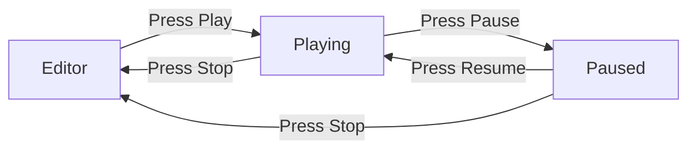

# Editor

The editor application — panels, gizmos, play mode, scene I/O.

- Document — Khora Editor v1.0
- Status — Authoritative
- Date — May 2026

---

## Contents

1. What the editor is
2. Workspace anatomy
3. Modes
4. Play mode
5. Scene I/O
6. Asset browser
7. Gizmos and selection
8. Build Game
9. The Control Plane
10. For game developers
11. For engine contributors
12. Decisions
13. Open questions

---

## 01 — What the editor is

`khora-editor` is a separate binary built on the SDK. It opens a project (a folder containing `.kscene` files and assets), authors scenes through ECS-aware panels, and previews them with **play mode** — a one-button switch between editing and full simulation.

The editor is not a separate engine. It uses the same agents, lanes, and ECS as a shipping game — **all of them, all the time**. What Play changes is the *simulation clock* and what the panels do on top of the world.

The visual language — colors, typography, panels, voice — is documented in [Editor design system](../design/editor.md). This chapter covers the **architecture**, not the look.

## 02 — Workspace anatomy

```
+--------------------------------------------------------------+
| Title bar — brand, project name, window controls            |
+----+----------------------------------------------+----------+
|    |                                              |          |
| Sp |               Viewport                       | Inspect  |
| in |                                              | -or      |
| e  |                                              |          |
|    |                                              |          |
+----+----------------------------------------------+----------+
| Bottom dock: Assets · Console · GORNA stream                |
+--------------------------------------------------------------+
| Status bar — engine state, FPS, build status                |
+--------------------------------------------------------------+
```

| Region | Purpose |
|---|---|
| **Title bar** | Brand, project name, window controls |
| **Spine** | Mode rail (Scene, Control Plane) |
| **Hierarchy** | Tree of entities, left of the viewport |
| **Viewport** | The 3D scene with floating gizmos |
| **Inspector** | Components of the selected entity, right of the viewport |
| **Bottom dock** | Assets browser, console, GORNA stream |
| **Status bar** | Engine state, FPS, build status, GORNA pulse |

Full anatomy and pixel-level layout in [Editor design system](../design/editor.md).

## 03 — Modes

Two workspaces ship today, switched from the Spine:

| Mode | Purpose |
|---|---|
| **Scene** | 3D editing (default) |
| **Control Plane** | Engine telemetry and GORNA stream |

Each mode has its own panel layout. We commit to opinionated defaults — Unity and Unreal let you arrange panels freely, and most users keep the defaults forever. We pick the layouts users won't want to change. Further authoring workspaces (2D canvas, node graph, animation, shader graph) will be added as they are built.

## 04 — Play mode



When you press **Play**:

1. The current world is serialized using `SerializationGoal::FastestLoad` (Archetype strategy).
2. The snapshot is stored in memory.
3. The editor's `PlayMode` (UI-state) becomes `Playing`.
4. The editor sets the engine's **simulation clock scale** to `1.0`.
5. The play camera takes over from the editor camera.

When you press **Stop**:

1. The editor's `PlayMode` becomes `Editing`.
2. The simulation clock scale goes back to `0.0`.
3. The snapshot is deserialized into the world.
4. The editor camera resumes.

The snapshot uses the `EditorInterchange` goal — the Recipe strategy, bincode — not
the page-level Archetype one. `FastestLoad` was tried and abandoned: it lost `Name`
components and corrupted the heap. See [Serialization](../concepts/serialization.md).

| Aspect | Editing | Playing |
|---|---|---|
| Active agents | All eight | All eight — the same ones |
| Simulation clock | `Time::scale == 0.0` — no fixed sub-steps run | `Time::scale == 1.0` |
| Camera | Editor camera (free orbit) | Scene cameras (active ones) |
| Input | Editor input (gizmos, selection) | Game input (player controls) |
| ECS | Mutable — user edits directly | Snapshot-based — original world preserved |
| Rendering | Viewport texture + gizmos + overlay | Full scene, no editor chrome |

> **`PlayMode` never leaves the editor.** It is the editor's UI state — buttons,
> panel visibility, what the user sees. The only thing that crosses into the engine
> is a **number**: the simulation clock's scale.
>
> That is deliberate. At scale `0.0` the fixed-step accumulator never fills, so no
> body integrates and no script timer counts down, while rendering carries on at
> real time. A pause menu, a cutscene and a slow-motion hit all write the same
> number, which makes the editor one caller among several rather than a case the
> engine has to know about.
>
> `EngineMode` is a separate axis the DCC reads to scope agents to a mode. The
> mechanism exists (`DccService::register_agent_for_mode`), but **nothing uses it
> today** — every built-in agent is registered for all modes. Earlier revisions of
> this page described an editor/playing agent filter that was never built.

> **Physics state is not preserved across play mode.** Velocities, contacts, and sleep state are reset on restore. The ECS components are restored exactly; the physics world rebuilds from those components.

## 05 — Scene I/O

The editor uses `SerializationService` for all scene operations. As of v0.4 it goes through `ProjectVfs` (the editor's wrapper around `khora_io::AssetService` + `AssetWatcher`), so saves and loads inside the project use the same UUID identity that a release pack would:

| Action | What happens |
|---|---|
| **Open project** | `ProjectVfs::open` recursively scans `<project>/assets/`, builds the in-memory UUID index, registers all decoders, arms a filesystem watcher. The asset browser reads off the resulting VFS. |
| **New scene** | Editor creates an empty world, ready for editing |
| **Save scene** | Encoded with `SerializationGoal::EditorInterchange` (Recipe — compact, structured) and written via `AssetWriter` so the new file enters the VFS index immediately |
| **Save scene as** | Same, with a new path. Out-of-project paths fall back to raw `std::fs` and log a warning. |
| **Load scene** | Double-click a `.kscene` in the asset browser, or File → Open. Project-internal paths route through `AssetService::load_raw` (UUID-keyed). |
| **Play / Stop** | World snapshot + restore via `SerializationService` with `FastestLoad` (Archetype — no human-readable round-trip needed for in-memory revert). |

Scene files are compact-binary in development today. RON dumps for diffing are available through `SerializationGoal::HumanReadableDebug` — not yet wired to a menu, but the strategy is registered in the service.

## 06 — Asset browser

The Assets panel in the bottom dock is a real file explorer over `<project>/assets/`, not just a read-only list. It reads off the same `ProjectVfs` the rest of the editor uses, so every operation goes through the identity registry — renaming or moving an asset here **does not break its references** (see [Scene I/O](#05--scene-io) and [File formats — asset identity registry](formats.md#asset-identity-registry)).

| Interaction | Result |
|---|---|
| **Left-click** | Selects a tile. |
| **Double-click** | Opens / activates it (a `.kscene` loads, other types open). |
| **Right-click a file tile** | Context menu: Open, Reveal in Explorer, Rename (inline), Duplicate, Delete, plus "Assign to selected" for materials. |
| **Right-click a folder** | New Folder, Rename, Delete, Reveal. |
| **Right-click empty space** | New Folder, Reveal Current Folder, Refresh. |
| **Header buttons** | More (menu), Trash (delete selected), Filter (category menu). |

Empty folders are shown, so **New Folder** produces a usable target immediately. **Delete goes to the OS recycle bin** (via the `trash` crate), so a mistaken delete is reversible from the system trash rather than lost.

**Drag & drop.** Drag a tile onto a folder in the tree to **move** it (the move is mediated by the editor, so the identity registry freezes the UUID and references survive). Drag a tile into the **3D viewport** to instantiate it: a mesh spawns an entity at the drop point, a prefab instantiates its subtree, a scene loads, and a texture or material assigns to the selected entity.

> **Rename/move only inside the editor.** The registry freeze happens because the editor mediates the file operation. Renaming or moving an asset from a shell or `git` bypasses that path — see [Troubleshoot](../how-to/troubleshoot.md#assets--vfs).

## 07 — Gizmos and selection

The viewport has floating gizmos for the selected entity:

- **Move** — three axis arrows.
- **Rotate** — three rings, one per axis.
- **Scale** — three axis arms with end cubes.

Selection is tracked in `EditorState.selection` (a set — multi-select is supported), with `EditorState.inspected` naming the one the Inspector shows. Clicking an entity in the hierarchy or the viewport sets it; `Esc` clears it. Selected entities get a 2 px gold inner-stroke outline (1 px dark outer stroke), visible against any background.

Numeric fields in the Inspector are draggable scrubbers — drag horizontally to change a value, modifier keys for precision. No spinner buttons.

## 08 — Build Game

`Build → Build Game…` packages the open project for a target OS. The editor picks one of two **strategies** automatically, based on the presence of `<project>/Cargo.toml`:

### Strategy A — Runtime stamp (default, data-only projects)

Used when the project has no `Cargo.toml` — the typical state for a fresh project from the hub.

1. **Pack** — `khora_io::asset::PackBuilder` walks `<project>/assets/` (sorted by forward-slash relative path), resolves each file's UUID through the project's identity registry (a frozen entry if one exists, else the `AssetUUID::new_v5(rel_path)` default — the same registry the editor's dev VFS reads, so dev and release UUIDs match by construction; see [File formats — asset identity registry](formats.md#asset-identity-registry)), and writes the two-file release layout: `data.pack` (16-byte header + concatenated asset bytes) + `index.bin` (`Vec<AssetMetadata>` with each variant rewritten to `AssetSource::Packed { offset, size }`).
2. **Stamp runtime** — the editor copies the pre-built `khora-runtime` for the chosen target into the output directory and renames it after the project. The runtime binary lives next to the editor (release-archive layout) or in the hub's `~/.khora/engines/<version>/runtime/` cache.
3. **Write `runtime.json`** — read by the runtime at boot to learn which scene to auto-load.

Cross-platform is trivial: the pre-built runtime exists for every target shipped by `release.yml`, so building Linux from a Windows host is just a file copy.

### Strategy B — Cargo build (native-Rust projects)

Used when the user has clicked **"Add Native Code"** on the project's hub card, which scaffolds `Cargo.toml` + `src/main.rs` (calling `khora_sdk::run_default()` by default — same as the runtime, but linked into a binary that *can* register custom components / agents / lanes when the user edits `main.rs`).

1. Same `PackBuilder` step as Strategy A.
2. `cargo build --release --manifest-path <project>/Cargo.toml` compiles the user's binary. stdout / stderr stream into the editor's console panel.
3. The compiled binary is copied into the output directory under the project name.
4. Same `runtime.json` companion is written.

Host-only in v1 (Rust cross-compilation is fragile without per-target toolchains). The editor refuses non-host targets on this strategy with a clear error pointing the user to "run the editor on the target OS".

### Output layout (identical between strategies)

```
<project>/dist/<target>/
├── <project_name>{.exe}     # renamed khora-runtime OR compiled user binary
├── data.pack
├── index.bin
└── runtime.json
```

Run the binary directly — both `khora-runtime` and any project compiled via `khora_sdk::run_default()` auto-detect PackLoader (when `data.pack` + `index.bin` are siblings) or FileLoader (when a loose `assets/` directory is a sibling instead, used by engine contributors who want to skip packing during iteration).

### Why two strategies

The choice is **deterministic** (presence of `Cargo.toml` is the contract) and **opt-in** (the user explicitly upgrades a project to native Rust by clicking the hub button). Most projects stay on Strategy A and benefit from trivial cross-platform export. Strategy B is the escape hatch when raw performance, compile-time safety, or new engine primitives are needed. Future scripting (`assets/scripts/`, hot-reloadable, see [Assets](../concepts/assets.md)) plugs into both strategies transparently — scripts are just assets that get packed.

## 09 — The Control Plane

The second Spine mode is the **Control Plane** — a workspace dedicated to the engine's mind.

| Region | Purpose |
|---|---|
| **Lane Timeline** (top) | Horizontal lanes per subsystem, execution windows as colored bands |
| **GORNA Stream** (bottom-left) | Live feed of negotiation: timestamp, subsystem, suggestion, accept/reject |
| **Meters Wall** (bottom-right) | Frame time, GPU %, memory, agent budget, assets pending |

The Control Plane is not a profiler popup. It is a first-class workspace. The whole pitch of Khora is the self-optimizing architecture; the editor surfaces that intelligence as a place you go to, not a window you launch.

Full design in [Editor design system](../design/editor.md), section 09.

---

## For game developers

You typically run the editor against your project folder:

```bash
cargo run -p khora-editor -- --project /path/to/my_project
```

Inside the editor, you author scenes. Each scene is one `.kscene` file. Spawn entities by dragging a vessel from the Assets panel into the viewport, or by right-clicking in the hierarchy → Add Entity. Edit components in the Inspector. Save with `Ctrl+S`.

To preview your scene in play mode, press the Play button. Your `EngineApp::update` runs every frame, exactly as in your shipping game.

## For engine contributors

The editor is an application built on the SDK — it implements `EngineApp` and
contributes its agents through `AgentProvider`.

| Where | Contents |
|---|---|
| `crates/khora-editor/src/panels/` | Scene tree, properties, asset browser, viewport, console, control plane |
| `crates/khora-editor/src/chrome/` | Title bar, menus, the window frame |
| `crates/khora-editor/src/widgets/` | Editor-specific widgets (tiles, inspector fields) |
| `crates/khora-editor/src/ops.rs` | High-level scene operations (spawn, despawn, parent, add component) |
| `crates/khora-editor/src/commands.rs` | The command dispatch the menus and palette go through |
| `crates/khora-editor/src/scene_io.rs` | Scene save / load via `SerializationService` |
| `crates/khora-editor/src/mod_gizmo.rs`, `picking.rs` | Gizmo dispatch and viewport picking |
| `crates/khora-editor/src/project_vfs.rs` | The live asset index — VFS, watcher and identity registry |

`EditorState` — selection, mode, pending operations — is **not** in the editor
crate. It lives in `crates/khora-core/src/ui/editor/state.rs`, alongside the dock
tree, the gizmo interaction model and the command history, because the render
lanes and the egui backend need the same vocabulary and neither may depend on the
editor. The engine's design keeps that vocabulary backend-agnostic; the editor is
one consumer of it.

To add a panel: write its render function under `panels/`, register it in the
workbench, and route any mutation through `ops.rs` so the action layer stays the
single place the world changes.

To add a gizmo type: extend the interaction model in
`crates/khora-core/src/ui/editor/gizmo_interact.rs`, draw it from the engine-side
`GizmoLane`, and convert drags into `Transform` mutations through `ops.rs`.

The editor depends on `khora-sdk` and `khora-tool-ui`, and nothing else from the workspace — there is no SDK bypass. Earlier revisions of this page described one; the manifest never had it.

## Decisions

### We said yes to
- **Editor as a separate binary.** The editor is a different application from a shipping game — different lifecycle, different active agents, different input.
- **Mode-first layouts.** Opinionated defaults beat infinite customization for 95% of users.
- **Play mode through scene snapshot.** Press Play, run the game; press Stop, you are back where you were. No state pollution.
- **The editor is an ordinary SDK application.** It depends on `khora-sdk` plus the first-party `khora-tool-ui` design system, which the SDK deliberately does not re-export so a game never compiles the engine vendor's brand.

### We said no to
- **Free-form panel docking.** Powerful but exhausting. We pick layouts users won't want to change.
- **Telemetry charts in the main UI.** Telemetry belongs in the Control Plane mode. Scene mode shows the scene.
- **Editor chrome during play mode.** Play mode is a near-shipping preview. Chrome reappears on stop.

## Open questions

1. **Multi-window.** How does Spine + Modes work when the user pops the viewport to a second monitor? Likely the popped window keeps its own Spine, with one mode lit.
2. **Plugin UI surface.** Third-party plugins need a place to live — probably the Inspector as additional component cards, but the contract is undefined.
3. **Collaboration.** Real-time multi-user editing (shared cursors, shared selections) is on no roadmap, but the architecture does not preclude it.

---

*Next: writing your own agent or lane. See [Extending Khora](../tutorials/extending-the-engine.md).*
