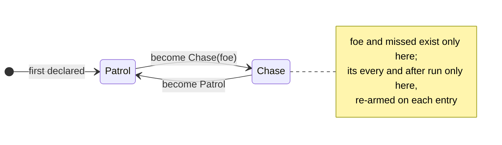

# Ergon reference

The Ergon language as it compiles and runs **today**: every construct, with an
example, and an honest line on what parses but does not run yet. For how a
script runs inside a frame — turns, safepoints, saves, edits — see
[Scripting](../concepts/scripting.md).

Each construct is marked:

| Mark | Means |
|---|---|
| **runs** | compiles and runs, pinned by the conformance suite |
| **checks** | the type checker accepts it; the compiler refuses it — "cannot be compiled yet" |
| **parses** | accepted by the parser, refused or ignored after |

The conformance suite (`crates/khora-script/tests/it/conformance.rs`) is the
source of truth: every *runs* row gives the same result when its execution is cut
at any fuel slice from 1 to 60.

---

## A file

```text
import "combat/damage.erg";

fn int Double(int n) { return n * 2; }

behavior Guard {
    int health = 100;
    on Damaged(int amount) { health -= Double(amount); }
}
```

| Item | Status | Notes |
|---|---|---|
| `import "path.erg";` | runs | before every other item; paths relative to the script root; a cycle is refused with its chain. Every imported module joins **one flat namespace**; `as Alias` parses and is unused |
| `fn <type> Name(params) { … }` | runs | free functions; called before their declaration and recursively; `this` is refused in them; a name an engine function already has is refused |
| `behavior Name { … }` | runs | the unit the engine attaches to an entity |
| `struct Name { … }` | parses | fields and operator overloads check; struct values cannot be built, read or written yet |
| `[Attribute]` on a behavior | parses | nothing reads it yet |

Comments are `// line` and `/* block */`.

## Values and types

| Literal | Forms | Type |
|---|---|---|
| integer | `42`, `0x2A`, `1_000` | `int` (64-bit) |
| float | `2.0`, `1e-3` | `float` (32-bit) |
| duration | `2s`, `500ms`, `1.5min` | `Duration`, stored in seconds |
| angle | `90deg`, `1.57rad` | `Angle`, stored in radians |
| text | `"text"` | `string` |
| boolean, none | `true`, `false`, `null` | `bool`, `T?` |

| Type | Status |
|---|---|
| `int`, `float`, `bool`, `string`, `Entity` | runs |
| `Vec2`, `Vec3`, `Vec4`, `Quat`, `Color` | runs — built by calling `Vec3(1.0, 2.0, 3.0)`; components `.x .y .z .w` (`.r .g .b .a`) read-only |
| `Duration`, `Angle` | runs — distinct from `float` and from each other; `2s + 500ms` is `2.5s`, `2s + 90deg` is refused |
| `T?` | runs — holds a value or `null`; one declared without a value starts `null`; `a ?? b` unwraps it; `?.` and `if (var x = opt)` do not run yet |
| `T[]`, `Map<K, V>` | checks — no literal, no indexing yet |

The one implicit conversion: an `int` where a `float` is expected. There is no
way yet to turn a `Duration` or an `Angle` into a `float` in compiled code.

## Fields

```text
behavior Lamp {
    float brightness = 0.8;
    Color tint = Color(1.0, 0.9, 0.7, 1.0);
    int lit;            // starts at 0
}
```

A field is `Type name [= default];` — `var` is for locals only. A default is any
expression, run once by the instance's initialiser. Without one, `int`, `float`
and `string` start at their zero; `bool`, `Entity` and the engine types start
unset, and reading them before writing faults.

## Members

| Member | Form | Status |
|---|---|---|
| method | `int Speed() { return 3; }` or `int Speed() => 3;` | runs |
| async method | `async void Attack() { await 0.5s; … }` | runs |
| event handler | `on Damaged(int amount) { … }`, `on Lost => become Patrol;` | runs — parentheses optional without parameters |
| schedule | `every 0.5s { … }` | runs — first fires one full interval in |
| one-shot | `after 10s { … }`, `after 10s => become Patrol;` | runs — fires once |

A member calls a sibling by its bare name; a behavior's own member wins over a
free function of the same name. A schedule's interval must be a **literal
duration** — a field or an expression is refused.

### Lifecycle members

The engine calls these by exact name. The checker requires `void` and exactly
these parameters:

| Signature | When |
|---|---|
| `void Update(float dt)` | every turn, last, with the frame's delta |
| `void OnSpawn()` | once per entity, ever — a save remembers it ran; a hot reload does not rerun it |
| `void OnLoad()` | after a game save restored the instance, before anything else; never on a scene load or Stop |
| `void OnDespawn()` | when the despawn is decided — by `Despawn(this)`, or noticed a frame later |
| `void OnResumeFailed(string member)` | an edit left nothing of a body part-way through; `member` is e.g. `"OnSpawn"`, `"Chase.Attack"`, `"__every(0.5)"` |
| `void FixedUpdate(float dt)` | reserved — never called yet; the checker warns |

See [One turn](../concepts/scripting.md#one-turn) for their order.

## States

```text
behavior Guard {
    state Patrol {
        on Spotted(Entity foe) { become Chase(foe); }
    }
    state Chase(Entity foe) {
        int missed = 0;
        every 1s { Raise(foe, "Damaged", 5); }
        after 10s => become Patrol;
    }
}
```



- An instance starts in the **first declared** state.
- A state's parameters and fields exist only inside it; entering it — by
  `become` or at the start — writes its defaults and re-arms its schedules.
- A state's member wins over the behavior's member of the same name; the
  behavior's is the fallback in every state.
- `become Name;` / `become Name(args);` switches state and **does not end the
  member**: the statements after it still run.

## Statements

| Statement | Status |
|---|---|
| `int x = 1;`, `var x = 10;` | runs — `var` needs an initialiser |
| `x = …`, `+=`, `-=`, `*=`, `/=` | runs — no `%=`, `++`, `--` |
| `if` / `else`, `else if` | runs — braces optional around one statement |
| `while`, C-style `for` | runs |
| `return;`, `return x;`, `{ … }` | runs |
| `become` | runs |
| `await duration;` | runs — in an `async` member only |
| `break`, `continue` | checks |
| `foreach (var x in xs)` | checks |
| `match (opt) { … }` | checks |
| `if (var x = opt)`, `while (var x = Next())` | checks |
| `int x;` without a value | compiles; reading it before writing faults |

### Waiting

`await` is allowed in an `async` member, and waits on a **duration** — nothing
else yet. A member that is not `async` may still *call* one, and then the whole
call waits:

```text
on Spotted(int by) { Attack(); }          // the handler waits with it
async void Attack() { await 0.5s; Strike(); }
```

`await` itself is refused in `Update`, `on` handlers, `every` and `after`.

## Expressions

| Expression | Status |
|---|---|
| `* / %`, `+ -`, `< <= > >=`, `== !=`, `&&`, `\|\|`, `!`, unary `-` | runs — C# precedence; `&&`/`\|\|` short-circuit; `int / int` truncates |
| `c ? a : b` | runs |
| `"a" + "b"`, `==` on text | runs — text `+` text only: `"hp " + health` is refused |
| `(float)x`, `(int)x` | runs — converts: `(float)5` is `5.0`, `(int)2.75` is `2`, `(int)-2.75` is `-2` (toward zero); `(int)` of an infinity, a NaN or a value past `int`'s range faults (`InvalidCast`) rather than saturating |
| `this` | runs — the behavior's entity; not in free functions |
| `Name(args)` | runs — functions and natives by bare name |
| `obj.Method()` | checks |
| `a ?? b` | runs — `a` unless it is `null`; `b` is evaluated only then. A `float?` falls back to a float even when `b` is written as an int |
| `a?.b`, `new T(…)`, `[…]`, `a[i]` | checks |

## Engine-type arithmetic

An engine type's operators are engine functions, exactly as `v.x` is: an
operation is defined when the engine defines it, and refused at compile time —
by name — when it does not.

| Type | Operators |
|---|---|
| `Vec2`, `Vec3`, `Vec4` | `v + w`, `v - w`, `v * s`, `s * v`, `v / s`, `-v` — `s` a number, an `int` widened |
| `Quat` | `q * r` composes, `q * v` rotates a `Vec3` |
| `Color` | `c + d`, `c - d`, `c * d` (modulate), `c * s`, `s * c` |

Compound assignment uses the same table: `v += w`, `v *= 2.0`. Anything else —
`Vec3 * Vec3`, `Vec3 % float`, `Quat + Quat`, `Color / float`, `2.0 / v` — is
refused with the operation's name and the list of what the type defines.

## Engine functions

| Area | Functions |
|---|---|
| Maths | `Abs`, `Floor`, `Ceil`, `Round`, `Sign`, `Sqrt` (faults below zero) `(float) → float`; `Min`, `Max` `(float, float)`; `Clamp(v, lo, hi)` (faults if `lo > hi`); `Lerp(a, b, t)` (unclamped) |
| Text | `Log`, `Warn`, `Error` `(string)`; `Length(string) → int` |
| World — queued, applied at the frame's end | `Position() → Vec3` (own entity, as the frame began); `Translate(Entity, Vec3)`, `SetPosition(Entity, Vec3)`, `SetScale(Entity, Vec3)`, `Despawn(Entity)`, `SetParent(Entity, Entity)`, `Detach(Entity)` |
| Input | `Pressed(string action) → bool`, `JustPressed(string) → bool` |
| Events | `Raise(Entity target, string name, …payload)` |
| Constructors | `Vec2`, `Vec3`, `Vec4`, `Quat(x, y, z, w)`, `Color(r, g, b, a)` |

A world write is a queued command: `Position()` does not see a `SetPosition` until
the next frame.

## Events

```text
on Damaged(int amount) { health -= amount; }
void Hurt() { Raise(this, "Damaged", 30); }
```

- `Raise(target, "Name", …)` delivers **next frame**, to the handler named `Name`
  — the current state's first, then the behavior's.
- The payload is checked against the handler that receives it: a wrong count is
  reported, a missing handler is simply not delivered, a despawned target hears
  nothing.
- A payload carries `bool`, `int`, `float`, `string`, `Entity` and the engine
  types — not `null`.
- The engine raises `Touched(Entity other)` and `Separated` from collisions:
  `on Touched(Entity other) { Despawn(other); }`.

## Not yet

Pinned as pending in the conformance suite, each with the spec that owns it:
struct values and fields, arrays and maps, `foreach`, `match`, `break` and
`continue`, optional bindings, `?.`, method calls,
awaiting events, and a check that every path of a non-`void` function returns.
Until then: no closures, no method calls, no struct or array values at run time.

## See also

- [Scripting](../concepts/scripting.md) — turns, safepoints, saves, resuming
  after edits.
- [Glossary](./glossary.md) — safepoint, site, resume tier.
