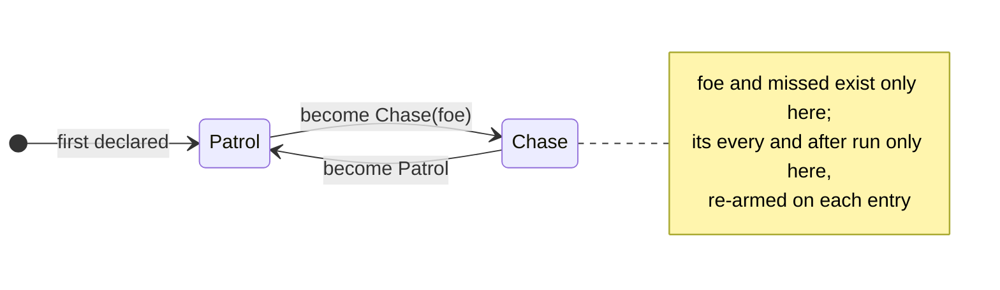

# Ergon reference

The Ergon language as it compiles and runs **today**: every construct, with an
example, and an honest line on what parses but does not run yet. For how a
script runs inside a frame — turns, safepoints, saves, edits — see
[Scripting](../concepts/scripting.md).

Each construct is marked:

| Mark | Means |
|---|---|
| **runs** | compiles and runs, pinned by the conformance suite |
| **checks** | the type checker accepts it; the compiler refuses it — "cannot be compiled yet" |
| **parses** | accepted by the parser, refused or ignored after |

The conformance suite (`crates/khora-script/tests/it/conformance.rs`) is the
source of truth: every *runs* row gives the same result when its execution is cut
at any fuel slice from 1 to 60.

---

## A file

```text
import "combat/damage.erg";

fn int Double(int n) { return n * 2; }

behavior Guard {
    int health = 100;
    on Damaged(int amount) { health -= Double(amount); }
}
```

| Item | Status | Notes |
|---|---|---|
| `import "path.erg";` | runs | before every other item; paths relative to the script root; a cycle is refused with its chain. Every imported module joins **one flat namespace**; `as Alias` parses and is unused |
| `fn <type> Name(params) { … }` | runs | free functions; called before their declaration and recursively; `this` is refused in them; a name an engine function already has is refused |
| `behavior Name { … }` | runs | the unit the engine attaches to an entity |
| `struct Name { … }` | runs — a value type; its field defaults must be constants; operator overloads check but do not compile yet |
| `component Name { … }` | refused in a script — only the engine's module `engine/components.erg` declares the components a script writes |
| `[Attribute]` on a behavior | parses | nothing reads it yet |

Comments are `// line` and `/* block */`.

## Values and types

| Literal | Forms | Type |
|---|---|---|
| integer | `42`, `0x2A`, `1_000` | `int` (64-bit) |
| float | `2.0`, `1e-3` | `float` (32-bit) |
| duration | `2s`, `500ms`, `1.5min` | `Duration`, stored in seconds |
| angle | `90deg`, `1.57rad` | `Angle`, stored in radians |
| text | `"text"` | `string` |
| boolean, none | `true`, `false`, `null` | `bool`, `T?` |

| Type | Status |
|---|---|
| `int`, `float`, `bool`, `string`, `Entity` | runs |
| `Vec2`, `Vec3`, `Vec4`, `Quat`, `Color` | runs — built by calling `Vec3(1.0, 2.0, 3.0)`; components `.x .y .z .w` (`.r .g .b .a`) read-only |
| `Duration`, `Angle` | runs — distinct from `float` and from each other; `2s + 500ms` is `2.5s`, `2s + 90deg` is refused |
| `T?` | runs — holds a value or `null`; one declared without a value starts `null`; `a ?? b`, `?.`, `if (var x = opt)`, `while (var x = opt)` and `match` unwrap it |
| `T[]` | runs — `[1, 2, 3]`, `xs[i]`, `xs.Length`, `foreach`, `xs.Push(v)`, `xs.RemoveAt(i)`; one declared without a value starts `[]` |
| `Map<K, V>` | checks — no literal, no indexing |

The one implicit conversion: an `int` where a `float` is expected. A
`Duration` or an `Angle` reads as a `float` with `d.Seconds`, `a.Radians`,
`a.Degrees`.

## Arrays and structs

```text
struct Waypoint { Vec3 at; float wait = 0.5; }

behavior Patroller {
    Waypoint[] route = [
        Waypoint { at: Vec3(0.0, 0.0, 0.0) },
        Waypoint { at: Vec3(4.0, 0.0, 0.0), wait: 2.0 }
    ];
    int current = 0;

    void Update(float dt) {
        Waypoint next = route[current];      // a copy
        current = (current + 1) % route.Length;
    }
}
```

- **Values, not references.** Binding an array or a struct read from a
  variable, a field or an element copies it — `b = a; b.x = 9;` leaves `a`
  alone, and so does passing one to a function or iterating it. Two guards never
  share one patrol route by accident; to share data, point at the same entity.
- **Writing through a path changes the value in place**: `route[1].at = …`,
  `grid[0][2] = 7`, `xs[i] += 1`.
- **A literal names its fields**, in any order: `Waypoint { at: p }`. A field it
  leaves out takes its default, else its type's zero; a field with neither must
  be written. A struct's defaults are constants — a number, text, `null`, a
  duration, an angle, or an array or struct literal of those.
- **Growing and shrinking**: `xs.Push(v)` appends a copy of `v`;
  `xs.RemoveAt(i)` removes the element at `i` and shifts the rest down. Both
  change the array in place, so `xs` must be a variable, a field, or an element
  or field of one — `Make().Push(1)` is refused: nothing would keep the result.
- `xs[i]` outside the array faults (`IndexOutOfRange`). `==` is not defined on
  arrays or structs — compare what they hold. `Length` and an engine type's
  components are read-only.
- `s?.field` reads a field of an optional struct, or gives `null`.
- **Saved by name.** A field holding an array or a struct is saved and
  restored by its field names: after an edit, a struct field that is gone is
  dropped, a new one takes its default or its zero.
- Copying, building and saving cost fuel in proportion to the size.

## Fields

```text
behavior Lamp {
    float brightness = 0.8;
    Color tint = Color(1.0, 0.9, 0.7, 1.0);
    int lit;            // starts at 0
}
```

A field is `Type name [= default];` — `var` is for locals only. A default is any
expression, run once by the instance's initialiser, in the order the fields are
declared: it may read a field declared above it, never itself or one below.
Without one, a field starts at its type's zero — `int` `0`, `float`,
`Duration`, `Angle` `0.0`, `bool` `false`, `string` `""`, `T?` `null`, `T[]` `[]`. `Entity`,
the engine types and structs have no zero: such a field starts unset — set it in
the inspector — and reading it before writing faults.

## Members

| Member | Form | Status |
|---|---|---|
| method | `int Speed() { return 3; }` or `int Speed() => 3;` | runs |
| async method | `async void Attack() { await 0.5s; … }` | runs |
| event handler | `on Damaged(int amount) { … }`, `on Lost => become Patrol;` | runs — parentheses optional without parameters |
| schedule | `every 0.5s { … }` | runs — first fires one full interval in |
| one-shot | `after 10s { … }`, `after 10s => become Patrol;` | runs — fires once |

A member calls a sibling by its bare name. Inside a state, that state's own
methods come first, then the behavior's, then free functions; outside every
state, the behavior's, then free functions. A state's method exists only inside
its state: called from anywhere else, the checker refuses it and names the state
it belongs to. A schedule's interval must be a **literal duration** — a field or
an expression is refused.

### Lifecycle members

The engine calls these by exact name. The checker requires `void` and exactly
these parameters:

| Signature | When |
|---|---|
| `void Update(float dt)` | every turn, last, with the frame's delta |
| `void OnSpawn()` | once per entity, ever — a save remembers it ran; a hot reload does not rerun it |
| `void OnLoad()` | after a game save restored the instance, before anything else; never on a scene load or Stop |
| `void OnDespawn()` | when the despawn is decided — by `this.Despawn()`, or noticed a frame later |
| `void OnResumeFailed(string member)` | an edit left nothing of a body part-way through; `member` is e.g. `"OnSpawn"`, `"Chase.Attack"`, `"__every(0.5)"` |
| `void FixedUpdate(float dt)` | reserved — never called yet; the checker warns |

See [One turn](../concepts/scripting.md#one-turn) for their order.

## States

```text
behavior Guard {
    state Patrol {
        on Spotted(Entity foe) { become Chase(foe); }
    }
    state Chase(Entity foe) {
        int missed = 0;
        every 1s { foe.Raise("Damaged", 5); }
        after 10s => become Patrol;
    }
}
```



- An instance starts in the **first declared** state, entered with no
  arguments — so the first state takes no parameters.
- A state's parameters and fields exist only inside it; entering it — by
  `become` or at the start — writes its defaults and re-arms its schedules.
- A state's member wins over the behavior's member of the same name — for the
  engine's calls and for a call written inside the state; the behavior's is the
  fallback in every state. A state's defaults are its own code: they read the
  behavior's fields, the state's parameters and its fields declared above, and
  call its methods — wherever the `become` that enters it is written, never
  seeing that member's locals or the data of the state it is written in.
- `become Name;` / `become Name(args);` switches state and **does not end the
  member**: the statements after it still run.

## Statements

| Statement | Status |
|---|---|
| `int x = 1;`, `var x = 10;` | runs — `var` needs an initialiser |
| `x = …`, `+=`, `-=`, `*=`, `/=` | runs — no `%=`, `++`, `--` |
| `if` / `else`, `else if` | runs — braces optional around one statement |
| `while`, C-style `for` | runs |
| `return;`, `return x;`, `{ … }` | runs — a function returning a value must `return` on every path: `if` counts with an `else`, `match` when every arm does, a loop never |
| `become` | runs |
| `await duration;` | runs — in an `async` member only |
| `break`, `continue` | runs — act on the innermost loop, from anywhere inside it; in a `for`, `continue` still runs the step |
| `if (var x = opt)`, `while (var x = Next())` | runs — `x` is the present value, in the branch or the body only |
| `match (opt) { T x => …, null => … }` | runs — takes an optional apart; see below |
| `foreach (var x in xs)`, `foreach (int x in xs)` | runs — over a copy of `xs` taken when the loop starts; `x` is a copy of each element |
| `int x;` without a value | runs — starts at its type's zero; `Entity e;`, `Vec3 v;` are refused: give them a value, or use `Entity?` |

### `match`

`match` takes an **optional** apart; it is not a `switch`. Its patterns are
`null`, `Type name` (the present value, bound for the arm) and `_`:

```text
match (target) {
    Entity e => Chase(e),
    null => Patrol(),
}
```

The subject is evaluated once; the first arm that matches runs. An optional
subject needs both cases, or a `_`. An arm after one that already takes all it
could match is warned unreachable, and a `null` arm on a subject that is never
null is refused. There are no value patterns — `1 =>`, `"idle" =>` do not parse.

### Waiting

`await` is allowed in an `async` member, and waits on a **duration** — nothing
else yet. A member that is not `async` may still *call* one, and then the whole
call waits:

```text
on Spotted(int by) { Attack(); }          // the handler waits with it
async void Attack() { await 0.5s; Strike(); }
```

`await` itself is refused in `Update`, `on` handlers, `every` and `after`.

## Expressions

| Expression | Status |
|---|---|
| `* / %`, `+ -`, `< <= > >=`, `== !=`, `&&`, `\|\|`, `!`, unary `-` | runs — C# precedence; `&&`/`\|\|` short-circuit; `int / int` truncates |
| `c ? a : b` | runs |
| `"a" + "b"`, `==` on text | runs — text `+` text only: `"hp " + health` is refused |
| `(float)x`, `(int)x` | runs — converts: `(float)5` is `5.0`, `(int)2.75` is `2`, `(int)-2.75` is `-2` (toward zero); `(int)` of an infinity, a NaN or a value past `int`'s range faults (`InvalidCast`) rather than saturating |
| `this` | runs — the behavior's entity; not in free functions |
| `Name(args)` | runs — functions and natives by bare name |
| `obj.Method()` | checks |
| `a ?? b` | runs — `a` unless it is `null`; `b` is evaluated only then. A `float?` falls back to a float even when `b` is written as an int |
| `[a, b]`, `a[i]`, `a.Length`, `a?.b`, `Name { field: v }` | runs — see [Arrays and structs](#arrays-and-structs) |
| `new T(…)` | refused — not supported yet; build an engine type with its function, `Vec3(1.0, 2.0, 3.0)` |
| `entity.Field` | refused — an entity has no fields: a behavior's own fields are named directly, a component is read with `Get` (not available yet) |

## Engine-type arithmetic

An engine type's operators are engine functions, exactly as `v.x` is: an
operation is defined when the engine defines it, and refused at compile time —
by name — when it does not.

| Type | Operators |
|---|---|
| `Vec2`, `Vec3`, `Vec4` | `v + w`, `v - w`, `v * s`, `s * v`, `v / s`, `-v` — `s` a number, an `int` widened |
| `Quat` | `q * r` composes, `q * v` rotates a `Vec3` |
| `Color` | `c + d`, `c - d`, `c * d` (modulate), `c * s`, `s * c` |

Compound assignment uses the same table: `v += w`, `v *= 2.0`. Anything else —
`Vec3 * Vec3`, `Vec3 % float`, `Quat + Quat`, `Color / float`, `2.0 / v` — is
refused with the operation's name and the list of what the type defines.

## Engine functions

| Area | Functions |
|---|---|
| Maths | `Abs`, `Floor`, `Ceil`, `Round`, `Sign`, `Sqrt` (faults below zero) `(float) → float`; `Min`, `Max` `(float, float)`; `Clamp(v, lo, hi)` (faults if `lo > hi`); `Lerp(a, b, t)` (unclamped) |
| Text | `Log`, `Warn`, `Error` `(string)`; `Length(string) → int` |
| World — queued, applied at the frame's end | `Position() → Vec3` (own entity, as the frame began); called on an entity `e`: `e.Translate(Vec3)`, `e.SetPosition(Vec3)`, `e.SetRotation(Quat)`, `e.SetScale(Vec3)`, `e.Despawn()`, `e.SetParent(Entity)`, `e.Detach()`; components — see [Writing components](#writing-components) |
| Input | `Pressed(string action) → bool`, `JustPressed(string) → bool` |
| Events | `target.Raise(string name, …payload)` |
| Constructors | `Vec2`, `Vec3`, `Vec4`, `Quat(x, y, z, w)`, `Color(r, g, b, a)` |

A world write is a queued command: `Position()` does not see a `SetPosition` until
the next frame.

**An operation on an entity is called on it.** Every engine function whose first
parameter is an `Entity` is written `e.Name(…)` — `this.SetPosition(v)`,
`enemy.Despawn()`, `target.Raise("Hit", 3)`. The free form `SetPosition(this, v)` is
refused with its rewrite. `Spawn`, the maths, `Log` and `Pressed` stay free
functions.

## Writing components

```text
import "engine/components.erg";

behavior Anchor {
    void OnSpawn() {
        this.Set(RigidBody { mass: 12.0 });   // only `mass` changes
        this.Add(Collider { friction: 0.8 }); // defaults, then `friction`
    }
    on Released() { this.Remove(Collider); }
}

behavior Spawner {
    every 2s { Spawn(Position(), AudioSource { volume: 0.5 }); }
}
```

| Write | Does | Refused |
|---|---|---|
| `e.Set(C { field: v, … })` | writes the fields named; the others keep their values | at the frame's end, when `e` has no `C` |
| `e.Add(C { field: v, … })` | attaches `C` with its defaults, then writes the fields named | at the frame's end, when `e` already has a `C` |
| `e.Remove(C)` | detaches `C` | at the frame's end, when `e` has no `C` |
| `Spawn(Vec3 position, C1 { … }, …)` | a new entity at `position`, upright, carrying each component | the whole spawn, when one component refuses its value — no entity is left behind |

- The components a script writes are those `engine/components.erg` declares with
  `component`: the ones an author may add in the editor. `Transform` is placed with
  `SetPosition`, `Translate`, `SetRotation` and `SetScale`; a component the engine
  computes (`Derived`, `Runtime`) or a tool sets (`Parent`) is a `struct` there — a
  value a script can build, not write.
- A component literal is a *patch*: it appears only as the argument of `Set`, `Add`
  or `Spawn`, and its fields are evaluated in the order written. A component is not
  a type — `RigidBody r;` is refused.
- Each write costs `1 +` the number of fields it names. `Spawn` returns nothing:
  the new entity configures itself in its own `OnSpawn`.
- `Set`, `Add`, `Remove`, `Get`, `Has` and `Spawn` are reserved: no function or
  method may take one of these names.

## Events

```text
on Damaged(int amount) { health -= amount; }
void Hurt() { this.Raise("Damaged", 30); }
```

- `target.Raise("Name", …)` delivers **next frame**, to the handler named `Name`
  — the current state's first, then the behavior's.
- The payload is checked against the handler that receives it: a wrong count is
  reported, a missing handler is simply not delivered, a despawned target hears
  nothing.
- A payload carries `bool`, `int`, `float`, `string`, `Entity` and the engine
  types — not `null`, whether a script or the engine raised it.
- The engine raises `Touched(Entity other)` and `Separated` from collisions:
  `on Touched(Entity other) { other.Despawn(); }`.

## Not yet

Maps, methods on structs and arrays (beyond `Push` and `RemoveAt`), struct
operator overloads at run time, value patterns in `match`, awaiting events,
closures, reading a component (`e.Get(C)`, `e.Has(C)`), components declared in a
script.

## See also

- [Scripting](../concepts/scripting.md) — turns, safepoints, saves, resuming
  after edits.
- [Glossary](./glossary.md) — safepoint, site, resume tier.
